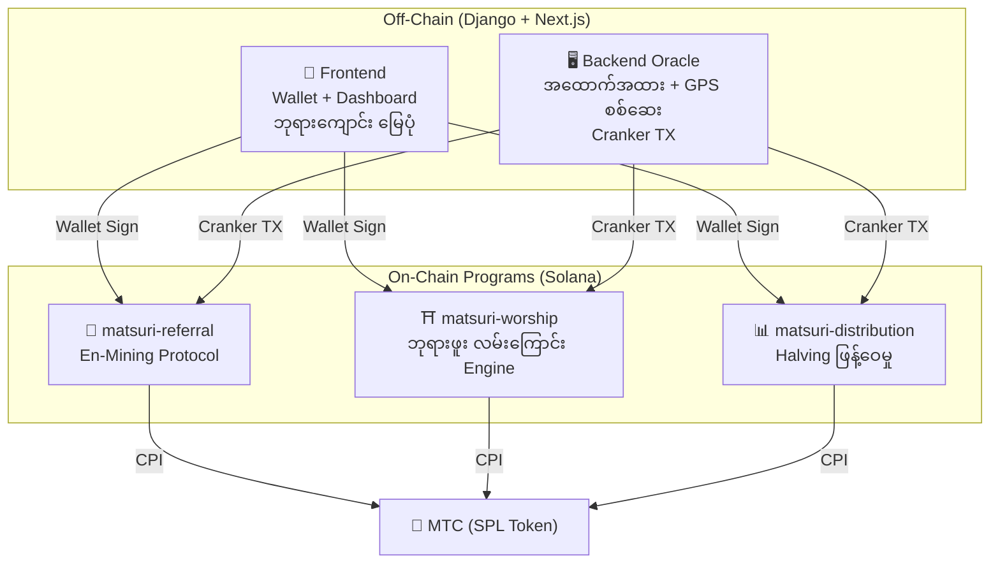

# ⚡ Smart Contracts — Open Source ဗိသုကာ

> **ယုံကြည်မှု မလိုအပ်သော ဒီဇိုင်း (Trustless)**
> ဆုလော့ဂျစ်, referral trees နှင့် halving အချိန်ဇယားများ — အားလုံးကို **on-chain** တွင် စစ်ဆေးနိုင်သော Rust programs ဖြင့် ကျင့်သုံးသည်။
> Source code: [GitHub](https://github.com/Cootakahashi/matsuri-contracts)

---

## ခြုံငုံသုံးသပ်ချက်

Matsuri သည် **Anchor (Rust) program သုံးခု** ကို Solana ပေါ်တွင် deploy ပြုလုပ်သည်:



---

## 1. 📣 En-Mining (縁マイニング) Protocol

**ရည်ရွယ်ချက်:** *အကျယ်* (referral ကွန်ယက်) နှင့် *အနက်* (စီးပွားရေး သက်ရောက်မှု) နှစ်မျိုးလုံးကို ဆုပေးသော ပေါင်းစပ် ကြီးထွားမှု engine

### အမှတ်ပေး ဖော်မြူလာ

```
S_final = S_raw × M_toku × B_title

where:
  S_raw   = 0.30 × referrals + 0.70 × (volume / 10^9)
  M_toku  = f(staked_mtc) ∈ [1.0×, 10.0×]
  B_title = 1.0 + min(seasons_ranked × 0.05, 0.50)
```

| အစိတ်အပိုင်း | အလေးချိန် | ရည်ရွယ်ချက် |
| :--- | :---: | :--- |
| **အကျယ်** (referral) | 30% | ကွန်ယက် ရောက်ရှိမှု |
| **အနက်** (ပေးချေမှု ပမာဏ) | 70% | စီးပွားရေး သက်ရောက်မှု — စစ်မှန်သော ဝယ်ယူမှု |
| **Toku ဆတိုး** | ×1–10 | MTC lock ပြု၍ mining power မြှင့်တင် |
| **ရာထူး Boost** | +5%/season | ထိပ်တန်း performer အတွက် အမြဲတမ်းဆု |

### Toku (徳) Staking အဆင့်များ

| Staked MTC | ဆတိုး | အဆင့် |
| :--- | :---: | :--- |
| 0 | 1.0× | — |
| 1,000+ | 1.5× | ကြေးဝါ |
| 10,000+ | 3.0× | ငွေ |
| 100,000+ | 5.0× | ရွှေ |
| 1,000,000+ | 10.0× | စိန် |

### Anti-Sybil ကာကွယ်ရေး (၃ လွှာ)

| လွှာ | ယန္တရား | နေရာ |
| :--- | :--- | :--- |
| **Identity Gate** | X/Twitter OAuth + SMS | Off-chain (Django) |
| **On-chain Gate** | `is_verified = true` ပရိုဖိုင်သာ ရရှိ | Smart Contract |
| **Depth Weighting** | 70% = စစ်မှန်ပေးချေမှု → bot များ ဘာမှမရ | Scoring Engine |

---

## 2. ⛩️ ဘုရားဖူး လမ်းကြောင်း Engine (Worship Routing)

**ရည်ရွယ်ချက်:** Token economics ဖြင့် overtourism ကို ဖြေရှင်းသော ကမ္ဘာ့ပထမ **ReFi protocol**။ လူနည်းနေရာ → ဆုပိုများ။

### ၆ လွှာ ဆုဖော်မြူလာ

```
R_final = R_pioneer × M_dynamic × M_regional × M_streak × M_omikuji
```

### လွှာ 1: Pioneer Bonus

| လာရောက်အစဉ် | ဆု | ဥပမာ (1000 MTC pool) |
| :---: | :---: | :--- |
| ပထမ | 100% | 1,000 MTC |
| ၅ ခု | 20% | 200 MTC |
| ၁₀ ခု | 10% | 100 MTC |
| ၁₀₀ ခု | 1% | 10 MTC |

### လွှာ 2: Dynamic Multiplier

| အခြေအနေ | ဆတိုး | အကျိုး |
| :--- | :---: | :--- |
| **Overtourism** | 0.1× | ဆု 90% လျော့ |
| **ပုံမှန်** | 1.0× | Standard |
| **လူနည်း** | 10× | 10× boost |
| **Frontier** | 50× | အမြင့်ဆုံး |

### လွှာ 3: ဒေသ အဆင့်

| အဆင့် | အမျိုးအစား | ဆတိုး |
| :---: | :--- | :---: |
| 0 | 🏙️ အကြီး | 1× |
| 1 | 🌆 အလတ် | 2× |
| 2 | 🏞️ ကျေးလက် | 5× |
| 3 | ⛰️ လျှို့ဝှက် | 10× |

### လွှာ 5: 🎲 Omikuji Protocol

| ရလဒ် | ဖြစ်နိုင်ခြေ | ဆတိုး |
| :--- | :---: | :---: |
| 🏆 **大吉** | 5% | 3.0× |
| ✨ **吉** | 15% | 1.5× |
| 🌸 **小吉** | 30% | 1.2× |
| 🍃 **末吉** | 35% | 1.0× |
| 💀 **凶** | 15% | 1.0× |

### လွှာ 6: Sponsored Beacons (B2B/B2G)

မြို့နယ်များနှင့် ခရီးသွားရုံးများသည် **MTC ထည့်သွင်း** ပြီး အချိန်ကန့်သတ် ဆုမြင့်ဇုန်များ ဖန်တီးနိုင်သည်။

---

## 3. 📊 Halving Distribution

550M MTC mining pool ကို **2 နှစ် halving cycle** ဖြင့် ဆယ်စုနှစ်များ ဖြန့်ဝေ။

```
Total Pool: 550,000,000 MTC

Epoch 0 (2027–2029):  275,000,000 MTC  (50%)
Epoch 1 (2029–2031):  137,500,000 MTC  (25%)
Epoch 2 (2031–2033):   68,750,000 MTC  (12.5%)
∑ → 550,000,000 MTC
```

### ပုဂ္ဂိုလ်ရေး ဆုဖော်မြူလာ

```
your_reward = epoch_budget × (your_score / total_score)
```

:::info ခွင့်ပြုချက်မလို Epoch တိုးတက်
`advance_epoch` ကို **မည်သူမဆို** ခေါ်နိုင် — admin မလို။
:::

---

## 4. 🎴 AR Mining — WebAR Omikuji Mining

**ရည်ရွယ်ချက်:** Smartphone browser ဖြင့်သာ AR Omikuji ကို တကယ့်အပြင်ထဲ ပေါ်စေ၍ MTC mine ပြုလုပ်ခြင်း။ **App download မလို**

### Omikuji ဖြစ်နိုင်ခြေ (GCF Admin)

| အဆင့် | ပုံမှန်တန်ဖိုး | ဆု ဆတိုး | NFT |
|------|-----------|---------|-----|
| 🏆 大吉 | 5.00% | ×3.0 | ✅ |
| ✨ 吉 | 15.00% | ×1.5 | ရွေးချယ်နိုင် |
| 🌸 小吉 | 30.00% | ×1.2 | — |
| 🍃 末吉 | 35.00% | ×1.0 | — |
| 💀 凶 | 15.00% | ×1.0 | — |

### ZK-Proof of Vision (၅ လွှာ စစ်ဆေးမှု)

GPS အတုလုပ်ခြင်းနှင့် replay attacks ကို ဖယ်ရှားသည်။ **Camera data ကို server သို့ မပို့** — ကိုယ်ပိုင်လွတ်လပ်မှု ကာကွယ်ပါ။

### ဆုတွက်ချက်ခြင်း

```
Reward = Base(10 MTC) × SiteMultiplier × OmikujiMult × TierMult

TierMult = { အကြီး: 1.0, အလတ်: 2.0, ကျေးလက်: 5.0, လျှို့ဝှက်: 10.0 }
```

---

## လုံခြုံရေး မော်ဒယ် (Open Source)

ဤ contracts များသည် **အပြည့်အဝ open source** ဖြစ်သည်။

| မူသာ | အကောင်အထည်ဖော်မှု |
| :--- | :--- |
| **PDA Vaults** | Token vault များကို PDA ဖြင့်ထိန်းချုပ် — လူ့ key ဖြင့် ထုတ်ယူ၍မရ |
| **Checked Arithmetic** | `checked_*` — overflow မဖြစ်နိုင် |
| **Authority Separation** | Admin (multisig) ≠ Cranker ≠ User |
| **Emergency Pause** | Admin ခေတ္တရပ်နိုင်, ငွေခိုးယူ၍မရ |
| **Immutable Tokenomics** | Halving, pool, epoch — တစ်ကြိမ် သတ်မှတ်ပြီး ပြောင်း၍မရ |
| **Pure Math Modules** | scoring/reward logic ကို audit/test ပြုလုပ်နိုင်သော math libraries အဖြစ် သီးခြားခွဲ |
| **Vision Proof** | Camera data မပေးပို့ဘဲ ၅ လွှာ anti-spoofing |

---

**[◀ Roadmap သို့ ပြန်သွားရန်](/docs/roadmap)** ｜ **[Source Code ကြည့်ရန်](https://github.com/Cootakahashi/matsuri-contracts)**
