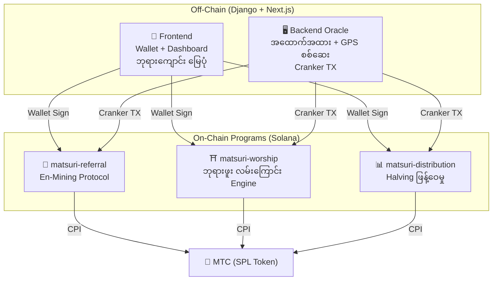

# ⚡ Smart Contracts — Open Source ဗိသုကာ

> **ယုံကြည်မှု မလိုအပ်သော ဒီဇိုင်း (Trustless)**
> ဆုလော့ဂျစ်, referral trees နှင့် halving အချိန်ဇယားများ — အားလုံးကို **on-chain** တွင် စစ်ဆေးနိုင်သော Rust programs ဖြင့် ကျင့်သုံးသည်။
> Source code: [GitHub](https://github.com/Cootakahashi/matsuri-contracts)

---

## ခြုံငုံသုံးသပ်ချက်

Matsuri သည် **Anchor (Rust) program သုံးခု** ကို Solana ပေါ်တွင် deploy ပြုလုပ်သည်:



---

## 1. 📣 En-Mining (縁マイニング) Protocol

**ရည်ရွယ်ချက်:** *အကျယ်* (referral ကွန်ယက်) နှင့် *အနက်* (စီးပွားရေး သက်ရောက်မှု) နှစ်မျိုးလုံးကို ဆုပေးသော ပေါင်းစပ် ကြီးထွားမှု engine

### ရမှတ်ပေး ဒီဇိုင်း

ပါဝင်မှု ရမှတ်သည် အလေးချိန်ပါ အစိတ်အပိုင်း နှစ်ခုပေါ် အခြေခံသည်:

| အစိတ်အပိုင်း | အလေးချိန် | ရည်ရွယ်ချက် |
| :--- | :---: | :--- |
| **အကျယ်** (referral အရေအတွက်) | 30% | ကွန်ယက် ရောက်ရှိမှု — သင် လူ ဘယ်နှစ်ယောက် ခေါ်လာသလဲ |
| **အနက်** (ပေးချေမှု ပမာဏ) | 70% | စီးပွားရေး သက်ရောက်မှု — စစ်မှန်သော ဝယ်ယူမှု၊ စာရင်းသွင်းခြင်း သက်သက် မဟုတ် |

ရမှတ်များ အချိန်နှင့်အမျှ စုဆောင်းပြီး halving epoch တစ်ခုစီတွင် MTC သို့ ပြောင်းလဲသည်။ ထပ်ဆောင်း boost ယန္တရားများ စီစဉ်ထားသည်:

| Boost | ဖော်ပြချက် | အခြေအနေ |
| :--- | :--- | :---: |
| **Toku (徳) Staking** | MTC lock ပြု၍ ပါဝင်မှု ရမှတ် မြှင့်တင် (~50% boost အထိ)။ အဆင့်များနှင့် တိကျသော multiplier များကို halving pool ထုတ်လွှတ်မှု အချိန်ဇယားအပေါ် အခြေခံ၍ ညှိယူမည် | ⬜ Coefficient TBD |
| **ရာသီ Ranking** | epoch တစ်ခုစီ၏ ထိပ်တန်း performer များက **Evangelist** ဘွဲ့ (အမြဲတမ်း SBT) နှင့် ရမှတ် boost ရရှိ။ တိကျသော ရာခိုင်နှုန်းများကို governance ဖြင့် သတ်မှတ်မည် | ⬜ Coefficient TBD |

:::info တဖြည်းဖြည်း Parameter ဒီဇိုင်း
Boost coefficient များ (staking အဆင့်များ, ranking bonus များ) ကို ရည်ရွယ်ချက်ရှိရှိ ပြင်ဆင်နိုင်အောင် ထားသည်။ အမှန်တကယ် ecosystem data — စုစုပေါင်း active user, halving pool ထုတ်လွှတ်နှုန်း, ဈေးနှုန်း တည်ငြိမ်မှု ပစ်မှတ် — ပေါ်မူတည်၍ အတည်ပြုပြီး smart contract များတွင် lock ချမည်။ ဤချဉ်းကပ်မှုသည် ပုံသေ ပြန်လည်ရရှိမှုများ မကတိပေးဘဲ **မျှတသော ဖြန့်ဝေမှု** ရရှိစေသည်။
:::

### Anti-Sybil ကာကွယ်ရေး (၃ လွှာ)

| လွှာ | ယန္တရား | နေရာ |
| :--- | :--- | :--- |
| **Identity Gate** | X/Twitter OAuth + SMS | Off-chain (Django) |
| **On-chain Gate** | `is_verified = true` ပရိုဖိုင်သာ ရရှိ | Smart Contract |
| **Depth Weighting** | 70% = စစ်မှန်ပေးချေမှု → bot များ ဘာမှမရ | Scoring Engine |

---

## 2. ⛩️ ဘုရားဖူး လမ်းကြောင်း Engine (Worship Routing)

**ရည်ရွယ်ချက်:** Token economics ဖြင့် overtourism ကို ဖြေရှင်းသော ကမ္ဘာ့ပထမ **ReFi protocol**။ လူနည်းနေရာ → ဆုပိုများ။

### ဆုကြေး ဒီဇိုင်း မူများ

လာရောက်မှု တစ်ခုစီအတွက် ပါဝင်မှု ရမှတ်ကို အချက်များစွာ ဖြင့် သတ်မှတ်သည်:

| အချက် | မူ | အကျိုး |
| :--- | :--- | :--- |
| **နေရာ လူကြိုက်များမှု** | လူနည်းနေရာ ရမှတ်ပိုမြင့် | လူပြင်းနေရာမှ ခရီးသွားများကို လွှဲပြောင်း |
| **လာရောက်ချိန်** | နေ့စဉ် အစောဆုံး လာရောက်သူ ရမှတ်ပိုမြင့် | peak time မဟုတ်သော အချိန်ကို အားပေး |
| **ဒေသ အဆင့်** | ကျေးလက်နှင့် နယ်စပ် နေရာ အမြင့်ဆုံးအဆင့် | ဒေသ ပြန်လည်ရှင်သန်မှုကို တွန်းအား |
| **လာရောက်မှု အကြိမ်အရေ** | ပုံမှန်လာရောက်သူ ဆုကြေး ရမှတ် စုဆောင်း | အဆက်မပြတ် ပါဝင်မှုကို ဆုပေး |
| **Omikuji ကံကြမ္မာ** | check-in တိုင်း ကျပန်း ဆုကြေး ဖွင့်ခြင်း | ပျော်စရာ gamification |
| **Sponsor boost** | မြို့နယ်အစိုးရ သတ်မှတ်နေရာ မြှင့်တင်နိုင် | B2B/B2G ဝင်ငွေ model |

:::info Coefficient များ ပြင်ဆင်နိုင်
အချက်တစ်ခုစီအတွက် တိကျသော multiplier များ (ဥပမာ ကျေးလက်နေရာသည် အဓိကနေရာထက် ဘယ်လောက်ပိုရသလဲ) ကို **halving pool အချိန်ဇယားပေါ်** အခြေခံ၍ ညှိယူပြီး အမှန်တကယ် အသုံးပြုမှု data ဖြင့် smart contract များတွင် တဖြည်းဖြည်း lock ချမည်။ ဒီဇိုင်း မူသည် ပုံသေ — coefficient များသည် ecosystem နှင့်အတူ ပြောင်းလဲသည်။
:::

### Sponsored Beacons (B2B/B2G)

မြို့နယ်များ၊ ရထားလမ်းကုမ္ပဏီများနှင့် ခရီးသွားရုံးများသည် **MTC ထည့်သွင်း** ပြီး သတ်မှတ်နေရာများတွင် အချိန်ကန့်သတ် ဆုမြင့်ဇုန်များ ဖန်တီးနိုင်သည်။

---

## 3. 📊 Halving Distribution

550M MTC mining pool ကို **2 နှစ် halving cycle** ဖြင့် ဆယ်စုနှစ်များ ဖြန့်ဝေ။

```
Total Pool: 550,000,000 MTC

Epoch 0 (2027–2029):  275,000,000 MTC  (50%)
Epoch 1 (2029–2031):  137,500,000 MTC  (25%)
Epoch 2 (2031–2033):   68,750,000 MTC  (12.5%)
∑ → 550,000,000 MTC
```

### ပုဂ္ဂိုလ်ရေး ဆုဖော်မြူလာ

```
your_reward = epoch_budget × (your_score / total_score)
```

:::info ခွင့်ပြုချက်မလို Epoch တိုးတက်
`advance_epoch` ကို **မည်သူမဆို** ခေါ်နိုင် — admin မလို။
:::

---

## 4. 🎴 AR Mining — WebAR Omikuji Mining

**ရည်ရွယ်ချက်:** Smartphone browser ဖြင့်သာ AR Omikuji ကို တကယ့်အပြင်ထဲ ပေါ်စေ၍ MTC mine ပြုလုပ်ခြင်း။ **App download မလို**

### Omikuji ဆက်တင် (GCF Admin)

Basis Points (10000 = 100%) ဖြင့် 0.01% တိကျမှု ထိန်းချုပ်။ GCF Admin panel မှ ညှိယူနိုင်။

| အဆင့် | ရှားပါးမှု | ဆုကြေး | NFT |
|------|-----------|---------|-----|
| 🏆 大吉 | ရှားပါး | အမြင့်ဆုံး ဆုကြေး | ✅ |
| ✨ 吉 | မကြာခဏ မတွေ့ | မြင့်သော ဆုကြေး | ရွေးချယ်နိုင် |
| 🌸 小吉 | သာမန် | ဆုကြေးငယ် | — |
| 🍃 末吉 | သာမန် | ပါဝင်မှု မှတ်တမ်း | — |
| 💀 凶 | မကြာခဏ မတွေ့ | ပါဝင်မှု မှတ်တမ်း | — |

ဖြစ်နိုင်ခြေနှင့် ဆုကြေး coefficient များကို ecosystem အရွယ်အစားနှင့် halving ထုတ်လွှတ်ပမာဏပေါ် အခြေခံ၍ တဖြည်းဖြည်း အတည်ပြုပြီး smart contract များတွင် အကောင်အထည်ဖော်မည်။

### ZK-Proof of Vision (၅ လွှာ စစ်ဆေးမှု)

GPS အတုလုပ်ခြင်းနှင့် replay attacks ကို ဖယ်ရှားသည်။ **Camera data ကို server သို့ မပို့** — ကိုယ်ပိုင်လွတ်လပ်မှု ကာကွယ်ပါ။

### ဆုကြေး ဒီဇိုင်း

ဆုကြေးများကို နေရာအမျိုးအစား, Omikuji ရလဒ်, ဒေသ tier စသည့် အချက်များစွာပေါ် အခြေခံသော **ပါဝင်မှု ရမှတ်** အဖြစ် မှတ်တမ်းတင်သည်။ တိကျသော coefficient များကို halving ထုတ်လွှတ်မှု အချိန်ဇယားနှင့် ecosystem ကြီးထွားမှုနှင့်အညီ တဖြည်းဖြည်း အတည်ပြုပြီး smart contract များတွင် အကောင်အထည်ဖော်မည်။

---

## လုံခြုံရေး မော်ဒယ် (Open Source)

ဤ contracts များသည် **အပြည့်အဝ open source** ဖြစ်သည်။

| မူသာ | အကောင်အထည်ဖော်မှု |
| :--- | :--- |
| **PDA Vaults** | Token vault များကို PDA ဖြင့်ထိန်းချုပ် — လူ့ key ဖြင့် ထုတ်ယူ၍မရ |
| **Checked Arithmetic** | `checked_*` — overflow မဖြစ်နိုင် |
| **Authority Separation** | Admin (multisig) ≠ Cranker ≠ User |
| **Emergency Pause** | Admin ခေတ္တရပ်နိုင်, ငွေခိုးယူ၍မရ |
| **Immutable Tokenomics** | Halving, pool, epoch — တစ်ကြိမ် သတ်မှတ်ပြီး ပြောင်း၍မရ |
| **Pure Math Modules** | scoring/reward logic ကို audit/test ပြုလုပ်နိုင်သော math libraries အဖြစ် သီးခြားခွဲ |
| **Vision Proof** | Camera data မပေးပို့ဘဲ ၅ လွှာ anti-spoofing |

---

**[◀ Roadmap သို့ ပြန်သွားရန်](/docs/roadmap)** ｜ **[Source Code ကြည့်ရန်](https://github.com/Cootakahashi/matsuri-contracts)**
