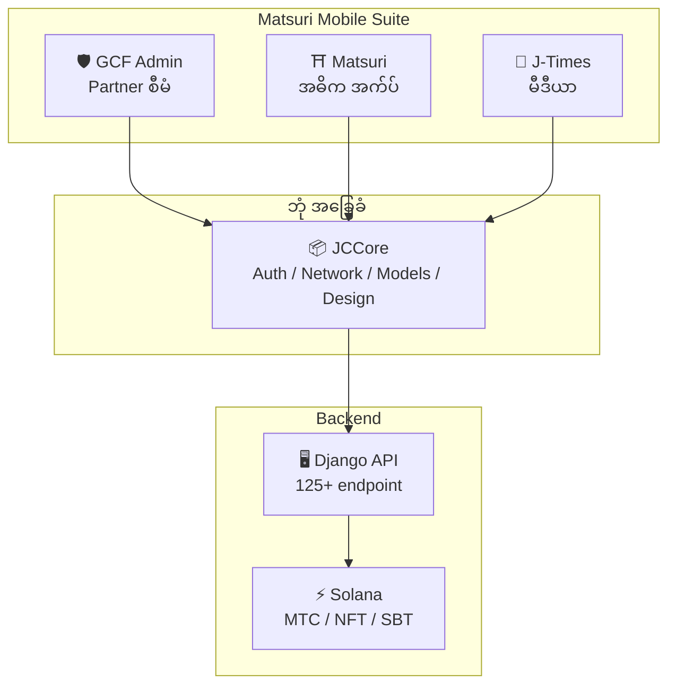
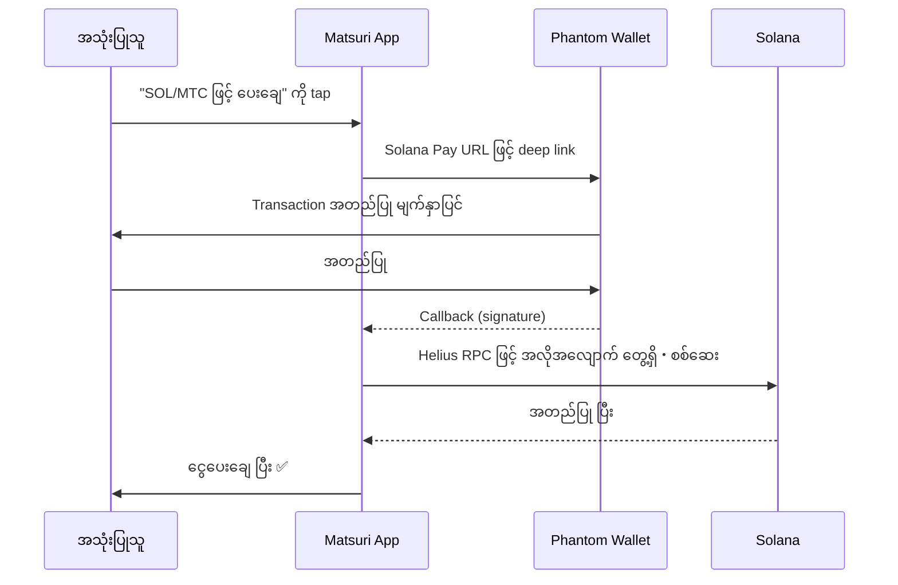
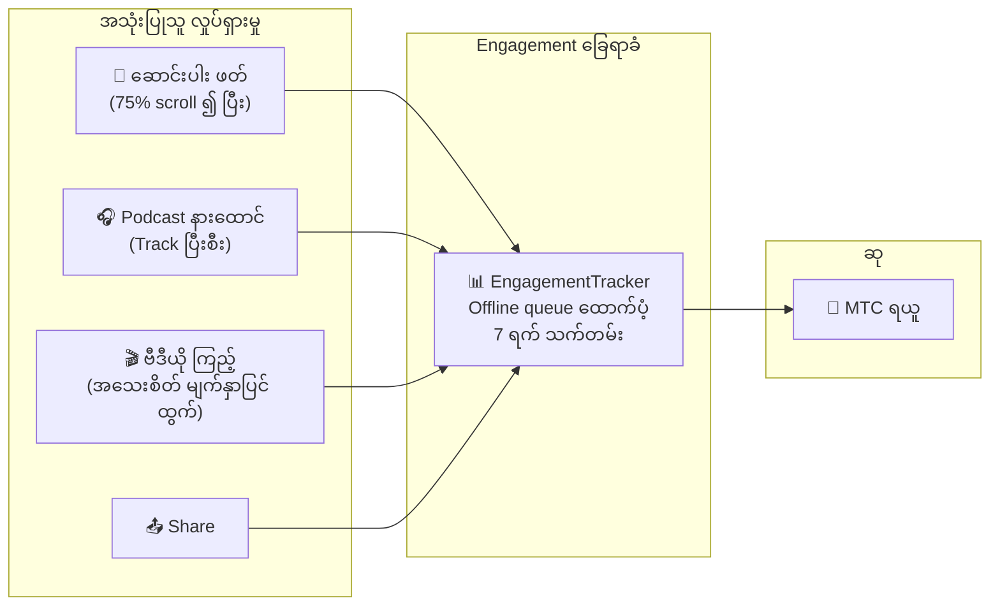
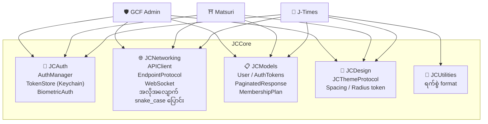
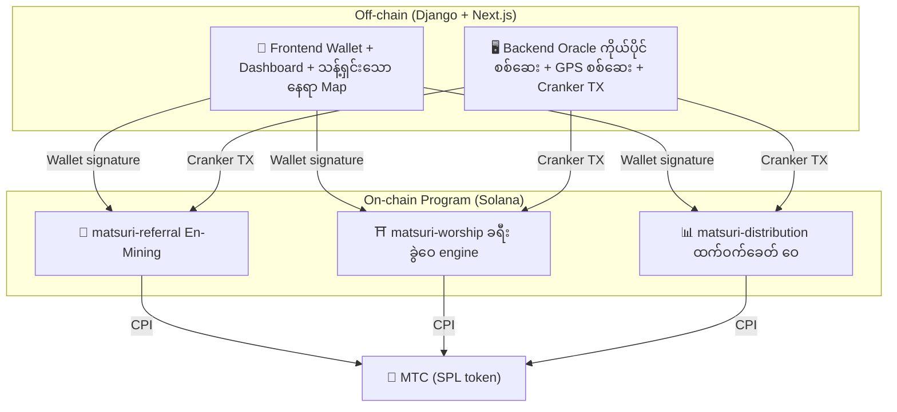
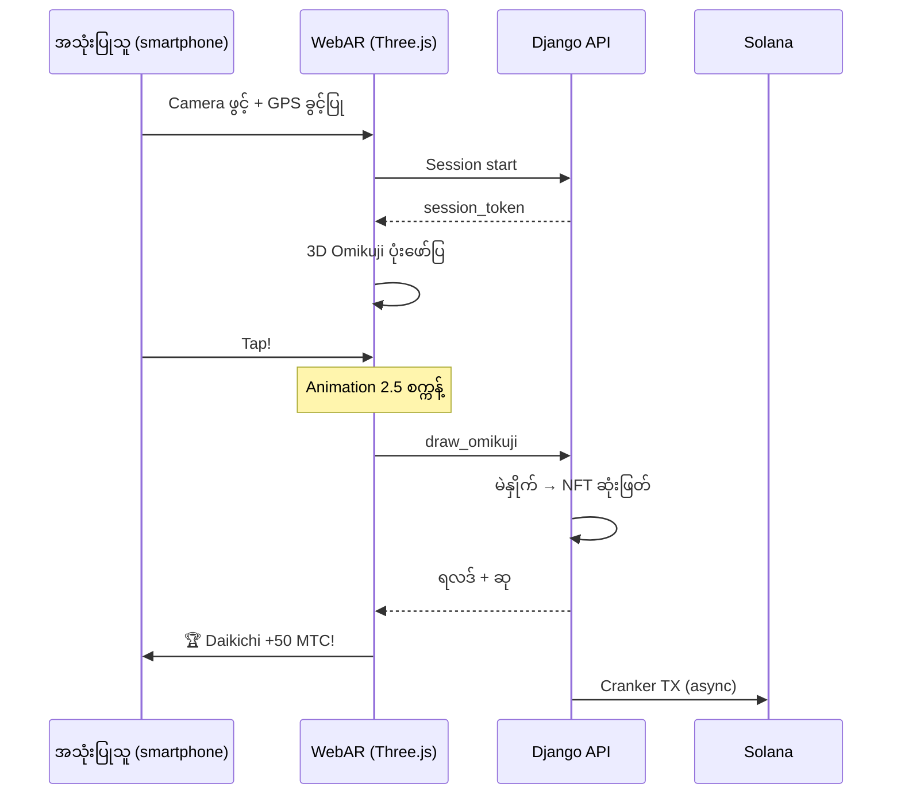

import useBaseUrl from '@docusaurus/useBaseUrl';

# 🔧 ထုတ်ကုန်・နည်းပညာ——လည်ပတ်နေသော အရာသည် အားလုံးကို သက်သေပြသည်

> **လည်ပတ်နေသော အရာသည် အားလုံးကို သက်သေပြသည်။**
> ကျွန်ုပ်တို့၏ ရည်မှန်းချက်သည် စကားသာ မဟုတ်ပါ။ Web platform သည် ယခုပင် အသုံးပြုနေ၊ iOS အက်ပ်များသည် နောက်ဆုံး phase တွင် ရှိ။

Web app・admin dashboard များသည် **production လည်ပတ်နေ**။ Native iOS အက်ပ် ၃ ခုသည် development ပြီးဆုံး၊ 2026 ဧပြီတွင် ထုတ်မည်။ Solana ပေါ်ရှိ smart contract များကို open source ဖြင့် ဖော်ပြပြီး——စိတ်ကူး မဟုတ်ဘဲ **လည်ပတ်နေသော ကုဒ်နှင့် မကြာမီ ရောက်ရှိမည့် ထုတ်ကုန်**ဖြင့် ပြောပါမည်။

---

## အက်ပ် စာရင်း

| အက်ပ် | အသုံး | အခြေအနေ | ဘာသာစကား |
| :--- | :--- | :---: | :--- |
| **GCF Admin** | Partner စီမံ・လည်ပတ်ရေး ကိရိယာ | ✅ ထုတ်ပြီး | 🇯🇵🇬🇧🇨🇳🇹🇭🇳🇴 |
| **Matsuri** | သာမန် အသုံးပြုသူအတွက် အဓိက အက်ပ် | 🔜 2026 ဧပြီ ထုတ်မည် | 🇯🇵🇬🇧🇨🇳🇹🇭🇳🇴 |
| **J-Times** | ယဉ်ကျေးမှု မီဒီယာ・သင်ယူရေး | 🔜 2026 ဧပြီ ထုတ်မည် | 🇯🇵🇬🇧 |

---

## 1. 🛡️ GCF Admin — Partner စီမံ အက်ပ်

:::info အခြေအနေ: App Store ထုတ်ပြီး (v1.0)
GCF (Global Community Friends) member များအတွက် လုပ်ငန်း စီမံ အက်ပ်။ Web admin ၏ လုပ်ဆောင်ချက်အားလုံးကို mobile တွင် စုစည်း။
:::

  
  
  

  

### ဤအက်ပ်ဖြင့် လုပ်နိုင်သည်

| အမျိုးအစား | လုပ်ဆောင်ချက် |
| :--- | :--- |
| **📊 Dashboard** | KPI card၊ ရောင်းအား chart၊ quick action |
| **👥 Member စီမံ** | စာရင်း・အသေးစိတ်・တည်းဖြတ်・tier စီမံ |
| **💰 ဝင်ငွေ စီမံ** | ကော်မရှင် ခြေရာခံ၊ MTC ထုတ်ယူမှု စီမံ၊ payout စီမံ |
| **📝 Content စီမံ** | Event・ဆောင်းပါး・podcast・ဗီဒီယို ဖန်တီး・တည်းဖြတ်・ထုတ်ဝေ |
| **🎫 Guide Slot** | Guide ကိုတာ စီမံ၊ ဝင်ငွေ ခြေရာခံ |
| **🖼️ NFT Dashboard** | Founder's Collection၊ on-chain စစ်ဆေး၊ NFT လွှဲပြောင်း |
| **⛩️ သန့်ရှင်းရာ စီမံ** | Site ၏ CRUD၊ beacon ချိန်ညှိ |
| **🎲 AR Mining ချိန်ညှိ** | Omikuji ဖြစ်နိုင်ခြေ table၊ ဆု parameter စီမံ |
| **📊 Analytics** | Error report၊ အသုံးပြုမှု ခွဲခြမ်းစိတ်ဖြာ |
| **🔗 Referral** | ပုံသေ QR ဖန်တီး၊ referral program စီမံ |

### နည်းပညာ အသေးစိတ်

| ခေါင်းစဉ် | အသေးစိတ် |
| :--- | :--- |
| **ဗိသုကာ** | Clean Architecture + MVVM + `@Observable` (iOS 17) |
| **ဘာသာစကား / SDK** | Swift 6.0 / Xcode 16+ / iOS 17.0+ |
| **API ချိတ်ဆက်** | Endpoint 125 ကျော် |
| **Test** | 226 test / 45 test class |
| **Localization** | ဘာသာစကား ၅ မျိုး (ဂျပန်・အင်္ဂလိပ်・တရုတ်・ထိုင်း・နော်ဝေ) / translation key 957 ကျော် |
| **Swift Concurrency** | Strict Concurrency လိုက်နာ / build warning မရှိ |

### QR Code ပေါင်းစည်းမှု

GCF Admin တွင် Matsuri logo ပါ ပုံသေ QR ဖန်တီးနိုင်။ Event ဖိတ်ကြား၊ referral link၊ ငွေပေးချေ တောင်းခံ စသည်တို့ အသုံးအများ ထောက်ပံ့။

---

## 2. ⛩️ Matsuri — အဓိက အက်ပ်

:::info အခြေအနေ: 2026 ဧပြီ နောက်ပိုင်း ထုတ်မည် (v3.0)
သာမန် အသုံးပြုသူအတွက် အဓိက အက်ပ်။ Event ဘုကင်၊ ငွေပေးချေ၊ Web3 wallet၊ AR mining အထိ အားလုံးကို အက်ပ်တစ်ခုထဲတွင် ပြီးဆုံးစေ။
:::

  
  
  

### ဤအက်ပ်ဖြင့် လုပ်နိုင်သည်

| အမျိုးအစား | လုပ်ဆောင်ချက် |
| :--- | :--- |
| **🎪 Event ဘုကင်** | ရှာ・ဘုကင်・Stripe ငွေပေးချေ・ticket QR စီမံ |
| **💳 ငွေပေးချေနည်း ၄ မျိုး** | Credit card / သိမ်းထားသော card / MTC balance / crypto (SOL/MTC) |
| **👛 Web3 Wallet** | MTC balance ပြ၊ ပို့・လက်ခံ၊ transaction history |
| **🖼️ NFT Gallery** | ပိုင်ဆိုင်သော NFT/SBT စာရင်း၊ on-chain စစ်ဆေး |
| **🗺️ သန့်ရှင်းသော နေရာ Map** | နတ်ကွန်း・ဘုရားကျောင်း map ပြ၊ check-in |
| **🎲 AR Mining** | WebAR Omikuji အတွေ့အကြုံ၊ MTC ရယူ |
| **💬 Chat** | Context menu ပါ messaging |
| **⭐ Wishlist** | နှစ်သက်သော event・အတွေ့အကြုံ သိမ်း |
| **🔍 အဆင့်မြင့် ရှာဖွေ** | အသံဖြင့် ရှာဖွေ ထောက်ပံ့ |
| **🤝 Referral** | Referral program ပါဝင်၊ ဆု ခြေရာခံ |
| **📊 GCF Dashboard** | GCF member များအတွက် ရိုးရှင်းသော စီမံ မျက်နှာပြင် |

### Phantom Wallet ချိတ်ဆက် — သုညဝင်ရိုက် crypto ငွေပေးချေ

>**အသုံးပြုသူသည် address copy-paste မလို။** Phantom Wallet က အလိုအလျောက် ဖွင့်ပြီး အတည်ပြုရုံဖြင့် ငွေပေးချေ ပြီးဆုံး။ Transaction signature ကို Helius RPC ဖြင့် အလိုအလျောက် တွေ့ရှိ။

### နည်းပညာ အသေးစိတ်

| ခေါင်းစဉ် | အသေးစိတ် |
| :--- | :--- |
| **ဗိသုကာ** | Clean Architecture + MVVM + Swift Concurrency |
| **ဘာသာစကား / SDK** | Swift 6.0 / Xcode 16+ / iOS 17.0+ |
| **ငွေပေးချေ** | Stripe PaymentSheet + MTC Balance + Phantom (Solana Pay) |
| **API ချိတ်ဆက်** | Endpoint 72 ခု / category 16 ခု |
| **Test** | 230 ကျော် (Model, ViewModel, Network, Security, DeepLink, E2E) |
| **Localization** | ဘာသာစကား ၅ မျိုး (ဂျပန်・အင်္ဂလိပ်・တရုတ်・ထိုင်း・နော်ဝေ) / translation key 406 ခု |
| **ViewModel အရေအတွက်** | 25 (အပြည့်အဝ MVVM — View မှ တိုက်ရိုက် API ခေါ်မှု မရှိ) |
| **Authentication** | Apple Sign In / Google Sign In (PKCE) |

---

## 3. 📰 J-Times — ယဉ်ကျေးမှု မီဒီယာ အက်ပ်

:::info အခြေအနေ: 2026 ဧပြီ နောက်ပိုင်း ထုတ်မည်
ဂျပန်ယဉ်ကျေးမှု၏ အနက်ကို ပို့ဆောင်သော မီဒီယာ platform။ ဆောင်းပါးဖတ်၊ podcast နားထောင်၊ ဗီဒီယို ကြည့်——လှုပ်ရှားမှုအားလုံးတွင် MTC ရယူ။
:::

  

  
  

### ဤအက်ပ်ဖြင့် လုပ်နိုင်သည်

| အမျိုးအစား | လုပ်ဆောင်ချက် |
| :--- | :--- |
| **📖 ဆောင်းပါး** | Parallax hero၊ drop cap၊ ဖတ်ခြင်း တိုးတက်မှု bar၊ rich content (Markdown, table, quote) |
| **🎧 Podcast** | Series ကြည့်၊ waveform ပြ player၊ sleep timer၊ AirPlay၊ lock screen ထိန်းချုပ် |
| **🎬 ဗီဒီယို** | Adaptive grid/list၊ short video (TikTok စတိုင်၊ double-tap) |
| **🔍 ရှာဖွေ** | Multi-filter၊ trending tag၊ အသံဖြင့် ရှာ |
| **🧭 Discovery** | Featured carousel၊ staff picks၊ this week trending |
| **📚 Library** | နှစ်သက်သော၊ history (ရက်စွဲအလိုက်)၊ download၊ playlist |
| **🎵 Audio Player** | Mini player (swipe လုပ်ဆောင်ချက်)၊ full player (waveform, lyrics, repeat) |
| **👤 Membership** | Tier ၃ ခု (Free / Premium / Pro) ၏ လုပ်ဆောင်ချက် နှိုင်းယှဉ်၊ ဝယ်ယူမှု ပြန်လည်ရယူ |

### Media Mining — ဖတ်・နားထောင်・ကြည့်ခြင်းသည် mining ဖြစ်လာ

>**Offline တွင်လည်း မှတ်တမ်းတင်။** Signal မဆိုက်သော တောင်ပိုင်းနတ်ကွန်းတွင် ဆောင်းပါးဖတ်လျှင်လည်း internet ပြန်ရောက်သည်နှင့် engagement ကို အလိုအလျောက် ပို့၍ MTC ပေးသည်။

### Design System — ဂျပန်၏ အလှ အမြင် "မဏ္ဍိုင် ၄ ခု"

J-Times သည် ဂျပန်ရိုးရာ အလှ အမြင်ကို ခေတ်သစ် UI အဖြစ် ဖော်ပြသော ထူးခြားသော design system ကို အသုံးပြု။

| မဏ္ဍိုင် | သဘောတရား | UI သို့ အသုံးချ |
| :--- | :--- | :--- |
| **墨 (Sumi — နို)** | နွေးထွေးသော neutral gray | Background၊ text hierarchy |
| **朱 (Shu — ဂျပန်အနီ)** | ဂျပန် အနီ (#C53030) | Accent color၊ အရေးကြီး action |
| **間 (Ma — ကြားအကွာ)** | 4pt grid spacing | Spacing၊ အသက်ရှူ ခံစားမှု |
| **紙 (Kami — စက္ကူ)** | သေးငယ်သော texture၊ glass morphism | Card မျက်နှာပြင်၊ အနက် ဖော်ပြ |

### နည်းပညာ အသေးစိတ်

| ခေါင်းစဉ် | အသေးစိတ် |
| :--- | :--- |
| **ဗိသုကာ** | Clean Architecture + MVVM + Swift Concurrency |
| **ဘာသာစကား / SDK** | Swift 6.0 / Xcode 16+ / iOS 17.0+ |
| **ပြင်ပ dependency** | **သုည**— Apple စစ်မှန် framework သာ |
| **API ချိတ်ဆက်** | Endpoint 40 ကျော် |
| **Test** | 371 test / 20 ဖိုင် |
| **Localization** | ဘာသာစကား ၂ မျိုး (ဂျပန်・အင်္ဂလိပ်) / translation key 310 ကျော် |
| **Offline ထောက်ပံ့** | ContentCache (50MB) + ImageDiskCache (200MB) + download manager |
| **Authentication** | Apple Sign In / Google Sign In (PKCE) |

---

## ဘုံ အခြေခံ: JCCore Library

အက်ပ် ၃ ခုလုံးက မျှဝေသော Swift Package library။

| Module | အခန်းကဏ္ဍ |
| :--- | :--- |
| **JCAuth** | Keychain အခြေခံ token စီမံ၊ biometric authentication (Face ID / Touch ID) |
| **JCNetworking** | Type-safe API client၊ WebSocket၊ အလိုအလျောက် JSON snake_case ပြောင်း |
| **JCModels** | အက်ပ် ဖြတ်၍ ဘုံ data model (User, AuthTokens, etc.) |
| **JCDesign** | Theme protocol၊ design token (spacing, corner radius) |
| **JCUtilities** | ရက်စွဲ・string utility |

---

## လုံခြုံရေးနှင့် ကိုယ်ရေးကိုယ်တာ

| ခေါင်းစဉ် | အကောင်အထည်ဖော်မှု |
| :--- | :--- |
| **Authentication token** | iOS Keychain တွင် encrypt သိမ်း (TokenStore) |
| **Biometric authentication** | Face ID / Touch ID ဖြင့် two-factor authentication |
| **API ဆက်သွယ်မှု** | HTTPS + Certificate Pinning |
| **Wallet secret key** | အက်ပ်အတွင်း secret key မသိမ်း — Phantom Wallet သို့ အပ် |
| **AR Mining** | Camera ပုံကို server သို့ မပို့ (VisionProof) |
| **Offline data** | SwiftData encryption + အလိုအလျောက် သက်တမ်း |
| **Swift Concurrency** | Actor isolation ဖြင့် race condition ကာကွယ် |

---

## Development အရည်အသွေး

### Mobile အက်ပ်: အက်ပ် ၃ ခု စုစုပေါင်း **automated test 827 ကျော်** အကောင်အထည်ဖော်။

| အက်ပ် | Test အရေအတွက် | Coverage နယ်ပယ် |
| :--- | :---: | :--- |
| **GCF Admin** | 226 | Model, ViewModel, Repository, API, Localization, Navigation |
| **Matsuri** | 230+ | Model, ViewModel, Network, Security, DeepLink, Regression, Performance, E2E |
| **J-Times** | 371 | Model, ViewModel, API, Repository, Navigation, Localization, Security, Performance |

### Smart Contract: Test implementation တစ်ဆင့်ချင်း ချဲ့ထွင်နေ

Solana ပေါ်ရှိ Rust program အတွက် core logic (math module) ၏ unit test မှ စတင်နေ၊ security audit (2026 Q2〜Q3) အတွက် test coverage ကို တစ်ဆင့်ချင်း ချဲ့ထွင်နေပါသည်။

---

## Smart Contract — Open Source ဒီဇိုင်း

>**ယုံကြည်မလိုသော (trustless) ဒီဇိုင်း အတွေး။**
> ဆု တွက်ချက်မှု၊ referral tree၊ ထက်ဝက်ခေတ် schedule —— logic အားလုံးကို **on-chain** တွင် execute လုပ်၍ မည်သူမဆို audit လုပ်နိုင်။
> Source code: [GitHub](https://github.com/Cootakahashi/matsuri-contracts)

---

### Contributors

| Member | အခန်းကဏ္ဍ |
| :--- | :--- |
| **Ko Takahashi** | Founder / Lead Developer — ဗိသုကာ ဒီဇိုင်း၊ smart contract၊ full-stack development |

> 🌏**အနာဂတ်တွင် GCF member နှင့် ကမ္ဘာ့ developer အသိုက်အဝန်းလည်း အတူတကွ development တွင် ပါဝင်သွားပါမည်။**
> Matsuri Protocol သည် "ယဉ်ကျေးမှု အခြေခံ" အဖြစ် ထာဝစဉ် လည်ပတ်ရန် ပွင့်လင်းမြင်သာမှုနှင့် ပူးတွဲပိုင်ဆိုင်မှုကို မူအဖြစ် ထားသည်။

---

### အခြေခံ ဖွဲ့စည်းမှု

Matsuri သည် **Anchor (Rust) program ၃ ခု**ကို Solana တွင် deploy လုပ်၍ ecosystem ၏ မဏ္ဍိုင်တစ်ခုစီကို တာဝန်ယူသည်။

---

### 1. 📣 En-Mining (縁 — ကြောင်း)

**ရည်ရွယ်ချက်:** "ကျယ်ပြန့်မှု (referral network)" နှင့် "နက်ရှိုင်းမှု (စီးပွားရေး သက်ရောက်မှု)" နှစ်ခုလုံးကို ဆုပေးသော hybrid ကြီးထွားမှု engine။ ရိုးရိုး affiliate မဟုတ်ဘဲ လက်တွေ့ကမ္ဘာ၏ စီးပွားရေး လှုပ်ရှားမှုသည် on-chain တန်ဖိုးကို မွေးဖွားသော အပြည့်အဝ mining protocol ဖြစ်သည်။

#### Scoring ဒီဇိုင်း

Contribution score သည် weighted component ၂ ခုအပေါ် အခြေခံ:

| Component | အလေးချိန် | ရည်ရွယ်ချက် |
| :--- | :---: | :--- |
| **ကျယ်ပြန့်မှု** (referral အရေအတွက်) | 30% | Network ရောက်ရှိသော နယ်ပယ် — လူ မည်မျှ ခေါ်လာ |
| **နက်ရှိုင်းမှု** (ငွေပေးချေ ပမာဏ) | 70% | စီးပွားရေး သက်ရောက်မှု — signup မျှသာ မဟုတ် တကယ့် ဝယ်ယူမှု |

Score သည် အချိန်ကြာလာတာနှင့်အမျှ စုဆောင်း၍ ထက်ဝက် epoch တစ်ခုစီတိုင်း MTC အဖြစ် ပြောင်းလဲ။ ထပ်၍ boost ယန္တရားများ စီစဉ်ထား:

| Boost | ရှင်းလင်းချက် | အခြေအနေ |
| :--- | :--- | :---: |
| **Toku (徳) Staking** | MTC ကို lock ၍ contribution score boost (အများဆုံး 50% ခန့်)။ Tier နှင့် တိကျသော multiplier ကို ထက်ဝက် pool ထုတ်လွှတ်မှု schedule အခြေခံ ချိန်ညှိ | ⬜ Coefficient မသတ်မှတ်ရသေး |
| **Season Ranking** | Epoch တစ်ခုစီ၏ top performer သည် **Evangelist** title (ထာဝစဉ် SBT) နှင့် score boost ရယူ။ တိကျသော အချိုးကို governance ဖြင့် ဆုံးဖြတ် | ⬜ Coefficient မသတ်မှတ်ရသေး |

:::info Progressive Parameter ဒီဇိုင်း
Boost coefficient (staking tier၊ ranking bonus) ကို ရည်ရွယ်၍ ချိန်ညှိနိုင်အောင် ထားသည်။ တကယ့် ecosystem data — active user စုစုပေါင်း၊ ထက်ဝက် pool ထုတ်လွှတ်နှုန်း၊ ဈေးနှုန်း တည်ငြိမ်မှု ပန်းတိုင် — အပေါ် အခြေခံ၍ အတည်ပြု၍ smart contract တွင် lock လုပ်။ ဤ အနှေးယူ နည်းလမ်းဖြင့် မပိုလွန်သော return ကတိ မပေးဘဲ **တရားမျှတသော ခွဲဝေ**ကို အာမခံ။
:::

#### Anti-Sybil ကာကွယ်မှု (Layer ၃ ခု)

| Layer | ယန္တရား | တည်နေရာ |
| :--- | :--- | :--- |
| **ကိုယ်ပိုင် စစ်ဆေး gate** | X/Twitter OAuth + SMS | Off-chain (Django) |
| **On-chain gate** | `is_verified = true` profile သာ ဆု ရယူနိုင် | Smart contract |
| **နက်ရှိုင်းမှု weighting** | Score ၏ 70% = တကယ့် ငွေပေးချေ → bot များ ဘာမျှ မရှာနိုင် | Scoring engine |

---

### 2. ⛩️ ခရီး ခွဲဝေ Engine (Worship Routing Engine)

**ရည်ရွယ်ချက်:** Token economics ကို အသုံးပြု၍ overtourism ကို ဖြေရှင်းသော ကမ္ဘာ့ ပထမဆုံး **ReFi protocol**။ သန့်ရှင်းသော နေရာသို့ သွား၍ MTC ရယူ။ သို့သော် အရေးကြီးသည်မှာ: *လာရောက်သူ နည်းသော site မှာ exponential အဖြစ် ဆု ပိုရယူ။*

:::tip အဓိက အတွေးအမြင်
"ပြောင်းပြန် Uber surge pricing" — စည်ကားသော site သည် ဒဏ်ရ၊ frontier site သည် boost။ ခရီးသွားများသည် **ပိုမို အကျိုးရှိသောကြောင့်** မိမိဆန္ဒအရ လူနည်းသော နေရာသို့ သွား။
:::

#### ဆု ဒီဇိုင်း အခြေခံမူ

လာရောက်မှုတစ်ခုစီ၏ contribution score ကို အချက်များစွာဖြင့် ဆုံးဖြတ်:

| အချက် | အခြေခံမူ | အကျိုး |
| :--- | :--- | :--- |
| **Site နာမည်ကြီးနှုန်း** | လာရောက်သူ နည်းသော site က ပို score မြင့် | ခရီးသွားများကို စည်ကားသော ဇုန်မှ ခွဲဝေ |
| **လာရောက်ချိန်** | ထိုနေ့၏ အစောပိုင်း လာရောက်သူ က ပို score မြင့် | Off-peak လာရောက်မှုကို မြှင့်တင် |
| **ဒေသ tier** | ဒေသ・frontier site သည် ထိပ်တန်း | ဒေသ ဖွံ့ဖြိုးမှု မြှင့်တင် |
| **လာရောက် ကြိမ်ရေ** | ပုံမှန် လာရောက်သူ bonus score စုဆောင်း | ဆက်လက် engagement ကို ဆုပေး |
| **Omikuji ကံ** | Check-in တစ်ခုစီ random bonus | ပျော်ရွှင်ဖွယ် gamification |
| **Sponsored boost** | မြို့တော်စည်ပင်များ သီးသန့် site boost နိုင် | B2B/B2G ဝင်ငွေ model |

:::info Coefficient ကို ချိန်ညှိနိုင်
အချက်တစ်ခုစီ၏ တိကျသော multiplier (ဥပမာ: ဒေသ site သည် အဓိက site ထက် မည်မျှ ပို ရှာနိုင်) ကို **ထက်ဝက် pool schedule** နှင့် တကယ့် အသုံးပြုမှု data အပေါ် အခြေခံ ချိန်ညှိ၍ တစ်ဆင့်ချင်း smart contract တွင် lock။ ဒီဇိုင်း အခြေခံ fixed — coefficient သည် ecosystem နှင့်အတူ တိုးတက်။
:::

---

### 3. 📊 ထက်ဝက်ခေတ် ဝေ (Halving Distribution)

**ရည်ရွယ်ချက်:** Bitcoin မှ စိတ်ကူးယူသော ထက်ဝက်ခေတ် schedule ဖြင့် MTC ၏ ခွဲဝေကို epoch တစ်ခုစီ အလိုအလျောက် ထက်ဝက်စေ။ သင်္ချာအရ အာမခံသော ရှားပါးမှု။

| Instruction | ရှင်းလင်းချက် |
| :--- | :--- |
| `initialize` | ဝေ pool ၏ initialization |
| `register_miner` | Miner ၏ register |
| `update_score` | Score ၏ update |
| `advance_epoch` | Epoch ၏ တိုးတက်မှု (ထက်ဝက် execute) |
| `claim_distribution` | ဝေ ဆု ရယူ |

---

### 4. 🎴 AR Mining — WebAR Omikuji အတွေ့အကြုံ

**ရည်ရွယ်ချက်:** Smartphone ၏ browser သာဖြင့် လက်တွေ့ ဇုန်တွင် AR omikuji ဖော်ထုတ်၍ MTC mine လုပ်သော အတွေ့အကြုံ။ **အက်ပ် download မလို**။ Shinto ၏ စိတ်ဓာတ်နှင့် နောက်ဆုံးပေါ် နည်းပညာ ပေါင်းစပ်ထားသော ကမ္ဘာ့ ပထမဆုံး WebAR × blockchain အခြေခံ ဖြစ်သည်။

#### ဗိသုကာ

#### Omikuji ဖြစ်နိုင်ခြေ ချိန်ညှိ (GCF admin)

Basis Points (10000 = 100%) ဖြင့် 0.01% ကွာခြားမှု တိကျသော ထိန်းချုပ်မှု။ GCF admin မျက်နှာပြင်မှ ချိန်ညှိနိုင်။

| အဆင့် | ရှားပါးမှု | Bonus | NFT |
|------|-----------|---------|-----|
| 🏆 Daikichi | Rare | အများဆုံး bonus | ✅ |
| ✨ Kichi | Uncommon | မြင့်မား bonus | ရွေးနိုင် |
| 🌸 Shōkichi | Common | သေးငယ် bonus | — |
| 🍃 Suekichi | Common | ပါဝင်မှု မှတ်တမ်း | — |
| 💀 Kyō | Uncommon | ပါဝင်မှု မှတ်တမ်း | — |

ဖြစ်နိုင်ခြေနှင့် ဆု coefficient ကို ecosystem ၏ အရွယ်အစားနှင့် ထက်ဝက်ခေတ် ထုတ်လွှတ်ပမာဏ အပေါ် အခြေခံ၍ တစ်ဆင့်ချင်း အတည်ပြု၍ smart contract တွင် အကောင်အထည်ဖော်။

#### ZK-Proof of Vision (Layer ၅ ခု လုံခြုံရေး)

GPS အတု၊ replay attack ကို layer အများဖြင့် ဖယ်ရှား။ **ကိုယ်ရေးကိုယ်တာ ကာကွယ်ရန် camera ပုံကို server သို့ မပို့ပါ။**

| Layer | စစ်ဆေးမှု | အမှတ် |
| :--- | :--- | :--- |
| Temporal | Session အချိန် 5-120 စက္ကန့် | /20 |
| Motion | Gyroscope ၏ သဘာဝ (လက်ကိုင် တုန်ခါမှု တွေ့ရှိ) | /20 |
| Light | ပတ်ဝန်းကျင် အလင်း × အချိန်ဇုန် ကိုက်ညီမှု | /20 |
| HMAC | proof_hash signature စစ်ဆေး | /20 |
| Fingerprint | Device ၏ ထူးခြားမှု | /20 |
| **စုစုပေါင်း** | **60/100 အထက်ဖြင့် PASS** | |

#### ဆု ဒီဇိုင်း

ဆုကို site အမျိုးအစား၊ Omikuji ရလဒ်၊ ဒေသ tier စသည့် အချက်များစွာအပေါ် အခြေခံ **contribution score** အဖြစ် မှတ်တမ်းတင်။ တိကျသော coefficient ကို ထက်ဝက်ခေတ် ထုတ်လွှတ်မှု schedule နှင့် ecosystem ကြီးထွားမှုနှင့် ကိုက်ညီ တစ်ဆင့်ချင်း အတည်ပြု၍ smart contract တွင် အကောင်အထည်ဖော်။

---

### Pure Math Modules (Audit-able Core Logic)

Program အားလုံးသည် scoring・ဆု တွက်ချက်မှုကို **pure and audit-able `math.rs` module** တွင် ခွဲခြား:

- **Side effect သုည** — I/O မရှိ၊ memory allocation မရှိ၊ ပြင်ပ ခေါ်ဆိုမှု မရှိ
- **စာရွက်စာတမ်း ရှိသော ပုံသေနည်း** — rustdoc အတွင်း LaTeX စတိုင် ဖော်ပြ
- **Overflow ခွဲခြမ်းစိတ်ဖြာ** — သက်သေပြပြီးသော နယ်ပယ်၏ u128 ကြားဖြတ် တန်ဖိုး
- **ပြည့်စုံသော test** — Edge case၊ boundary condition၊ အချိုး စစ်ဆေး
- **ချိန်ညှိနိုင်သော coefficient** — ဆု parameter ကို governance မှတဆင့် update လုပ်နိုင်အောင် ဒီဇိုင်းထား၊ ecosystem ကြီးထွားမှုနှင့် ကိုက်ညီ တစ်ဆင့်ချင်း ချိန်ညှိ ဖြစ်နိုင်

---

### လုံခြုံရေး Model

ဤ contract သည် **အပြည့်အဝ open source** ဖြစ်သည်။ လုံခြုံရေးကို မထင်ရှားမှုမဟုတ်ဘဲ သင်္ချာ အာမခံမှုအပေါ် အခြေခံ။

| အခြေခံမူ | အကောင်အထည်ဖော်မှု |
| :--- | :--- |
| **PDA သီးသန့် ဘဏ်** | Token ဘဏ်ကို PDA (Program Derived Address) ဖြင့် ထိန်းချုပ် — လူ့ key ဖြင့် ထုတ်၍ မရ |
| **Checked arithmetic** | တွက်ချက်မှုအားလုံးတွင် `checked_*` ဖြင့် — overflow မဖြစ်နိုင် |
| **ခွင့်ပြုချက် ခွဲခြား** | Admin (multi-sig) ≠ Cranker (ကန့်သတ် လုပ်ဆောင်ချက်) ≠ အသုံးပြုသူ (ကိုယ်ပိုင် စီမံ) |
| **အရေးပေါ် ရပ်ဆိုင်းမှု** | လုံခြုံရေး ခြိမ်းခြောက်မှုအပေါ် admin က program ကို ယာယီ ရပ်နိုင်။ သို့သော် **ငွေ လှုပ်・ယူမှု မဖြစ်နိုင်**—ရပ်တန့်မှုသည် "ကာကွယ်ရန် ဒိုင်း" ဖြစ်၍ စည်းမျဉ်း ပြောင်းလဲရန် နည်းလမ်း မဟုတ် |
| **ပြုပြင်၍မရသော tokenomics** | ထက်ဝက်နှုန်း・စုစုပေါင်း pool・epoch ကာလ အစပိုင်း ချိန်ညှိပြီးနောက် ပြောင်းလဲ၍ မရ |
| **Pure math module** | ဆု/score logic သည် ခွဲခြား test လုပ်နိုင်သော math library |
| **Vision Proof** | Camera data မပို့ခြင်း layer ၅ ခု အတု တွေ့ရှိမှု (ကိုယ်ရေးကိုယ်တာ ကာကွယ်) |

---

**[▶ ရှေ့သို့: Roadmap နှင့် အဖွဲ့](/docs/roadmap)**｜**[◀ နောက်သို့: Tokenomics](/docs/tokenomics)**
