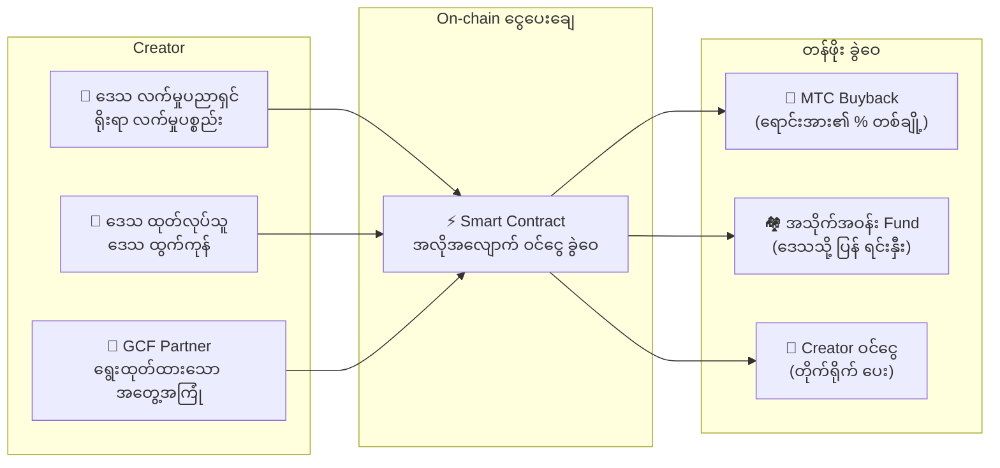

import useBaseUrl from '@docusaurus/useBaseUrl';

# 🗓️ Roadmap နှင့် အဖွဲ့

>**ဤနေရာအထိ ဖတ်ပြီးသူများသို့——ရူပါ၊ စီးပွားရေး ဒီဇိုင်း၊ နည်းပညာ အခြေခံ အားလုံး ပြည့်စုံနေပါသည်။**
> ကျွန်ုပ်တို့သည် ရေတိုကြံစည်မှု ပရောဂျက် မဟုတ်ပါ။
>**အဓိက platform development ပြီးဆုံးပြီ**၊ ကျန်သည်မှာ ချဲ့ထွင်မည့် phase တွင် ရှိပါသည်။

---

## မဟာဗျူဟာ Milestone

### 🔥 Phase 1: နိုးကြား (2026 နှစ်ဦးပိုင်း ── လက်ရှိ)

**Theme: အခြေခံ တည်ဆောက်ခြင်းနှင့် cash flow ထူထောင်ခြင်း**

Web platform လည်ပတ်နေ။ iOS အက်ပ် သုံးခုလုံး (GCF Admin・J-Times・Matsuri) သည် App Store တွင် ရရှိနိုင်ပြီ (2026 ဧပြီ အထိ)။ CEO တိုက်ရိုက် ကြီးကြပ်သော ငွေကြေးစနစ်ဖြင့် ဝင်ငွေရရှိမှုနှင့် အစပိုင်း liquidity ကို အာရုံစိုက်။

| အခြေအနေ | Milestone | အသေးစိတ် |
| :---: | :--- | :--- |
| ✅ | **Web Platform အသုံးပြုနေ** | Matsuri Web app၊ GCF Admin Dashboard (Web ဗားရှင်း) စတင်အသုံးပြု |
| ✅ | **ငွေပေးချေနှင့် ကြီးထွားမှု** | MTC ငွေပေးချေ function & referral airdrop function implementation ပြီး |
| ✅ | **မီဒီယာ စတင်** | J-Times (Web & podcast) ဖြန့်ဝေမှု အခြေခံ တည်ဆောက် |
| ✅ | **Genesis** | Solana chain တွင် MTC token ထုတ်ဝေ |
| ✅ | **Liquidity ထူထောင်** | Raydium တွင် အစပိုင်း liquidity pool ဖန်တီး ပြီး |
| ⬜ | **Incentive စတင်** | ပန်းတိုင် APY 20% ၏ liquidity mining စတင် |
| ⬜ | **On-chain ငွေပေးချေ** | Solana Pay စစ်ဆေးမှု production လည်ပတ်မှု စတင် |
| ⬜ | **VIP member စုစည်း** | GCF အစပိုင်း VIP member 20 ဦး ရွေးချယ်မှု ပြီး |

### 🚀 Phase 2: ချဲ့ထွင် (2026 နှစ်နှောင်းပိုင်း)

**Theme: တကယ့် asset နှင့် Adventure Mining**

ပြီးဆုံးထားသော webapp ကို အပြည့်အဝ အသုံးပြု၍ ရုပ်ပိုင်းဆိုင်ရာ ဗဟိုနှင့် "ခရီးသွား function" ကို ချဲ့ထွင်ပါမည်။

| အခြေအနေ | Milestone | အသေးစိတ် |
| :---: | :--- | :--- |
| ⬜ | **Function အသစ် ထုတ်** | Adventure Mining (ခရီးသွား) အကောင်အထည်ဖော်・ထုတ် |
| ⬜ | **နိုင်ငံတကာ ချဲ့ထွင်** | အာရှ (ထိုင်း・ထိုင်ဝမ် စသည်) တွင် ပူးပေါင်း base ရှာ & VIP event ကျင်းပ |
| ⬜ | **Asset စီမံ** | အိမ်ခြံမြေ・share・crypto asset portfolio တည်ဆောက် |
| ⬜ | **ပန်းတိုင် အောင်မြင်** | Ecosystem စုစုပေါင်း asset အရွယ်အစား **¥1 ဘီလီယံ** |

### 🌊 Phase 3: လည်ပတ် (2027〜)

**Theme: ကြီးမား ပြန့်နှံ့ခြင်း၊ အတူတကွ ဖန်တီးမှု economy၊ ဗဟိုမဲ့**

အများ ဖွင့်၊ on-chain marketplace၊ အပြည့်အဝ ecosystem လည်ပတ် phase ဖြစ်သည်။

| အခြေအနေ | Milestone | အသေးစိတ် |
| :---: | :--- | :--- |
| ⬜ | **Grand Open** | Matsuri App ကမ္ဘာ့နှံ့ တရားဝင် ထုတ် |
| ⬜ | **ကြီးမား Unlock (2027/6/1)** | Founder lockup unlock + mining pool (550 သန်း) စတင် + ထက်ဝက်ခေတ် cycle စတင် |
| ⬜ | **အတူတကွ ဖန်တီးမှု Marketplace** | ဒေသထွက်ကုန် ဆိုင် + GCF partner store ── MTC အလိုအလျောက် buyback ပါ on-chain ငွေပေးချေ |
| ⬜ | **Crowdfunding (NFT အခွင့်အရေးပါ)** | အသုံးပြုသူများ Solana တွင် ယဉ်ကျေးမှု ပရောဂျက်သို့ ရင်းနှီး။ ထောက်ပံ့သူသည် ပိုင်ဆိုင်ခွင့်・ဝင်ငွေခွဲဝေ・governance အခွင့်အရေး ကိုယ်စားပြုသော NFT ကို လက်ခံ |
| ⬜ | **On-chain ငွေပေးချေ** | Marketplace ၏ transaction အားလုံးကို smart contract ဖြင့် ငွေပေးချေ ── ရောင်းအား၏ တစ်ချို့အချိုးကို MTC buyback pool သို့ အလိုအလျောက် ပို့ |
| ⬜ | **ပန်းတိုင် အောင်မြင်** | Ecosystem စုစုပေါင်း asset အရွယ်အစား **¥10 ဘီလီယံ (〜$65M)** |
| ⬜ | **DAO သို့ ပြောင်းရွှေ့** | ဆုံးဖြတ်ချက် အခွင့်အရေးတစ်ချို့ကို GCF အသိုက်အဝန်းသို့ လွှဲပြောင်း |

#### 🏪 အတူတကွ ဖန်တီးမှု Marketplace စိတ်ကူး

"ယဉ်ကျေးမှု OS" ၏ အထွတ်အထိပ် ဖော်ပြမှု ── **ယဉ်ကျေးမှု ဖန်တီးသူနှင့် ယဉ်ကျေးမှု ချစ်မြတ်နိုးသူ တိုက်ရိုက် အရောင်းအဝယ်ပြုသော**၊ ခေါင်းပုံဖြတ်သော ကြားခံ မရှိသော ဗဟိုမဲ့ marketplace ဖြစ်သည်။

| Function | ရှင်းလင်းချက် | အခြေအနေ |
| :--- | :--- | :---: |
| **🏺 ဒေသထွက်ကုန် ဆိုင်** | လက်မှုပညာရှင်နှင့် ဒေသ ထုတ်လုပ်သူသည် ကမ္ဘာ့ customer သို့ တိုက်ရိုက် ရောင်း။ MTC ငွေပေးချေတွင် 5〜10% လျှော့ | ⬜ စိတ်ကူး |
| **🎫 Crowdfunding + NFT အခွင့်အရေး** | ယဉ်ကျေးမှု ပရောဂျက် (နတ်ကွန်း ပြုပြင်၊ ပွဲ ပြန်လည်ထူထောင်၊ လက်မှုပညာရှင် အလုပ်ရုံ) သို့ ရင်းနှီး။ ပါဝင်မှုကို သက်သေပြသော NFT ကို လက်ခံ၊ ဝင်ငွေခွဲဝေ သို့မဟုတ် governance အခွင့်အရေး ပါဝင်ခြင်း ဖြစ်နိုင် | ⬜ စိတ်ကူး |
| **⚡ On-chain ငွေပေးချေ** | Marketplace transaction အားလုံးကို Solana smart contract ဖြင့် ငွေပေးချေ။ ဝင်ငွေကို အလိုအလျောက် ခွဲဝေ: creator သို့ ပေးငွေ + အသိုက်အဝန်း fund + MTC buyback ── manual စာရင်းကိုင် လုပ်ငန်းစဉ် မလို | ⬜ စိတ်ကူး |
| **🗳️ ထောက်ပံ့သူ Governance** | NFT ပိုင်ရှင်များသည် ရင်းနှီးထားသော ပရောဂျက်၏ resource ခွဲဝေမှုအပေါ် မဲပေး ── ရိုးရိုး လှူဒါန်းမှု မဟုတ်ဘဲ စစ်မှန်သော အတူတကွ ဖန်တီးမှု | ⬜ စိတ်ကူး |

:::info ဘာကြောင့် အရေးကြီးသနည်း
ယနေ့တွင် ခရီးသွားများသည် platform ဟူသော "ငှားရမ်းသူ" သို့ တည်းခို ခ ပေးသည့် ဆိုင်တွင် အမှတ်တရ ဝယ်ယူနေ။ မနက်ဖြန်တွင် **ကျိုတို ဒေသ လက်မှုပညာရှင်က ကိုပင်ဟာဂင် fan သို့ တိုက်ရိုက် ရောင်း**၊ ရောင်းအား၏ တစ်ချို့က MTC economy ကို အလိုအလျောက် ခိုင်မာစေသည်။ ဤသည်မှာ flywheel ၏ အပြည့်ဆုံး ပုံစံ ဖြစ်သည်။
:::

---

## 👤 အဖွဲ့

  

### Ko Takahashi ── Founder / CEO & Lead Architect

| ခေါင်းစဉ် | အသေးစိတ် |
| :--- | :--- |
| **အခန်းကဏ္ဍ** | ပရောဂျက်တစ်ခုလုံးကို ကြီးကြပ်။ Platform ဒီဇိုင်း・smart contract・full-stack development |
| **ရူပါ** | "ယဉ်ကျေးမှု တင်ပို့ချင်း၊ ဥစ္စာ တင်သွင်းခြင်း" ယဉ်ကျေးမှု OS ကို တင်ပြသူ |
| **ရပ်တည်ချက်** | ကိုယ်တိုင် ကုဒ်ရေး၊ ကိုယ်တိုင် လက်တွေ့မြေပြင် (Golden Gai) တွင် ရပ်တည်သော "ကိုယ်ပိုင် ငွေ ဖြုန်း" လက်တွေ့ကျင့်သူ |

  

### Jon Anders Jensen ── Director / GCF・Event Operations

| ခေါင်းစဉ် | အသေးစိတ် |
| :--- | :--- |
| **အခန်းကဏ္ဍ** | GCF လည်ပတ်မှု တာဝန်ခံ။ Event・tour ၏ operation ဒီဇိုင်းနှင့် လက်တွေ့ လုပ်ငန်း |
| **အားသာချက်** | နိုင်ငံတကာ ရှုထောင့်နှင့် GCF member များနှင့် ယုံကြည်မှုကို အခြေခံ၍ ecosystem ၏ "လူ" လည်ပတ်မှုကို ထောက်ပံ့ |

  

### Ryunosuke Honda ── Director / ဒေသ ယဉ်ကျေးမှု သံအမတ်

| ခေါင်းစဉ် | အသေးစိတ် |
| :--- | :--- |
| **အခန်းကဏ္ဍ** | ဂျပန် ဒေသများ၏ ယဉ်ကျေးမှု・အသိုက်အဝန်းနှင့် Matsuri ecosystem ကို ချိတ်ဆက်သော တံတား |
| **အားသာချက်** | ဒေသ ယဉ်ကျေးမှု resource ကို ရှာဖွေ၍ Matsuri platform တွင် တင်ပြခြင်းဖြင့် "Deep Japan" အတွေ့အကြုံကို အကောင်အထည်ဖော် |

### 🌏 GCF အသိုက်အဝန်း ── ကမ္ဘာသို့ ချဲ့ထွင်သော Development Member

Matsuri Protocol သည် တည်ထောင်သူ အဖွဲ့ တစ်ခုတည်းဖြင့် ဖန်တီးထားခြင်း မဟုတ်။
**ကမ္ဘာ့ GCF member များ**သည် test၊ feedback၊ translation၊ ဒေသ ချဲ့ထွင်မှု မှတဆင့် protocol ဆင့်ကဲဖြစ်စဉ်သို့ ပါဝင်ဆောင်ရွက်ပါသည်။

| နယ်ပယ် | ဖွဲ့စည်းပုံ |
| :--- | :--- |
| **💼 ကမ္ဘာ့ ငွေကြေး** | အာရှ private investor network နှင့် ပူးပေါင်း |
| **⚙️ Engineering** | Blockchain & mobile app development ၏ ဗဟိုမဲ့ engineer အဖွဲ့ |
| **🏮 Operations** | Shinjuku Golden Gai & အဓိက ခရီးသွားဒေသ ဒေသတွင်း အသိုက်အဝန်း ခိုင်မာသော pipeline |
| **🌐 အသိုက်အဝန်း** | ဂျပန်・နော်ဝေ・ထိုင်း・ထိုင်ဝမ် အပါအဝင် နိုင်ငံစုံ GCF member |

:::tip အားလုံး ဖန်တီးသော ယဉ်ကျေးမှု အခြေခံ
GCF သို့ ပါဝင်ပါက သင်သည်လည်း Matsuri Protocol ၏ အတူတကွ ဖန်တီးသူ။
ကုဒ်ရေးခြင်း တစ်ခုတည်း ပါဝင်မှု မဟုတ်ပါ။ ဒေသ သန့်ရှင်းရာကို မိတ်ဆက်၊ document ဘာသာပြန်၊ event စီစဉ်ခြင်း ──
အားလုံးသည် ဤ protocol ကို ကမ္ဘာသို့ ချဲ့ထွင်သော စွမ်းအား ဖြစ်သည်။
:::

---

## 🏛️ Governance (DAO)

Matsuri Protocol သည် ဗဟို စီမံခန့်ခွဲမှုမှ တစ်ဖြည်းဖြည်း **ဗဟိုမဲ့ autonomy အဖွဲ့အစည်း (DAO)** သို့ ပြောင်းရွှေ့သည်။
GCF member (Platinum/Gold) များသည် အနာဂတ်တွင် အောက်ပါ အရေးကြီး အကြောင်းအရာများအပေါ် **မဲပေးခွင့်** ရှိမည်။

| မဲပေး အကြောင်းအရာ | ရှင်းလင်းချက် |
| :--- | :--- |
| **💰 ရန်ပုံငွေ ခွဲဝေ** | လုပ်ငန်းဝင်ငွေကို မည်သည့် လုပ်ငန်းသစ် သို့မဟုတ် marketing တွင် ရင်းနှီးမည်နည်း |
| **⚙️ Protocol update** | အက်ပ်၏ ကော်မရှင်နှုန်း သို့မဟုတ် mining ဆုနှုန်း၏ သေးငယ် ချိန်ညှိမှု |
| **⛩️ ယဉ်ကျေးမှု အသိအမှတ်ပြု** | မည်သည့် ပွဲ သို့မဟုတ် နတ်ကွန်းကို "တရားဝင် သန့်ရှင်းသော ခရီး ဒေသ" အဖြစ် အသိအမှတ်ပြု၍ ရန်ပုံငွေ ထောက်ပံ့မည်နည်း |

:::info တော်လှန်မှုသို့ ပါဝင်ပါ
ကျွန်ုပ်တို့သည် ရိုးရှင်းသော အက်ပ်ကို ဖန်တီးနေခြင်း မဟုတ်။
**နယ်စပ် မရှိသော ယဉ်ကျေးမှု စီးပွားရေးဇုန်**ကို ဖန်တီးနေခြင်း ဖြစ်သည်။
:::

---

**[◀ နောက်သို့: ထုတ်ကုန်・နည်းပညာ](/docs/product-tech)**｜**[⛩️ White Paper ထိပ်သို့ ပြန်သွား](/docs/intro)**
