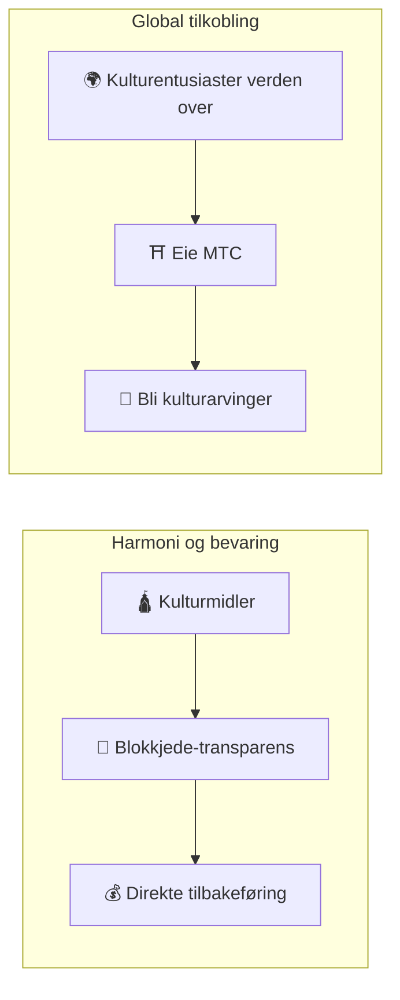

# ⛩️ Velkommen til Matsuri Coin

> **Kode for harmoni. Verdi for fred.**
> En bro av «Wa» i en splittet verden. MTC er kompasset som leder fra konkurranse til samskapning.

**Matsuri Coin (MTC)** er en desentralisert brukstoken bygget på Solana-blokkjeden.
Den er designet som et **«Kultur-OS»** som kobler Japans åndelige arv — «Deep Japan» — til den globale økonomien.

Vi bygger ikke bare et betalingssystem.
Vi bygger en **bro mellom Japan og verden** — et nytt rammeverk for samskapning der kulturelskere forenes på tvers av landegrenser.

---

## 🎯 Vårt oppdrag

:::info Kanaliserer ¥10 billioner i markedsenergi til kulturens fremtid
Japans inbound-turistmarked vokser mot **¥10 billioner** per år.
Men under overflaten skjuler det seg en **ubehagelig sannhet.**
:::

### Problemene ingen snakker om

| Problem | Hva som faktisk skjer |
| :--- | :--- |
| 💸 **Inntektslekkasje** | Brorparten av inntektene forsvinner til utlandet som provisjoner til utenlandske OTA-er og mellomledd |
| 😤 **Utbrenthet i lokalsamfunn** | Overturisme fyller lokalsamfunn med folkemengder, men ingen av inntektene når tilbake |
| 🚧 **Opplevelsesmuren** | Pakketurer berører bare overflaten — reisende får aldri kontakt med det *ekte* Japan |

> **«Japanerne sliter, reisende ser en fasade, og formuen forsvinner inn i plattformgebyrer.»**

Vi bruker Web3 til å rive ned dette ødelagte systemet.
Betalingen din når lokalsamfunn og kulturvern **direkte** — fullstendig transparent, null mellomledd.

---

## 🏗️ Hybridmodellen: Kultur × Teknologi

De fleste kryptoprosjekter jager profitt og behandler kultur som forbruksvare.
MTC snur dette på hodet: vi bygger en **«økonomi som beskytter kultur»** — hybridstrukturen som burde ha eksistert fra dag én.

| Søyle | Hva det betyr |
| :--- | :--- |
| **🛕 Harmoni og bevaring** | Turistbetalinger flyter gjennom blokkjeden direkte til kulturvern og håndverkerstøtte. Lokalsamfunn (GCF) beholder suverenitet over sin egen arv |
| **🌍 Global tilkobling** | Infrastruktur som lar hvem som helst, hvor som helst, støtte den japanske ånden «Wa». Å eie MTC betyr å dele i Japans levende historie |

---

## 💎 Hvorfor bruke MTC?

MTC-økosystemet leverer både **åndelig berikelse** og **konkret økonomisk oppside.**

### ✨ Opplevelsesverdi

| Fordel | Detaljer |
| :--- | :--- |
| **🎌 Meningsfulle opplevelser** | Lås opp «Deep Japan» — hellige områder stengt for offentligheten, private seremoniell, eksklusiv kulturelle begivenheter |
| **🌐 Et livslangt bånd** | Forbli tilkoblet Japan gjennom MTC lenge etter at du har reist hjem |
| **⚖️ Rettferdig handel** | Smarte kontrakter eliminerer mellomledd. Betalingen din går rett til de som fortjener den |

### 💰 Økonomisk oppside

| Fordel | Detaljer |
| :--- | :--- |
| **🏷️ Foretrukne priser** | Betal med MTC og spar **5–10 %** sammenlignet med yen-priser. F.eks. ¥30 000-tur → ~¥27 000 |
| **🔑 Eksklusiv tilgang** | Billett-NFT-er til «kun for inviterte»-steder og begrensede arrangementer — kun MTC-holdere |
| **🛡️ Valutasikring** | Lås opplevelsesverdi før turen — ingen bekymring for valutasvingninger |

---

## ⚡ Hvorfor Solana?

For å betjene både «reell reiselivsetterspørsel» og «høyfrekvent finanshandel» fantes det nøyaktig **én levedyktig blokkjede.**

| Mål | Ethereum | Solana |
| :--- | :---: | :---: |
| **Transaksjonsgebyr** | ¥100–¥1 000+ | **~¥0,04** |
| **Ferdigstillelse** | 12 s – minutter | **0,4 sekunder** |
| **Gjennomstrømning** | ~15 TPS | **Tusenvis av TPS** |

:::tip Tempeltesten
En mikrobetaling liten som «å kaste ¥100 i offerkassen» krever gebyrer **under ¥1.** Bare Solana består den testen.
:::

---

:::note Klar til start
MTC avslutter æraen med turisme som bare *forbruker* kultur. Velkommen til reisen mot **samskapning** — la oss bygge fremtiden sammen.
:::

**[▶ Visjon: Hvorfor nå?](/docs/vision)** ｜ **[▶ Bli med i GCF (VIP-medlemskap)](/docs/economy)**
