# 🎯 Visjon: «Inbound First»-strategien

> **Fra subsidieavhengighet til selvstendighet.**
> Tiden for å holde distriktsøkonomier i live med statlige tilskudd er over. Vi kanaliserer utenlandsk kapital rett inn i kulturen.

De fleste distriktsfornyelsesprosjekter mislykkes — fordi alt de gjør er å flytte rundt på krympende offentlige budsjetter.

**Matsuri Protocol tar den stikk motsatte tilnærmingen.**

---

## 1. Strategi: Kultureksportmaskinen

Vi omdefinerer Japans turistressurser — ikke som «forbruksvarer», men som **eksporterbare finansielle instrumenter.**

| Problem | Virkelighet | Konsekvens |
| :--- | :--- | :--- |
| 💸 **Inntektslekkasje** | Provisjoner til utenlandske OTA-er (Booking.com, Expedia osv.) | **15–20 % av inntektene** lekker til utlandet |
| 🚧 **Den usynlige muren** | Språk- og betalingsbarrierer | Velstående reisende får ikke tilgang til «Deep Japan»-opplevelser |

:::tip MTCs rolle
MTC er den **eneste hovednøkkelen** som stopper lekkasjen og river ned murene.
:::

---

## 2. Det økonomiske svinghjulet

Matsuri Protocols kjennetegn: **turistentusiasme driver matematisk MTC-prisøkning.**
Ikke håp — **tilbuds- og etterspørselsmekanikk.**

### Hvorfor stiger MTC?

En **4-trinns automatisk syklus** driver prisen:

| Trinn | Navn | Mekanisme |
| :---: | :--- | :--- |
| **①** | **Reell etterspørsel** | Turister trenger MTC for guidebookinger og billett-NFT-kjøp |
| **②** | **Kjøpepress** | MTC kjøpes til markedspris på DEX — forbruksdrevet, ikke spekulativt |
| **③** | **Lås og brenn** | En andel av MTC brukt i betalinger låses eller brennes umiddelbart — tilbudet krymper fysisk |
| **④** | **Verdiøkning** | Kjøpsetterspørsel vokser, salgstilbud krymper — knapphetsverdi stiger matematisk |

:::info Kjernens sannhet
**«Jo mer turistene nyter Japan, desto mer øker MTC-holdernes formue.»**
Denne enkle likningen er prosjektets hjertslag.
:::

---

## 3. Sluttmålet: Kultur-OS

Vårt endelige mål er ikke en betalingsapp.
Det er å **gjøre kultur til et operativsystem.**

```mermaid
timeline
    title Matsuri Protocol veikart
    Fase 1 (Nå) : Dominere inbound-betalinger
    Fase 2 : Integrere eiendom og tradisjonelle boliger i MTC-økonomien (Real World Assets)
    Fase 3 : Forankre kulturell tillit på blokkjeden — bygge et permanent bevaringssystem
```

> Vi beskytter **kultur som har overlevd i 1000 år** med **banebrytende blokkjedeteknologi.**
> Det er fremtiden Matsuri Protocol bygger.

---

**[▶ Neste: Hvordan tjener vi egentlig? (Økonomien)](/docs/economy)**
