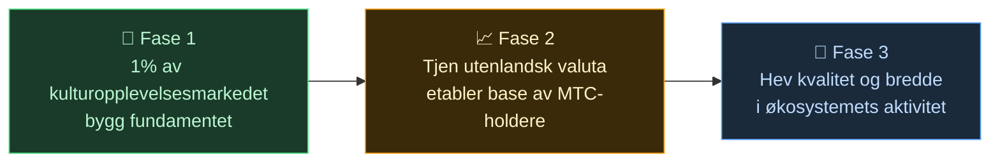

# 🌏 Utfordringer og løsninger – ubehagelige sannheter, og håp

> **Oppdraget er vakkert. Men virkeligheten står i veien.**

---

## De ubehagelige sannhetene som står i veien

:::info 10 billioner yen i markedsenergi når ikke fram til dem som bærer kulturen
Japans dolende turismemarked vokser mot **10 billioner ¥** i året.
Men det meste av godene når aldri fram til dem som faktisk leverer opplevelsene.
:::

### Markedet MTC sikter mot

Vi prøver ikke å ta hele de 10 billionene.

Det vi først går etter, er markedet for **kulturopplevelser, guider og lokale turer**. **1 % av det (rundt 100 milliarder ¥)** er vårt første mål – start smått, bli sterk.

| Fase | Strategi | Mål |
| :--- | :--- | :--- |
| **Start smått** | Fokus på kulturopplevelser og guideturer. Bygg erfaring og vekst gjennom jungeltelegrafen | Inntektsgrunnlag etablert |
| **Bli sterk** | Hent utenlandsk valuta (turistinntekt), dokumenter mekanismen for overskuddsdeling til MTC-holdere | Tillit til MTC-økonomien |
| **Hev nivået** | Når en viss størrelse er nådd, prioriter kvalitet, bredde og dybde i fellesskapet framfor videre ekspansjon | Bærekraftig kulturøkonomi |

> **Vi jager ikke volum – vi vokser gjennom kvaliteten på deltakerne og dybden i opplevelsene.** Det er MTCs vekststrategi.

Web2-plattformene har brakt reisens underverker ut til hele verden. Det er vi takknemlige for.
Men den sentraliserte strukturen har noen uunngåelige bivirkninger.

Algoritmer bestemmer «hva du ser», og tilbyderne tvinges til å konkurrere om plassering. Én enkelt anmeldelse kan avgjøre omsetningen, og gebyrsatser kan endres etter plattformens ønske – alltid i frykten for å «bli valgt eller forsvinne».

Det skaper splittelse mellom tilbyderne og frykt for usynlige regler.
Nabobedriften blir en rival; det blir mer rasjonelt å lukke seg om seg selv enn å samarbeide. Reisende får bare standardiserte valg – stjerner og ranglister – og opplevelser som virkelig har verdi, drukner.

:::danger Tre utfordringer i felten
💸 **Inntekten lekker ut** — mesteparten av omsetningen ender som gebyrer hos utenlandske OTA-er og mellomledd i utlandet

😤 **Områder slites ned** — overturismens byrder blir igjen, mens den egentlige inntekten ikke kommer tilbake til lokalsamfunnet

🚧 **Opplevelsesvegg** — algoritmenes ensartede turer dominerer, og man får aldri «det ekte Japan» å se
:::

> **Japanerne sliter, reisende møter aldri det ekte Japan, og rikdommen forsvinner til plattformene.**

---

## Så hvordan endrer vi det?

Men nå ligger teknologien klar til å endre strukturen fra grunnen av.

:::tip Smart contracts – felles regler som ikke kan skrives om
Gebyrer og vilkår er risset inn i koden og kan ikke endres av én enkelt aktør. De samme reglene gjelder for alle og utføres automatisk.
:::

:::tip Blokkjeden – alt er synlig
Alle transaksjoner registreres i en åpen hovedbok, og hvem som helst kan etterprøve dem. Tiden da data ble låst inne i selskaper, er forbi.
:::

:::tip Solana – 0,4 sek. oppgjør, gebyr på ca. 0,04 ¥
Ingen lag på lag med mellomledd, ingen dager med venting. Mennesker kan møte hverandre direkte.
:::

:::tip AI – utsletter selve administrasjonskostnaden
Den eksplosive produktivitetsgevinsten gjør kostnadsstrukturen som holder kjempeplattformene gående, til fortid.
:::

Vi trenger ikke lenger mellomledd. Vi kan knytte oss direkte til hverandre.

Med denne teknologien frigjør vi turismens økonomi fra monopolet og sender inntektene tilbake til tilbyderne – i Japan og i andre land.
Og vi bygger ikke bare for Japan, men **en mekanisme for å verne om og knytte sammen verdens kulturer**.

---

**[◀ Forrige: Visjon og oppdrag](/docs/vision)**｜**[▶ Neste: Framtiden MTC tegner](/docs/future)**
