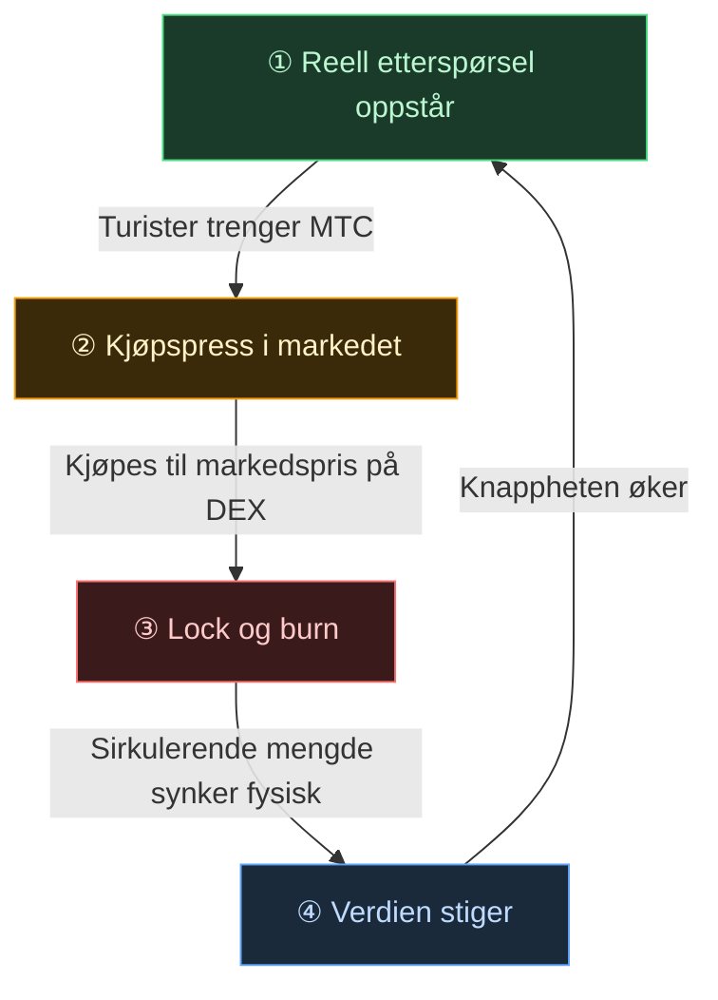

# 🔄 Økonomisk svinghjul – vekstens kretsløp og kultur-OS

> **Jo mer turister nyter Japan, jo mer vokser etterspørselen i økosystemet.**
> Denne tilbuds- og etterspørselsmekanismen er prosjektets hjerte.

---

## MTCs tilbud/etterspørsel

I Matsuri Protocols design er mekanismen bygd slik at **økt reell etterspørsel skaper kjøpspress, som kombinert med synkende tilbud gir betingelsene for verdiøkning**.
Det er ikke håp, men **tilbud og etterspørsel**.

Følgende **firetrinns kretsløp** bærer hele mekanismen.

| Trinn | Navn | Mekanisme |
| :---: | :--- | :--- |
| **①** | **Reell etterspørsel oppstår** | Turister trenger MTC for å booke guider og kjøpe billett-NFT-er |
| **②** | **Kjøpspress i markedet** | MTC kjøpes til markedspris på DEX (desentralisert børs). Ikke spekulasjon, men et sterkt forbruksdrevet kjøp |
| **③** | **Lock og burn** | En del av MTC-en som brukes til betaling, låses eller brennes straks av smart contracten. Sirkulerende mengde synker fysisk |
| **④** | **Økt knapphet** | Kjøpsetterspørselen vokser, salgstilbudet synker. Endringen i tilbud/etterspørsel gjør hver enkelt token sjeldnere |

---

---

:::note Visjonen formelen bærer
Hele bildet av det "kultur-OS" som ligger bortenfor svinghjulet, fortelles på neste side [Framtiden MTC tegner](/docs/future).
:::

---

**[◀ Forrige: Utfordringer og løsninger](/docs/challenges)**｜**[▶ Neste: Framtiden MTC tegner](/docs/future)**
