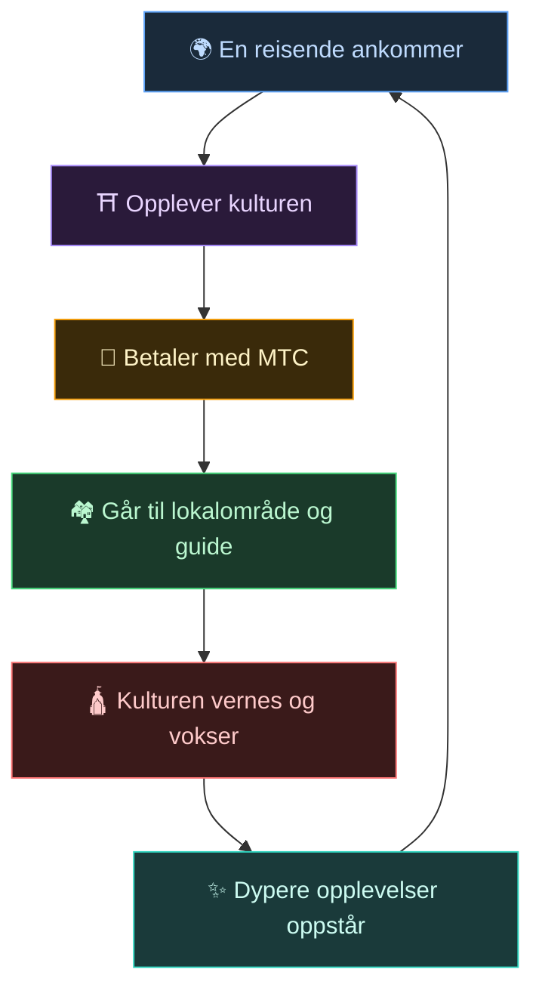
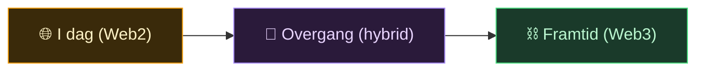
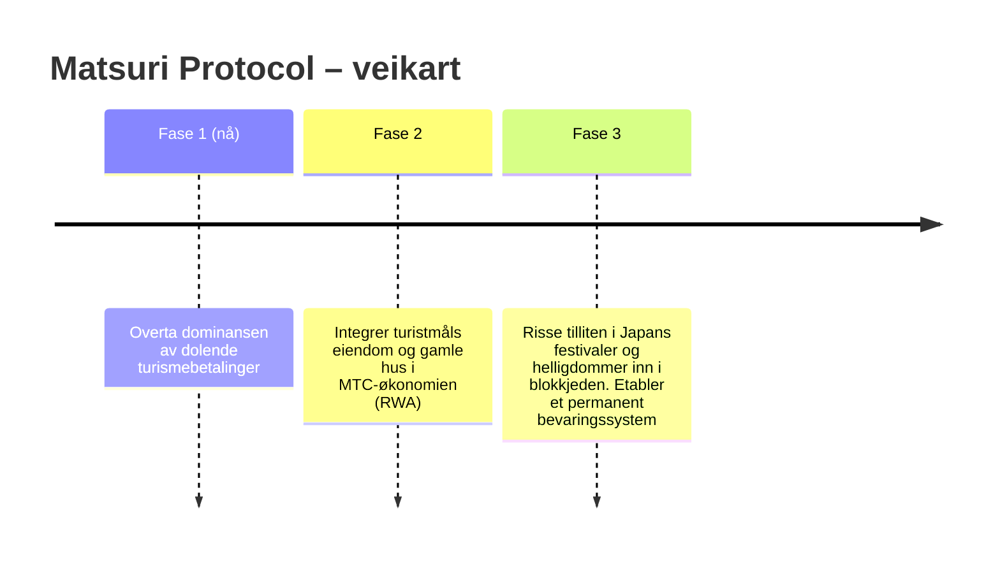

# 🌀 Framtiden MTC tegner – en økonomi der alt engasjement sirkulerer

> **De som opplever, de som formidler, de som verner. Alle tankene sirkulerer som økonomi og sender kulturen videre til neste generasjon.**

---

## Kretsløpet vi vil realisere

MTC er ikke en spekulasjonstoken.

En reisende berøres av japansk kultur.
En guide bringer følelsen videre og belønnes for det.
Et lokalsamfunn får overskudd og kan fortsette å verne om kulturen.
Og den kulturen tiltrekker nye reisende.

Det kretsløpet er hele grunnen til at MTC finnes.

---

## En økonomi der alle tre parter belønnes

I klassisk turisme betaler den reisende, plattformen tar profitten, og lokalsamfunnet sitter igjen med ingenting.
I MTCs økonomi belønnes alle involverte.

| Den involverte | Hva som skjer | Hvordan belønnes de |
| :--- | :--- | :--- |
| **🌍 De som opplever** | Berøres av japansk kultur og betaler med MTC | Billigere enn yen-prisen, tilgang til ekte opplevelser, forblir koblet via MTC også etter hjemreisen |
| **⛩️ De som formidler** | Arrangerer events som guide, publiserer innhold på J-Times | Direkte betaling uten mellomledd – jo mer de arbeider, jo mer belønnes de i MTC |
| **🏘️ De som verner** | Lokalsamfunn som vedlikeholder og viderefører kulturen | Inntektene går direkte til dem. Bærekraftig velstand i stedet for overturisme |

---

## Jo bredere økonomi, jo sterkere kultur

MTCs økonomi begynner med opplevelsesbookinger og sprer seg etter hvert over hele livet.

- **Opplevelser** — ekte kulturopplevelser, pilegrimsgruving
- **Bolig, mat, klær** — gjestehus, butikker, mat, mote
- **Felles skaperprosjekter** — crowdfunding-investeringer som verner om kulturen
- **Internasjonal kulturforståelse** — utveksling og gjensidig forståelse på tvers av grenser

Jo bredere økonomien blir, jo tykkere sirkulerer MTC, og jo sterkere er kraften som bærer kulturen.
Dette er ikke bare en forretningsmodell, men et **livsstøttende system for kulturen**.

---

## Fra Web2 til Web3 – uten rykkvise overganger

Vi sier ikke «alt skal på blokkjeden nå».

De fleste er ennå ikke fortrolige med Web3. Derfor er designet slik at **man først bruker noe kjent og gradvis merker Web3s fordeler**.

| Fase | Brukeropplevelse | Under panseret |
| :--- | :--- | :--- |
| **I dag** | En helt vanlig webapp for booking og betaling. Kredittkort er helt greit | Django + Stripe. Ingen lommebok nødvendig |
| **Overgang** | Tjen og bruk MTC i appen. Lommebok-kobling med ett trykk | Off-chain-poeng migreres gradvis on-chain |
| **Framtid** | Alle transaksjoner og rettigheter registreres transparent på blokkjeden. Bidraget ditt bevises for alltid | Fullautomatisk, uforanderlig økonomi via smart contracts |

:::tip Web3 er ikke vanskelig
Du trenger ikke å sette opp lommebøker eller passe på seed-fraser fra starten. Mens du bruker systemet, berører du Web3-verdenen helt naturlig — **før du vet av det, er du allerede en beboer i Web3.** Slik er opplevelsen designet.
:::

---

## En økonomi drevet av empati, ikke makt

Og denne økonomien drives av smart contracts.
Ingens makt eller bekvemmelighet kan ensidig endre reglene — **en økonomisk mekanisme der makt ikke kan endre status quo**.

På toppen lærer vi av gammel visdom og fortsetter å skape ny verdi. 温故知新 (onko-chishin), og videre mot 創新 (sōshin — å skape nytt).

> **En verden der livet hviler på kultur – uten yen, uten dollar.**
>
> I stedet for å overlate valutaens verdi til andre, skaper og bruker du verdi gjennom ditt eget engasjement.
> Det er friheten MTC vil levere.

---

## 🏁 Sluttmålet: «Kultur-OS»

Det endelige målet vårt er ikke bare en betalingsapp.
Det er å **gjøre selve kulturen til et OS (fundament)**.

> Vi verner om gammel visdom med den nyeste blokkjeden.
> Det er Matsuri Protocols framtidsbilde.

---

:::note Så langt rekker fortellingen
Er du kommet hit, har du nå forstått hvorfor MTC i det hele tatt finnes.
Nå går vi videre til **[Praksis]** — la oss se hva du faktisk kan gjøre med MTC.
:::

**[◀ Forrige: Økonomisk svinghjul](/docs/flywheel)**｜**[▶ Neste: Økosystemet](/docs/ecosystem)**
