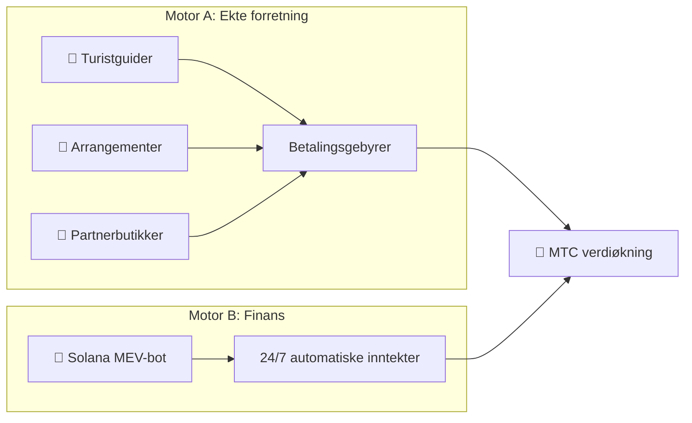

# 💰 Økonomisystemet

> Matsuri Coin (MTC)-økonomien er enkel, men kampherdet.
> **To inntektsmotorer — ekte forretning og finansielle algoritmer — genererer profitt og omfordeler den programmatisk til holdere.**


---

## 1. Doble inntektsmotorer



| Motor | Inntektskilde | Hvordan det fungerer |
| :--- | :--- | :--- |
| **🏯 Motor A (Forretning)** | Betalingsgebyrer fra turistguider, arrangementer og partnerbutikker | Flere turister → mer utenlandsk kapital → økosystemet ekspanderer |
| **🤖 Motor B (Finans)** | Solana MEV-bot automatisert handel | CEO-ledet høyfrekvenshandel som trekker ut profitt fra blokkjedens ineffektiviteter 24/7/365 |

---

## 2. Tilbakekjøpsprotokoll (verdiøkningsmekanisme)

Vi putter ikke profitt i egen lomme.
Smarte kontrakter kanaliserer inntekter direkte til **MTC-verdiøkning.**

| Inntektskilde | Allokering | Handling |
| :--- | :---: | :--- |
| **Matsuri HQs salg** (Guider og arrangementer) | **20 %** | Markedsbasert **tilbakekjøp** + likviditetspoolinjeksjon |
| **GCF-medlemskap** (Medlemsavgifter) | **25 %** | Markedsbasert **tilbakekjøp** |

:::info Kjernelogikk
**«Forretningsvekst = MTC kjøpes konstant på det åpne markedet.»**
Den likningen understøtter din aktivaverdi.
:::

---

## 3. Prisfastsettelseslogikk

Prismekanismen vår kjører på **AMM-formelen (Automated Market Maker)** — ikke ønsketenkning.

```
Pris = Likviditet (SOL) ÷ Tilbud (MTC)
```

| Trinn | Hva skjer | Resultat |
| :---: | :--- | :--- |
| **①** | Forretningsinntekter (SOL) injiseres i poolen | **Teller ↑** |
| **②** | MTC kjøpes tilbake fra markedet og brennes | **Nevner ↓** |
| **③** | Teller ↑ × Nevner ↓ | **Prisen trender matematisk oppover** |

---

## 4. GCF (Global Community Friends)

GCF er den **kun-invitasjon** partnerorganisasjonen (DAO) som skalerer Matsuri-økosystemet.
Ikke en medlemsklubb — et **forretningskollektiv** som deler oppsiden.


### Medlemsnivåer

| Nivå | Rolle | Privilegier |
| :---: | :--- | :--- |
| **👑 Platinum** | Eier / VIP | Topprettigheter. Første **50 plasser** kun. Beslutningsmyndighet + betydelig utbytteinntekt |
| **🥇 Gold** | Ambassadør | Operatørene. Retten til å tjene **uten tak** gjennom aktivitet. Maksimert mining- og vervingsrater |

### Fordel ①: Real-Work Mining (minerettigheter)

De **550 millioner MTC (~61 % av total tilbud)** som låses opp 1. juni 2027 er reservert som **bidragsyterbelønningspool** — ikke dumpet på markedet.

:::tip Fullstendig ytelsesbasert
MTC distribueres automatisk fra poolen basert på din innsats (salg, besøkstall, guideøkter).
:::

**Halveringsskjema (2-års syklus):**

| Periode | Utslipp | Volum |
| :--- | :---: | :--- |
| **Epoke 1** 2027 – 2029 | **50 %** | ~275 M tokens |
| **Epoke 2** 2029 – 2031 | **25 %** | ~137 M tokens |
| **Epoke 3** 2031 – 2033 | **12,5 %** | ~68 M tokens |

:::caution Førstemann-til-mølla-vindu
Raskere enn Bitcoins 4-årige halvering — vi bruker en **2-års syklus.**
De som satser alt de **første to årene fra 2027** sikrer seg en overveldende førstemann-til-mølla-fordel.
:::

### Fordel ②: Premium vervingsprovisjon

Verv høyverdiprodukter (medlemskap, VIP-turer, partnereiendom) og tjen **premiumprovisjon (USDC + MTC)** — størrelsesordener over standard affiliatebetalinger. Utbetales **umiddelbart** via smart kontrakt.

---

## 5. Token-spesifikasjoner

Vi har permanent **TILBAKEKALT** Mint- og Freeze-autoritetene på Solana.
Ingen ytterligere utstedelse — noensinne. Ingen frysing av midler — noensinne. **Fullstendig tillitsløs by design.**

| Element | Detaljer |
| :--- | :--- |
| **Token-navn** | Matsuri Coin |
| **Ticker** | MTC |
| **Kjede** | Solana |
| **Totalt tilbud** | **900 000 000 MTC** (Fast) |
| **Mint-autoritet** | 🚫 Tilbakekalt |
| **Freeze-autoritet** | 🚫 Tilbakekalt |
| **Låsekontrakt** | Streamflow Finance (Verifisert) |

:::warning Kun invitasjon — begrensede plasser
GCF stenger rekrutteringen i det øyeblikket de begrensede plassene fylles (Platinum: 50 / Gold: justeres).
Å ha denne rettigheten betyr å tre inn i **den indre sirkelen** av Matsuri-økonomien.
:::

---

**[▶ Neste: Økosystem og mining](/docs/ecosystem)** ｜ **[Bli med på Discord](#)**
