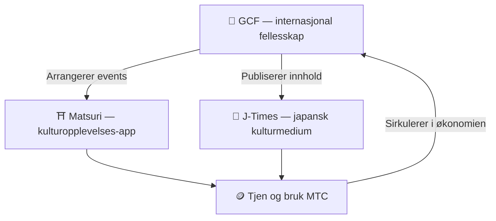

# 🏗️ MTC-økosystemet – en økonomi der opplevelser, medier og fellesskap sirkulerer

> **Tre "steder" som realiserer oppdraget.**
> Et sted å oppleve, et sted å lære, et sted å møtes — uavhengige av hverandre og samtidig ett sirkulerende kretsløp via MTC.

MTC er ikke bare en token. Tre produkter og et internasjonalt fellesskap jobber sammen for å virkeliggjøre en økonomi som verner om kulturen.

:::tip 🤝 GCF — det internasjonale fellesskapet som driver økosystemet
Et sted der mennesker med kjærlighet til japansk kultur møtes på tvers av grenser. GCF rekrutterer guider, og disse GCF-guidene kjører opplevelser på Matsuri. De sender også fengslende innhold til J-Times — fellesskapets aktivitet er motoren for hele økosystemet.
:::

:::tip ⛩️ Matsuri — kulturopplevelses-app
Starter med booking av kulturopplevelser og utvides trinnvis med **gjestehus**, **butikker** og **crowdfunding**. Økonomien vokser fra opplevelser til klær, mat, bolig og felles investering.

**Pilegrimsgruving (sankei-mining)** — tjen MTC ved å besøke helligdommer, templer og kultursteder fysisk. Strømmen av besøkende sprer seg naturlig fra store severdigheter til skjulte perler i regionene, slik at overturisme løses samtidig med at distriktene revitaliseres.
:::

:::tip 📰 J-Times — japansk kulturmedium
Et medium som bringer japansk kultur ut i verden. Tjen MTC ved å lese, dele og engasjere deg i artiklene.
:::

---

## 🤝 Social Mining (tjen ved å knytte bånd)

**Integrert med GCF-administrasjonspanel ── webversjon i drift (iOS-app planlagt april 2026)**

GCF-medlemmer får tilgang til det dedikerte **GCF-admin-webet**.

| Funksjon | Hva du kan gjøre |
| :--- | :--- |
| **🎪 Events** | Utform og publiser egne events og turer |
| **📢 Innhold** | Publiser og spre J-Times-artikler og innhold |
| **📊 Henvisningsoppfølging** | Følg henvisninger, brukeraktivitet og inntekter i sanntid |

:::info Automatisk utbytte
Hver gang en av dine henvisninger gjennomfører en betaling, overfører systemet **automatisk** en andel av omsetningen til lommeboken din.
:::

---

## 🎓 Skaperøkonomi (tjen ved å skape)

Du kan ikke bare konsumere innhold – på Matsuri-plattformen kan **hvem som helst** produsere og tjene på eget innhold.

| Plattform | Hva skaperen kan | Inntektsmodell |
| :--- | :--- | :--- |
| **📚 Kursmarkedsplass** | Publiser video- eller tekstkurs om japansk kultur, språk, håndverk | Gebyr per påmelding (skaperandel) |
| **🎙️ Podcast-studio** | Produser audio-serier distribuert via Spotify, Apple Podcasts, RSS | Abonnement-eksklusive episoder |
| **🤝 Crowdfunding** | Start Solana-baserte kampanjer for kulturprosjekter | On-chain-sporing av bidrag |
| **🛍️ Brukerbutikker** | Åpne personlige butikker på plattformen (håndverk, merch) | Direkte salg med produkt-/anmeldelsessystem |

:::tip AI-assistert produksjon
Event-verter kan bruke den **innebygde AI-assistenten (GPT-4 Turbo)** til å skrive eventbeskrivelser, automatisk oversette til fem språk og generere SEO-optimaliserte metadata — alt fra admin-panelet.
:::

---

  

*Fellesskaps-meetup i Golden Gai ── bånd som gruvekraft.*

---

:::note Neste side
Vil du vite mer om hvordan gruvingen konkret fungerer og hvordan man tjener, gå videre til **[Gruving og inntjening →](/docs/mining)**.
:::
