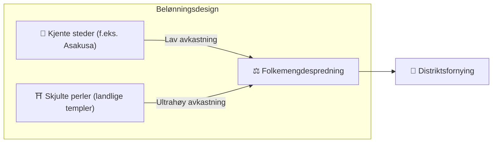

# ⛏️ De tre pilarene innen mining

> **Proof of Action (PoA)**
> Matsuri Coin mines ikke med GPUer, men med **menneskelig handling.**

Webappen og admin-dashboardet er **allerede live** — begynn å tjene **akkurat nå** gjennom aktivitetene nedenfor.

---

## 1. 📖 Media Mining (Les, lytt og quiz for å tjene)

**Drevet av «J-Times» offisielle media**

Kunnskap forvandler kvaliteten på reisen.
Vi belønner læring — lesing, lytting **og** å bevise forståelse gjennom quizer.

| Handling | Hva du gjør | Belønning |
| :--- | :--- | :--- |
| **📰 Les for å tjene** | Les J-Times-artikler om historie, shinto, zen | MTC tildelt |
| **🎧 Lytt for å tjene** | Strøm eksklusive podcaster om dyp japansk kultur | MTC tildelt |
| **✅ Quiz for å tjene** | Bestå quizer for å bevise kunnskapsretensjon | MTC tildelt (umiddelbart) |

:::tip Dødtid → Miningtid
Pendlertiden, lunsjen, flyturen — hvert ledig øyeblikk blir en belønningsgenererende mulighet.
:::

---

## 2. 🤝 Social Mining (Knytt kontakter for å tjene)

**Drevet av GCF Admin Dashboard — allerede i drift**

GCF-medlemmer får tilgang til den dedikerte **«GCF Admin Web».**

| Funksjon | Hva du kan gjøre |
| :--- | :--- |
| **🎪 Arrangementoppretting** | Planlegg og publiser dine egne arrangementer og turer |
| **📢 Innholdsdistribusjon** | Forsterke J-Times-artikler og innhold på tvers av nettverket ditt |
| **📊 Vervingssporing** | Spor vervede brukeres aktivitet og inntekt i sanntid |

:::info Automatiske utbetalinger
Hver gang en vervet venn gjennomfører en transaksjon, setter systemet **automatisk** inn din inntektsandel rett i lommeboken din.
:::

---

## 3. 🗺️ Adventure Mining (Beveg deg for å tjene)

**Prosjekt «PILEGRIMSREISE» — neste fase (under utvikling)**

En neste-generasjons funksjon som bruker GPS og token-insentiver til å omdirigere den fysiske turiststrømmen.

> **«Folk reiser til distriktene fordi det er mer lønnsomt.»**
> Den økonomiske logikken løser overturisme og akselererer distriktsfornying.

### 🎲 «Omikuji»-protokollen

En lykkelapp-lignende smart kontrakt som utløses **gratis (kun gass)** ved innsjekking.

| Resultat | Hva du får |
| :--- | :--- |
| **🎊 Storlykke** | Bonus MTC-airdrop |
| **📜 NFT-slipp** | Stedseksklusiv **«Goshuin NFT»** |
| **🏆 Samling komplett** | Å fullføre et sett låser opp spesiell arrangementstilgang |

:::note Ikke gambling
Null pengeinnsats nødvendig. Bare en tilfeldig bonus for **å dukke opp.**
:::

---

## 4. 🏦 Likviditets-mining (Tilby for å tjene)

> **Bli banken.**

Vi kjører et spesielt belønningsprogram for brukere som tilbyr MTC/SOL-likviditet på Raydium.

| Element | Detaljer |
| :--- | :--- |
| **Hvem** | Tidlige likviditetstilbydere («grunnlegger-partnere») |
| **Mål-APY** | **50 %** (satt som risikopremie) |
| **Hvorfor** | Sikre initial likviditet for et stabilt handelsmiljø |

---

**[▶ Neste: Veikart og team](/docs/roadmap)** ｜ **[◀ Forrige: Økonomien](/docs/economy)**
