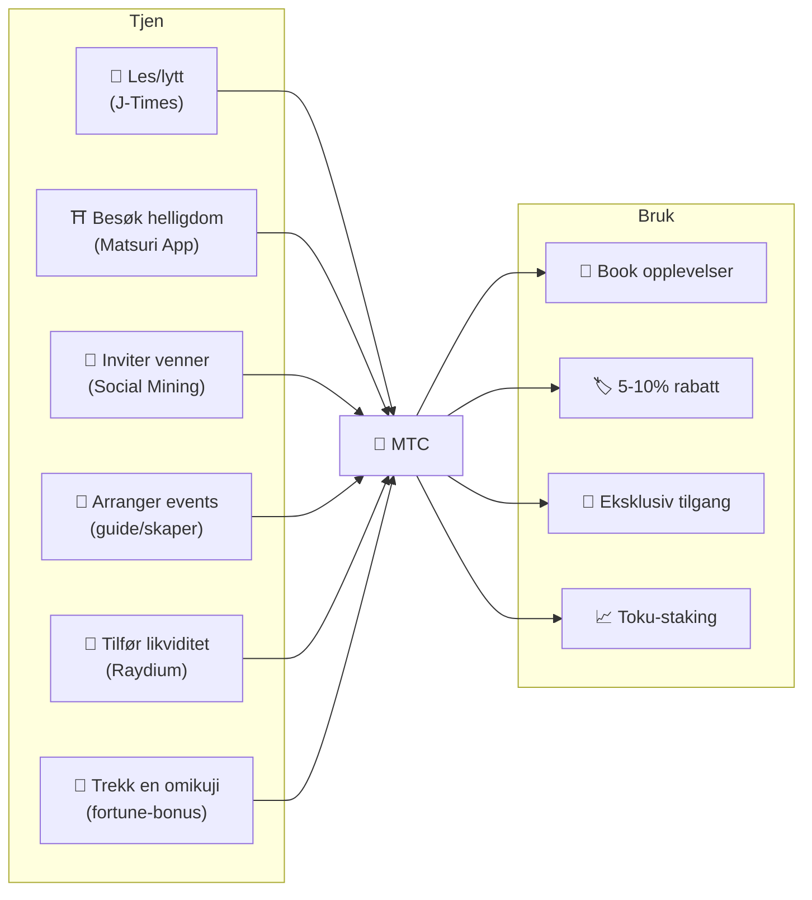
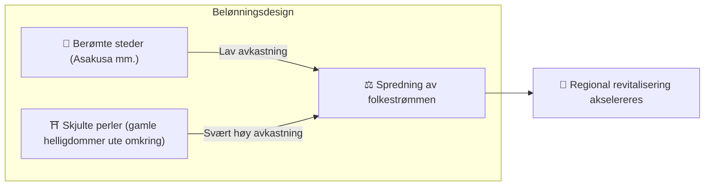
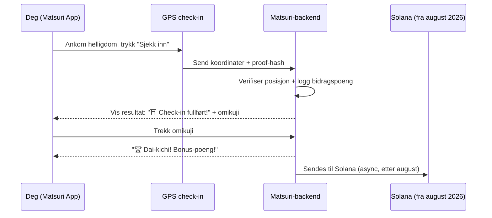
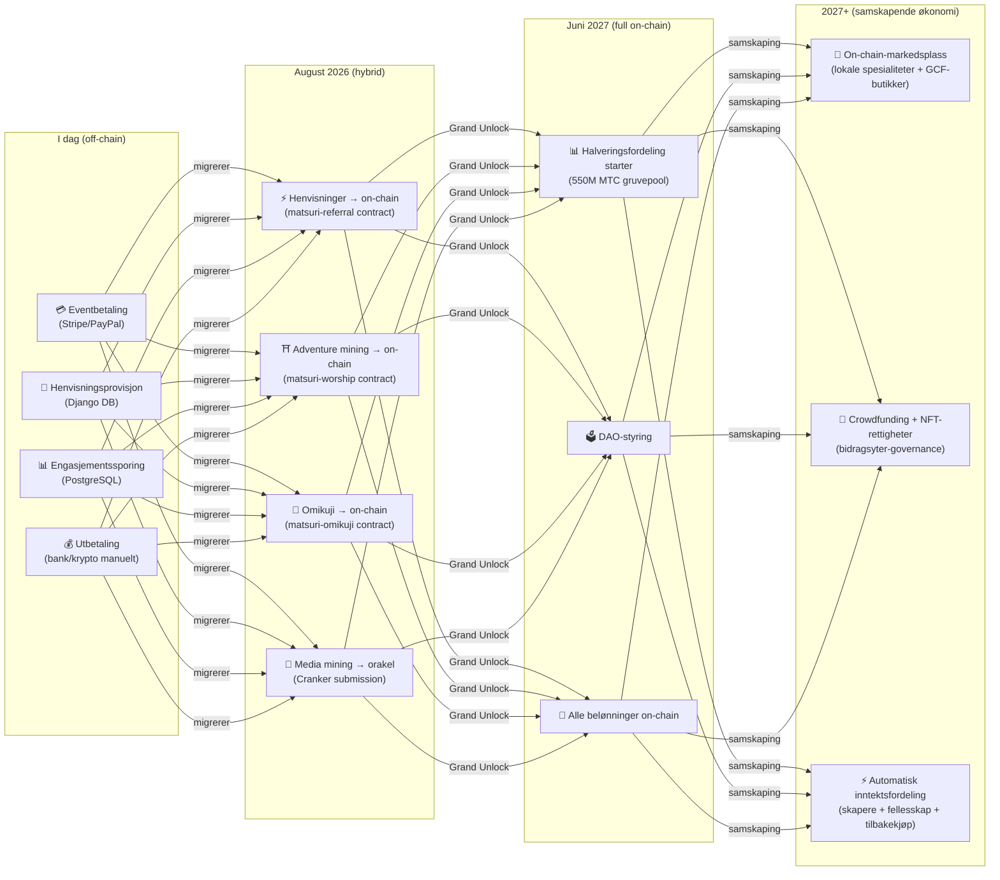

import useBaseUrl from '@docusaurus/useBaseUrl';

# ⛏️ De fem søylene for gruving og hvordan man tjener

> **Engasjementet ditt i kulturen blir direkte til verdi.**
> Les, gå, knytt bånd, skap, støtt — hver enkelt handling skaper MTC.

<small>*※ Hva er «gruving»? I Bitcoin osv. kalles det gruving når en datamaskin gjør enorme beregninger og mottar nye mynter som belønning. I MTC er det ikke datakraft, men **dine egne handlinger** — å lese en artikkel, besøke en helligdom, arrangere et event — som utgjør «gruvingen». I stedet for å grave i en gullåre er det engasjement i kulturen som utvinner MTC. Det er vår «gruving».*</small>

> Tjen ved å handle. Bruk på opplevelser. Hold og voks.

MTC er ikke en spekulasjonstoken. Alle handlinger skaper og henter verdi i en reell økonomi. Webappen og admin-panelet er **allerede i drift**. Bidragspoengene registreres nå off-chain (Django), og fra august 2026 flyttes de trinnvis on-chain.

:::tip Det store bildet
MTC har **en fullstendig sirkulær økonomi**: du tjener gjennom reell aktivitet, bruker på reelle opplevelser, og verdien vokser med økosystemet. På denne siden går vi i dybden på mekanismen.
:::

---

## MTCs livssyklus

---

## De fem gruvingssøylene

### 1. 📖 Media Mining (tjen ved å lese, lytte og svare)

**Integrert med det offisielle mediet «J-Times»**

Kunnskap løfter reisens kvalitet dramatisk. Åpne **J-Times-appen** og nyt innholdet om japansk kultur. I tillegg til lesing og lytting belønnes også **forståelsestester (quizer)**. For hver gjennomført handling tildeles MTC automatisk.

| Handling | Vilkår for fullført | Cirka-belønning |
| :--- | :--- | :---: |
| **📰 Les en artikkel** | Scroll til 75% | 2–30 MTC |
| **🎧 Lytt til en podcast** | Lytt til slutt | 2–30 MTC |
| **🎬 Se en video** | Lukk detaljevisningen etter visning | 2–30 MTC |
| **📤 Del innhold** | Åpne delearket | 2–30 MTC |
| **✅ Svar på quiz** | Bestå forståelsestesten | 2–30 MTC |

<small>*※ Belønningen varierer med innholdstype, lengde og tilbudsbalansen i hele økosystemet*</small>

:::tip Små pauser blir til gruving
Reisetid og pauser forvandles til tid som skaper belønning.
:::

:::info Offline-støtte
Ingen nett ved en helligdom på landet? Ikke noe problem. J-Times logger aktiviteten lokalt og **synkroniserer automatisk når du igjen er online** (offline-kø bevares i 7 dager). Du mister ikke den MTC-en du har tjent.
:::

**Under panseret:**
1. J-Times-appen registrerer handlingen din (fullført lesing, visning, deling osv.)
2. Logger lokalt, også offline (bevares i 7 dager)
3. Sendes til serveren og valideres når nettet er tilbake
4. Oppdateres som bidragspoeng i saldoen
5. Fra august 2026: den validerte poengsummen skrives on-chain via en orakel og kan etterprøves på blokkjeden

---

### 2. ⛩️ Adventure Mining (tjen ved å gå)

**Prosjektet «Junrei (pilegrimsferd)» ── smart contract ferdig, mainnet-deploy august 2026**

En neste generasjons funksjon som bruker GPS og token-insentiver til å styre den fysiske strømmen av mennesker. Det hellige kartet kjører **allerede i Matsuri-webappen**. Bidragspoeng registreres off-chain i dag, og on-chain-utbetalinger starter etter smart contract-deployet i august 2026.

>**Man tjener mer, altså drar man ut på landet**
> Den økonomiske logikken løser overturisme og akselererer regional gjenoppblomstring.

**Slik fungerer check-in:**

  
  

    
<strong>Worship Mining</strong> — sjekk inn nær et tempel, oppdag energi med AR-kamera, trekk en omikuji for MTC-bonus. Multiplikatorer fra 1.0× til 10.0×.

  

**Grunnprinsipp — sjelden besøkte steder gir mer:**

| Stedstype | Eksempel | Cirka-belønning (per check-in) |
| :--- | :--- | :---: |
| 🏙️ **Hoved** | Senso-ji, Kiyomizu-dera, Fushimi Inari | 30–50 MTC |
| 🌆 **Regionkjerne** | Ichinomiya i hver prefektur, store regionale helligdommer | 50–100 MTC |
| 🏞️ **Lokalt** | Historiske helligdommer på landet | 100–150 MTC |
| ⛰️ **Frontier** | Fjelltempler, hellige steder på avsidesliggende øyer | 150–200 MTC |

<small>*※ Ovennevnte er veiledende grunnbelønning. Omikuji-multiplikatoren kan heve den flere ganger*</small>

**Ekstra poeng-faktorer:**
- **Omikuji-multiplikator** — tilfeldig bonus ved hvert check-in. Dai-kichi mangedobler belønningen
- **Besøksfrekvens** — gjengangere tjener mer over tid
- **Sponsede steder** — kommuner kan booste bestemte steder

:::info Bidragspoeng → MTC
Aktiviteten din akkumuleres som **bidragspoeng**. Ved hver halverings-epoke (starter juni 2027) gjøres poengene om til MTC fra 550M-gruvepoolen. Jo mer du bidrar til fellesskapet, jo mer MTC får du. De nøyaktige boost-koeffisientene fastsettes trinnvis og implementeres i smart contracts — en garanti for rettferdig fordeling som stemmer med reell poolstørrelse.
:::

---

### 3. 🤝 Social Mining (tjen ved å knytte bånd)

Du kan tjene MTC bare ved å invitere venner.

#### Henvisningsbelønning for vanlige brukere

Enkelt: når en venn registrerer seg via henvisningslinken din, får du **300 MTC per direkte henvisning**.

| Vilkår | Belønning |
| :--- | :--- |
| En venn du har henvist registrerer seg | **300 MTC** |

Det er alt. Ingen flernivå-belønninger.

#### Henvisningsbelønning for GCF-agenter

[GCF-medlemmer](/docs/gcf) fungerer som **offisielle agenter** for økosystemets ekspansjon og har en dypere belønningsstruktur.

| Lag | Relasjon | Provisjon |
| :---: | :--- | :---: |
| **L1** | Direkte henvisning | **20%** |
| **L2** | Henvisning av henvisning | **5%** |
| **L3** | 3. ledd | **5%** |
| **L4** | 4. ledd | **5%** |

:::note Om GCF-agentordningen
Flernivåstrukturen gjelder kun offisielle agenter med GCF-medlemskap (etter invitasjon). Vanlige brukere får bare den direkte henvisningen (300 MTC).
Provisjoner for GCF-agenter beregnes ut fra **reell økonomisk aktivitet** (opplevelseskjøp, eventdeltakelse osv.) hos de henviste. Å samle folk uten aktivitet gir ingen belønning.
:::

**Slik fungerer En-Mining-poengene (for GCF-agenter):**

Bidragspoengene beregnes av to komponenter:
- **Nettverkets bredde** (30%) — hvor mange du har brakt inn
- **Økonomisk aktivitet** (70%) — faktiske kjøp fra henvisningsnettverket

Poengene akkumuleres over tid og gjøres om til MTC ved hver halverings-epoke.

#### GCF-administrasjonspanel ── webversjon i drift

GCF-medlemmer får tilgang til et dedikert administrasjonspanel.

| Funksjon | Hva du kan gjøre |
| :--- | :--- |
| **🎪 Events** | Utform og publiser egne events og turer |
| **📢 Innhold** | Publiser og spre J-Times-artikler og innhold |
| **📊 Henvisningsoppfølging** | Følg henviste brukeres aktivitet og inntekter i sanntid |

:::warning I dag off-chain → migrerer on-chain august 2026
Henvisningsprovisjoner spores i dag i Django (PostgreSQL) og utbetales via bankoverføring eller krypto. Fra **august 2026** flyttes de til **Matsuri Referral smart contract** på Solana, slik at utbetalinger kan revideres on-chain.
:::

  

*Fellesskaps-meetup i Golden Gai ── bånd som gruvekraft.*

---

### 4. 🎓 Creator & Guide Mining (tjen ved å skape)

Du kan ikke bare konsumere innhold – på Matsuri-plattformen kan **hvem som helst** produsere og tjene på eget innhold. Er du GCF-medlem, guide eller innholdsskaper, kan du tjene på følgende måter.

| Aktivitet | Inntektskilde |
| :--- | :--- |
| **🗺️ Arranger turer** | Guideprovisjon (satt per event) + tips |
| **🎫 Selg eventbilletter** | Inntektsandel via EventPurchase |
| **📚 Publiser kurs** | Gebyr per påmelding (skaperandel) |
| **🎙️ Produser podcast-episoder** | Abonnementsinntekt |
| **🤝 Start crowdfunding** | Solana-basert on-chain-sporing av bidrag |
| **🛍️ Åpne brukerbutikk** | Direkte salg av håndverk/merch |

**Tips-system:** Etter eventet kan gjester sende tips til guiden (Uber-stil). Tips håndteres via Stripe og spores i en offentlig leaderboard.

:::tip AI-assistert produksjon
Event-verter kan bruke den **innebygde AI-assistenten (GPT-4 Turbo)** til å skrive eventbeskrivelser, oversette automatisk til fem språk og generere SEO-optimaliserte metadata — alt fra admin-panelet.
:::

---

### 5. 🏦 Likviditetsgruving (tjen ved å parkere)

>**Bli din egen bank.**

Tilfør likviditet til MTC/SOL på Raydium DEX og støtt handelsgrunnlaget i økosystemets tidlige fase. De tidlige likviditets-leverandørene får et eget «grunnleggerpartner»-belønningsprogram.

| Punkt | Detaljer |
| :--- | :--- |
| **Hvem** | Alle som eier MTC og SOL |
| **Mål-APY** | **20%** (initialt likviditets-insentiv som risikopremie) |
| **DEX** | Raydium (Solana) |
| **Formål** | Sikre likviditet tidlig i økosystemet og etablere et stabilt handelsmiljø |

---

## 🎲 Omikuji-bonus

Hvert adventure-mining check-in inkluderer en gratis omikuji. En omikuji-formet smart contract som utføres **gratis (kun gas)** når check-in er fullført.

| Lykke | Belønningsmultiplikator | Ekstra bonus |
| :--- | :---: | :--- |
| 🏆 **Dai-kichi** | Grunnbelønning × maks | Goshuin-NFT |
| ✨ **Kichi** | Grunnbelønning × høy | — |
| 🌸 **Shō-kichi** | Grunnbelønning × lav | — |
| 🍃 **Sue-kichi** | Grunnbelønning × 1,0 | — |
| 💀 **Kyō** | Grunnbelønning × 1,0 | — |

Sannsynligheter og multiplikatorer kan justeres fra GCF-admin-panelet og styres etter MTC-tilbudsbalansen i hele økosystemet. Resultatet bestemmes av en **tamper-resistent commit-reveal-protokoll på Solana** — etter commit-fasen kan ingen endre resultatet.

<small>*※ Får du kyō, mottar du fortsatt grunnbelønningen. Selve handlingen å sjekke inn belønnes*</small>

:::note Dette er ikke gambling
Ingen penger settes på spill. Det er bare en tilfeldig bonus for **handlingen «jeg har besøkt stedet»**. Samler du bestemte NFT-er, kan du låse opp tilgang til spesielle events.
:::

---

## Slik bruker du MTC

| Bruk | Fordel | Status |
| :--- | :--- | :---: |
| **🎫 Book opplevelser** | Betal turer, events og kulturaktiviteter med MTC | ✅ Tilgjengelig |
| **🏷️ Rabatt** | 5–10% rabatt på yen-prisen ved MTC-betaling | ✅ Tilgjengelig |
| **🔑 Eksklusiv tilgang** | NFT-gatede events, VIP-ritualer, private turer | ✅ Tilgjengelig |
| **📈 Toku-staking** | Lås MTC og boost bidragspoengene (opptil ca. 50% boost) | 🔜 August 2026 |
| **🗳️ DAO-styring** | Stem om treasury, protokoll-oppgraderinger, site-sertifisering | 🔜 2027 |
| **🛍️ Partnerbutikker** | Betal hos partnerbutikker og restauranter | 🔜 Utvides |

:::info MTC som betalingsmiddel
I Matsuri-appen er MTC et førsteklasses betalingsmiddel på linje med kredittkort og Solana Pay. Ingen konvertering — velg «Betal med MTC» i kassen, og beløpet trekkes straks fra saldoen.
:::

### Om innløsning av MTC

:::warning Viktig: vi tilbyr ikke innløsning eller veksling av MTC
Matsuri er ikke registrert som krypto-vekslingstjeneste, så **vi veksler ikke MTC direkte til fiat (¥, $, osv.)**.

Vil du veksle MTC til annen krypto eller fiat, gjør du følgende selv:
1. Administrer MTC i en Solana-kompatibel lommebok som **Phantom Wallet**
2. Veksle MTC → SOL på **Raydium (DEX)**
3. Veksle SOL til fiat hos en krypto-børs (CEX)

På sikt vurderer vi også notering på CEX-er (sentraliserte børser), noe som vil gjøre innløsning enklere.
:::

---

## Eksempel: en dag i MTC-økonomien

> **Morgen:** les 3 J-Times-artikler på toget → tjen MTC.
> **Ettermiddag:** besøk en lokal helligdom i Matsuri-appen → sjekk inn, trekk «kichi» (×1,5) → tjen enda mer MTC.
> **Kveld:** book en kulturtur i Shinjuku Golden Gai til ¥9 000 med 10% MTC-rabatt (betal ¥8 100).
> **Resultat:** din kulturelle nysgjerrighet ble til en ekte opplevelse, og guiden, helligdommen og fellesskapet fikk betaling direkte. Ingen OTA tok 20% i gebyr.

---

## Økonomisk bærekraft

:::warning Hva skjer når gruvepoolen tømmes?
Halveringspoolen på 550M MTC er designet for å vare i **flere tiår**. Siden utgivelsen halveres annethvert år, når den matematisk aldri 100%, og belønninger fortsetter lenge (se [Tokenomics](/docs/tokenomics)). Men også lenge etter at utgivelsen er blitt svært liten:

- **Transaksjonsgebyrer** fortsetter å belønne nettverksdeltakere fra on-chain-aktivitet
- **Tilbakekjøpsprotokollen** (20-25% av forretningsomsetning) skaper konstant kjøpspress
- **Toku-staking** låser sirkulerende tilbud og reduserer salgspress
- **Reell forretningsomsetning** (events, medlemskap, kurs) bærer økosystemet uavhengig av token-utgivelse

MTC er understøttet av en **reell økonomi** — ikke bare token-emisjon.
:::

---

## Veikart for on-chain-migreringen

Matsuri-økonomien migrerer trinnvis fra off-chain (Django/PostgreSQL) til on-chain (Solana smart contracts). Migreringen gjør alle operasjoner **trustless, reviderbare og uten tillatelse**.

| Fase | Tidslinje | Hva som blir on-chain |
| :--- | :--- | :--- |
| **Fase 1 (nå)** | Live | MTC-token (SPL), Raydium LP, Solana Pay-verifikasjon |
| **Fase 2 (august 2026)** | Smart contracts deployes på mainnet | Henvisningsprovisjoner, adventure-mining-belønninger, omikuji-lotteri, media mining via orakel |
| **Fase 3 (juni 2027)** | Grand Unlock | 550M MTC halveringsfordeling, DAO-styring, full desentralisering |
| **Fase 4 (2027+)** | Samskapende økonomi | On-chain-markedsplass (regionale spesialiteter + GCF-butikker), crowdfunding med NFT-rettigheter, automatisk inntektsfordeling til skapere + fellesskap + tilbakekjøp |

:::warning Hvorfor ikke alt on-chain med én gang?
**Inntil sikkerhetsrevisjonen er gjennomført, aktiverer vi ikke on-chain-funksjoner der brukernes midler beveger seg.** Det er prinsippet vårt.

Status i dag:
- **Brukermidler i fare: nei** — alle belønninger og poeng holdes i dag off-chain (Django); ingen funksjoner flytter brukermidler via smart contracts
- **Revisjonsplan: Q2–Q3 2026** — når en profesjonell sikkerhetsrevisjon er bestått, deployes kontraktene trinnvis på mainnet
- **Fullført revisjon er forutsetning for deploy** — vi aktiverer aldri en urevidert smart contract på mainnet

Off-chain-belønningene kan også verifiseres — alle transaksjoner inneholder `solana_signature` som betalingsbevis.
:::

---

**[▶ Neste: Tokenomics](/docs/tokenomics)** ｜ **[◀ Forrige: Økosystemet](/docs/ecosystem)**
