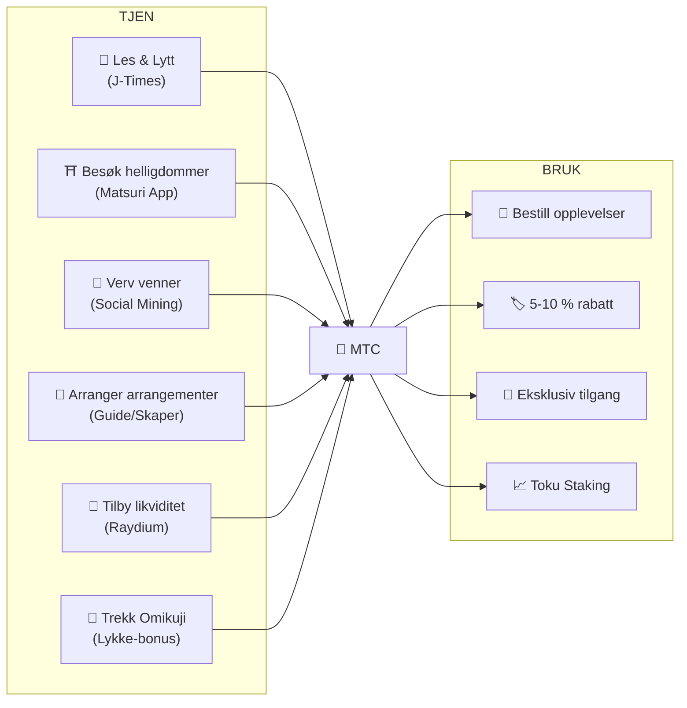
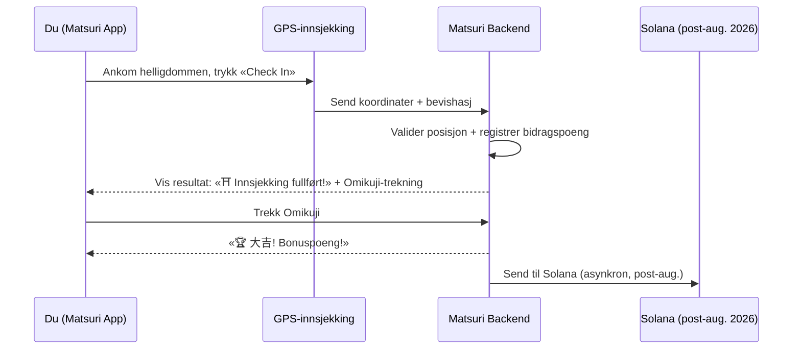
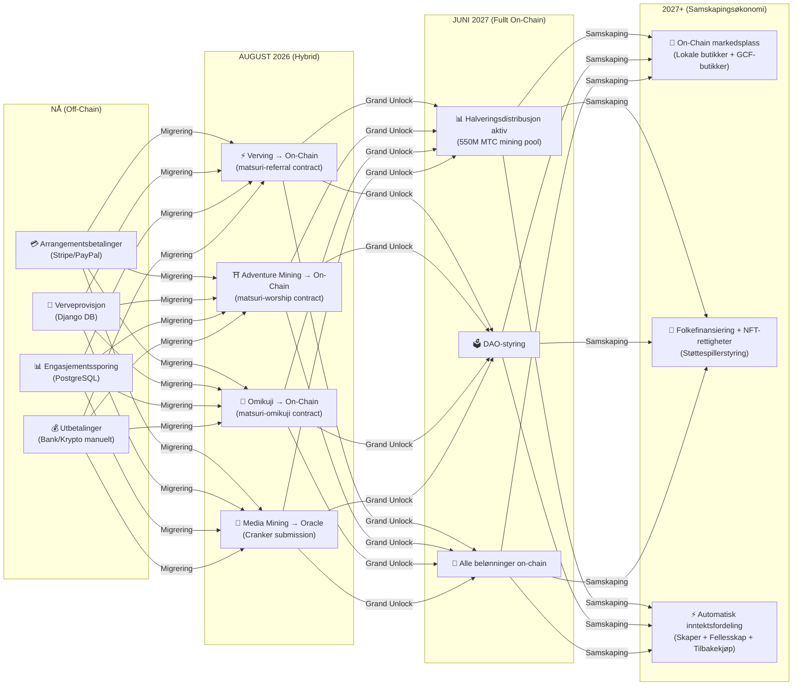

# 💎 Hvordan tjene og bruke MTC

> **Tjen gjennom handling. Bruk på opplevelser. Hold for vekst.**
> MTC er ikke bare et spekulativt token — det flyter gjennom en reell økonomi der hver handling skaper og fanger verdi.

:::tip Det store bildet
MTC har en **komplett sirkulær økonomi**: du tjener det gjennom reelle aktiviteter, bruker det på reelle opplevelser, og verdien vokser etter hvert som økosystemet utvides. Denne siden viser deg nøyaktig hvordan.
:::

---

## MTC-livssyklusen

---

## Hvordan tjene MTC

### 1. 📖 Media Mining — Les, lytt og se på J-Times

Åpne **J-Times-appen** og utforsk innhold om japansk kultur. Hver fullført handling gir MTC automatisk.

| Handling | Fullføringskriterium | Belønning |
| :--- | :--- | :---: |
| **Les en artikkel** | Rull til 75 % av innholdet | MTC |
| **Lytt til en podkast** | Spor avspilling til slutt | MTC |
| **Se en video** | Forlat detaljskjermen etter visning | MTC |
| **Del innhold** | Delingsark presentert | MTC |
| **Fullfør en quiz** | Bestå forståelsestesten | MTC (umiddelbart) |

:::info Frakoblet støtte
Ingen internettforbindelse ved en landlig helligdom? Ikke noe problem. J-Times registrerer aktiviteten din lokalt og **synkroniserer automatisk når du er tilbake på nett** (frakoblet kø med 7 dagers oppbevaring). Du mister aldri opptjente MTC.
:::

**Slik fungerer det teknisk:**
1. `EngagementTracker` i appen oppdager fullføringshendelser
2. Handlinger legges i kø lokalt (selv frakoblet)
3. Ved nettverksgjenoppretting sendes handlinger samlet til Django API
4. API validerer og krediterer MTC til saldoen din
5. Etter august 2026: handlinger vil bli sendt on-chain via Cranker-orakelet

---

### 2. ⛩️ Adventure Mining — Besøk hellige steder med Matsuri App

Åpne **Matsuri-appen**, finn en helligdom eller et tempel på kartet over hellige steder, dra dit og registrer deg. Aktiviteten din registreres som en **bidragspoeng**.

**Slik fungerer det:**

**Kjerneprimipp — mindre besøkte steder gir mer:**

| Stedtype | Eksempler | Poeng |
| :--- | :--- | :---: |
| 🏙️ **Store** | Sensoji, Kiyomizu-dera, Fushimi Inari | Standard |
| 🌆 **Regionale** | Prefekturens ichinomiya, regionale storhelligdommer | Høyere |
| 🏞️ **Landlige** | Historiske landsbyhelligdommer | Mye høyere |
| ⛰️ **Grenseområder** | Fjelltempler, hellige steder på avsidesliggende øyer | Høyest |

**Ekstra poengfaktorer:**
- **Besøksfrekvens** — regelmessige besøkende tjener mer over tid
- **Omikuji** — tilfeldig lykketrekning gir bonuspoeng (大吉 er best!)
- **Sponsede steder** — kommuner kan styrke bestemte steder

:::info Bidragspoeng → MTC
Aktiviteten din akkumuleres som **bidragspoeng**. Ved hver halveringsepoke (fra juni 2027) konverteres poeng til MTC fra 550M mining-poolen. Jo mer du bidrar i forhold til fellesskapet, desto mer MTC mottar du. Nøyaktige boostkoeffisienter vil bli fastsatt progressivt og implementert i smarte kontrakter — for å sikre rettferdig distribusjon tilpasset den faktiske poolstørrelsen.
:::

---

### 3. 🤝 Social Mining — Verv venner og bygg nettverket ditt

Del vervekoden din. Når nettverket ditt handler, tjener du automatisk.

| Lag | Relasjon | Provisjon |
| :---: | :--- | :---: |
| **L1** | Du → Venn (direkte) | **20 %** |
| **L2** | Venn → Deres venn | **5 %** |
| **L3** | 3. ledd | **5 %** |
| **L4** | 4. ledd | **5 %** |

**Slik fungerer En-Mining-scoren:**

Bidragspoengene dine beregnes basert på to faktorer:
- **Nettverksrekkevidde** (30 %) — hvor mange personer du bringer inn
- **Økonomisk aktivitet** (70 %) — ekte kjøp fra vervingsnettverket ditt

> **Viktig innsikt:** Mesteparten av poengene dine kommer fra **reell økonomisk aktivitet** i nettverket ditt, ikke bare registreringer. Å invitere 1 000 personer som aldri bruker penger gir mindre enn å invitere 10 aktive forbrukere.

Poeng akkumuleres over tid og konverteres til MTC ved hver halveringsepoke. Boostmultiplikatorer (f.eks. staking av MTC, sesongrangeringer) vil bli introdusert progressivt via smarte kontrakter.

:::warning For øyeblikket Off-Chain → Flyttes On-Chain august 2026
Verveprovisjonene spores for tiden i Django (PostgreSQL) og betales via bankoverføring eller krypto. Fra og med **august 2026** vil hele verveprovisjons-systemet migrere til **Matsuri Referral smart contract** på Solana — noe som gjør utbetalinger tillitsløse, umiddelbare og reviderbare on-chain.
:::

---

### 4. 🎪 Creator & Guide Mining — Arranger arrangementer, lag innhold

Hvis du er GCF-medlem, guide eller innholdsskaper:

| Aktivitet | Hvordan du tjener |
| :--- | :--- |
| **Arranger en omvisning** | Guide-provisjon (satt per arrangement) + tips |
| **Selg arrangementsbilletter** | Inntektsdeling via EventPurchase |
| **Publiser et kurs** | Gebyr per påmelding |
| **Lag podkastepisoder** | Abonnementsinntekter |
| **Start en folkefinansieringskampanje** | Solana-baserte bidrag |

**Tipssystem:** Etter hvert arrangement kan gjestene tipse guider (Uber-stil). Tips behandles via Stripe og spores på en offentlig resultatliste.

---

### 5. 🏦 Liquidity Mining — Tilby likviditet på Raydium

Tilby MTC/SOL-likviditet på Raydium DEX og tjen belønninger.

| Element | Detaljer |
| :--- | :--- |
| **Mål-APY** | 20% (tidlig likviditetsinsentiv) |
| **DEX** | Raydium (Solana) |
| **Hvem** | Alle som holder MTC og SOL |

---

### 6. 🎲 Omikuji-bonus — Lykketrekning

Hver Adventure Mining-innsjekking inkluderer en gratis Omikuji-trekning (lykke) — en bonus oppå dine vanlige poeng.

| Lykke | Sjeldenhet | Bonus |
| :--- | :---: | :--- |
| 🏆 **大吉** (Stor Velsignelse) | Sjelden | Høyeste bonuspoeng + NFT |
| ✨ **吉** (Velsignelse) | Uvanlig | Gode bonuspoeng |
| 🌸 **小吉** (Liten Velsignelse) | Vanlig | Liten bonus |
| 🍃 **末吉** (Fremtidig Velsignelse) | Vanlig | Deltakelse registrert |
| 💀 **凶** (Ulykke) | Uvanlig | Deltakelse registrert |

Resultatet bestemmes av en **manipulasjonssikker commit-reveal-protokoll** på Solana. Ikke engang serveren kan endre resultatet ditt etter commit-fasen. Nøyaktige sannsynligheter og bonusbeløp vil bli fastsatt i smartkontraktimplementeringen.

---

## Hvor du kan bruke MTC

| Bruksområde | Fordel | Tilgjengelig |
| :--- | :--- | :---: |
| **🎫 Bestill opplevelser** | Betal for omvisninger, arrangementer og kulturelle aktiviteter med MTC | ✅ Nå |
| **🏷️ Rabatt** | 5–10 % rabatt sammenlignet med yen-pris ved betaling med MTC | ✅ Nå |
| **🔑 Eksklusiv tilgang** | NFT-styrte arrangementer, VIP-seremonier, private omvisninger | ✅ Nå |
| **📈 Toku Staking** | Lås MTC for å øke bidragspoengene dine (opptil ~50 % boost) | 🔜 Aug. 2026 |
| **🗳️ DAO-styring** | Stem over treasury, protokolloppgraderinger og stedsertifisering | 🔜 2027 |
| **🛍️ Partnerbutikker** | Betal hos deltakende butikker og restauranter | 🔜 Utvides |

:::info MTC som betalingsmiddel
I Matsuri-appen er MTC et førsteklasses betalingsmiddel på linje med kredittkort og Solana Pay. Ingen konvertering nødvendig — velg «Betal med MTC» ved kassen, og saldoen trekkes umiddelbart.
:::

### Eksempel: En dag i MTC-økonomien

> **Morgen:** Les 3 J-Times-artikler på toget → tjen MTC.
> **Ettermiddag:** Besøk en landlig helligdom med Matsuri-appen → sjekk inn, trekk 吉 (×1.5) → tjen enda mer MTC.
> **Kveld:** Bruk opptjente MTC til å bestille en kulturell tur i Golden Gai til ¥9 000 med 10 % rabatt (betal tilsvarende ¥8 100).
> **Resultat:** Din kulturelle nysgjerrighet finansierte en ekte opplevelse — og guiden, helligdommen og samfunnet mottok alle direkte betaling. Ingen OTA tok 20 % i provisjon.

### Økonomisk bærekraft

:::warning Hva skjer når mining-poolen er tom?
Halverings-poolen på 550M MTC er designet for å vare i **flere tiår** (20 epoker × 2 år = 40 år teoretisk). Men selv etter at poolen er uttømt:

- **Transaksjonsgebyrer** fra on-chain-aktivitet fortsetter å belønne nettverksdeltakere
- **Tilbakekjøpsprotokollen** (20–25 % av forretningsinntektene) skaper vedvarende kjøpepress
- **Toku Staking** låser sirkulerende tilbud og reduserer salgspress
- **Reelle forretningsinntekter** (arrangementer, medlemskap, kurs) opprettholder økosystemet uavhengig av tokendistribusjon

MTC er støttet av en **reell økonomi** — ikke bare tokenutslipp.
:::

---

## Veikart for On-Chain-migrering

Matsuri-økonomien flyttes gradvis fra off-chain (Django/PostgreSQL) til on-chain (Solana smart contracts). Denne overgangen gjør alle operasjoner **tillitsløse, reviderbare og tillatelsesløse**.

| Fase | Tidslinje | Hva som flyttes On-Chain |
| :--- | :--- | :--- |
| **Fase 1 (Nå)** | I produksjon | MTC-token (SPL), Raydium LP, Solana Pay-verifisering |
| **Fase 2 (Aug. 2026)** | Smart contract mainnet-utrulling | Verveprovisjon, Adventure Mining-belønninger, Omikuji-trekninger, Media Mining via orakel |
| **Fase 3 (Juni 2027)** | Grand Unlock | 550M MTC halveringsdistribusjon, DAO-styring, full desentralisering |
| **Fase 4 (2027+)** | Samskapingsøkonomi | On-chain markedsplass (lokale butikker + GCF-butikker), folkefinansiering med NFT-rettigheter, automatisk inntektsfordeling til skapere + fellesskap + tilbakekjøp |

:::warning Hvorfor ikke alt on-chain i dag?
Å flytte alt on-chain før en **profesjonell sikkerhetsrevisjon** (planlagt Q2 2026) ville vært uansvarlig. Den nåværende hybridtilnærmingen lar oss iterere trygt mens vi forbereder tillitsløse on-chain-operasjoner. Off-chain-belønninger er fortsatt verifiserbare — hver transaksjon har en `solana_signature` som oppgjørsbevis.
:::

---

**[▶ Neste: Mobilapper](/docs/mobile-apps)** ｜ **[◀ Forrige: Økosystem & Mining](/docs/ecosystem)**
