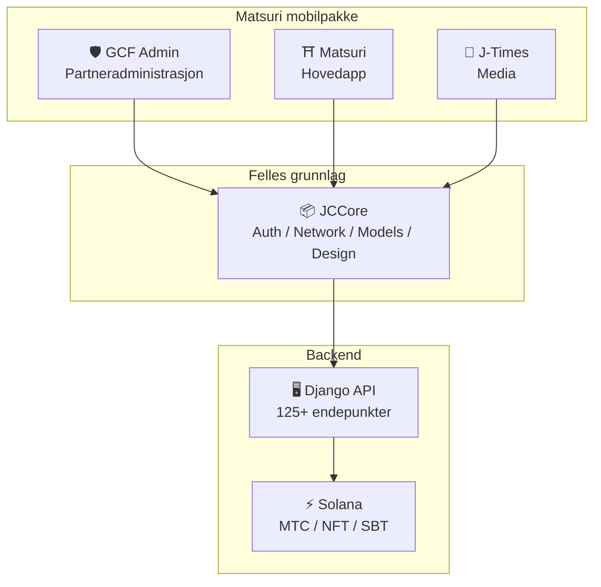
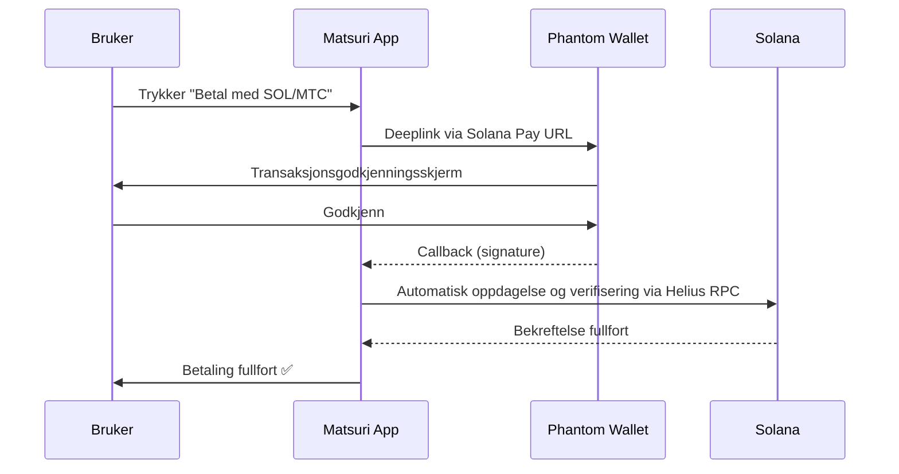
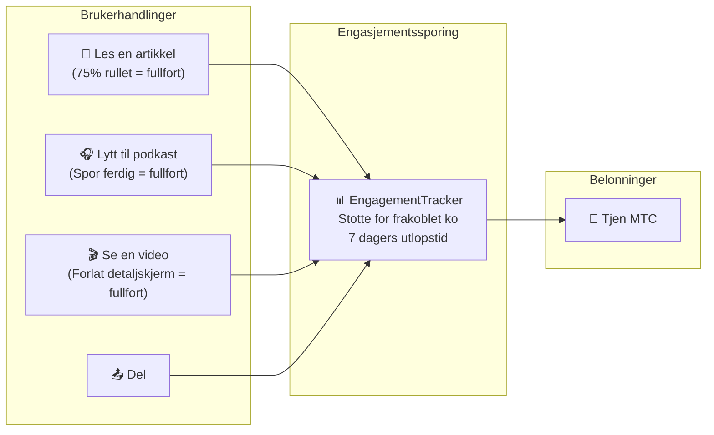
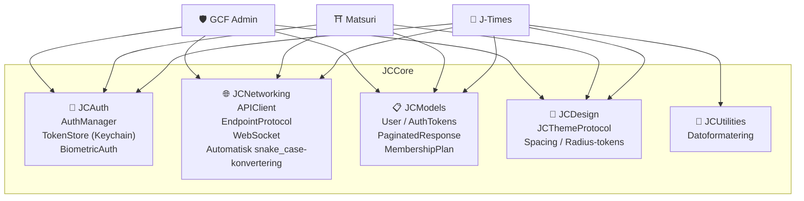

# 📱 Mobilapp-pakke

> **Tre native iOS-apper som dekker alle lag i Matsuri-okosystemet.**
> Bygget utelukkende med Swift 6 / iOS 17+. Enhetlig autentisering, nettverkskommunikasjon og design via det delte **JCCore**-biblioteket.

:::tip Hvorfor dette er viktig for investorer
De fleste Web3-prosjekter har en nettside og en whitepaper. Matsuri har **3 produksjons iOS-apper med 827+ automatiserte tester**, delt infrastruktur og native Solana-integrasjon. Dette er sjelden gjennomforingsdybde i token-markedet.
:::

---

## App-oversikt

| App | Formal | Status | Sprak |
| :--- | :--- | :---: | :--- |
| **GCF Admin** | Partneradministrasjon og drift | ✅ Utgitt | 🇯🇵🇬🇧🇨🇳🇹🇭🇳🇴 |
| **Matsuri** | Forbrukerrettet hovedapp | 🔜 Slutten av april 2026 | 🇯🇵🇬🇧🇨🇳🇹🇭🇳🇴 |
| **J-Times** | Kultur, media og laering | 🔜 Slutten av april 2026 | 🇯🇵🇬🇧 |

---

## 1. 🛡️ GCF Admin — Partneradministrasjonsapp

:::info Status: Utgitt pa App Store (v1.0)
En driftsadministrasjonsapp for GCF (Global Community Friends)-medlemmer. Alle funksjoner fra webadministrasjonspanelet samlet i en mobilapp.
:::

  
  
  

### Hva du kan gjore med denne appen

| Kategori | Funksjon |
| :--- | :--- |
| **📊 Dashbord** | KPI-kort, salgsdiagrammer, hurtighandlinger |
| **👥 Medlemsadministrasjon** | Liste, detaljer, redigering, nivaadministrasjon |
| **💰 Inntektsadministrasjon** | Provisjonssporing, MTC-uttaksadministrasjon, utbetalingsadministrasjon |
| **📝 Innholdsadministrasjon** | Oppretting, redigering og publisering av arrangementer, artikler, podkaster og videoer |
| **🎫 Guide-plasser** | Administrasjon av guideplasser, inntektssporing |
| **🖼️ NFT-dashbord** | Founder's Collection, on-chain-verifisering, NFT-overforing |
| **⛩️ Hellig sted-administrasjon** | CRUD for steder, beacon-oppsett |
| **🎲 AR-mining-oppsett** | Omikuji-sannsynlighetstabeller, administrasjon av belonningsparametere |
| **📊 Analyse** | Feilrapporter, bruksanalyse |
| **🔗 Referanser** | Generering av tilpassede QR-koder, administrasjon av henvisningsprogram |

### Tekniske spesifikasjoner

| Element | Detaljer |
| :--- | :--- |
| **Arkitektur** | Clean Architecture + MVVM + `@Observable` (iOS 17) |
| **Sprak / SDK** | Swift 6.0 / Xcode 16+ / iOS 17.0+ |
| **API-integrasjon** | 125+ endepunkter |
| **Tester** | 226 tester / 45 testklasser |
| **Lokalisering** | 5 sprak (JA/EN/ZH/TH/NB) / 957+ oversettelsesnokler |
| **Swift Concurrency** | Strict Concurrency-kompatibel / null byggeadvarsler |

### QR-kode-integrasjon

GCF Admin kan generere tilpassede QR-koder med Matsuri-logoen. Stotter flere bruksomrader som arrangementsinvitasjoner, henvisningslenker og betalingsforesporsler.

---

## 2. ⛩️ Matsuri — Hovedapp

:::info Status: Planlagt utgivelse slutten av april 2026 (v3.0)
Hovedappen for vanlige brukere. Alt i en app — arrangementsbooking, betaling, Web3-lommebok og AR-mining.
:::

  
  
  

### Hva du kan gjore med denne appen

| Kategori | Funksjon |
| :--- | :--- |
| **🎪 Arrangementsbooking** | Sok, booking, Stripe-betaling, billett-QR-administrasjon |
| **💳 4 betalingsmetoder** | Kredittkort / lagret kort / MTC-saldo / kryptovaluta (SOL/MTC) |
| **👛 Web3-lommebok** | MTC-saldovisning, sending/mottak, transaksjonshistorikk |
| **🖼️ NFT-galleri** | Oversikt over NFT/SBT-beholdning, on-chain-verifisering |
| **🗺️ Hellig sted-kart** | Kartvisning av helligdommer og templer, innsjekking |
| **🎲 AR-mining** | WebAR omikuji-opplevelse, tjen MTC |
| **💬 Chat** | Meldinger med kontekstmeny |
| **⭐ Onskeliste** | Lagre favorittarrangementer og opplevelser |
| **🔍 Avansert sok** | Stotte for stemmesok |
| **🤝 Referanser** | Deltakelse i henvisningsprogram, belonningssporing |
| **📊 GCF-dashbord** | Forenklet administrasjonspanel for GCF-medlemmer |

### Phantom Wallet-integrasjon — Kryptobetaling uten manuell inntasting

> **Ingen kopiering av adresser.** Phantom Wallet apnes automatisk, brukeren godkjenner, og betalingen er fullfort. Transaksjonssignaturer oppdages automatisk via Helius RPC — den smidigste kryptobetalingsopplevelsen pa markedet.

:::tip Hvorfor dette er viktig
De fleste Web3-apper tvinger brukere til a kopiere lommebokadresser, manuelt skrive inn belop og vente pa bekreftelser. Matsuris Solana Pay-integrasjon reduserer dette til **ett enkelt trykk** — som matcher brukeropplevelsen til Apple Pay, men med oppgjor on-chain.
:::

### Tekniske spesifikasjoner

| Element | Detaljer |
| :--- | :--- |
| **Arkitektur** | Clean Architecture + MVVM + Swift Concurrency |
| **Sprak / SDK** | Swift 6.0 / Xcode 16+ / iOS 17.0+ |
| **Betaling** | Stripe PaymentSheet + MTC Balance + Phantom (Solana Pay) |
| **API-integrasjon** | 72 endepunkter / 16 kategorier |
| **Tester** | 230+ (Model, ViewModel, Network, Security, DeepLink, E2E) |
| **Lokalisering** | 5 sprak (JA/EN/ZH/TH/NB) / 406 oversettelsesnokler |
| **Antall ViewModels** | 25 (fullstendig MVVM — ingen direkte API-kall fra Views) |
| **Autentisering** | Apple Sign In / Google Sign In (PKCE) |

---

## 3. 📰 J-Times — Kulturmedieapp

:::info Status: Planlagt utgivelse slutten av april 2026
En medieplattform som formidler dybden i japansk kultur. Les artikler, lytt til podkaster, se videoer — tjen MTC for alle handlinger.
:::

  

### Hva du kan gjore med denne appen

| Kategori | Funksjon |
| :--- | :--- |
| **📖 Artikler** | Parallakse-hero, drop cap, fremdriftslinje for lesing, rikt innhold (Markdown, tabeller, sitater) |
| **🎧 Podkaster** | Seriebrowsing, bolgeformspiller, sovntimer, AirPlay, laseskjermkontroller |
| **🎬 Videoer** | Adaptivt rutenett-/listevisning, kortvideoer (TikTok-stil, dobbelttrykk) |
| **🔍 Sok** | Multifilter, trendmerker, stemmesok |
| **🧭 Utforskning** | Fremhevet karusell, redaksjonens valg, ukens populaere |
| **📚 Bibliotek** | Favoritter, historikk (etter dato), nedlastinger, spillelister |
| **🎵 Lydspiller** | Minispiller (sveipekontroll), fullspiller (bolgeform, tekster, gjentakelse) |
| **👤 Medlemskap** | Funksjonssammenligning for 3 nivaer (Free / Premium / Pro), kjopsgjenoppretting |

### Media Mining — Les, lytt og se blir til mining

> **Registreres selv uten nett.** Selv om du leser en artikkel ved et tempel dypt inne i fjellene uten dekning, sendes engasjementet automatisk nar du er online igjen, og MTC tildeles.

### Designsystem — Japansk estetikk i fire pilarer

J-Times bruker et unikt designsystem som omsetter tradisjonell japansk estetikk til moderne UI.

| Pilar | Konsept | Anvendelse i UI |
| :--- | :--- | :--- |
| **墨 (Sumi)** | Varme noytrale gratoner | Bakgrunnsfarge, teksthierarki |
| **朱 (Shu)** | Japansk rod (#C53030) | Aksentfarge, viktige handlinger |
| **間 (Ma)** | Mellomrom basert pa 4pt-rutenett | Avstand, pusteplass |
| **紙 (Kami)** | Subtil tekstur, glassmorfisme | Kortoverflater, dybdeuttrykk |

### Tekniske spesifikasjoner

| Element | Detaljer |
| :--- | :--- |
| **Arkitektur** | Clean Architecture + MVVM + Swift Concurrency |
| **Sprak / SDK** | Swift 6.0 / Xcode 16+ / iOS 17.0+ |
| **Eksterne avhengigheter** | **Null** — kun Apples egne rammeverk |
| **API-integrasjon** | 40+ endepunkter |
| **Tester** | 371 tester / 20 filer |
| **Lokalisering** | 2 sprak (JA/EN) / 310+ oversettelsesnokler |
| **Frakoblet stotte** | ContentCache (50MB) + ImageDiskCache (200MB) + nedlastingsbehandler |
| **Autentisering** | Apple Sign In / Google Sign In (PKCE) |

---

## Felles grunnlag: JCCore-biblioteket

Et delt Swift Package-bibliotek som brukes av alle tre appene.

| Modul | Rolle |
| :--- | :--- |
| **JCAuth** | Keychain-basert tokenadministrasjon, biometrisk autentisering (Face ID / Touch ID) |
| **JCNetworking** | Typesikker API-klient, WebSocket, automatisk JSON snake_case-konvertering |
| **JCModels** | Felles datamodeller pa tvers av apper (User, AuthTokens, osv.) |
| **JCDesign** | Temaprotokoll, designtokens (avstand, avrundede hjorner) |
| **JCUtilities** | Verktoy for dato og strenger |

---

## Sikkerhet og personvern

| Element | Implementering |
| :--- | :--- |
| **Autentiseringstokens** | Kryptert lagring i iOS Keychain (TokenStore) |
| **Biometrisk autentisering** | Tofaktorautentisering via Face ID / Touch ID |
| **API-kommunikasjon** | HTTPS + Certificate Pinning |
| **Lommebok-privatnokler** | Ingen privatnokler lagres i appen — delegert til Phantom Wallet |
| **AR-mining** | Kamerabilder sendes ikke til serveren (VisionProof) |
| **Frakoblede data** | SwiftData-kryptering + automatisk utlopstid |
| **Swift Concurrency** | Forebygging av kapplopsforhold gjennom actor-isolasjon |

---

## Utviklingskvalitet

Totalt **827+ automatiserte tester** pa tvers av alle 3 apper.

| App | Antall tester | Dekningsomrader |
| :--- | :---: | :--- |
| **GCF Admin** | 226 | Model, ViewModel, Repository, API, Localization, Navigation |
| **Matsuri** | 230+ | Model, ViewModel, Network, Security, DeepLink, Regression, Performance, E2E |
| **J-Times** | 371 | Model, ViewModel, API, Repository, Navigation, Localization, Security, Performance |

---

**[▶ Neste: Veikart og team](/docs/roadmap)** | **[◀ Forrige: Okosystem og mining](/docs/ecosystem)**
