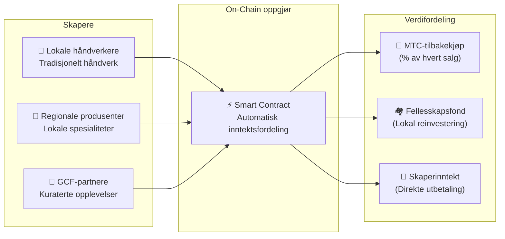

# 🗓️ Veikart og styring

> **Veien mot sikkerhet.**
> Dette er ikke et kortsiktig spekulativt prosjekt.
> **Kjerneplattformen er allerede ferdigbygd** — vi er i skaleringsfasen.

---

## Strategiske milepæler

### 🔥 Fase 1: Oppvåkning (2026 H1 — Nå)

**Tema: Fundamentet og kontantstrømgenerering**

Produktet er bygd. Fokus nå er inntektsgenerering via det CEO-ledede finanssystemet og sikring av initial likviditet.

| Status | Milepæl | Detaljer |
| :---: | :--- | :--- |
| ✅ | **Produktlansering** | Matsuri Webapp og GCF Admin Dashboard i drift |
| ✅ | **Betalinger og vekst** | MTC-betalinger + verve-airdrop-funksjoner levert |
| ✅ | **Medielansering** | J-Times (Web og Podcast) distribusjonsinfrastruktur live |
| ✅ | **Genesis** | MTC Token Generation Event på Solana |
| ✅ | **Likviditet** | Initiell LP-pool opprettet på Raydium |
| ⬜ | **Insentivprogram** | 20% mål-APY likviditetsmining lanseres |
| ⬜ | **Systemgåing live** | Solana MEV/arbitrasje-bot i produksjon |
| ⬜ | **VIP-rekruttering** | Første 20 GCF VIP-medlemmer valgt ut |

### 🚀 Fase 2: Ekspansjon (2026 H2)

**Tema: Virkelige eiendeler og Adventure Mining**

Utnytte den ferdigbygde webappen til å utvide fysiske baser og «Pilegrimsreise»-funksjonen.

| Status | Milepæl | Detaljer |
| :---: | :--- | :--- |
| ⬜ | **Funksjonsslipp** | Adventure Mining (Pilegrimsreise) går live |
| ⬜ | **Global ekspansjon** | Partnerbaser og VIP-arrangementer i Asia (Thailand, Taiwan osv.) |
| ⬜ | **Kapitalforvaltning** | Eiendom, aksjer og kryptoportefølje fra forretningsinntekter |
| ⬜ | **Mål** | Økosystemets totale AUM på **¥1 milliard (~$6,5 M)** |

### 🌊 Fase 3: Sirkulasjon (2027+)

**Tema: Masseadopsjon, samskapingsøkonomi og desentralisering**

Offentlig lansering, on-chain markedsplass og full økosystemdrift.

| Status | Milepæl | Detaljer |
| :---: | :--- | :--- |
| ⬜ | **Grandåpning** | Matsuri App verdenslansering |
| ⬜ | **Stor opplåsing (1. juni 2027)** | Grunnleggerens lockup frigjøres + Miningpool (550 M MTC) live + Halveringssyklus starter |
| ⬜ | **Samskapingsmarkedsplass** | Lokale spesialbutikker + GCF-partnerbutikker — on-chain oppgjør med automatisk MTC-tilbakekjøp |
| ⬜ | **Folkefinansiering med NFT-rettigheter** | Brukere finansierer kulturprosjekter på Solana. Støttespillere mottar NFT-er som representerer eierskap, inntektsdeling eller styringsrettigheter over det finansierte prosjektet |
| ⬜ | **On-Chain butikkoppgjør** | Alle markedsplasstransaksjoner gjøres opp via smarte kontrakter — en prosentandel av hvert salg går automatisk til MTC-tilbakekjøpspoolen |
| ⬜ | **Mål** | Økosystemets totale AUM på **¥10 milliarder (~$65 M)** |
| ⬜ | **DAO-overgang** | Delvis overføring av beslutningsmyndighet til GCF-fellesskapet |

#### 🏪 Visjon for samskapingsmarkedsplassen

Det ultimate uttrykket for «Culture OS» — en desentralisert markedsplass der **kulturskapere og kulturentusiaster handler direkte**, uten utbyttende mellomledd.

| Funksjon | Beskrivelse | Status |
| :--- | :--- | :---: |
| **🏺 Lokale spesialbutikker** | Håndverkere og regionale produsenter selger direkte til et globalt publikum. MTC-betaling = 5–10 % rabatt | ⬜ Visjon |
| **🎫 Folkefinansiering + NFT-rettigheter** | Finansier et kulturprosjekt (restaurering av helligdom, gjenoppliving av festival, håndverkerverksted). Motta en NFT som representerer ditt bidrag — med potensiell inntektsdeling eller styringsrettigheter | ⬜ Visjon |
| **⚡ On-Chain oppgjør** | Hver markedsplasstransaksjon gjøres opp via Solana smarte kontrakter. Inntektene fordeles automatisk: skaperens utbetaling + fellesskapsfond + MTC-tilbakekjøp — ingen manuell regnskapsføring | ⬜ Visjon |
| **🗳️ Støttespillerstyring** | NFT-innehavere stemmer over hvordan finansierte prosjekter allokerer ressurser — ekte samskaping, ikke bare donasjon | ⬜ Visjon |

:::info Hvorfor dette betyr noe
I dag kjøper turister suvenirer fra butikker som betaler husleie til plattformeiere. I morgen **selger en håndverker i landlige Kyoto direkte til en fan i København** — og en prosentandel av det salget styrker automatisk MTC-økonomien. Dette er «svinghjulet» i sitt mest komplette uttrykk.
:::

---

## 👤 Team

### Ko Takahashi — Grunnlegger / CEO og sjefarkitekt

| Element | Detaljer |
| :--- | :--- |
| **Rolle** | Overordnet prosjektledelse. Designer og bygger kjernealgoritmen (Solana MEV Bot) |
| **Visjon** | Skaper av «Eksporter kultur, importer velstand»-konseptet |
| **Holdning** | Skriver kode om dagen, driver baren i Golden Gai om natten — definisjonen av «skin in the game» |

### Jon Anders Jensen

### Ryunosuke Honda

### 🌏 GCF-fellesskapet — Globale utviklingsbidragsytere

Matsuri Protocol er ikke bygd av grunnleggerteamet alene.
**GCF-medlemmer over hele verden** bidrar gjennom testing, tilbakemelding, oversettelse og regional ekspansjon.

| Domene | Team |
| :--- | :--- |
| **💼 Global finans** | Private investornettverk i Asia |
| **⚙️ Engineering** | Distribuert ingeniørgruppe for blokkjede og mobilutvikling |
| **🏮 Drift** | Sterk pipeline med lokalsamfunn i Shinjuku Golden Gai og store turistknutepunkt |
| **🌐 Fellesskap** | Multinasjonale GCF-medlemmer fra Japan, Norge, Thailand, Taiwan og utover |

:::tip Bygg kulturens infrastruktur sammen
Bli med i GCF og bli en medutvikler av Matsuri Protocol.
Å bidra handler ikke bare om å skrive kode — å introdusere lokale helligdommer, oversette dokumenter, organisere arrangementer — alt bidrar til å spre dette protokollet til verden.
:::

### Strategiske partnere

| Domene | Team |
| :--- | :--- |
| **💼 Global finans** | Private investornettverk i Asia |
| **⚙️ Engineering** | Distribuert ingeniørgruppe for blokkjede og mobilutvikling |
| **🏮 Drift** | Sterk pipeline med lokalsamfunn i Shinjuku Golden Gai og store turistknutepunkt |

---

## 🏛️ Styring (DAO)

Matsuri Protocol vil gradvis gå over til en **desentralisert autonom organisasjon (DAO).**
GCF-medlemmer (Platinum/Gold) vil ha **stemmerett** i viktige beslutninger:

| Avstemning | Omfang |
| :--- | :--- |
| **💰 Kapitalallokering** | Hvilke nye satsinger eller markedsføringstiltak som skal finansieres |
| **⚙️ Protokolloppgraderinger** | Finjustering av gebyrsatser og miningbelønningskurver |
| **⛩️ Kulturell sertifisering** | Hvilke festivaler og templer som skal sertifiseres som «offisielle pilegrimssteder» og finansieres |

:::info Bli med i revolusjonen
Vi bygger ikke bare en app.
Vi bygger en **grenseløs kulturøkonomi.**
:::

---

**[◀ Tilbake til hvitbokens topp](/docs/intro)** ｜ **[Bli med på Discord](#)**
