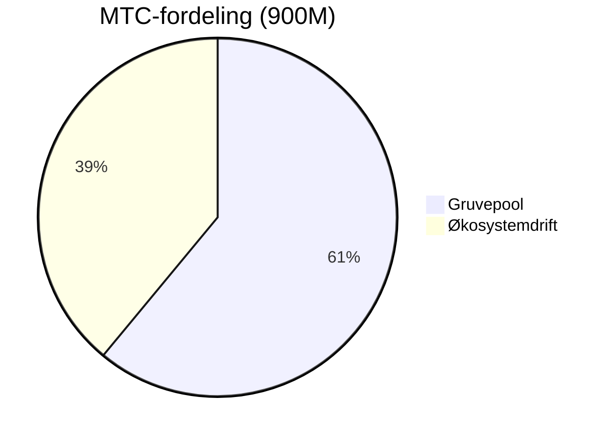
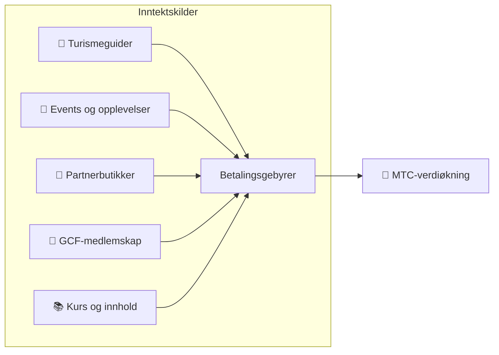

# 💰 Tokenomics — MTCs økonomiske design

> **Tilliten er risset inn i koden.**
> MTCs økonomiske design er ikke et løfte fra et menneske, men en garanti fra matematikk og blokkjeden.


> **«En økonomi der makten ikke kan endre status quo» — det er MTCs tokenomics.**

Matsuri Coin (MTC) hviler på én overbevisning:
**en regel som ikke engang driftsteamet kan manipulere, er den største tryggheten for en investor.**

Tilbudet låst for alltid. Ny utstedelse og frysing av midler umulig. Forretningens vekst gjenspeiles i prisen på formel-nivå —
det er ikke et løfte, men et **faktum** risset inn på blokkjeden.

På denne siden offentliggjør vi MTCs økonomiske mekanisme fullt ut.

---

## Token-spesifikasjoner

For å sikre investorer har vi permanent **frasagt oss** «mint»-autoritet og «freeze»-autoritet på Solana.
Det er nå umulig å utstede mer MTC, og umulig å fryse noens midler. **Helt trustless.**

| Punkt | Detaljer |
| :--- | :--- |
| **Tokennavn** | Matsuri Coin |
| **Ticker** | MTC |
| **Kjede** | Solana |
| **Mint-adresse** | `DRENpzmRWM4TwECrCPCfS1k5VBPmanhQg9bcCWP8EZXF` [Solscan →](https://solscan.io/token/DRENpzmRWM4TwECrCPCfS1k5VBPmanhQg9bcCWP8EZXF) |
| **Samlet tilbud** | **900 millioner** (900 000 000 MTC) fast |
| **Mint-autoritet** | 🚫 Frasagt ([verifiserbar on-chain](https://solscan.io/token/DRENpzmRWM4TwECrCPCfS1k5VBPmanhQg9bcCWP8EZXF)) |
| **Freeze-autoritet** | 🚫 Frasagt ([verifiserbar on-chain](https://solscan.io/token/DRENpzmRWM4TwECrCPCfS1k5VBPmanhQg9bcCWP8EZXF)) |
| **Lock-håndtering** | Streamflow Finance (verifisert) |

:::info Hvorfor dette betyr noe
Å frasi seg mint-autoriteten betyr at «driftsteamet ikke kan utstede mer og utvanne din andel». Å frasi seg freeze-autoriteten betyr at «ingen kan fryse lommeboken din». Det er kjernen i «trustless».
:::

---

## Token-fordeling

900M MTC fordeles som følger.



| Kategori | Andel | Stk. | Formål |
| :--- | :---: | :--- | :--- |
| **⛏️ Gruvepool** | **61%** | 550 millioner | Belønningspool for bidragsytere. Låses opp juni 2027, halveres annethvert år. Fordeles etter bidragspoeng |
| **🌐 Økosystemdrift** | **39%** | 350 millioner | Markedsføring, GCF-distribusjon, drift, likviditetspool (LP), utvikling, annonser, arrangering av events osv. |

:::note Om gruvepoolens utgivelse
550M MTC frigis ikke på én gang. Den utgis trinnvis etter en **halveringsplan annethvert år** og fordeles etter bidragspoeng. Reglene for utgivelse/fordeling implementeres trinnvis som smart contracts i andre halvdel av 2026 og kan deretter verifiseres on-chain.
:::

:::note Om økosystem-driftsandelen
De 39% er en flerformåls-kasse som trengs for økosystemets vekst. Konkret omfatter det markedsføring, innledende distribusjon til GCF-medlemmer, tilførsel til Raydiums likviditetspool, godtgjørelse til utviklingsteamet, reklame, arrangering av kulturevents osv. Åpenhet om bruk blir gjenstand for fellesskaps-governance etter DAO-overgangen.
:::

---

## Inntektsstruktur

Det som bærer MTCs verdi, er **inntekt fra reell forretning**. Ikke spekulasjon – den faktiske økonomiske aktiviteten er fundamentet.



| Inntektskilde | Innhold |
| :--- | :--- |
| **🏯 Opplevelser og guider** | Betalingsgebyrer fra turismeguider og kulturopplevelser |
| **🤝 GCF-medlemskap** | Medlemsgebyrer |
| **📚 Innhold** | Kursgebyrer, medieabonnementer |
| **🏪 Markedsplass** | Transaksjonsgebyrer fra partnerbutikker (utvides trinnvis) |

:::tip Vekst understøttet av reell etterspørsel
Jo flere dolende turister, jo mer utenlandsk valuta strømmer inn, og økosystemet vokser. MTCs verdi avgjøres ikke av spekulasjon, men av **antall mennesker som opplever kultur**.
:::

---

## Aktuelle forretningsresultater

MTC-økonomien er fortsatt i en tidlig fase, men reell aktivitet er allerede i gang.

| Indikator | Resultat |
| :--- | :--- |
| **Arrangerte events** | 50+ (testdrift) |
| **GCF Platinum-medlemmer** | 20 påmeldt (av 50) |
| **GCF Gold-medlemmer** | Rekruttering starter nå |
| **Webplattform** | I drift. Samler testbrukere og kjører |
| **iOS-app** | Utvikling ferdig, release planlagt april 2026 |

:::note Ærlig talt
Vi har ennå ikke «et vinnende track record». 50 events og testdrift — det er virkeligheten akkurat nå. Men produktet kjører, fellesskapet finnes, og vi står på terskelen til seriøs ekspansjon.
:::

---

## Tilbakekjøpsprotokoll

«Blir det overskudd, skal det i driften sin lomme» — det gjør vi ikke.
En fast andel av forretningsomsetningen er øremerket til tilbakekjøp av MTC på markedet.

| Inntektskilde | Andel | Handling |
| :--- | :---: | :--- |
| **Matsuri HQ omsetning** (guider, events) | **20%** | **Tilbakekjøp** i markedet og tilførsel til likviditetspoolen |
| **GCF-medlemskap** (medlemsgebyrer) | **25%** | **Tilbakekjøp** i markedet |

:::info Status for tilbakekjøp nå
Tilbakekjøpsprotokollen **settes i drift** etter hvert som forretningsomsetningen tar av. Innledningsvis utføres det off-chain (manuelt), og fra andre halvdel av 2026 migreres det trinnvis til automatisk smart contract-utførelse. Etter migrering kan hele historikken verifiseres på blokkjeden.
:::

Tilbakekjøp er ikke «noe vi skal gjøre en dag». Det er en regel programmert som protokoll. Hver gang omsetningen stiger, trekkes MTC automatisk ut av markedet — et **strukturelt trygghetsnett** for investorer.

---

## Prislogikk

MTCs prismekanisme hviler ikke på ønsketenkning, men på **AMM-formelens (automated market maker) matematikk**.

```
Pris = likviditet (SOL) ÷ tilbud (MTC)
```

| Trinn | Hva skjer | Resultat |
| :---: | :--- | :--- |
| **①** | Forretningsomsetning (SOL) sprøytes inn i poolen | **Telleren vokser** |
| **②** | Midlene brukes til å kjøpe MTC tilbake fra markedet og brenne det | **Nevneren faller** |
| **③** | Teller↑ × nevner↓ | **Betingelsene for økt knapphet er til stede** |

:::info En beskrivelse av mekanismen, ikke en prisgaranti
Formelen viser det strukturelle designet: «hvis forretningsomsetningen fortsetter og tilbakekjøp utføres, beveger tilbuds-/etterspørselsbalansen seg i retning av knapphet». Faktisk pris avhenger av mange faktorer: markedets tilbud/etterspørsel, eksterne forhold, likviditet osv.
:::

---

## Halveringsplan

De **550 millioner MTC (ca. 61% av samlet tilbud)** som frigis fra 1. juni 2027, selges ikke på markedet, men holdes som **belønningspool for bidragsytere**.

Vi bruker en **halvering annethvert år** — raskere enn Bitcoins fireårssyklus.
Annethvert år halveres utgivelsesmengden, og belønninger fortsetter teoretisk i tiår.

| Periode | Andel | Antall | Akkumulert |
| :--- | :---: | :--- | :---: |
| **1. periode** 2027 – 2029 | **50%** | ca. 275M | 50% |
| **2. periode** 2029 – 2031 | **25%** | ca. 137M | 75% |
| **3. periode** 2031 – 2033 | **12,5%** | ca. 68M | 87,5% |
| **4. periode** 2033 – 2035 | **6,25%** | ca. 34M | 93,75% |
| **5. periode og framover** | Halvering fortsetter | Avtagende | → 100% asymptotisk |

<small>*※ Matematisk nås 100% aldri; mengden nærmer seg null. Samme prinsipp som Bitcoin.*</small>

:::tip Jo tidligere du bidrar, jo mer MTC får du
Med halveringsmekanismen er 1. periode (2027–2029) den mest MTC-tunge, og per epoke faller utgivelsesmengden. Det betyr at **de som bygger bidragspoeng fra starten, får mest MTC**.

Eksempler på aktivitet som gir bidragspoeng:
- Oppretting av events og mengde tilstrømmede brukere
- Drift av populære guideturer
- Rekruttering og utvikling av fremragende guider
- Visninger og delinger av J-Times-innhold
- Antall check-ins ved hellige steder

Belønningen avgjøres ikke av «rekkefølgen på påmelding», men av **«hvor mye du har bidratt»**.
:::

---

:::note Neste side
Har du forstått MTCs økonomiske design, er neste skritt å se **hvordan du kan delta som partner**.
**[GCF-medlemskap →](/docs/gcf)**
:::
