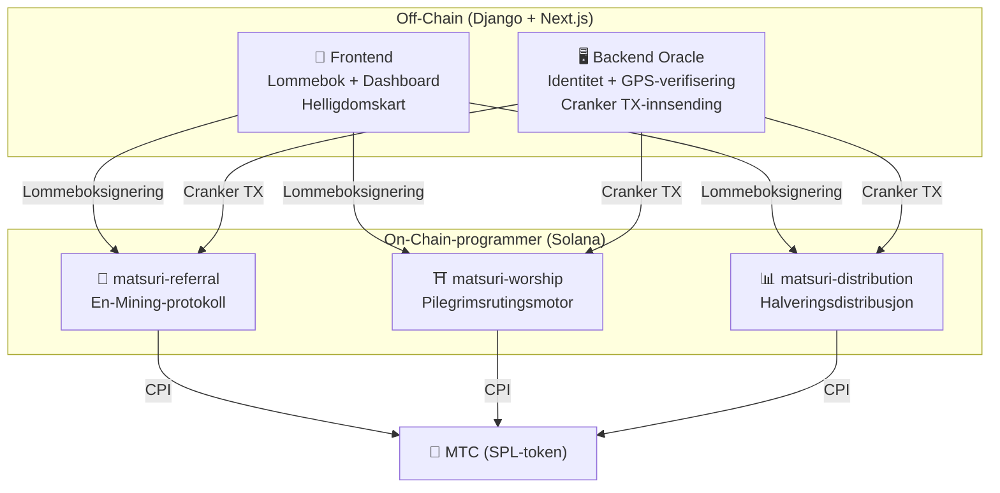
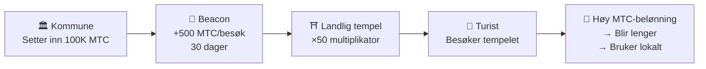
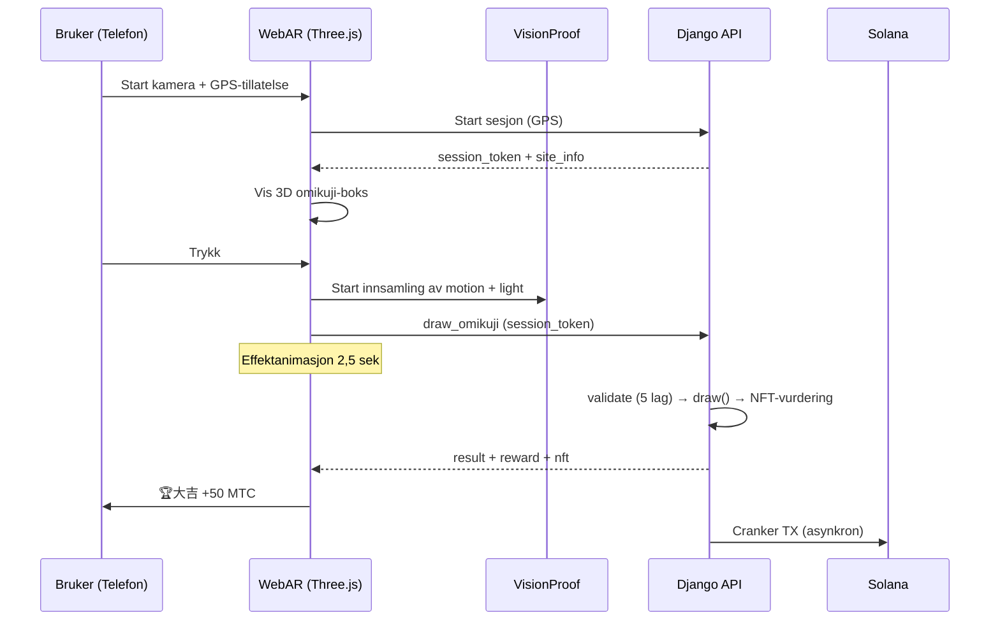

# ⚡ Smarte kontrakter — Åpen kildekode-arkitektur

> **Tillitsløst (Trustless) design.**
> All belønningslogikk, vervingstrær og halveringsplaner håndheves **on-chain** via reviderbare Rust-programmer.
> Kildekode: [GitHub](https://github.com/Cootakahashi/matsuri-contracts)

---

## Oversikt

Matsuri distribuerer **tre Anchor (Rust)-programmer** på Solana, som håndterer hver sin søyle i økosystemet:



---

## 1. 📣 En-Mining (縁マイニング) Protokoll

**Formål:** En hybrid vekstmotor som belønner både *bredde* (ververekkevidde) og *dybde* (økonomisk påvirkning). Ikke bare et affiliateprogram — en fullstendig mining-protokoll der økonomisk aktivitet i den virkelige verden genererer on-chain-verdi.

### Poengformel

```
S_final = S_raw × M_toku × B_title

where:
  S_raw   = 0.30 × antall_vervede + 0.70 × (volum / 10^9)
  M_toku  = f(staket_mtc) ∈ [1.0×, 10.0×]
  B_title = 1.0 + min(sesonger_rangert × 0.05, 0.50)
```

| Komponent | Vekt | Formål |
| :--- | :---: | :--- |
| **Bredde** (antall vervede) | 30% | Nettverksrekkevidde — hvor mange du bringer inn |
| **Dybde** (oppgjørsvolum) | 70% | Økonomisk påvirkning — ekte kjøp, ikke bare registreringer |
| **Toku-multiplikator** | ×1–10 | Lås MTC for å øke mining-kraften |
| **Tittelboost** | +5%/sesong | Permanent belønning for konsekvent toppytelse |

### Toku (徳) Staking-nivåer

| Staket MTC | Multiplikator | Nivå |
| :--- | :---: | :--- |
| 0 | 1.0× | — |
| 1 000+ | 1.5× | Bronse |
| 10 000+ | 3.0× | Sølv |
| 100 000+ | 5.0× | Gull |
| 1 000 000+ | 10.0× | Diamant |

### En no Banzuke (Sesongranking)

Hver sesong (epoke) rangeres toppytere. Fordeler:
- Topp 10 % får **Evangelist**-tittelen (permanent SBT-flagg)
- Hver rangert sesong gir **+5 % mining-boost** (kumulativt, tak: 50 %)

### Anti-Sybil-forsvar (3 lag)

| Lag | Mekanisme | Hvor |
| :--- | :--- | :--- |
| **Identitetsport** | X/Twitter OAuth + SMS | Off-chain (Django) |
| **On-chain-port** | Bare `is_verified = true`-profiler tjener | Smart Contract |
| **Dybdevekting** | 70 % av poengsummen = ekte betalinger → botter tjener ingenting | Poengmotor |

---

## 2. ⛩️ Pilegrimsrutingsmotor (Worship Routing Engine)

**Formål:** Verdens første **ReFi-protokoll som løser overturisme ved hjelp av token-økonomi.** Besøk hellige steder → tjen MTC. Men her er vrien: *mindre besøkte steder betaler eksponentielt mer.*

:::tip Innsikten
Dette er «omvendt Uber-surge pricing» — overfylte steder straffes, grensesteder belønnes. Turister ruter seg selv til mindre besøkte steder fordi **det er mer lønnsomt.**
:::

### 6-lags belønningsformel

```
R_final = R_pioneer × M_dynamic × M_regional × M_streak × M_omikuji

where:
  R_pioneer  = daily_pool / visit_order     (harmonisk 1/n-nedgang)
  M_dynamic  = admin-styrt ∈ [0.1×, 50×]
  M_regional = tier_table[tier] ∈ {1×, 2×, 5×, 10×}
  M_streak   = 1.0 + min(days × 0.02, 0.50)
  M_omikuji  = loddtrekning ∈ {1.0, 1.2, 1.5, 3.0}
```

### Lag 1: Pionérbonus

Harmonisk nedgang — matematikken som ruter turister:

| Besøksrekkefølge | Belønning vs. 1. | Reelt eksempel (1000 MTC-pool) |
| :---: | :---: | :--- |
| 1. | 100 % | 1 000 MTC |
| 5. | 20 % | 200 MTC |
| 10. | 10 % | 100 MTC |
| 100. | 1 % | 10 MTC |

> **Første besøkende = 100× mer belønning enn den 100.** Dette skaper et kraftig insentiv for å besøke utenom høysesong.

### Lag 2: Dynamisk multiplikator (trafikkspredning)

Kontrollert i sanntid av administratorer via GCF Admin-panelet:

| Scenario | Multiplikator | Effekt |
| :--- | :---: | :--- |
| **Overturistifisert** (Asakusa-topp) | 0.1× | 90 % belønningsstraff |
| **Normal** | 1.0× | Standard |
| **Underbesøkt** | 10× | 10× belønningsboost |
| **Grensekampanje** | 50× | Maksimalt insentiv |

### Lag 3: Regionalt nivå

| Nivå | Etikett | Multiplikator | Eksempler |
| :---: | :--- | :---: | :--- |
| 0 | 🏙️ Stor | 1× | 浅草寺, 清水寺, 伏見稲荷 |
| 1 | 🌆 Middels | 2× | Regionale hovedshriner |
| 2 | 🏞️ Landlig | 5× | Historiske templer på landsbygda |
| 3 | ⛰️ Skjult | 10× | Fjelltopphelligdommer, øy-helligdommer |

### Lag 4: Streakbonus

+2 % per sammenhengende dag, tak +50 %. Belønner faste besøkende.

### Lag 5: 🎲 Omikuji-protokoll

| Resultat | Sannsynlighet | Multiplikator |
| :--- | :---: | :---: |
| 🏆 **大吉** | 5 % | 3.0× |
| ✨ **吉** | 15 % | 1.5× |
| 🌸 **小吉** | 30 % | 1.2× |
| 🍃 **末吉** | 35 % | 1.0× |
| 💀 **凶** | 15 % | 1.0× |

### Lag 6: Sponsede beacons (B2B/B2G)

Kommuner, togselskaper og turismebyråer kan **sette inn MTC** for å opprette tidsbegrensede høybelønningssoner på bestemte steder.



> **B2B-inntektsmodell:** Sponsorer betaler MTC for å rute turister. MTC-kjøpspress → tokenverdi. Win-win-win.

---

## 3. 📊 Halveringsdistribusjon

**Formål:** 550M MTC mining-pool distribuert over tiår via en **2-års halveringssyklus** — raskere enn Bitcoins 4-års syklus.

### Halveringsplan

```
Totalt pool: 550 000 000 MTC

Epoke 0 (2027–2029):  275 000 000 MTC  (50 %)
Epoke 1 (2029–2031):  137 500 000 MTC  (25 %)
Epoke 2 (2031–2033):   68 750 000 MTC  (12,5 %)
Epoke 3 (2033–2035):   34 375 000 MTC  (6,25 %)
        ...              ...
∑ → 550 000 000 MTC (asymptotisk total)
```

### Individuell belønningsformel

```
your_reward = epoch_budget × (your_score / total_score)
```

All aritmetikk bruker **128-bits mellomberegning** — matematisk umulig å overflyte.

### Ytelsesskårkilder

| Aktivitet | Skårvekt |
| :--- | :--- |
| **Guideøkter gjennomført** | Høy |
| **Eventbillettsalg** | Høy |
| **Vervingsnettverksaktivitet** | Middels |
| **Pilegrimsmining-besøk** | Middels |
| **Medieengasjement** | Lav |

:::info Tillatelsesløs epokeframgang
`advance_epoch`-instruksjonen kan kalles av **hvem som helst** — ingen admin nødvendig. Systemklokken bestemmer når epoker skifter, noe som sikrer tillitsløs drift selv om teamet forsvinner.
:::

---

## 4. 🎴 AR Mining — WebAR Omikuji Mining

**Formål:** Mine MTC ved å gjøre AR-omikuji synlige i den virkelige verden — kun med smarttelefonens nettleser. **Ingen app-nedlasting nødvendig.** Verdens første WebAR × blockchain-infrastruktur som forener Shinto-spiritualitet og banebrytende teknologi.

### Arkitektur



### Optimistic UI (null ventetid)

| Steg | Tid | Prosess |
|---------|------|------|
| Trykk → Effektstart | 0ms | Frontend spiller animasjon umiddelbart |
| API draw_omikuji | ~50ms | Django trekker + NFT-vurdering |
| Effekt ferdig | 2500ms | Resultat bekreftet → Visning |
| Solana TX | ~400ms | Sendt i bakgrunnen |

### Omikuji-sannsynlighetsinnstillinger (GCF Admin)

Basispunkter (10000 = 100 %) med 0,01 % presisjonskontroll.

| Grad | Standard | Belønningsm. | NFT |
|------|-----------|---------|-----|
| 🏆 大吉 | 5,00 % (500bp) | ×3.0 | ✅ |
| ✨ 吉 | 15,00 % (1500bp) | ×1.5 | Valgfritt |
| 🌸 小吉 | 30,00 % (3000bp) | ×1.2 | — |
| 🍃 末吉 | 35,00 % (3500bp) | ×1.0 | — |
| 💀 凶 | 15,00 % (1500bp) | ×1.0 | — |

### ZK-Proof of Vision (5-lags verifisering)

GPS-forfalskning og replay-angrep elimineres gjennom flere lag. **Kameradata sendes ikke til serveren** for personvern.

| Lag | Verifiseringsinnhold | Poeng |
|-------|---------|------|
| Temporal | Sesjonstid 5–120 sek | /20 |
| Motion | Gyrovarians 0,005–0,5 (håndholdt naturlighet) | /20 |
| Light | Omgivelseslys × tidspunkt-konsistens | /20 |
| HMAC | proof_hash signaturverifisering | /20 |
| Fingerprint | Enhetsunikhet | /20 |
| **Totalt** | **PASS-terskel** | **60/100** |

### Belønningsberegning

```
Reward = Base(10 MTC) × SiteMultiplier × OmikujiMult × TierMult

TierMult = { Stor: 1.0, Middels: 2.0, Landlig: 5.0, Skjult: 10.0 }
```

---

## Matematikkmoduler (Åpen kildekode-kjerne)

Begge programmene separerer all poengberegnings-/belønningsmatematikk i **rene, reviderbare `math.rs`-moduler** med:

- **Null sideeffekter** — ingen I/O, ingen allokeringer, ingen eksterne kall
- **Dokumenterte formler** — LaTeX-stil notasjon i rustdoc
- **Overflytanalyse** — u128 mellomverdier med bevisde grenser
- **Omfattende tester** — grensetilfeller, grensebetingelser, ratioverifisering

```rust
// Eksempel: Pionérbonus (fra worship/math.rs)
#[inline]
pub fn pioneer_reward(daily_pool: u64, visit_order: u32) -> u64 {
    if visit_order == 0 { return 0; }
    (daily_pool as u128 / visit_order as u128) as u64
}
```

---

## Sikkerhetsmodell (Åpen kildekode)

Disse kontraktene er **fullstendig åpen kildekode.** Sikkerheten baserer seg på matematiske garantier, ikke uklarhet.

| Prinsipp | Implementering |
| :--- | :--- |
| **Kun PDA-hvelv** | Token-hvelv kontrolleres av Program Derived Addresses — ingen menneskelig nøkkel kan tømme dem |
| **Sjekket aritmetikk** | Alle beregninger bruker `checked_*`-operasjoner — overflyt er umulig |
| **Autoritetsseparasjon** | Admin (multisig) ≠ Cranker (begrensede ops) ≠ Bruker (selvforvaring) |
| **Nødpause** | Admin kan pause alle programmer umiddelbart; kan ikke stjele midler |
| **Uforanderlig tokenøkonomi** | Halveringsfaktor, total pool og epokevarighet settes én gang og kan ikke endres |
| **Rene matematikkmoduler** | Poeng-/belønningslogikk separert i reviderbare, testbare matematikkbiblioteker |
| **Vision Proof** | 5-lags anti-spoofing uten overføring av kameradata (personvernbevarende) |

---

**[◀ Tilbake til veikartet](/docs/roadmap)** ｜ **[Se kildekoden](https://github.com/Cootakahashi/matsuri-contracts)**
