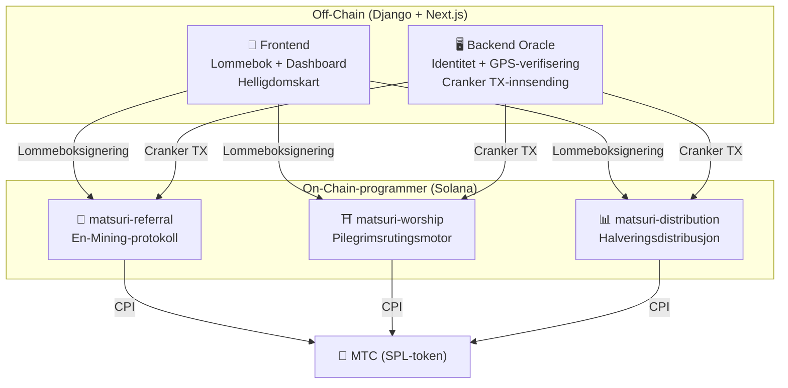
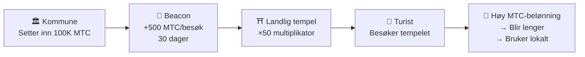
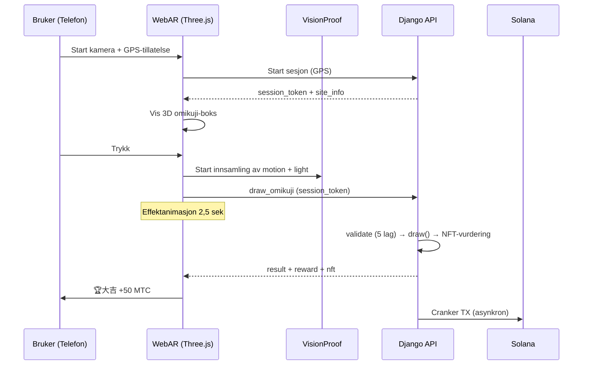

# ⚡ Smarte kontrakter — Åpen kildekode-arkitektur

> **Tillitsløst (Trustless) design.**
> All belønningslogikk, vervingstrær og halveringsplaner håndheves **on-chain** via reviderbare Rust-programmer.
> Kildekode: [GitHub](https://github.com/Cootakahashi/matsuri-contracts)

---

## Oversikt

Matsuri distribuerer **tre Anchor (Rust)-programmer** på Solana, som håndterer hver sin søyle i økosystemet:



---

## 1. 📣 En-Mining (縁マイニング) Protokoll

**Formål:** En hybrid vekstmotor som belønner både *bredde* (ververekkevidde) og *dybde* (økonomisk påvirkning). Ikke bare et affiliateprogram — en fullstendig mining-protokoll der økonomisk aktivitet i den virkelige verden genererer on-chain-verdi.

### Poengdesign

Bidragspoengene er basert på to vektede komponenter:

| Komponent | Vekt | Formål |
| :--- | :---: | :--- |
| **Bredde** (antall vervede) | 30% | Nettverksrekkevidde — hvor mange du bringer inn |
| **Dybde** (oppgjørsvolum) | 70% | Økonomisk påvirkning — ekte kjøp, ikke bare registreringer |

Poeng akkumuleres over tid og konverteres til MTC ved hver halveringsepoke. Ytterligere boostmekanismer er planlagt:

| Boost | Beskrivelse | Status |
| :--- | :--- | :---: |
| **Toku (徳) Staking** | Lås MTC for å øke bidragspoengene dine (opptil ~50 % boost). Nivåer og nøyaktige multiplikatorer vil bli kalibrert basert på halveringspoolens utgivelsesplan | Koeffisienter TBD |
| **Sesongrangeringer** | Toppytere hver epoke tjener **Evangelist**-tittelen (permanent SBT) og en poengboost. Nøyaktige prosentsatser vil bli bestemt via styring | Koeffisienter TBD |

:::info Progressivt parameterdesign
Boostkoeffisienter (staking-nivåer, rangeringsbonuser) er med vilje holdt justerbare. De vil bli fastsatt basert på reelle økosystemdata — totalt antall aktive brukere, halveringspoolens utgivelsestakt og prisstabilitetsmål — deretter låst inn i smarte kontrakter. Denne tilnærmingen sikrer **rettferdig distribusjon** uten å overløfte faste avkastninger.
:::

### Anti-Sybil-forsvar (3 lag)

| Lag | Mekanisme | Hvor |
| :--- | :--- | :--- |
| **Identitetsport** | X/Twitter OAuth + SMS | Off-chain (Django) |
| **On-chain-port** | Bare `is_verified = true`-profiler tjener | Smart Contract |
| **Dybdevekting** | 70 % av poengsummen = ekte betalinger → botter tjener ingenting | Poengmotor |

---

## 2. ⛩️ Pilegrimsrutingsmotor (Worship Routing Engine)

**Formål:** Verdens første **ReFi-protokoll som løser overturisme ved hjelp av token-økonomi.** Besøk hellige steder → tjen MTC. Men her er vrien: *mindre besøkte steder betaler eksponentielt mer.*

:::tip Innsikten
Dette er «omvendt Uber-surge pricing» — overfylte steder straffes, grensesteder belønnes. Turister ruter seg selv til mindre besøkte steder fordi **det er mer lønnsomt.**
:::

### Prinsipper for belønningsdesign

Bidragspoengene for hvert besøk bestemmes av flere faktorer:

| Faktor | Prinsipp | Effekt |
| :--- | :--- | :--- |
| **Stedets popularitet** | Mindre besøkte steder gir høyere poeng | Ruter turister bort fra overfylte områder |
| **Besøkstidspunkt** | Tidligere besøkende på dagen scorer høyere | Oppmuntrer besøk utenfor rushtid |
| **Regionalt nivå** | Landlige steder og grenseområder rangeres høyest | Driver regional revitalisering |
| **Besøksfrekvens** | Regelmessige besøkende akkumulerer bonuspoeng | Belønner konsekvent engasjement |
| **Omikuji-lykke** | Tilfeldig bonustrekning ved hver innsjekking | Morsomt gamification-lag |
| **Sponsede booster** | Kommuner kan booste bestemte steder | B2B/B2G-inntektsmodell |

:::info Koeffisientene er justerbare
De nøyaktige multiplikatorene for hver faktor (f.eks. hvor mye mer et landlig sted tjener vs. et stort sted) vil bli **kalibrert basert på halveringspoolens tidsplan** og reelle bruksdata, deretter progressivt låst inn i smarte kontrakter. Designprinsippet er fast — koeffisientene utvikler seg med økosystemet.
:::

### Sponsede beacons (B2B/B2G)

Kommuner, togselskaper og turismebyråer kan **sette inn MTC** for å opprette tidsbegrensede høybelønningssoner på bestemte steder.



> **B2B-inntektsmodell:** Sponsorer betaler MTC for å rute turister. MTC-kjøpspress → tokenverdi. Win-win-win.

---

## 3. 📊 Halveringsdistribusjon

**Formål:** 550M MTC mining-pool distribuert over tiår via en **2-års halveringssyklus** — raskere enn Bitcoins 4-års syklus.

### Halveringsplan

```
Totalt pool: 550 000 000 MTC

Epoke 0 (2027–2029):  275 000 000 MTC  (50 %)
Epoke 1 (2029–2031):  137 500 000 MTC  (25 %)
Epoke 2 (2031–2033):   68 750 000 MTC  (12,5 %)
Epoke 3 (2033–2035):   34 375 000 MTC  (6,25 %)
        ...              ...
∑ → 550 000 000 MTC (asymptotisk total)
```

### Individuell belønningsformel

```
your_reward = epoch_budget × (your_score / total_score)
```

All aritmetikk bruker **128-bits mellomberegning** — matematisk umulig å overflyte.

### Ytelsesskårkilder

| Aktivitet | Skårvekt |
| :--- | :--- |
| **Guideøkter gjennomført** | Høy |
| **Eventbillettsalg** | Høy |
| **Vervingsnettverksaktivitet** | Middels |
| **Pilegrimsmining-besøk** | Middels |
| **Medieengasjement** | Lav |

:::info Tillatelsesløs epokeframgang
`advance_epoch`-instruksjonen kan kalles av **hvem som helst** — ingen admin nødvendig. Systemklokken bestemmer når epoker skifter, noe som sikrer tillitsløs drift selv om teamet forsvinner.
:::

---

## 4. 🎴 AR Mining — WebAR Omikuji Mining

**Formål:** Mine MTC ved å gjøre AR-omikuji synlige i den virkelige verden — kun med smarttelefonens nettleser. **Ingen app-nedlasting nødvendig.** Verdens første WebAR × blockchain-infrastruktur som forener Shinto-spiritualitet og banebrytende teknologi.

### Arkitektur



### Optimistic UI (null ventetid)

| Steg | Tid | Prosess |
|---------|------|------|
| Trykk → Effektstart | 0ms | Frontend spiller animasjon umiddelbart |
| API draw_omikuji | ~50ms | Django trekker + NFT-vurdering |
| Effekt ferdig | 2500ms | Resultat bekreftet → Visning |
| Solana TX | ~400ms | Sendt i bakgrunnen |

### Omikuji-innstillinger (GCF Admin)

Basispunkter (10000 = 100 %) med 0,01 % presisjonskontroll. Justerbar fra GCF Admin-grensesnittet.

| Grad | Sjeldenhet | Bonus | NFT |
|------|-----------|---------|-----|
| 🏆 大吉 | Sjelden | Høyeste bonus | ✅ |
| ✨ 吉 | Uvanlig | God bonus | Valgfritt |
| 🌸 小吉 | Vanlig | Liten bonus | — |
| 🍃 末吉 | Vanlig | Deltakelse registrert | — |
| 💀 凶 | Uvanlig | Deltakelse registrert | — |

Sannsynligheter og belønningskoeffisienter vil bli fastsatt progressivt basert på økosystemets størrelse og halveringens utgivelsesvolum, deretter implementert i smarte kontrakter.

### ZK-Proof of Vision (5-lags verifisering)

GPS-forfalskning og replay-angrep elimineres gjennom flere lag. **Kameradata sendes ikke til serveren** for personvern.

| Lag | Verifiseringsinnhold | Poeng |
|-------|---------|------|
| Temporal | Sesjonstid 5–120 sek | /20 |
| Motion | Gyrovarians 0,005–0,5 (håndholdt naturlighet) | /20 |
| Light | Omgivelseslys × tidspunkt-konsistens | /20 |
| HMAC | proof_hash signaturverifisering | /20 |
| Fingerprint | Enhetsunikhet | /20 |
| **Totalt** | **PASS-terskel** | **60/100** |

### Belønningsdesign

Belønninger registreres som **bidragspoeng** basert på flere faktorer: stedtype, Omikuji-resultat, regionalt nivå osv. Nøyaktige koeffisienter vil bli fastsatt progressivt basert på halveringens utgivelsesplan og økosystemets vekst, deretter implementert i smarte kontrakter.

---

## Matematikkmoduler (Åpen kildekode-kjerne)

Alle programmer separerer poengberegnings-/belønningsmatematikk i **rene, reviderbare `math.rs`-moduler** med:

- **Null sideeffekter** — ingen I/O, ingen allokeringer, ingen eksterne kall
- **Dokumenterte formler** — LaTeX-stil notasjon i rustdoc
- **Overflytanalyse** — u128 mellomverdier med beviste grenser
- **Omfattende tester** — grensetilfeller, grensebetingelser, ratioverifisering
- **Justerbare koeffisienter** — belønningsparametere er designet for å kunne oppdateres via styring, som muliggjør progressiv kalibrering etter hvert som økosystemet vokser

---

## Sikkerhetsmodell (Åpen kildekode)

Disse kontraktene er **fullstendig åpen kildekode.** Sikkerheten baserer seg på matematiske garantier, ikke uklarhet.

| Prinsipp | Implementering |
| :--- | :--- |
| **Kun PDA-hvelv** | Token-hvelv kontrolleres av Program Derived Addresses — ingen menneskelig nøkkel kan tømme dem |
| **Sjekket aritmetikk** | Alle beregninger bruker `checked_*`-operasjoner — overflyt er umulig |
| **Autoritetsseparasjon** | Admin (multisig) ≠ Cranker (begrensede ops) ≠ Bruker (selvforvaring) |
| **Nødpause** | Admin kan pause alle programmer umiddelbart; kan ikke stjele midler |
| **Uforanderlig tokenøkonomi** | Halveringsfaktor, total pool og epokevarighet settes én gang og kan ikke endres |
| **Rene matematikkmoduler** | Poeng-/belønningslogikk separert i reviderbare, testbare matematikkbiblioteker |
| **Vision Proof** | 5-lags anti-spoofing uten overføring av kameradata (personvernbevarende) |

---

**[◀ Tilbake til veikartet](/docs/roadmap)** ｜ **[Se kildekoden](https://github.com/Cootakahashi/matsuri-contracts)**
