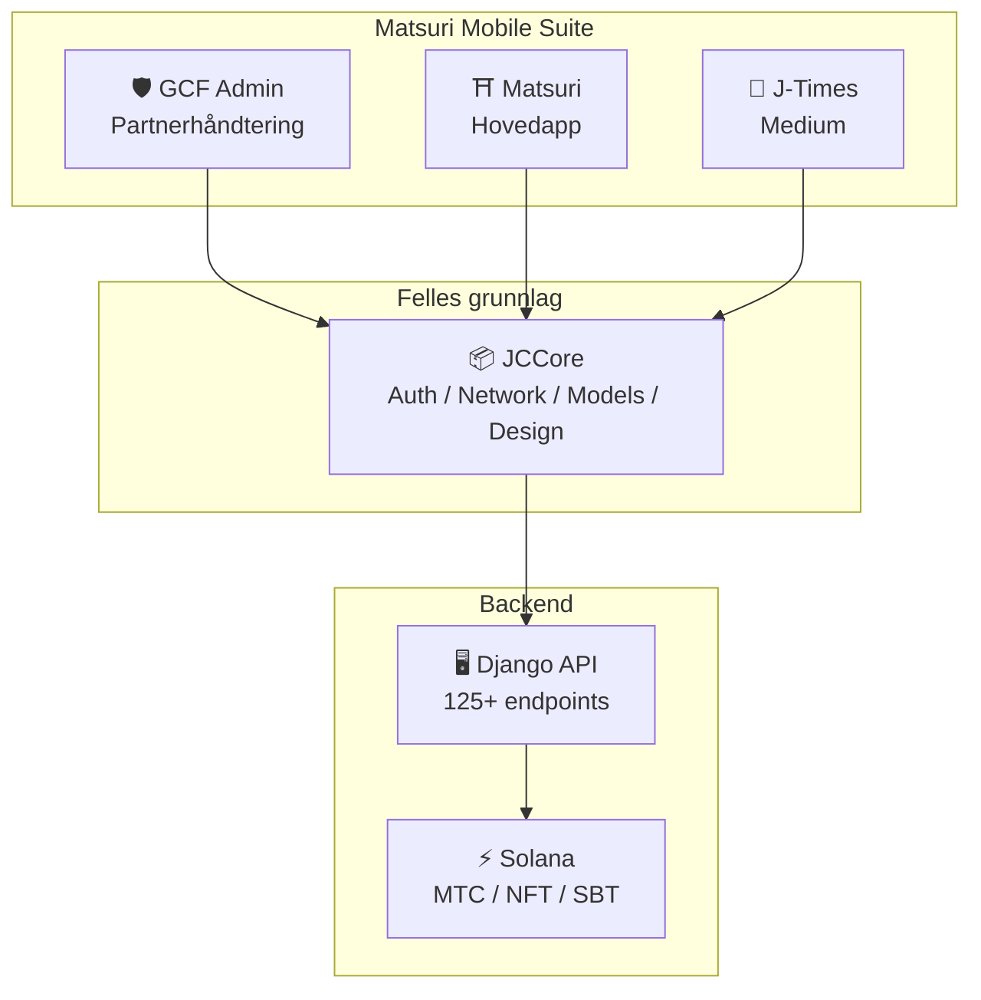
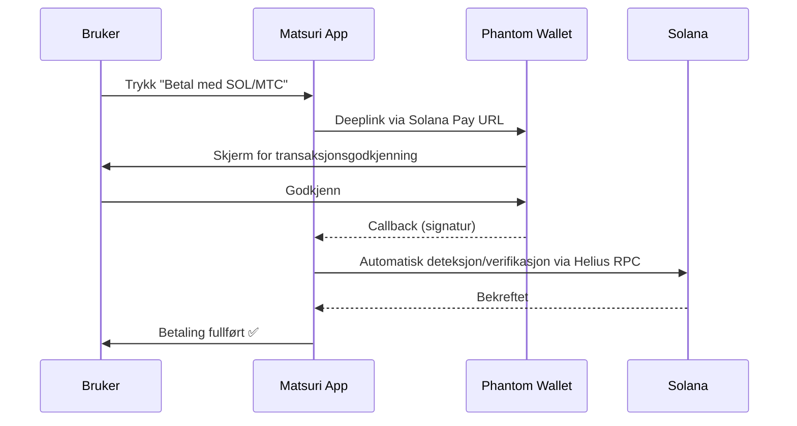
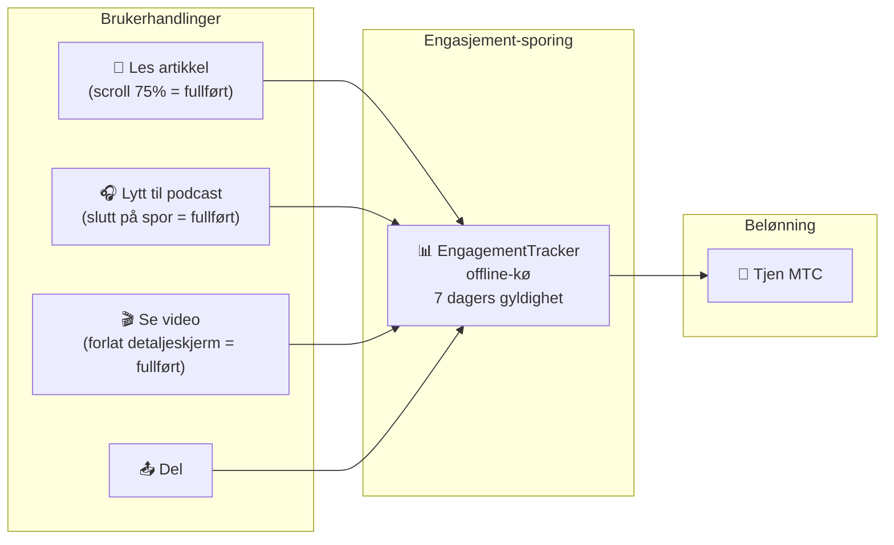
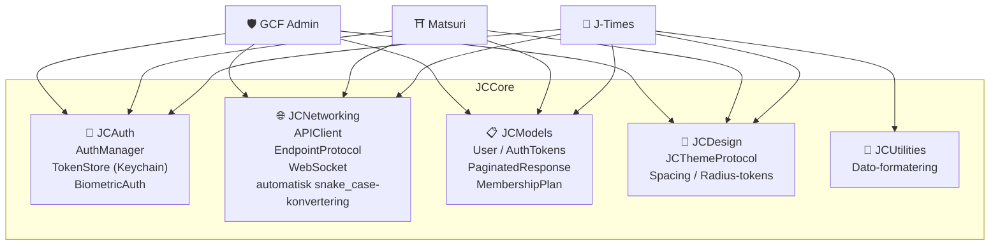
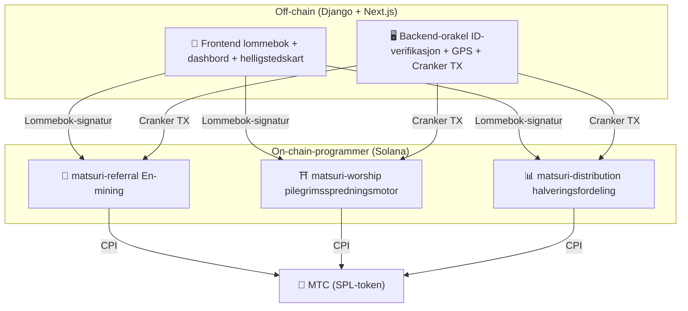
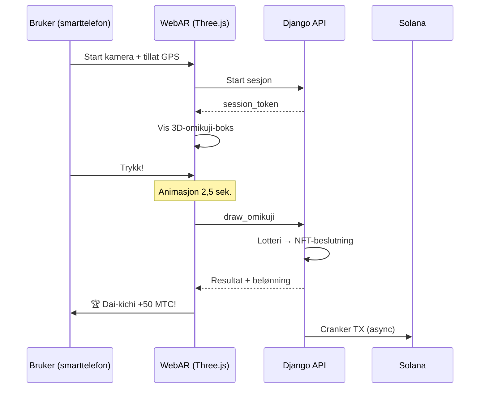

# 🔧 Produkt og teknologi — det som kjører beviser alt

> **Det som kjører, beviser alt.**
> Oppdraget vårt er ikke bare ord. Webplattformen kjører allerede, iOS-appene er i sluttfasen.

Webappen og admin-panelet er **i produksjon**. Tre native iOS-apper er ferdigutviklet og utgis april 2026. Smart contracts på Solana er åpen kildekode og offentlig tilgjengelige — vi snakker ikke i konsepter, men med **kjørende kode og produkter rett rundt hjørnet**.

---

## App-oversikt

| App | Bruk | Status | Språk |
| :--- | :--- | :---: | :--- |
| **GCF Admin** | Partnerhåndtering / driftsverktøy | ✅ Utgitt | 🇯🇵🇬🇧🇨🇳🇹🇭🇳🇴 |
| **Matsuri** | Hovedapp for vanlige brukere | 🔜 Utgis april 2026 | 🇯🇵🇬🇧🇨🇳🇹🇭🇳🇴 |
| **J-Times** | Kulturmedium og læring | 🔜 Utgis april 2026 | 🇯🇵🇬🇧 |

---

## 1. 🛡️ GCF Admin — partner-håndteringsapp

:::info Status: utgitt i App Store (v1.0)
Forretnings-app for GCF (Global Community Friends)-medlemmer. All funksjonalitet fra web-admin samlet på mobil.
:::

  
  
  

### Hva appen kan

| Kategori | Funksjon |
| :--- | :--- |
| **📊 Dashbord** | KPI-kort, omsetningsdiagrammer, hurtighandlinger |
| **👥 Medlemshåndtering** | Liste, detaljer, redigering, tier-styring |
| **💰 Inntjening** | Provisjonssporing, MTC-utbetaling, utbetalingshåndtering |
| **📝 Innholdsstyring** | Oppretting, redigering og publisering av events, artikler, podcaster, video |
| **🎫 Guideplasser** | Håndtering av guideplasser, inntektssporing |
| **🖼️ NFT-dashbord** | Founder's Collection, on-chain-verifikasjon, NFT-overføring |
| **⛩️ Hellig-steds-håndtering** | CRUD for sites, beacon-oppsett |
| **🎲 AR-mining-innstillinger** | Omikuji-sannsynlighetstabell, belønningsparametre |
| **📊 Analytics** | Feilrapporter, bruksanalyser |
| **🔗 Referral** | Egendefinert QR-kode-generering, henvisningsprogram |

### Tekniske spesifikasjoner

| Punkt | Detaljer |
| :--- | :--- |
| **Arkitektur** | Clean Architecture + MVVM + `@Observable` (iOS 17) |
| **Språk / SDK** | Swift 6.0 / Xcode 16+ / iOS 17.0+ |
| **API-integrasjon** | 125+ endpoints |
| **Tester** | 226 tester / 45 testklasser |
| **Lokalisering** | 5 språk (JA/EN/ZH/TH/NO) / 957+ oversettelsesnøkler |
| **Swift Concurrency** | Strict Concurrency-compliant / null byggeadvarsler |

### QR-kode-integrasjon

I GCF Admin kan man generere egendefinerte QR-koder med Matsuri-logo. Brukes til event-invitasjoner, henvisningslenker, betalingsforespørsler mv.

---

## 2. ⛩️ Matsuri — hovedapp

:::info Status: utgis sent april 2026 (v3.0)
Hovedapp for vanlige brukere. Eventbooking, betaling, Web3-lommebok, AR-mining — alt samlet i én app.
:::

  
  
  

### Hva appen kan

| Kategori | Funksjon |
| :--- | :--- |
| **🎪 Eventbooking** | Søk, book, Stripe-betaling, billett-QR |
| **💳 Fire betalingsformer** | Kredittkort / lagrede kort / MTC-saldo / krypto (SOL/MTC) |
| **👛 Web3-lommebok** | MTC-saldo, send/motta, transaksjonshistorikk |
| **🖼️ NFT-galleri** | Beholdning av NFT/SBT, on-chain-verifikasjon |
| **🗺️ Helligstedskart** | Kartvisning av helligdommer og templer, check-in |
| **🎲 AR-mining** | WebAR-omikuji-opplevelse, tjen MTC |
| **💬 Chat** | Meldinger med kontekstmeny |
| **⭐ Ønskeliste** | Lagre favorittevents og opplevelser |
| **🔍 Avansert søk** | Talesøk støttet |
| **🤝 Referral** | Delta i henvisningsprogram, spor belønninger |
| **📊 GCF-dashbord** | Lettvekts-admin for GCF-medlemmer |

### Phantom Wallet-integrasjon — krypto-betaling uten innskriving

>**Brukeren kopierer aldri adresser.** Phantom Wallet åpner automatisk, man godkjenner, og betalingen er fullført. Signaturen oppdages automatisk av Helius RPC.

### Tekniske spesifikasjoner

| Punkt | Detaljer |
| :--- | :--- |
| **Arkitektur** | Clean Architecture + MVVM + Swift Concurrency |
| **Språk / SDK** | Swift 6.0 / Xcode 16+ / iOS 17.0+ |
| **Betaling** | Stripe PaymentSheet + MTC Balance + Phantom (Solana Pay) |
| **API-integrasjon** | 72 endpoints / 16 kategorier |
| **Tester** | 230+ (Model, ViewModel, Network, Security, DeepLink, E2E) |
| **Lokalisering** | 5 språk (JA/EN/ZH/TH/NO) / 406 oversettelsesnøkler |
| **ViewModels** | 25 (full MVVM — null direkte API-kall fra View) |
| **Autentisering** | Apple Sign In / Google Sign In (PKCE) |

---

## 3. 📰 J-Times — kulturmedium-app

:::info Status: utgis sent april 2026
Medieplattform som formidler japansk kulturs dybder. Les artikler, lytt til podcaster, se video — hver handling gir MTC.
:::

  

### Hva appen kan

| Kategori | Funksjon |
| :--- | :--- |
| **📖 Artikler** | Parallax-hero, drop-caps, leseprogresjon, rikt innhold (Markdown, tabeller, sitater) |
| **🎧 Podcaster** | Serier, waveform-spiller, sleep timer, AirPlay, lockscreen-kontroller |
| **🎬 Video** | Adaptiv grid/liste, shorts (TikTok-stil, dobbel-tapp) |
| **🔍 Søk** | Multi-filter, trending tags, talesøk |
| **🧭 Discovery** | Featured carousels, staff picks, ukens hit |
| **📚 Bibliotek** | Favoritter, historikk (etter dato), nedlastinger, spillelister |
| **🎵 Audio-spiller** | Mini-spiller (swipe), full spiller (waveform, tekst, loop) |
| **👤 Medlemskap** | 3 tiers (Free / Premium / Pro), sammenligning, kjøp-gjenoppretting |

### Media Mining — å lese, lytte og se blir til gruving

>**Registreres også offline.** Selv om du leser en artikkel ved en avsides helligdom uten signal, sendes engasjementet automatisk når nettet kommer tilbake, og MTC utbetales.

### Designsystem — Japans estetiske «fire søyler»

J-Times bruker et eget designsystem som oversetter klassisk japansk estetikk til moderne UI.

| Søyle | Konsept | Anvendt i UI |
| :--- | :--- | :--- |
| **Sumi (墨)** | Varm nøytralgrå | Bakgrunnsfarge, teksthierarki |
| **Shu (朱)** | Japansk rød (#C53030) | Aksent, viktige handlinger |
| **Ma (間)** | Luft i 4pt-grid | Spacing, pusterom |
| **Kami (紙)** | Fin tekstur, glasmorfisme | Kortflate, dybde |

### Tekniske spesifikasjoner

| Punkt | Detaljer |
| :--- | :--- |
| **Arkitektur** | Clean Architecture + MVVM + Swift Concurrency |
| **Språk / SDK** | Swift 6.0 / Xcode 16+ / iOS 17.0+ |
| **Eksterne avhengigheter** | **Null** — kun Apples egne rammeverk |
| **API-integrasjon** | 40+ endpoints |
| **Tester** | 371 tester / 20 filer |
| **Lokalisering** | 2 språk (JA/EN) / 310+ oversettelsesnøkler |
| **Offline** | ContentCache (50MB) + ImageDiskCache (200MB) + nedlastingsbehandler |
| **Autentisering** | Apple Sign In / Google Sign In (PKCE) |

---

## Felles grunnlag: JCCore-bibliotek

Et Swift Package-bibliotek delt av alle tre apper.

| Modul | Rolle |
| :--- | :--- |
| **JCAuth** | Keychain-basert token-håndtering, biometrisk autentisering (Face ID / Touch ID) |
| **JCNetworking** | Typesikker API-klient, WebSocket, automatisk JSON snake_case-konvertering |
| **JCModels** | Felles datamodeller på tvers av apper (User, AuthTokens osv.) |
| **JCDesign** | Theme-protokoll, designtokens (spacing, radius) |
| **JCUtilities** | Dato- og tekst-utilities |

---

## Sikkerhet og personvern

| Punkt | Implementering |
| :--- | :--- |
| **Auth-token** | Kryptert lagret i iOS Keychain (TokenStore) |
| **Biometri** | 2-faktor via Face ID / Touch ID |
| **API-kommunikasjon** | HTTPS + Certificate Pinning |
| **Lommebok-privatnøkkel** | Appen lagrer ingen privatnøkkel — uddelegert til Phantom Wallet |
| **AR-mining** | Kamerabilder sendes ikke til server (VisionProof) |
| **Offlinedata** | SwiftData-kryptering + automatisk utløp |
| **Swift Concurrency** | Actor-isolasjon forhindrer race conditions |

---

## Utviklingskvalitet

### Mobilapper: totalt **over 827 automatiske tester** på tvers av de tre appene.

| App | Tester | Dekning |
| :--- | :---: | :--- |
| **GCF Admin** | 226 | Model, ViewModel, Repository, API, Localization, Navigation |
| **Matsuri** | 230+ | Model, ViewModel, Network, Security, DeepLink, Regression, Performance, E2E |
| **J-Times** | 371 | Model, ViewModel, API, Repository, Navigation, Localization, Security, Performance |

### Smart contracts: tester utvides trinnvis

For Rust-programmene på Solana har vi startet med unit-tester på kjernelogikken (matematikkmoduler), og dekningen utvides trinnvis fram mot sikkerhetsrevisjonen (Q2–Q3 2026).

---

## Smart contracts — åpen kildekode-design

>**Designet for trustless.**
> Belønningsberegning, henvisningstre, halveringsplan — all logikk utføres **on-chain** og kan revideres av alle.
> Kildekode: [GitHub](https://github.com/Cootakahashi/matsuri-contracts)

---

### Contributors

| Medlem | Rolle |
| :--- | :--- |
| **Ko Takahashi** | Founder / Lead Developer — arkitektur, smart contracts, full-stack-utvikling |

> 🌏**Framover vil GCF-medlemmer og utviklermiljøer fra hele verden også bidra til felles utvikling.**
> Matsuri Protocol bygger på prinsippene om åpenhet og felles eierskap, slik at den kan fungere som «kulturens infrastruktur» varig.

---

### Overordnet oppbygging

Matsuri deployer **tre Anchor-programmer (Rust)** på Solana som hver bærer en søyle av økosystemet.

---

### 1. 📣 En-mining (縁マイニング — forbindelsesgruving)

**Formål:** en hybrid vekstmotor som belønner både «bredde» (henvisningsnettverk) og «dybde» (økonomisk effekt). Ikke bare affiliate, men en full gruvingsprotokoll der reell økonomisk aktivitet skaper on-chain-verdi.

#### Scoring-design

Bidragspoengene baseres på to vektede komponenter:

| Komponent | Vekt | Formål |
| :--- | :---: | :--- |
| **Bredde** (antall henvisninger) | 30% | Nettverkets rekkevidde — hvor mange er brakt inn |
| **Dybde** (transaksjonsvolum) | 70% | Økonomisk effekt — reelle kjøp, ikke bare sign-ups |

Poengene akkumuleres over tid og gjøres om til MTC per halverings-epoke. Ytterligere boost-mekanismer er planlagt:

| Boost | Beskrivelse | Status |
| :--- | :--- | :---: |
| **Toku (徳)-staking** | Lås MTC og boost bidragspoengene (opptil ca. 50%). Tier og nøyaktig multiplikator tilpasses halveringsplanen | ⬜ Koeffisient tbd |
| **Sesong-ranking** | Topp-performere i hver epoke får tittelen **Evangelist** (permanent SBT) og poeng-boost. Nøyaktig andel avgjøres av governance | ⬜ Koeffisient tbd |

:::info Progressivt parameter-design
Boost-koeffisientene (staking-tier, ranking-bonus) er bevisst justerbare. De låses i smart contracts basert på reelle økosystem-data — aktive brukere, utgivelse fra halveringspoolen, prisstabilitetsmål — og sikrer **rettferdig fordeling** uten å love faste avkastninger.
:::

#### Anti-sybil-forsvar (3 lag)

| Lag | Mekanisme | Plassering |
| :--- | :--- | :--- |
| **ID-gate** | X/Twitter OAuth + SMS | Off-chain (Django) |
| **On-chain-gate** | Kun profiler med `is_verified = true` får belønning | Smart contract |
| **Dybdevekting** | 70% av poengene = reell betaling → bots tjener ingenting | Scoring-motor |

---

### 2. ⛩️ Pilegrimsspredningsmotor (Worship Routing Engine)

**Formål:** Verdens første **ReFi-protokoll** som bruker tokenøkonomi til å løse overturisme. Tjen MTC ved å besøke hellige steder. Det viktige er: *jo færre besøkende, jo eksponentielt større belønning.*

:::tip Kjerneinnsikten
«Omvendt Uber-surge-prising» — overfylte steder får straff, frontier-steder får boost. Turister går frivillig til de mindre besøkte stedene, **fordi det lønner seg bedre**.
:::

#### Designprinsipp for belønning

Bidragspoeng for hvert besøk bestemmes av flere faktorer:

| Faktor | Prinsipp | Effekt |
| :--- | :--- | :--- |
| **Stedets popularitet** | Færre besøkende = høyere poeng | Sprer turister fra overfylte områder |
| **Besøkstidspunkt** | Tidligere på dagen = høyere poeng | Fremmer off-peak-besøk |
| **Regions-tier** | Lokal og frontier ligger høyest | Driver regional revitalisering |
| **Besøksfrekvens** | Gjengangere akkumulerer bonus-poeng | Belønner fortsatt engasjement |
| **Omikuji-lykke** | Tilfeldig bonus-lotteri per check-in | Morsom gamification |
| **Sponset boost** | Kommuner kan booste bestemte sites | B2B/B2G-inntektsmodell |

:::info Koeffisienter kan justeres
De eksakte multiplikatorene (f.eks. hvor mye mer lokale steder tjener vs. hovedsteder) tilpasses **halveringspoolens plan** og reelle bruksdata, og låses trinnvis i smart contracts. Designprinsippet er fast — koeffisientene utvikler seg med økosystemet.
:::

---

### 3. 📊 Halveringsfordeling (Halving Distribution)

**Formål:** inspirert av Bitcoin halveres MTC-fordelingen automatisk per epoke etter en fastsatt plan. Matematisk garantert knapphet.

| Instruksjon | Beskrivelse |
| :--- | :--- |
| `initialize` | Initialiser fordelingspoolen |
| `register_miner` | Registrer miner |
| `update_score` | Oppdater poeng |
| `advance_epoch` | Gå til ny epoke (utfør halvering) |
| `claim_distribution` | Motta fordelingsbelønning |

---

### 4. 🎴 AR-mining — WebAR omikuji-opplevelse

**Formål:** En opplevelse der AR-omikuji dukker opp i det fysiske rommet via smarttelefonens nettleser, og MTC gruves. **Ingen app-nedlasting nødvendig.** En verdensledende infrastruktur der shintoens spiritualitet møter banebrytende teknologi og blokkjeden.

#### Arkitektur

#### Omikuji-sannsynlighet (GCF-admin)

Basis Points (10000 = 100%) gir 0,01%-presisjon. Justerbart fra GCF-admin.

| Klasse | Sjeldenhet | Bonus | NFT |
|------|-----------|---------|-----|
| 🏆 Dai-kichi | Rare | Maks bonus | ✅ |
| ✨ Kichi | Uncommon | Høy bonus | Valgfritt |
| 🌸 Shō-kichi | Common | Liten bonus | — |
| 🍃 Sue-kichi | Common | Deltakelses-logg | — |
| 💀 Kyō | Uncommon | Deltakelses-logg | — |

Sannsynligheter og belønningskoeffisienter fastsettes trinnvis ut fra økosystemets størrelse og halveringens utgivelsesmengde, og implementeres i smart contracts.

#### ZK-Proof of Vision (5 lags sikkerhet)

Flerlagsforsvar mot GPS-juks og replay-angrep. **For å beskytte personvernet sendes kamerabilder aldri til serveren.**

| Lag | Hva som verifiseres | Poeng |
| :--- | :--- | :--- |
| Temporal | Sesjon 5-120 sek. | /20 |
| Motion | Gyroens naturlighet (håndrysten-deteksjon) | /20 |
| Light | Omgivelseslys × tid på dagen | /20 |
| HMAC | Proof_hash signatur-sjekk | /20 |
| Fingerprint | Enhetens unikhet | /20 |
| **Total** | **PASS ved 60/100 eller over** | |

#### Belønningsdesign

Belønningen registreres som **bidragspoeng** basert på stedtype, omikuji-resultat, regions-tier mv. De eksakte koeffisientene fastsettes trinnvis i takt med halveringsplanen og økosystemets vekst og implementeres i smart contracts.

---

### Pure Math Modules (reviderbar kjernelogikk)

Alle programmene skiller scoring og belønningsberegning i **rene, reviderbare `math.rs`-moduler**:

- **Null bivirkninger** — ingen I/O, ingen allokering, ingen eksterne kall
- **Dokumenterte formler** — LaTeX-lignende notasjon i rustdoc
- **Overflow-analyse** — u128 mellomverdier med bevist område
- **Omfattende tester** — edge cases, grenseverdier, ratio-verifisering
- **Justerbare koeffisienter** — belønningsparametre kan oppdateres via governance og tilpasses økosystemets vekst

---

### Sikkerhetsmodell

Kontraktene er **helt åpen kildekode**. Sikkerheten hviler ikke på uklarhet, men på matematisk garanti.

| Prinsipp | Implementering |
| :--- | :--- |
| **PDA-baserte vaults** | Token-vaults styres av PDA (program-derived address) — kan ikke trekkes ut med en menneskelig nøkkel |
| **Checked-aritmetikk** | Alle beregninger bruker `checked_*` — overflow umulig |
| **Rolleskille** | Admin (multisig) ≠ Cranker (begrensede operasjoner) ≠ bruker (selv-administrert) |
| **Nødstopp** | Admin kan pause programmet, men **bare ved sikkerhetstrusler**. Ingen mulighet til å flytte eller konfiskere midler — pause er et «skjold», ikke et verktøy for å endre regler |
| **Uforanderlig tokenomics** | Halveringsrate, total pool, epokelengde er låst etter oppsett |
| **Rene matematikkmoduler** | Belønnings-/scoring-logikk er isolert, testbart matematikkbibliotek |
| **Vision Proof** | 5 lag mot juks – uten å sende kameradata (personvern) |

---

**[▶ Neste: Veikart og team](/docs/roadmap)**｜**[◀ Forrige: Tokenomics](/docs/tokenomics)**
