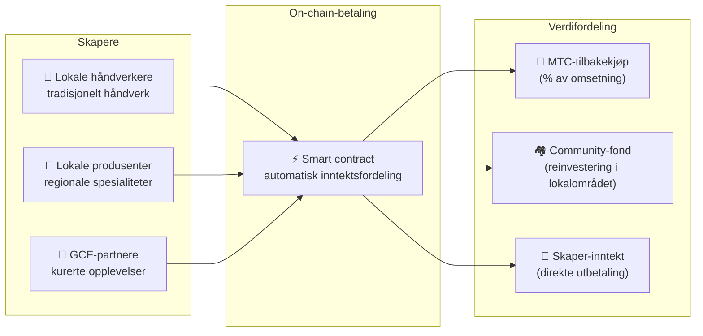

import useBaseUrl from '@docusaurus/useBaseUrl';

# 🗓️ Veikart og team

>**Til deg som har lest så langt — visjon, økonomisk design og teknisk fundament er på plass.**
> Vi er ikke et kortsiktig spekulasjonsprosjekt.
>**Den vesentlige plattformutviklingen er allerede ferdig**, og vi er i fasen med å skalere ut.

---

## Strategiske milepæler

### 🔥 Fase 1: Oppvåkning (første halvdel av 2026 ── nå)

**Tema: Grunnbygging og etablering av kontantstrøm**

Webplattformen kjører, og alle tre iOS-appene (GCF Admin, J-Times, Matsuri) er nå tilgjengelige i App Store (april 2026). Vi fokuserer på inntjening og tidlig likviditet via et finanssystem direkte under CEO.

| Status | Milepæl | Detaljer |
| :---: | :--- | :--- |
| ✅ | **Webplattform i drift** | Matsuri-webapp og GCF-admin (web) er live |
| ✅ | **Betaling og vekst** | MTC-betalingsfunksjon og henvisnings-airdrop implementert |
| ✅ | **Medier i gang** | Distribusjonsgrunnlag for J-Times (web + podcast) |
| ✅ | **Genesis** | MTC-token utstedt på Solana |
| ✅ | **Likviditet sikret** | Innledende likviditetspool opprettet på Raydium |
| ⬜ | **Insentiver starter** | Likviditetsgruving med mål-APY 20% |
| ⬜ | **On-chain-betaling** | Produksjon av Solana Pay-verifikasjon |
| ⬜ | **VIP-rekruttering** | Utvalg av 20 tidlige GCF-VIP-medlemmer |

### 🚀 Fase 2: Ekspansjon (andre halvdel av 2026)

**Tema: Real assets og adventure mining**

Vi bruker den ferdige webappen fullt ut og utvider fysiske baser og pilegrimsfunksjoner.

| Status | Milepæl | Detaljer |
| :---: | :--- | :--- |
| ⬜ | **Ny funksjon** | Adventure mining (pilegrimsferd) implementeres og slippes |
| ⬜ | **Internasjonal** | Partnerskap og VIP-events i Asia (Thailand, Taiwan mv.) |
| ⬜ | **Kapitalforvaltning** | Bygging av portefølje i eiendom, aksjer, krypto |
| ⬜ | **Mål nådd** | Samlet AUM i økosystemet: **1 mrd. ¥** |

### 🌊 Fase 3: Sirkulasjon (2027+)

**Tema: Masseutbredelse, samskapende økonomi, desentralisering**

Fase for generell åpning, on-chain-markedsplass og et komplett økosystem.

| Status | Milepæl | Detaljer |
| :---: | :--- | :--- |
| ⬜ | **Grand Opening** | Matsuri-app offisielt utgitt globalt |
| ⬜ | **Grand Unlock (1.6.2027)** | Founder-lockup oppheves + gruvepool (550M MTC) aktiv + halveringssyklus starter |
| ⬜ | **Samskapende markedsplass** | Lokale spesialiteter + GCF-partnerbutikker ── on-chain-betalinger med automatisk MTC-tilbakekjøp |
| ⬜ | **Crowdfunding (med NFT-rettigheter)** | Brukere investerer i kulturprosjekter på Solana. Støtter mottar NFT som representerer eierskap, inntektsdeling og governance |
| ⬜ | **On-chain-betalinger** | Alle transaksjoner i markedsplassen gjøres opp via smart contracts ── en andel av omsetningen sendes automatisk til MTC-tilbakekjøpspoolen |
| ⬜ | **Mål nådd** | Samlet AUM i økosystemet: **10 mrd. ¥ (~65 mill. $)** |
| ⬜ | **DAO-overgang** | Del av beslutningsmyndighet overføres til GCF-fellesskapet |

#### 🏪 Visjon for samskapende markedsplass

«Kultur-OS-et» i sin ultimate form ── en **desentralisert markedsplass** der kulturens skapere og kulturens elskere handler direkte, uten utnyttende mellomledd.

| Funksjon | Beskrivelse | Status |
| :--- | :--- | :---: |
| **🏺 Lokale spesialiteter** | Håndverkere og lokale produsenter selger direkte til kunder over hele verden. 5–10% rabatt ved MTC-betaling | ⬜ Visjon |
| **🎫 Crowdfunding + NFT-rettigheter** | Invester i kulturprosjekter (restaurering av helligdommer, gjenoppliving av festivaler, håndverkerverksteder). Motta NFT som bevis for bidrag, eventuelt med inntektsdeling og governance | ⬜ Visjon |
| **⚡ On-chain-betaling** | Alle markedsplasstransaksjoner gjøres opp i Solana-smart contracts. Omsetningen fordeles automatisk: utbetaling til skapere + community-fond + MTC-tilbakekjøp ── ingen manuelt regnskap | ⬜ Visjon |
| **🗳️ Støtter-governance** | NFT-holdere stemmer om ressursfordeling i prosjektene de har støttet ── ikke bare en donasjon, men ekte samskaping | ⬜ Visjon |

:::info Hvorfor dette betyr noe
I dag kjøper turister suvenirer i butikker som betaler husleie til plattformen. I morgen selger **en håndverker på japansk landsbygd direkte til en fan i København**, og en andel av omsetningen styrker automatisk MTC-økonomien. Det er svinghjulet i sin mest fullendte form.
:::

---

## 👤 Team

  

### Ko Takahashi ── grunnlegger / CEO og sjefsarkitekt

| Punkt | Detaljer |
| :--- | :--- |
| **Rolle** | Overordnet ansvar for prosjektet. Plattformsdesign, smart contracts, full-stack-utvikling |
| **Visjon** | Forslagsstilleren bak et kultur-OS som «eksporterer kultur og importerer rikdom» |
| **Stil** | Skriver selv koden, står selv i felten (Golden Gai) – «skin in the game» |

  

### Jon Anders Jensen ── styremedlem / GCF- og event-operations

| Punkt | Detaljer |
| :--- | :--- |
| **Rolle** | GCF-drift. Utformer driften av events og turer, jobber i felten |
| **Styrker** | Internasjonalt perspektiv og tillit blant GCF-medlemmer – bærer «sirkulasjonen av mennesker» i økosystemet |

  

### Ryunosuke Honda ── styremedlem / regionskultur-ambassadør

| Punkt | Detaljer |
| :--- | :--- |
| **Rolle** | Broen mellom Japans regionale kulturer og Matsuri-økosystemet |
| **Styrker** | Oppdager lokale kulturressurser og legger dem inn på Matsuri-plattformen for å skape «Deep Japan»-opplevelser |

### 🌏 GCF-fellesskapet ── utviklingsmedlemmer spredt over verden

Matsuri Protocol er ikke skapt av grunnleggerteamet alene.
**GCF-medlemmer fra hele verden** bidrar til protokollens utvikling gjennom test, tilbakemeldinger, oversettelser og lokal utrulling.

| Område | Oppsett |
| :--- | :--- |
| **💼 Global finansiering** | Nettverk av private investorer i Asia |
| **⚙️ Engineering** | Desentralt team av blokkjede- og mobilutviklere |
| **🏮 Operations** | Sterke pipelines i Shinjuku Golden Gai og andre turiststeder |
| **🌐 Fellesskap** | Tverrnasjonale GCF-medlemmer i Japan, Norge, Thailand, Taiwan mv. |

:::tip Kulturens infrastruktur skapes av oss alle
Er du med i GCF, er du også medutvikler av Matsuri Protocol.
Det handler ikke bare om å skrive kode. Å vise fram et lokalt helligsted, oversette dokumentasjon, arrangere et event —
alt er med på å spre protokollen ut i verden.
:::

---

## 🏛️ Governance (DAO)

Matsuri Protocol beveger seg gradvis fra sentralisering mot en **desentralisert autonom organisasjon (DAO)**.
GCF-medlemmer (Platinum/Gold) vil på sikt få **stemmerett** i følgende viktige saker.

| Avstemningssak | Innhold |
| :--- | :--- |
| **💰 Kapitalfordeling** | Hvilke nye forretningsområder eller markedsføring skal forretningsomsetningen investeres i |
| **⚙️ Protokoll-oppdateringer** | Finjustering av app-gebyrer og gruvebelønninger |
| **⛩️ Kulturell sertifisering** | Hvilke festivaler og helligdommer sertifiseres som «offisielle pilegrimssteder» og mottar støtte |

:::info Bli med i revolusjonen
Vi bygger ikke bare en app.
Vi bygger en **kulturøkonomi uten grenser**.
:::

---

**[◀ Forrige: Produkt og teknologi](/docs/product-tech)**｜**[⛩️ Tilbake til whitepaper-start](/docs/intro)**
