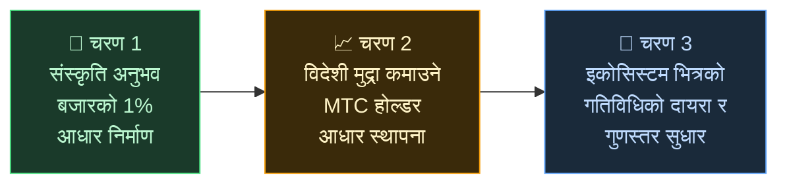

# 🌏 चुनौती र समाधान — असुविधाजनक सत्यहरू, र आशा

> **मिसन सुन्दर छ। वास्तविकता यसको बाटोमा खडा छ।**

---

## तर यस मिसनको बाटोमा खडा भएका असुविधाजनक सत्यहरू छन्

:::info ¥10 ट्रिलियन (~66B $) बजार, र ऊर्जा संस्कृति बोक्ने मानिसहरूसम्म पुग्दैन
जापानको इनबाउन्ड बजार **प्रति वर्ष ¥10 ट्रिलियन (~66 बिलियन $)** तर्फ बढिरहेको छ।
तर त्यो लाभको थोरै मात्र जमिनमा पुगिरहेको छ।
:::

### MTC ले लक्षित गरेको बजार

हामी एकैचोटि सबै ¥10 ट्रिलियन लिने प्रयास गरिरहेका छैनौं।

त्यो बजार भित्र हाम्रो पहिलो लक्ष्य भनेको **संस्कृति अनुभव, गाइड, र स्थानीय टुर खण्ड** हो। हामी **त्यस खण्डको 1% (लगभग ¥100 बिलियन / ~660M $)** लाई हाम्रो प्रारम्भिक लक्ष्यको रूपमा लिन्छौं: सानो सुरु गर्ने, बलियो बढ्ने।

| चरण | रणनीति | लक्ष्य |
| :--- | :--- | :--- |
| **सानो सुरु** | संस्कृति अनुभव र गाइडेड टुरमा फोकस। ट्र्याक रेकर्ड बनाउने र मुखको कुराबाट बढ्ने | राजस्व आधार स्थापना |
| **बलियो बढ्ने** | विदेशी मुद्रा (इनबाउन्ड राजस्व) ल्याउने र MTC होल्डरहरूसँग राजस्व साझेदारी गर्ने संयन्त्र प्रमाणित गर्ने | MTC अर्थतन्त्रमा विश्वास निर्माण |
| **गुणस्तर बढाउने** | निश्चित आकारमा पुगेपछि, वृद्धिको लागि वृद्धिको पछि नदौडने; इकोसिस्टम भित्र अनुभव गुणस्तर, गतिविधि दायरा, र समुदायलाई गहिरो बनाउने | दिगो सांस्कृतिक अर्थतन्त्र |

> **संलग्न मानिसहरूको गुणस्तर र अनुभवको गहिराइमार्फत बढ्ने, मात्रामार्फत होइन।** त्यो MTC को विस्तार रणनीति हो।

Web2 प्लेटफर्महरूले संसारभरका मानिसहरूलाई यात्राको आनन्द ल्याएका छन्, र हामी उनीहरूले निर्माण गरेकोप्रति सच्चा कृतज्ञ छौं। तर केन्द्रीकृत संरचना अपरिहार्य साइड इफेक्टहरूसँग आउँछ।

एल्गोरिदमहरूले के देखिन्छ निर्णय गर्छन्। सञ्चालकहरू प्लेसमेन्टका लागि प्रतिस्पर्धा गर्न बाध्य छन्। एउटा समीक्षाले बिक्रीलाई जङ्गली रूपमा हल्लाउन सक्छ। प्लेटफर्मको इच्छामा कमिशन दर परिवर्तन हुन्छ — र जमिनका मानिसहरू छानिने वा हराउने डरमा निरन्तर बाँच्छन्।

यो संरचनाले उत्पादन गर्ने भनेको सञ्चालकहरू बीचको विभाजन, र अदृश्य नियमहरूको त्रास हो।
छेउछाउको पसल प्रतिद्वन्द्वी बन्छ; ग्राहकलाई बारेर राख्नु सहयोग गर्नुभन्दा बढी अर्थपूर्ण लाग्छ। यात्रुहरूले पनि "ताराको गणना" र "रैङ्किङ" मा फ्ल्याट गरिएका विकल्पहरू मात्रै देख्छन्, र साँचो रूपमा मूल्यवान अनुभवहरू ओझेलमा पर्छन्।

:::danger तीनवटा समस्या जसमा क्षेत्र बाँचिरहेको छ
💸 **राजस्व बहिर्गमन** — अधिकांश राजस्व विदेशी OTA र मध्यस्थहरूलाई कमिशनको रूपमा देश बाहिर बग्छ

😤 **स्थानीय थकान** — overtourism को बोझ मात्र पछाडि रहन्छ; महत्त्वपूर्ण राजस्व कहिल्यै समुदायमा फर्किंदैन

🚧 **अनुभवको पर्खाल** — एल्गोरिदमले छानेका सजातीय टुरहरू मात्र देखिन्छन्, र आगन्तुकहरूले "वास्तविक जापान" लाई कहिल्यै भेट्दैनन्
:::

> **जापानीहरू संघर्ष गर्छन्, यात्रुहरूले वास्तविक कुरा कहिल्यै भेट्दैनन्, र सम्पत्ति प्लेटफर्महरूमा हराउँछ।**

---

## त्यसोभए हामीले यसलाई कसरी परिवर्तन गर्ने?

आज, यो संरचनालाई जरामै परिवर्तन गर्ने प्रविधि अन्ततः आइपुगेको छ।

:::tip Smart contracts — पुनर्लेखन गर्न नसकिने साझा नियमहरू
कमिशन दर र सर्तहरू कोडमा खोदिएका छन्। कसैले इच्छा अनुसार ती परिवर्तन गर्न सक्दैनन्। सबै स्वचालित रूपमा एउटै नियम अन्तर्गत सञ्चालन गर्छन्।
:::

:::tip ब्लकचेन — तपाईंले वास्तवमै देख्न सक्ने पारदर्शिता
प्रत्येक कारोबार सार्वजनिक लेजरमा रेकर्ड हुन्छ जुन कसैले पनि प्रमाणित गर्न सक्छ। कर्पोरेशन भित्र बन्द डेटाको युग सकिएको छ।
:::

:::tip Solana — 0.4-सेकेन्ड निपटान, ~$0.0003 शुल्क
मध्यस्थ शुल्कको थुप्रो छैन, बहु-दिन निपटान छैन। मानिसहरू मानिसहरूसँग सीधा जोडिन्छन्।
:::

:::tip AI — व्यवस्थापनको लागत आफै घुलिन्छ
उत्पादकत्वमा विस्फोटक छलाङले विशाल प्लेटफर्म चलाउन आवश्यक लागत संरचनालाई विगतको कुरा बनाइरहेको छ।
:::

हामी त्यो युगमा छैनौं जहाँ मानिसहरूलाई जोडिनको लागि मध्यस्थहरू चाहिन्छ।

यो प्रविधिले हामी इनबाउन्ड अर्थतन्त्रलाई एकाधिकारबाट मुक्त गर्छौं र जापान र विदेशका जमिनका मानिसहरूलाई राजस्व फिर्ता गर्छौं।
र जापानमा मात्र होइन — हामी **विश्वका संस्कृतिहरूलाई जोगाउने र जोड्ने संरचना** निर्माण गर्छौं।

---

**[◀ अघिल्लो: दृष्टि र मिसन](/docs/vision)** | **[▶ अर्को: MTC ले कल्पना गरेको भविष्य](/docs/future)**
