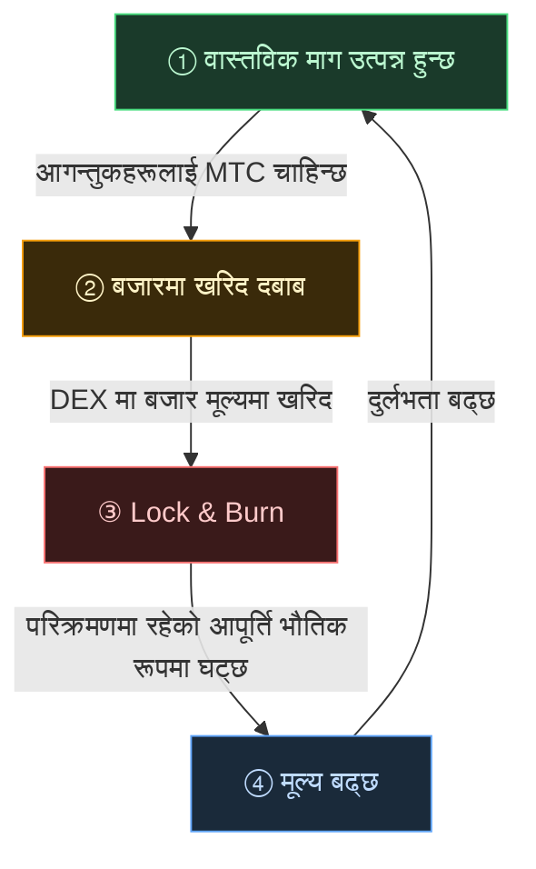

# 🔄 आर्थिक फ्लाईव्हील — वृद्धि लूप र सांस्कृतिक OS

> **आगन्तुकहरूले जापानको जति आनन्द लिन्छन्, इकोसिस्टमले त्यति माग सिर्जना गर्छ।**
> यो आपूर्ति-माग संयन्त्र परियोजनाको धड्किरहेको हृदय हो।

---

## MTC को आपूर्ति-माग संयन्त्र

Matsuri Protocol को डिजाइनद्वारा, **बढ्दो वास्तविक मागले खरिद दबाब सिर्जना गर्छ र, सिकुडिँदो आपूर्तिसँग संयोजन गरेर, मूल्य बढ्ने सर्तहरू सेट गर्छ।**
यो भावना होइन — यो **आपूर्ति र मागको संयन्त्र** हो।

त्यो संयन्त्र तलको **चार-चरण लूप** मा चल्छ।

| चरण | नाम | संयन्त्र |
| :---: | :--- | :--- |
| **①** | **वास्तविक माग उत्पन्न हुन्छ** | आगन्तुकहरूलाई गाइड बुक गर्न वा टिकट NFT किन्न MTC चाहिन्छ |
| **②** | **बजारमा खरिद दबाब** | MTC लाई DEX (विकेन्द्रीकृत एक्सचेन्ज) मा बजार मूल्यमा किनिन्छ। उपभोगमा आधारित बलियो खरिद दबाब, अनुमानमा होइन |
| **③** | **Lock & Burn** | निपटानमा प्रयोग भएको MTC को एक भाग smart contract द्वारा तुरुन्त लक वा बर्न हुन्छ। परिक्रमणमा रहेको आपूर्ति भौतिक रूपमा घट्छ |
| **④** | **दुर्लभता बढ्छ** | खरिद माग बढ्छ, बिक्री आपूर्ति घट्छ। आपूर्ति-माग सन्तुलनको परिवर्तनले प्रत्येक टोकनलाई बढी दुर्लभ बनाउँछ |

---

---

:::note यस समीकरण पछाडिको दृष्टि
ठूलो तस्बिर — फ्लाईव्हील पारिको "सांस्कृतिक OS" — अर्को पृष्ठ [MTC ले कल्पना गरेको भविष्य](/docs/future) मा विस्तृत रूपमा अन्वेषण गरिएको छ।
:::

---

**[◀ अघिल्लो: चुनौती र समाधान](/docs/challenges)** | **[▶ अर्को: MTC ले कल्पना गरेको भविष्य](/docs/future)**
