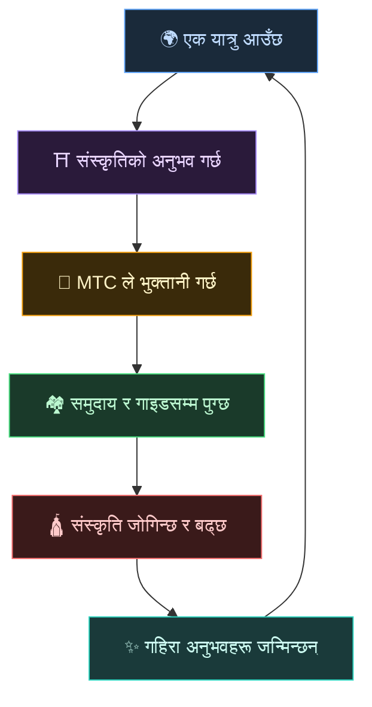
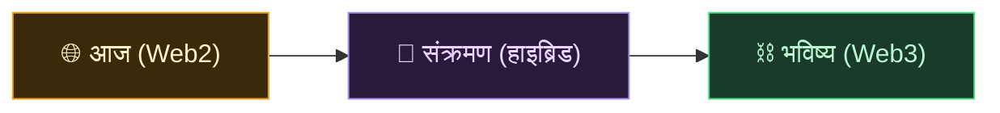
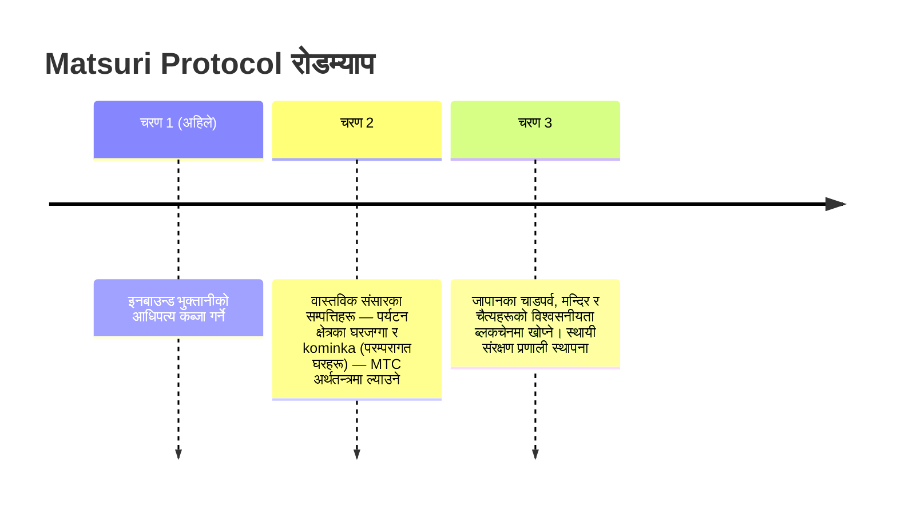

# 🌀 MTC ले कल्पना गरेको भविष्य — हरेक प्रकारको संलग्नता परिक्रमण गर्ने अर्थतन्त्र

> **यसको अनुभव गर्ने मानिसहरू, यसलाई पुर्‍याउने मानिसहरू, यसको रक्षा गर्ने मानिसहरू — हरेक भावना अर्थतन्त्रको रूपमा परिक्रमण गर्छ र संस्कृतिलाई अर्को पुस्तासम्म लैजान्छ।**

---

## हामी ल्याउन चाहेको परिक्रमण

MTC अनुमानको लागि टोकन होइन।

यात्रुहरू जापानी संस्कृतिसँग भेट्छन् र प्रभावित हुन्छन्।
गाइडहरूले त्यो भावना पुर्‍याउँछन् र पुरस्कृत हुन्छन्।
समुदायहरू फस्टाउँछन् र आफ्नो संस्कृतिलाई जोगाइरहन्छन्।
र त्यो संस्कृतिले अर्को यात्रुलाई तान्छ।

यो परिक्रमण नै MTC अस्तित्वमा हुनुको साँचो कारण हो।

---

## तीनै पक्ष पुरस्कृत हुने अर्थतन्त्र

पर्यटनको पुरानो मोडेलमा, यात्रुले तिर्छ, प्लेटफर्मले नाफा लिन्छ, र जमिनमा केही पनि बाँकी रहँदैन।
MTC को अर्थतन्त्रमा, सबै सम्बन्धित पुरस्कृत हुन्छन्।

| को संलग्न छ | के हुन्छ | उनीहरू कसरी पुरस्कृत हुन्छन् |
| :--- | :--- | :--- |
| **🌍 अनुभव गर्नेहरू** | जापानी संस्कृति भेट्छन्, MTC मा तिर्छन् | येनभन्दा सस्तो र प्रामाणिक अनुभवहरूमा वास्तविक पहुँच। घर फर्केपछि पनि MTC मार्फत जोडिएरै रहन्छन् |
| **⛩️ पुर्‍याउनेहरू** | गाइडको रूपमा इभेन्ट होस्ट गर्छन्, J-Times मा प्रकाशित गर्छन् | प्रत्यक्ष पुरस्कारहरू, माथिबाट टिप्ने मध्यस्थहरू बिना। जति बढी कार्य गर्नुहुन्छ, त्यति बढी MTC कमाउनुहुन्छ |
| **🏘️ रक्षा गर्नेहरू** | स्थानीय समुदायको रूपमा संस्कृति कायम राख्छन् र हस्तान्तरण गर्छन् | राजस्व प्रत्यक्ष आइपुग्छ। समुदायहरू overtourism को सट्टा दिगो रूपमा फस्टाउँछन् |

---

## अर्थतन्त्र जति फराकिलो, संस्कृति त्यति बलियो

MTC को अर्थतन्त्र अनुभव बुकिङबाट सुरु हुन्छ, र जीवनको हरेक भागमा फैलिन्छ।

- **अनुभव** — प्रामाणिक संस्कृति अनुभव, तीर्थ-दर्शन खनन
- **लुगा, खाना, बास** — गेस्टहाउस, पसल, खाना, फेसन
- **सह-सिर्जना परियोजनाहरू** — संस्कृति जोगाउनको लागि लगानी गर्न क्राउडफन्डिङ
- **अन्तर्राष्ट्रिय क्रस-कल्चरल समझ** — सिमाना पारको आदानप्रदान र पारस्परिक समझको ठाउँहरू

अर्थतन्त्र जति फराकिलो हुन्छ, यसमार्फत MTC को प्रवाह त्यति घना हुन्छ, र संस्कृतिलाई कायम राख्ने यसको शक्ति त्यति ठूलो हुन्छ।
यो केवल व्यवसायिक मोडेल होइन। यो **संस्कृतिको लागि जीवन-समर्थन प्रणाली** हो।

---

## Web2 बाट Web3 सम्म — चरणबद्ध रूपमा, बिना दबाब

हामी पहिलो दिनदेखि "सबै कुरा ब्लकचेनमा राख्नुहोस्" भन्दैनौं।

आज अधिकांश मानिसहरू अझै Web3 सँग अपरिचित छन्। त्यसैले हामीले यसलाई **मानिसहरूले पहिले नै चिनेका आकारबाट सुरु गर्न र Web3 का फाइदाहरू क्रमशः अनुभव गर्न** डिजाइन गरेका छौं।

| चरण | प्रयोगकर्ता अनुभव | तल के भइरहेको छ |
| :--- | :--- | :--- |
| **आज** | कुनै सामान्य वेब एप जस्तै बुक र भुक्तानी गर्नुहोस्। क्रेडिट कार्ड पर्याप्त छ | Django + Stripe। सुरु गर्न वालेट चाहिँदैन |
| **संक्रमण** | एप भित्र MTC कमाउनुहोस् र प्रयोग गर्नुहोस्। वालेट जडान एक ट्याप मा | अफ-चेन स्कोरहरू क्रमशः अन-चेन सर्छन् |
| **भविष्य** | प्रत्येक कारोबार र अधिकार पारदर्शी रूपमा अन-चेन रेकर्ड हुन्छ। तपाईंको योगदान सधैंभरि प्रमाणित हुन्छ | Smart contracts द्वारा सञ्चालित पूर्ण स्वचालित, छेडछाड-प्रूफ अर्थतन्त्र |

:::tip Web3 गाह्रो हुनुपर्दैन
सुरुमा कुनै वालेट सेटअप, कुनै सीड फ्रेज व्यवस्थापन आवश्यक छैन। तपाईंले एप प्रयोग गर्दा, तपाईं प्राकृतिक रूपमा Web3 मा प्रवेश गर्नुहुन्छ। **तपाईंलाई थाहा हुनुअघि नै, तपाईं Web3 का नागरिक बन्नुभएको छ।** हामीले त्यो अनुभव डिजाइन गरिरहेका छौं।
:::

---

## अर्थतन्त्र जुन सहानुभूतिमा चल्छ, बल होइन

र यो अर्थतन्त्र smart contracts मा चल्छ।
कसैको इच्छामा एकपक्षीय रूपमा नियमहरू पुनर्लेखन हुन सक्दैनन् — **एउटा अर्थतन्त्र जसमा यथास्थितिलाई बल प्रयोग गरेर परिवर्तन गर्न सकिँदैन।**

त्यो जगमा, हामी पुरातन ज्ञानबाट सिक्छौं र नयाँ मूल्य सिर्जना गरिरहन्छौं। 温故知新, र त्यसपछि सिर्जना।

> **एउटा संसार जहाँ जीवन येन वा डलर बिना पनि संस्कृति वरिपरि एकसाथ रहन सक्छ।**
>
> मुद्राको अर्थलाई कसैलाई आउटसोर्स गर्ने होइन, तर आफ्नो "संलग्नता" मार्फत मूल्य उत्पन्न र खर्च गर्ने।
> त्यो स्वतन्त्रता हो जुन MTC ले पुर्‍याउन चाहन्छ।

---

## 🏁 अन्तिम गन्तव्य: "सांस्कृतिक OS"

हाम्रो परम लक्ष्य भनेको केवल भुक्तानी एप होइन।
यो **संस्कृति आफैलाई OS (आधारभूत तह) मा परिणत** गर्ने हो।

> हामी पुरातन ज्ञानलाई नवीनतम ब्लकचेनले जोगाउँछौं।
> त्यो भविष्य हो जुन Matsuri Protocol कोरिरहेको छ।

---

:::note कथा खण्डको अन्त्य
यदि तपाईंले यहाँसम्म पढ्नुभएको छ भने, अब तपाईंले MTC किन अस्तित्वमा छ बुझ्नुभएको हुनुपर्छ।
अर्को **[अभ्यास]** हो — MTC सँग वास्तवमा के गर्न सकिन्छ हेरौं।
:::

**[◀ अघिल्लो: आर्थिक फ्लाईव्हील](/docs/flywheel)** | **[▶ अर्को: इकोसिस्टम](/docs/ecosystem)**
