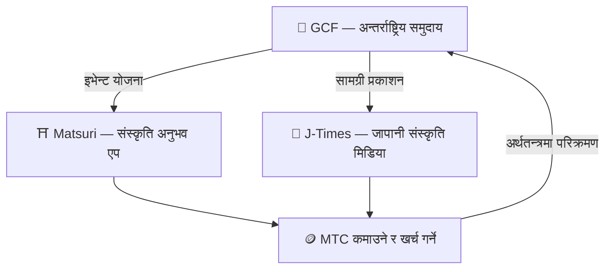

# 🏗️ MTC इकोसिस्टम — अनुभव, मिडिया, र समुदाय परिक्रमण गर्ने अर्थतन्त्र

> **मिसन वास्तविक बनाउनको लागि तीन "ठाउँ"।**
> अनुभव गर्ने ठाउँ, सिक्ने ठाउँ, जोडिने ठाउँ — प्रत्येक आफैमा खडा हुन्छ, र MTC ले तिनलाई एकल परिक्रमण गर्ने अर्थतन्त्रमा जोड्छ।

MTC केवल टोकन होइन। तीन उत्पादन र एउटा अन्तर्राष्ट्रिय समुदायले संस्कृति जोगाउने अर्थतन्त्र निर्माण गर्न सँगै काम गर्छन्।

:::tip 🤝 GCF — इकोसिस्टम चलाउने अन्तर्राष्ट्रिय समुदाय
सिमाना पार जापानी संस्कृति मन पराउने मानिसहरूको भेला हुने स्थान। GCF ले गाइडहरू भर्ती गर्छ, र ती GCF गाइडहरूले Matsuri मा अनुभवहरू सञ्चालन गर्छन्। उनीहरूले J-Times मा आकर्षक सामग्री पनि प्रकाशित गर्छन् — समुदायको गतिविधि नै सम्पूर्ण इकोसिस्टम चलाउने इन्जिन हो।
:::

:::tip ⛩️ Matsuri — संस्कृति अनुभव एप
संस्कृति-अनुभव बुकिङबाट सुरु हुन्छ र चरणबद्ध रूपमा **गेस्टहाउस**, **पसल**, र **क्राउडफन्डिङ** मा विस्तार हुन्छ। अर्थतन्त्र अनुभवबाट लुगा, खाना, बास, र सह-सिर्जना लगानीमा बढ्छ।

**तीर्थ-दर्शन खनन (seichi junrei — पवित्र तीर्थयात्रा)** — मन्दिर, चैत्य, र सांस्कृतिक स्थलहरूलाई भौतिक रूपमा भ्रमण गरेर MTC कमाउनुहोस्। यात्रुहरू प्राकृतिक रूपमा प्रसिद्ध हटस्पटहरूबाट लुकेका स्थानीय रत्नहरूतर्फ बग्छन्, overtourism समाधान गर्दै र क्षेत्रीय क्षेत्रहरूलाई पुनर्जीवित गर्दै।
:::

:::tip 📰 J-Times — जापानी संस्कृति मिडिया
जापानी संस्कृतिको आकर्षण संसारमा पुर्‍याउने मिडिया प्लेटफर्म। तपाईंले लेखहरू पढ्ने र साझा गर्ने जस्ता संलग्नताहरूमार्फत MTC कमाउनुहुन्छ।
:::

---

## 🤝 सामाजिक खनन (जोडिनुहोस् र कमाउनुहोस्)

**GCF एड्मिन ड्यासबोर्डसँग बाँधिएको — वेब संस्करण लाइभ (iOS एप अप्रिल 2026 मा अनुसूचित)।**

GCF सदस्यहरूले समर्पित **GCF एड्मिन वेब** इन्टरफेसमा पहुँच पाउँछन्।

| सुविधा | तपाईंले के गर्न सक्नुहुन्छ |
| :--- | :--- |
| **🎪 इभेन्ट सिर्जना** | आफ्नै इभेन्ट र टुर योजना र सूचीबद्ध गर्नुहोस् |
| **📢 सामग्री वितरण** | J-Times लेख र सामग्री प्रकाशित र फैलाउनुहोस् |
| **📊 रेफरल ट्र्याकिङ** | रेफर गरिएका प्रयोगकर्ताहरूको गतिविधि र राजस्व वास्तविक समयमा ट्र्याक गर्नुहोस् |

:::info स्वचालित पुरस्कार
तपाईंले रेफर गरेको साथीले हरेक पटक भुक्तानी गर्दा, प्रणालीले **स्वचालित रूपमा** तपाईंको वालेटमा पुरस्कार (राजस्व साझेदारी) जम्मा गर्छ।
:::

---

## 🎓 निर्माता अर्थतन्त्र (सिर्जना गर्नुहोस् र कमाउनुहोस्)

तपाईं केवल सामग्री उपभोग गर्नुहुन्न — Matsuri मा, **जो कोही** ले यसलाई सिर्जना र मुद्रीकरण गर्न सक्छ।

| प्लेटफर्म | निर्माताहरूले के गर्न सक्छन् | राजस्व मोडेल |
| :--- | :--- | :--- |
| **📚 कोर्स मार्केटप्लेस** | जापानी संस्कृति, भाषा, वा शिल्पमा भिडियो / पाठ कोर्सहरू प्रकाशित गर्नुहोस् | प्रति-नामांकन शुल्क (निर्माता राजस्व साझेदारी) |
| **🎙️ पडकास्ट स्टुडियो** | Spotify, Apple Podcasts, र RSS मार्फत वितरित अडियो शृङ्खला उत्पादन गर्नुहोस् | केवल सब्सक्रिप्शन एपिसोडहरू |
| **🤝 क्राउडफन्डिङ** | सांस्कृतिक परियोजनाहरूको लागि Solana-आधारित अनुदान संकलन अभियानहरू सुरु गर्नुहोस् | अन-चेन योगदान ट्र्याकिङ |
| **🛍️ प्रयोगकर्ता पसलहरू** | प्लेटफर्म भित्र व्यक्तिगत पसल खोल्नुहोस् (शिल्प, सामान) | उत्पादन / समीक्षा प्रणालीसहित प्रत्यक्ष बिक्री |

:::tip AI-संचालित उत्पादन सहायता
इभेन्ट होस्टहरूले एड्मिन ड्यासबोर्ड भित्र **बिल्ट-इन AI सहायक (GPT-4 Turbo)** प्रयोग गरेर इभेन्ट विवरणहरू लेख्न, ५ भाषामा स्वत: अनुवाद गर्न, र SEO-अनुकूलित मेटाडेटा उत्पन्न गर्न सक्छन्।
:::

---

  

*Golden Gai मा समुदाय भेटघाट — जडान खनन शक्ति बन्छ।*

---

:::note अर्को पृष्ठ
खनन वास्तवमा कसरी काम गर्छ र कसरी कमाउने हेर्नको लागि, **[खनन र कमाई →](/docs/mining)** मा जानुहोस्।
:::
