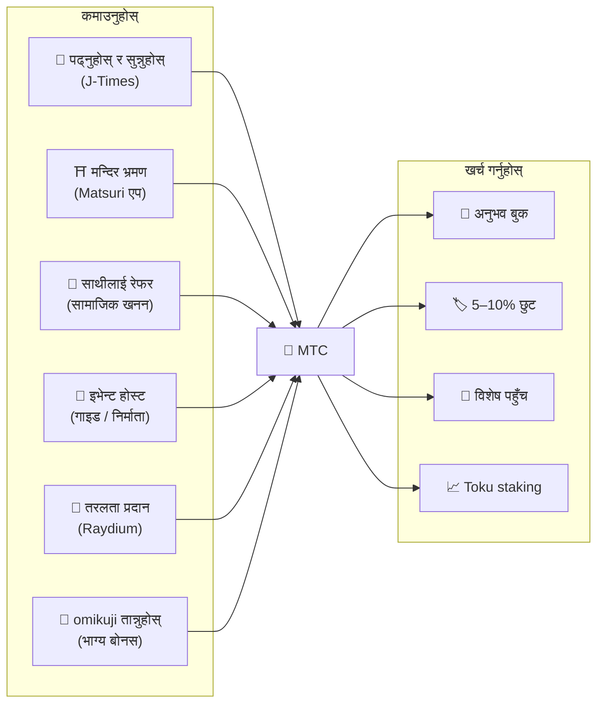
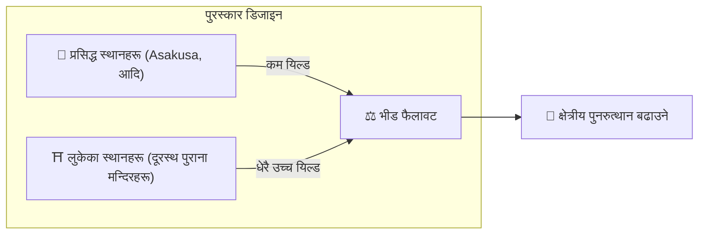
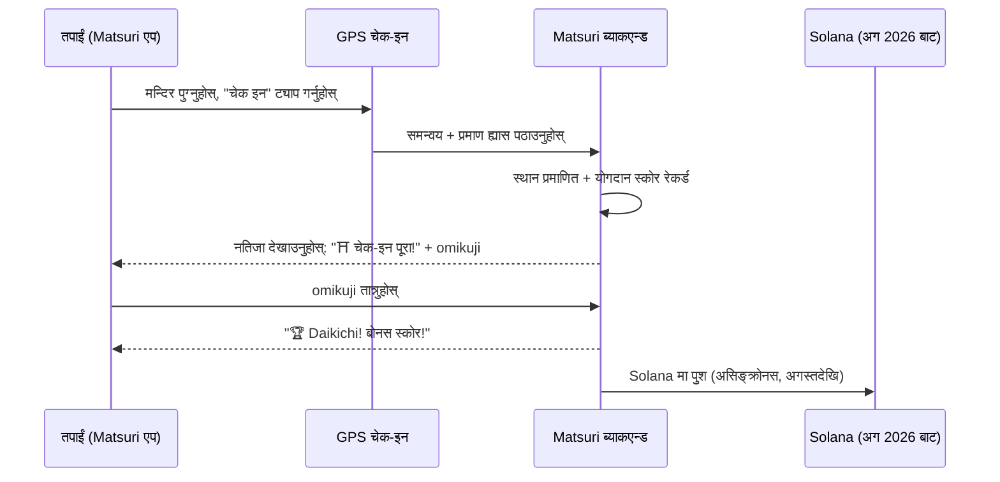
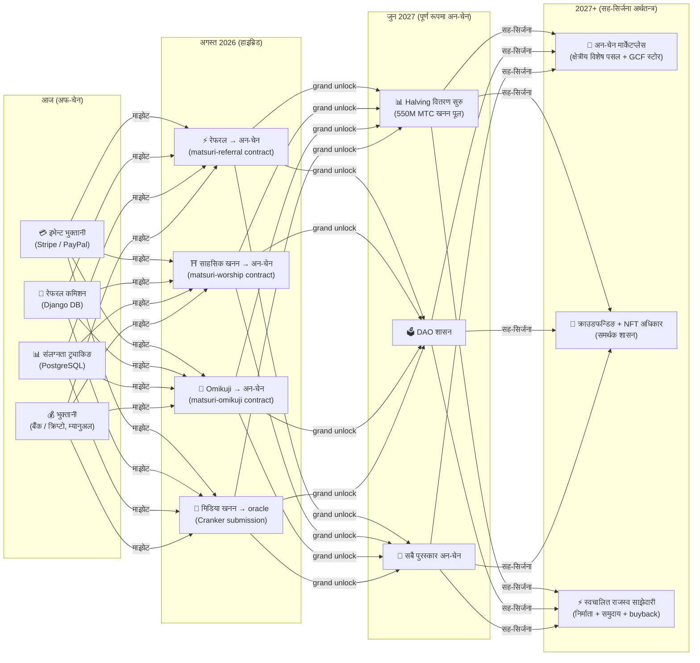

import useBaseUrl from '@docusaurus/useBaseUrl';

# ⛏️ खननका पाँच स्तम्भ र कसरी कमाउने

> **संस्कृतिमा "संलग्नता" को हरेक रूप मूल्य बन्छ।**
> पढ्ने, हिँड्ने, जोडिने, सिर्जना गर्ने, समर्थन गर्ने — तपाईंका हरेक कार्यले MTC उत्पादन गर्छन्।

<small>*"खनन" के हो? — Bitcoin र समान नेटवर्कहरूमा, कम्प्युटरहरूले विशाल गणनाहरू गर्छन् र पुरस्कारको रूपमा नयाँ कोइनहरू प्राप्त गर्छन्; यसलाई "खनन" भनिन्छ। MTC सँग, खनन गर्ने भनेको कम्प्युटिङ शक्ति होइन, **तपाईंका आफ्नै कार्यहरू** हुन् — एक लेख पढ्ने, मन्दिर भ्रमण गर्ने, इभेन्ट होस्ट गर्ने। सुन खन्नुको सट्टा, संस्कृतिसँगको संलग्नताले MTC उत्पादन गर्छ। यसको अर्थ "खनन" भनेको त्यही हो यहाँ।*</small>

> कार्यद्वारा कमाउनुहोस्। अनुभवमा खर्च गर्नुहोस्। यसलाई होल्ड गर्नुहोस् र बढ्दै गरेको हेर्नुहोस्।

MTC अनुमानमूलक टोकन होइन। यो वास्तविक अर्थतन्त्रमार्फत परिक्रमण गर्छ जहाँ हरेक कार्यले मूल्य उत्पादन गर्छ र समात्छ। वेब एप्लिकेसन र एड्मिन ड्यासबोर्ड **पहिले नै लाइभ छन्**। योगदान स्कोरहरू हाल अफ-चेन (Django मा) रेकर्ड गरिन्छन् र अगस्त 2026 बाट चरणबद्ध रूपमा अन-चेनमा सर्नेछन्।

:::tip ठूलो तस्बिर
MTC सँग **पूर्ण रूपमा बन्द-लूप अर्थतन्त्र** छ: तपाईंले वास्तविक गतिविधिमार्फत कमाउनुहुन्छ, तपाईंले वास्तविक अनुभवहरूमा खर्च गर्नुहुन्छ, र इकोसिस्टम बढ्दा मूल्य बढ्छ। यो पृष्ठले मेकानिक्सलाई विस्तृत रूपमा व्याख्या गर्छ।
:::

---

## MTC जीवनचक्र

---

## पाँच खनन स्तम्भ

### 1. 📖 मिडिया खनन (पढ्नुहोस्, सुन्नुहोस्, जवाफ दिनुहोस् — र कमाउनुहोस्)

**आधिकारिक "J-Times" मिडिया प्लेटफर्मसँग बाँधिएको**

ज्ञानले यात्राको गुणस्तरलाई नाटकीय रूपमा बढाउँछ। **J-Times एप** खोल्नुहोस् र जापानी संस्कृतिको बारेमा सामग्री आनन्द लिनुहोस्। पाठ र अडियोको शीर्षमा, हामी **समझ जाँच (क्विज)** लाई पुरस्कृत गर्छौं। हरेक पूरा भएको कार्यले तपाईंलाई स्वचालित रूपमा MTC क्रेडिट गर्छ।

| कार्य | पूरा हुने सर्त | सामान्य पुरस्कार |
| :--- | :--- | :---: |
| **📰 लेख पढ्नुहोस्** | 75% सम्म स्क्रोल गर्नुहोस् | 2–30 MTC |
| **🎧 पडकास्ट सुन्नुहोस्** | अन्तसम्म प्ले गर्नुहोस् | 2–30 MTC |
| **🎬 भिडियो हेर्नुहोस्** | हेरेपछि विवरण स्क्रिन बन्द गर्नुहोस् | 2–30 MTC |
| **📤 सामग्री साझा** | साझा शीट खोल्नुहोस् | 2–30 MTC |
| **✅ क्विज जवाफ** | समझ परीक्षण उत्तीर्ण गर्नुहोस् | 2–30 MTC |

<small>*पुरस्कार रकम सामग्री प्रकार, लम्बाइ, र इकोसिस्टमको समग्र आपूर्ति सन्तुलन अनुसार फरक हुन्छ।*</small>

:::tip खाली समय खनन बन्छ
यात्रा र विश्राम पुरस्कार उत्पन्न गर्ने समयमा परिणत हुन्छन्।
:::

:::info अफलाइन समर्थन
कुनै दूरस्थ मन्दिरमा इन्टरनेट छैन? कुनै समस्या छैन। J-Times ले गतिविधि स्थानीय रूपमा लग गर्छ र **तपाईं फेरि अनलाइन हुनासाथ स्वत: सिङ्क हुन्छ** (7-दिन अफलाइन क्यु अवधारण)। तपाईंले कमाएको MTC गुम्नेछैन।
:::

**हुडमुनि के हुन्छ:**
1. J-Times एपले तपाईंको कार्य पत्ता लगाउँछ (पढ्ने, हेर्न पूरा हुने, साझा गर्ने, आदि)
2. अफलाइनमा पनि स्थानीय रूपमा रेकर्ड गर्छ (7 दिनसम्म राखिन्छ)
3. नेटवर्क फर्किएपछि प्रमाणिकरणको लागि सर्भरमा पठाउँछ
4. योगदान स्कोरको रूपमा तपाईंको ब्यालेन्समा प्रतिबिम्बित गर्छ
5. अगस्त 2026 बाट: प्रमाणित स्कोरहरू oracle मार्फत अन-चेन रेकर्ड हुन्छन् र ब्लकचेनमा प्रमाणित गर्न योग्य बन्छन्

---

### 2. ⛩️ साहसिक खनन (हिँड्नुहोस् र कमाउनुहोस्)

**परियोजना "Junrei" — smart contract पूरा, mainnet तैनाथी अगस्त 2026**

GPS र टोकन प्रोत्साहनहरू प्रयोग गरेर भौतिक "मानिसहरूको प्रवाह" आकार दिने अर्को-पुस्ताको सुविधा। पवित्र-स्थल नक्सा Matsuri वेब एपमा **पहिले नै लाइभ** छ। योगदान स्कोरहरू हाल अफ-चेन रेकर्ड गरिन्छन्; अन-चेन पुरस्कार वितरण अगस्त 2026 स्मार्ट-कन्ट्र्याक्ट तैनाथीपछि सुरु हुन्छ।

>**तपाईंले बढी कमाउनुहुन्छ भनेर, तपाईं ग्रामीण क्षेत्रतर्फ जानुहुन्छ।**
> यो सरल आर्थिक तर्कले overtourism लाई घुलाउँछ र क्षेत्रीय पुनरुत्थानलाई बढाउँछ।

**चेक-इन कसरी काम गर्छ:**

  
  

    
<strong>Worship Mining</strong> — मन्दिर नजिक चेक इन गर्नुहोस्, AR क्यामेराले ऊर्जा पत्ता लगाउनुहोस्, बोनस MTC को लागि omikuji तान्नुहोस्। टियर मल्टिप्लायर्स 1.0× (Major) देखि 10.0× (Hidden Gem) सम्म।

  

**मूल सिद्धान्त — आगन्तुकहरू जति कम, तपाईंले त्यति बढी कमाउनुहुन्छ:**

| स्थल प्रकार | उदाहरण | सामान्य पुरस्कार (प्रति चेक-इन) |
| :--- | :--- | :---: |
| 🏙️ **Major** | Sensōji, Kiyomizudera, Fushimi Inari | 30–50 MTC |
| 🌆 **क्षेत्रीय हब** | प्रत्येक प्रिफेक्चरको Ichinomiya, क्षेत्रीय ठूला मन्दिरहरू | 50–100 MTC |
| 🏞️ **क्षेत्रीय** | ऐतिहासिक क्षेत्रीय मन्दिरहरू | 100–150 MTC |
| ⛰️ **Frontier** | पहाडी चैत्य, टापु पवित्र स्थलहरू | 150–200 MTC |

<small>*माथिका मानहरू आधार पुरस्कार अनुमानहरू हुन्। Omikuji मल्टिप्लायर्सले तिनलाई धेरै-गुणा बढाउन सक्छन्।*</small>

**अतिरिक्त स्कोरिङ कारकहरू:**
- **Omikuji मल्टिप्लायर** — हरेक चेक-इनमा अनियमित बोनस। Daikichi ले पुरस्कारलाई धेरै गुणा बढाउँछ
- **भ्रमण आवृत्ति** — नियमित आगन्तुकहरूले समयसँगै बढी जम्मा गर्छन्
- **प्रायोजित स्थानहरू** — नगरपालिकाहरूले विशेष स्थानहरूलाई बूस्ट गर्न सक्छन्

:::info योगदान स्कोर → MTC
तपाईंको गतिविधि **योगदान स्कोर** को रूपमा जम्मा हुन्छ। प्रत्येक halving epoch मा (जुन 2027 बाट सुरु), स्कोरहरू 550M खनन पूलबाट MTC मा परिणत हुन्छन्। समुदायमा तपाईंको योगदान जति ठूलो, तपाईंले त्यति बढी MTC पाउनुहुनेछ। सटीक बूस्ट गुणहरू चरणबद्ध रूपमा अन्तिम रूप दिइन्छन् र smart contracts मा कार्यान्वयन गरिन्छन् — यसले वास्तविक पूल आकारसँग संरेखित निष्पक्ष वितरण ग्यारेन्टी गर्छ।
:::

---

### 3. 🤝 सामाजिक खनन (जोडिनुहोस् र कमाउनुहोस्)

तपाईंले साथीहरूलाई परिचय गराएर मात्रै MTC कमाउनुहुन्छ।

#### सामान्य प्रयोगकर्ताहरूको लागि रेफरल पुरस्कार

सरल छ। तपाईंको रेफरल लिङ्कमार्फत साथीले साइन अप गर्दा, तपाईंले **प्रति प्रत्यक्ष रेफरल 300 MTC** प्राप्त गर्नुहुन्छ।

| सर्त | पुरस्कार |
| :--- | :--- |
| तपाईंले रेफर गरेको साथीले साइन अप गर्छ | **300 MTC** |

बस त्यति। बहु-तह पुरस्कार छैन।

#### GCF एजेन्ट रेफरल पुरस्कार

[GCF सदस्यहरू](/docs/gcf) इकोसिस्टम विस्तारको लागि जिम्मेवार **आधिकारिक एजेन्टहरू** हुन् र गहिरो पुरस्कार संरचना छ।

| तह | सम्बन्ध | कमिशन |
| :---: | :--- | :---: |
| **L1** | प्रत्यक्ष रेफरल | **20%** |
| **L2** | उनीहरूका रेफरलहरू | **5%** |
| **L3** | तेस्रो तह | **5%** |
| **L4** | चौथो तह | **5%** |

:::note GCF एजेन्ट कार्यक्रमको बारेमा
यो बहु-तह पुरस्कार GCF सदस्यता धारण गर्ने आधिकारिक एजेन्टहरूमा मात्र लागू हुन्छ (निमन्त्रणामा मात्रै)। सामान्य प्रयोगकर्ताहरूले प्रत्यक्ष रेफरल (300 MTC) मात्र प्राप्त गर्छन्।
GCF एजेन्ट कमिशनहरू उनीहरूका रेफरलहरूको **वास्तविक आर्थिक गतिविधि** (अनुभव खरिद, इभेन्ट सहभागिता, आदि) को आधारमा गणना गरिन्छ। मानिस मात्र जम्मा गर्दा पुरस्कार उत्पन्न हुँदैन।
:::

**En-Mining स्कोर कसरी काम गर्छ (GCF एजेन्टहरूको लागि):**

योगदान स्कोर दुई कम्पोनेन्टहरूबाट गणना गरिन्छ:
- **नेटवर्क चौडाइ** (30%) — तपाईंले ल्याएका मानिसहरूको संख्या
- **आर्थिक गतिविधि** (70%) — तपाईंको रेफरल नेटवर्कबाट वास्तविक खरिदहरू

स्कोरहरू समयसँगै जम्मा हुन्छन् र प्रत्येक halving epoch मा MTC मा परिणत हुन्छन्।

#### GCF एड्मिन ड्यासबोर्ड — वेब संस्करण लाइभ

GCF सदस्यहरूले समर्पित एड्मिन ड्यासबोर्डमा पहुँच पाउँछन्।

| सुविधा | तपाईंले के गर्न सक्नुहुन्छ |
| :--- | :--- |
| **🎪 इभेन्ट सिर्जना** | आफ्नै इभेन्ट र टुर योजना र सूचीबद्ध गर्नुहोस् |
| **📢 सामग्री वितरण** | J-Times लेख र सामग्री प्रकाशित र फैलाउनुहोस् |
| **📊 रेफरल ट्र्याकिङ** | रेफर गरिएका प्रयोगकर्ताहरूको गतिविधि र राजस्व वास्तविक समयमा ट्र्याक गर्नुहोस् |

:::warning हाल अफ-चेन → अगस्त 2026 मा अन-चेनमा माइग्रेट
रेफरल कमिशनहरू हाल Django (PostgreSQL) मा ट्र्याक गरिन्छन् र बैंक स्थानान्तरण वा क्रिप्टोद्वारा भुक्तानी गरिन्छ। **अगस्त 2026** बाट, उनीहरू Solana मा **Matsuri Referral स्मार्ट कन्ट्र्याक्ट** मा सर्छन्, अन-चेन, अडिट योग्य भुक्तानी ल्याउँछन्।
:::

  

*Golden Gai मा समुदाय भेटघाट — जडान खनन शक्ति बन्छ।*

---

### 4. 🎓 निर्माता र गाइड खनन (सिर्जना गर्नुहोस् र कमाउनुहोस्)

तपाईं केवल सामग्री उपभोग गर्नुहुन्न — Matsuri मा, **जो कोही** ले यसलाई सिर्जना र मुद्रीकरण गर्न सक्छ। यदि तपाईं GCF सदस्य, गाइड, वा सामग्री निर्माता हुनुहुन्छ भने, यहाँ तपाईंले कसरी कमाउनुहुन्छ।

| गतिविधि | तपाईंले कसरी कमाउनुहुन्छ |
| :--- | :--- |
| **🗺️ टुर होस्ट गर्नुहोस्** | गाइड कमिशन (प्रति इभेन्ट सेट) + टिप्स |
| **🎫 इभेन्ट टिकट बेच्नुहोस्** | EventPurchase मार्फत राजस्व साझेदारी |
| **📚 कोर्स प्रकाशित गर्नुहोस्** | प्रति-नामांकन शुल्क (निर्माता राजस्व साझेदारी) |
| **🎙️ पडकास्ट एपिसोडहरू उत्पादन गर्नुहोस्** | सब्सक्रिप्शन राजस्व |
| **🤝 क्राउडफन्डिङ अभियान सुरु गर्नुहोस्** | Solana-आधारित अन-चेन योगदान ट्र्याकिङ |
| **🛍️ प्रयोगकर्ता पसल खोल्नुहोस्** | शिल्प र सामानको प्रत्यक्ष बिक्री |

**टिपिङ प्रणाली:** इभेन्ट पछि, अतिथिहरूले गाइडलाई टिप दिन सक्छन् (Uber-शैली)। टिप्स Stripe मार्फत प्रशोधन हुन्छ र सार्वजनिक लीडरबोर्डमा ट्र्याक गरिन्छ।

:::tip AI-संचालित उत्पादन सहायता
इभेन्ट होस्टहरूले एड्मिन ड्यासबोर्ड भित्र **बिल्ट-इन AI सहायक (GPT-4 Turbo)** प्रयोग गरेर इभेन्ट विवरणहरू लेख्न, ५ भाषामा स्वत: अनुवाद गर्न, र SEO-अनुकूलित मेटाडेटा उत्पन्न गर्न सक्छन्।
:::

---

### 5. 🏦 तरलता खनन (जम्मा गर्नुहोस् र कमाउनुहोस्)

>**बैंक बन्नुहोस्।**

Raydium DEX मा MTC/SOL तरलता प्रदान गर्नुहोस् र इकोसिस्टमको प्रारम्भिक व्यापार पूर्वाधारलाई समर्थन गर्नुहोस्। प्रारम्भिक तरलता प्रदायकहरूलाई विशेष पुरस्कार कार्यक्रममा "founding partners" को रूपमा व्यवहार गरिन्छ।

| वस्तु | विवरण |
| :--- | :--- |
| **योग्य** | MTC र SOL होल्ड गर्ने जो कोही |
| **लक्ष्य APY** | **20%** (प्रारम्भिक तरलता प्रोत्साहन, जोखिम प्रिमियमको रूपमा सेट) |
| **DEX** | Raydium (Solana) |
| **उद्देश्य** | प्रारम्भिक चरणको तरलता सुरक्षित गर्ने र स्थिर व्यापार वातावरण निर्माण |

---

## 🎲 Omikuji बोनस

प्रत्येक साहसिक-खनन चेक-इन एक नि:शुल्क Omikuji (भाग्य पर्ची) ड्रसँग आउँछ। यो चेक-इन पूरा हुँदा **नि:शुल्क (केवल ग्यास)** चलाइने omikuji-शैली smart contract हो।

| भाग्य | पुरस्कार मल्टिप्लायर | अतिरिक्त बोनस |
| :--- | :---: | :--- |
| 🏆 **Daikichi (महान आशीर्वाद)** | आधार × शीर्ष मल्टिप्लायर | Goshuin NFT |
| ✨ **Kichi (आशीर्वाद)** | आधार × उच्च मल्टिप्लायर | — |
| 🌸 **Shōkichi (सानो आशीर्वाद)** | आधार × सानो मल्टिप्लायर | — |
| 🍃 **Suekichi (भविष्यको आशीर्वाद)** | आधार × 1.0 | — |
| 💀 **Kyō (श्राप)** | आधार × 1.0 | — |

सम्भावनाहरू र मल्टिप्लायर्स GCF एड्मिन ड्यासबोर्डबाट समायोजन गर्न सकिन्छ र इकोसिस्टम-व्यापी MTC आपूर्ति सन्तुलनको आधारमा अपरेटरद्वारा व्यवस्थापन गरिन्छ। नतिजाहरू Solana मा **छेडछाड-प्रूफ commit-reveal प्रोटोकल** द्वारा निर्धारण गरिन्छ — commit चरण पछि कसैले पनि नतिजा परिवर्तन गर्न सक्दैन।

<small>*kyō नतिजामा पनि तपाईंले अझै आधार पुरस्कार प्राप्त गर्नुहुन्छ। डिजाइनले चेक इन गर्ने कार्य आफैलाई पुरस्कृत गर्छ।*</small>

:::note यो जुवा होइन
कुनै पैसा दाउमा राखिँदैन। यो केवल **"भ्रमण गरिएको" कार्य** माथिको अनियमित बोनस हो। निश्चित NFT सेटहरू सङ्कलन गर्दा विशेष इभेन्टहरूमा सामेल हुने अधिकार अनलक हुन सक्छ।
:::

---

## MTC के को लागि हो

| उपयोग केस | फाइदा | उपलब्धता |
| :--- | :--- | :---: |
| **🎫 अनुभव बुक** | MTC मा टुर, इभेन्ट, र सांस्कृतिक गतिविधिहरूको लागि भुक्तानी | ✅ उपलब्ध |
| **🏷️ छुट** | MTC मा भुक्तानी गर्दा येन-मूल्यबाट 5–10% छुट | ✅ उपलब्ध |
| **🔑 विशेष पहुँच** | NFT-गेटेड इभेन्टहरू, VIP-मात्र अनुष्ठानहरू, निजी टुरहरू | ✅ उपलब्ध |
| **📈 Toku staking** | तपाईंको योगदान स्कोर बूस्ट गर्न MTC लक गर्नुहोस् (~50% सम्म बूस्ट) | 🔜 अगस्त 2026 |
| **🗳️ DAO शासन** | treasury, प्रोटोकल अपग्रेड, र साइट मान्यतामा भोट | 🔜 2027 |
| **🛍️ साझेदार पसलहरू** | साझेदार पसल र रेस्टुरेन्टहरूमा भुक्तानी | 🔜 विस्तार हुँदै |

:::info भुक्तानी विधिको रूपमा MTC
Matsuri एप भित्र, MTC क्रेडिट कार्ड र Solana Pay सँगै प्रथम-श्रेणीको भुक्तानी विधि हो। कुनै रूपान्तरण चरण छैन — चेकआउटमा "MTC ले भुक्तानी" छान्नुहोस् र तपाईंको ब्यालेन्स तुरुन्त डेबिट हुन्छ।
:::

### MTC रूपान्तरणको बारेमा

:::warning महत्त्वपूर्ण: हामी MTC रूपान्तरण / विनिमय सेवाहरू प्रदान गर्दैनौं
Matsuri क्रिप्टो सम्पत्ति विनिमय व्यवसायको रूपमा दर्ता छैन, त्यसैले **हामी कुनै पनि परिस्थितिमा MTC लाई फिएट मुद्रा (येन, डलर, आदि) मा सीधा विनिमय गर्दैनौं।**

यदि तपाईं MTC लाई अन्य क्रिप्टो सम्पत्ति वा फिएटमा रूपान्तरण गर्न चाहनुहुन्छ भने, तपाईं आफैले गर्न सक्नुहुन्छ:
1. **Phantom Wallet** जस्ता Solana-कम्प्याटिबल वालेटमा MTC होल्ड गर्नुहोस्
2. **Raydium (DEX)** मा MTC → SOL स्व्याप गर्नुहोस्
3. केन्द्रीकृत एक्सचेन्ज (CEX) मा SOL लाई फिएटमा परिणत गर्नुहोस्

हामी भविष्यमा CEX सूचीकरणको पनि विचार गरिरहेका छौं, जुन समयमा सजिलो रूपान्तरण मार्गहरू उपलब्ध हुनेछन्।
:::

---

## उदाहरण: MTC अर्थतन्त्रमा एक दिन

> **बिहान:** तपाईंले रेलमा तीन J-Times लेखहरू पढ्नुहुन्छ → MTC कमाउनुहुन्छ।
> **दिउँसो:** तपाईंले Matsuri एपमार्फत क्षेत्रीय मन्दिर भ्रमण गर्नुहुन्छ → चेक इन गर्नुहोस्, kichi (×1.5) तान्नुहोस् → थप MTC कमाउनुहोस्।
> **साँझ:** तपाईंको MTC ले 10% छुटमा ¥9,000 (~63 $) Shinjuku Golden Gai संस्कृति टुर बुक गर्नुहुन्छ (¥8,100 / ~57 $ बराबर तिर्नुहोस्)।
> **नतिजा:** तपाईंको जिज्ञासा वास्तविक अनुभवमा परिणत भयो, र गाइड, मन्दिर, र समुदायले प्रत्यक्ष भुक्तानी प्राप्त गरे। कुनै OTA ले 20% कटौती लिएन।

---

## आर्थिक स्थिरता

:::warning खनन पूल सकिएमा के हुन्छ?
550M MTC halving पूल **दशकौंसम्म चल्न** डिजाइन गरिएको छ। किनभने रिलिज दर हरेक दुई वर्षमा आधा हुन्छ, यो गणितीय रूपमा कहिल्यै 100% पुग्दैन, र पुरस्कारहरू धेरै लामो क्षितिजमा जारी रहन्छन् ([Tokenomics](/docs/tokenomics) हेर्नुहोस्)। रिलिजहरू अत्यन्त सानो भएपछि पनि:

- **कारोबार शुल्कहरू** अन-चेन गतिविधिबाट नेटवर्क सहभागीहरूलाई पुरस्कृत गर्न जारी रहन्छन्
- **Buyback प्रोटोकल** (व्यवसाय राजस्वको 20–25%) ले स्थिर खरिद दबाब उत्पन्न गर्छ
- **Toku staking** ले परिक्रमणमा रहेको आपूर्ति लक गर्छ र बिक्री दबाब कम गर्छ
- **वास्तविक व्यवसाय राजस्व** (इभेन्ट, सदस्यता, कोर्स) ले टोकन वितरणबाट स्वतन्त्र रूपमा इकोसिस्टमलाई कायम राख्छ

MTC **वास्तविक अर्थतन्त्र** द्वारा समर्थित छ — केवल टोकन उत्सर्जन होइन।
:::

---

## अन-चेन माइग्रेशन रोडम्याप

Matsuri अर्थतन्त्र अफ-चेन (Django/PostgreSQL) बाट अन-चेन (Solana smart contracts) मा चरणबद्ध रूपमा माइग्रेट हुँदैछ। यस माइग्रेशनमार्फत, सबै अपरेसनहरू **trustless, अडिट योग्य, र permissionless** बन्छन्।

| चरण | समयरेखा | के अन-चेनमा जान्छ |
| :--- | :--- | :--- |
| **चरण 1 (अहिले)** | लाइभ | MTC टोकन (SPL), Raydium LP, Solana Pay प्रमाणीकरण |
| **चरण 2 (अगस्त 2026)** | Smart contract mainnet तैनाथी | रेफरल कमिशन, साहसिक-खनन पुरस्कार, Omikuji ड्र, oracle-आधारित मिडिया खनन |
| **चरण 3 (जुन 2027)** | Grand unlock | 550M MTC halving वितरण, DAO शासन, पूर्ण विकेन्द्रीकरण |
| **चरण 4 (2027+)** | सह-सिर्जना अर्थतन्त्र | अन-चेन मार्केटप्लेस (क्षेत्रीय विशेष पसल + GCF स्टोर), NFT अधिकारसहित क्राउडफन्डिङ, निर्माता + समुदाय + buyback मा स्वचालित राजस्व साझेदारी |

:::warning हामी अहिले सबै कुरा अन-चेनमा किन राख्दैनौं?
**सुरक्षा अडिट पूरा नभएसम्म हामी प्रयोगकर्ता कोष चलाउने कुनै पनि अन-चेन सुविधा सक्षम पार्दैनौं।** त्यो हाम्रो सिद्धान्त हो।

हालको स्थिति:
- **प्रयोगकर्ता कोषमा जोखिम: छैन** — सबै पुरस्कार र स्कोरहरू आज अफ-चेन (Django) मा व्यवस्थापन गरिन्छ। प्रयोगकर्ता कोष चलाउने कुनै smart-contract सुविधा लाइभ छैन
- **अडिट तालिका: Q2–Q3 2026** — कन्ट्र्याक्टहरू एक-एक गरेर mainnet मा तैनाथ गरिनेछन्, पेशेवर सुरक्षा अडिट पास गरेपछि मात्र
- **तैनाथीको लागि अडिट पूरा हुनु पूर्व-शर्त हो** — हामी कहिल्यै mainnet मा अप्रमाणित smart contract सक्रिय गर्नेछैनौं

अफ-चेन अवधिमा कमाएको पुरस्कार अझै प्रमाणित गर्न योग्य छ — प्रत्येक कारोबारमा निपटानको प्रमाणको रूपमा `solana_signature` समावेश हुन्छ।
:::

---

**[▶ अर्को: Tokenomics](/docs/tokenomics)** | **[◀ अघिल्लो: इकोसिस्टम](/docs/ecosystem)**
