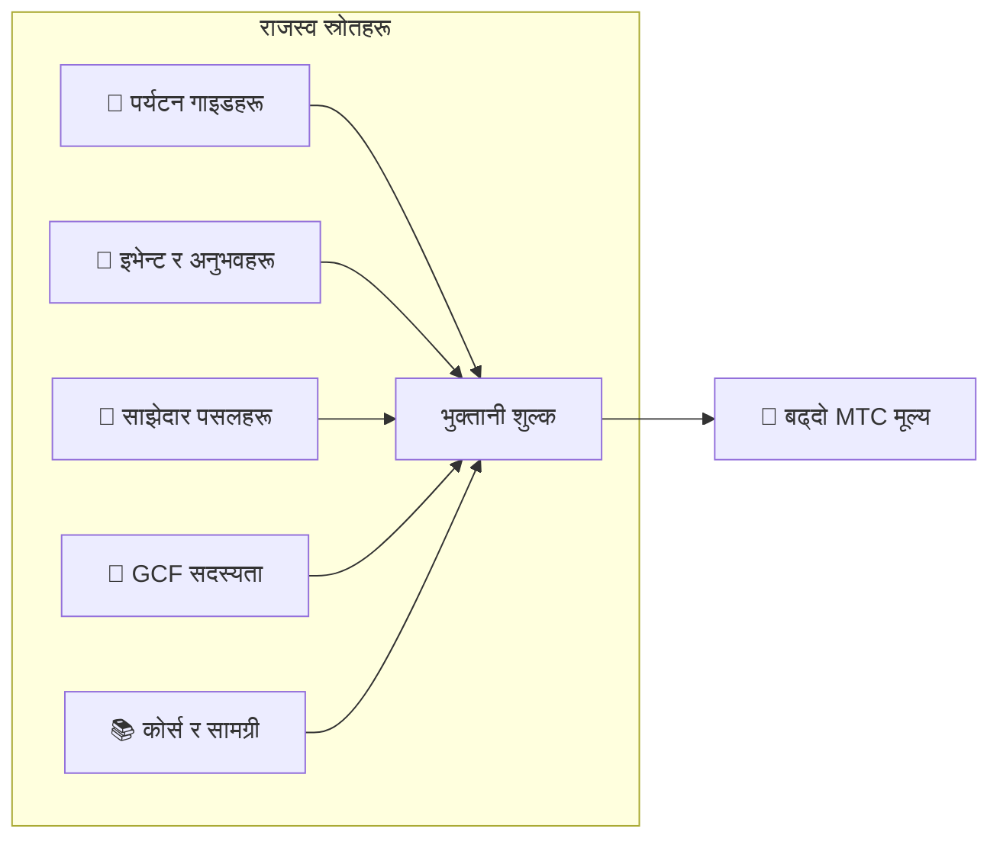

# 💰 Tokenomics — MTC को आर्थिक डिजाइन

> **विश्वास कोडमा खोदिएको छ।**
> MTC को आर्थिक डिजाइन कसैको प्रतिज्ञाद्वारा होइन, तर गणित र ब्लकचेनद्वारा ग्यारेन्टी गरिएको छ।


> **"एउटा अर्थतन्त्र जसमा यथास्थितिलाई बल प्रयोग गरेर परिवर्तन गर्न सकिँदैन" — त्यो MTC को tokenomics हो।**

Matsuri Coin (MTC) को आर्थिक डिजाइन एउटा दृढ विश्वासमा आधारित छ:
**अपरेटरले पनि छेडछाड गर्न नसक्ने नियम लगानीकर्ताको लागि सम्भावित सबैभन्दा बलियो आश्वासन हो।**

आपूर्ति स्थायी रूपमा निश्चित छ। थप जारी र कोष फ्रिज असम्भव छन्। व्यवसाय वृद्धि समीकरणको स्तरमा मूल्यमा प्रतिबिम्बित हुन्छ —
"प्रतिज्ञा" होइन, तर ब्लकचेनमा खोदिएको **तथ्य**।

यो पृष्ठले MTC का सबै आर्थिक मेकानिकहरू खुला रूपमा प्रकट गर्छ।

---

## टोकन विशिष्टीकरण

लगानीकर्ता सुरक्षा ग्यारेन्टी गर्न, हामीले Solana मा "mint authority" र "freeze authority" दुवै स्थायी रूपमा **त्यागेका** छौं।
थप जारी स्थायी रूपमा असम्भव छ। कोषलाई फ्रिज गर्न सकिँदैन। यो **पूर्ण रूपमा trustless डिजाइन** हो।

| वस्तु | विवरण |
| :--- | :--- |
| **टोकन नाम** | Matsuri Coin |
| **टिकर** | MTC |
| **चेन** | Solana |
| **Mint ठेगाना** | `DRENpzmRWM4TwECrCPCfS1k5VBPmanhQg9bcCWP8EZXF` [Solscan →](https://solscan.io/token/DRENpzmRWM4TwECrCPCfS1k5VBPmanhQg9bcCWP8EZXF) |
| **कुल आपूर्ति** | **900 मिलियन** (900,000,000 MTC), निश्चित |
| **Mint authority** | 🚫 त्यागिएको ([अन-चेन प्रमाणित गर्न योग्य](https://solscan.io/token/DRENpzmRWM4TwECrCPCfS1k5VBPmanhQg9bcCWP8EZXF)) |
| **Freeze authority** | 🚫 त्यागिएको ([अन-चेन प्रमाणित गर्न योग्य](https://solscan.io/token/DRENpzmRWM4TwECrCPCfS1k5VBPmanhQg9bcCWP8EZXF)) |
| **Lock व्यवस्थापन** | Streamflow Finance (प्रमाणित) |

:::info यो किन महत्त्वपूर्ण छ
Mint authority त्याग्नुको अर्थ "अपरेटरले थप टोकन mint गर्न र तपाईंको हिस्सालाई पातलो पार्न सक्दैन।" Freeze authority त्याग्नुको अर्थ "कसैले पनि तपाईंको वालेट फ्रिज गर्न सक्दैन।" यो trustlessness को आधारशिला हो।
:::

---

## टोकन बाँडफाँट

900M MTC निम्नानुसार बाँडफाँट गरिएको छ।

<div className="mtc-alloc">
  <div className="mtc-alloc__donut" role="img" aria-label="MTC बाँडफाँट: 61% खनन पूल, 39% इकोसिस्टम सञ्चालन">
    <div className="mtc-alloc__hole">
      <span className="mtc-alloc__total">900M</span>
      <span className="mtc-alloc__unit">MTC</span>
    </div>
  </div>
  <div className="mtc-alloc__legend">
    <div className="mtc-alloc__row mtc-alloc__row--mining">
      <span className="mtc-alloc__dot"></span>
      <span className="mtc-alloc__pct">61%</span>
      <span className="mtc-alloc__amount">⛏️ 550M MTC</span>
    </div>
    <div className="mtc-alloc__row mtc-alloc__row--ecosystem">
      <span className="mtc-alloc__dot"></span>
      <span className="mtc-alloc__pct">39%</span>
      <span className="mtc-alloc__amount">🌐 350M MTC</span>
    </div>
  </div>
</div>

| श्रेणी | हिस्सा | रकम | उद्देश्य |
| :--- | :---: | :--- | :--- |
| **⛏️ खनन पूल** | **61%** | 550 मिलियन | योगदानकर्ताहरूको लागि पुरस्कार पूल। जुन 2027 मा अनलक, दुई-वर्षीय halving चक्रमा रिलिज। योगदान स्कोर अनुसार वितरित |
| **🌐 इकोसिस्टम सञ्चालन** | **39%** | 350 मिलियन | मार्केटिङ, GCF वितरण, परिचालन खर्च, तरलता पूल (LP) कोष, विकास लागत, विज्ञापन, इभेन्ट होस्टिङ, र थप |

:::note खनन पूल कसरी रिलिज हुन्छ
550M MTC एकैचोटि रिलिज हुँदैन। यो दुई-वर्षीय halving तालिका पछ्याउँछ र **योगदान स्कोर अनुसार चरणहरूमा वितरित हुन्छ।** रिलिज र वितरण नियमहरू 2026 को अन्त्यदेखि चरणबद्ध रूपमा smart contracts को रूपमा कार्यान्वयन गरिनेछन्, र अन-चेन प्रमाणित गर्न योग्य बन्नेछन्।
:::

:::note इकोसिस्टम सञ्चालन बाँडफाँटको बारेमा
39% सञ्चालन बाँडफाँट इकोसिस्टम बढाउन आवश्यक बहु-उद्देश्य कोष हो। ठोस प्रयोगहरूमा मार्केटिङ गतिविधि, GCF सदस्यहरूलाई प्रारम्भिक वितरण, Raydium पूलमा तरलता प्रदान, विकास टोलीको लागि क्षतिपूर्ति, विज्ञापन, र संस्कृति-अनुभव इभेन्टहरू कोष समावेश छन्। प्रयोगको पारदर्शिता DAO मा सर्ने पछि समुदाय शासनको अधीनमा हुनेछ।
:::

---

## राजस्व संरचना

MTC को मूल्यलाई समर्थन गर्ने भनेको **वास्तविक व्यवसायिक गतिविधिबाट राजस्व** हो। अनुमान होइन — वास्तविक आर्थिक गतिविधिले टोकनको मूल्यलाई समर्थन गर्छ।



| राजस्व स्रोत | विवरण |
| :--- | :--- |
| **🏯 अनुभव र गाइडहरू** | टुर गाइड र संस्कृति-अनुभव इभेन्टहरूबाट भुक्तानी शुल्क |
| **🤝 GCF सदस्यता** | सदस्यता शुल्क |
| **📚 सामग्री** | कोर्स नामांकन शुल्क, मिडिया सब्सक्रिप्शन |
| **🏪 मार्केटप्लेस** | साझेदार पसलहरूबाट कारोबार शुल्क (चरणहरूमा विस्तार हुँदै) |

:::tip वास्तविक मागद्वारा समर्थित वृद्धि
जति बढी इनबाउन्ड आगन्तुकहरू आइपुग्छन्, त्यति बढी विदेशी मुद्रा बहन्छ र इकोसिस्टम त्यति ठूलो बढ्छ। MTC को मूल्य अनुमानद्वारा होइन तर **संस्कृति अनुभव गर्ने मानिसहरूको संख्या** द्वारा सेट गरिन्छ।
:::

---

## हालको व्यवसायिक ट्र्याक्शन

MTC अर्थतन्त्र अझै प्रारम्भिक छ, तर वास्तविक गतिविधि पहिले नै सुरु भइसकेको छ।

| मेट्रिक | स्थिति |
| :--- | :--- |
| **होस्ट गरिएका इभेन्टहरू** | 50+ (परीक्षण सञ्चालन) |
| **GCF Platinum सदस्यहरू** | 50 मध्ये 20 सिटहरू भरिएका |
| **GCF Gold सदस्यहरू** | भर्ती चाँडै खुल्ने |
| **वेब प्लेटफर्म** | लाइभ, हाल परीक्षण प्रयोगकर्ताहरू सङ्कलन र सेवा प्रदान गर्दै |
| **iOS एपहरू** | विकास पूरा, अप्रिल 2026 रिलिज अनुसूचित |

:::note इमानदार वक्तव्य
हामीसँग अझै "विशाल सफलता" को ट्र्याक रेकर्ड छैन। 50 इभेन्ट र परीक्षण सञ्चालन — त्यो आजको वास्तविकता हो। तर उत्पादन चलिरहेको छ, समुदाय अस्तित्वमा छ, र हामी गम्भीरतापूर्वक यहाँबाट बढाउने चरणमा छौं।
:::

---

## Buyback प्रोटोकल

हामी केवल नाफा खल्तीमा राख्दैनौं।
व्यवसाय राजस्वको निश्चित प्रतिशत **बजारबाट MTC फिर्ता खरिद गर्न** छुट्याइएको छ।

| राजस्व स्रोत | बाँडफाँट | कार्य |
| :--- | :---: | :--- |
| **Matsuri HQ राजस्व** (गाइड, इभेन्ट) | **20%** | बजारबाट **Buyback** + तरलता पूल थपहरू |
| **GCF सदस्यता** (सदस्यता शुल्क) | **25%** | बजारबाट **Buyback** |

:::info आजको buyback स्थिति
व्यवसाय राजस्व बढ्दै जाँदा buyback प्रोटोकल **सञ्चालन सुरु गर्नेछ**। सुरुमा यो अफ-चेन (म्यानुअल रूपमा) चल्छ; यो 2026 को अन्त्यदेखि smart contract द्वारा स्वचालित कार्यान्वयनमा चरणबद्ध रूपमा माइग्रेट हुन्छ। अन-चेन भएपछि, buyback को पूर्ण कार्यान्वयन इतिहास ब्लकचेनमा कसैले पनि प्रमाणित गर्न योग्य हुनेछ।
:::

Buybacks "कुनै दिन" को प्रतिज्ञा होइन। तिनीहरू प्रोटोकलको रूपमा प्रोग्राम गरिएका नियम हुन्। व्यवसाय राजस्व बढ्दा हरेक पटक, MTC स्वचालित रूपमा बजारबाट अवशोषित हुन्छ — लगानीकर्ताको लागि **संरचनात्मक आश्वासन**।

---

## मूल्य-निर्माण तर्क

MTC को माथिल्लो-मूल्य संयन्त्र आशामा होइन, तर **AMM (automated market maker) को समीकरण** मा आधारित छ।

```
मूल्य = तरलता (SOL) ÷ आपूर्ति (MTC)
```

| चरण | के हुन्छ | नतिजा |
| :---: | :--- | :--- |
| **①** | व्यवसाय राजस्व (SOL) पूलमा इन्जेक्ट गरिन्छ | **अंश बढ्छ** |
| **②** | ती कोषले बजारबाट MTC फिर्ता किन्छन् र बर्न गर्छन् | **हर घट्छ** |
| **③** | अंश ↑ × हर ↓ | **दुर्लभता बढ्ने सर्तहरू पूरा हुन्छन्** |

:::info संयन्त्रको विवरण, मूल्य ग्यारेन्टी होइन
यो समीकरणले संरचनात्मक डिजाइनको वर्णन गर्छ: यदि व्यवसाय राजस्व जारी रहन्छ र buybacks कार्यान्वयन हुन्छन् भने, आपूर्ति-माग सन्तुलन दुर्लभताको दिशामा सर्छ। वास्तविक मूल्य बजार माग, बाह्य अवस्था, तरलता, र अन्य धेरै कारकहरूमा निर्भर गर्छ।
:::

---

## Halving तालिका

जुन 1, 2027 मा अनलक हुने **550 मिलियन MTC (कुल आपूर्तिको लगभग 61%)** बजारमा फालिनेछैन। तिनीहरू **योगदानकर्ताहरूको लागि पुरस्कार पूल** को रूपमा सुरक्षित छन्।

हामीले Bitcoin को चार-वर्षीय चक्र भन्दा छिटो, **दुई-वर्षीय halving चक्र** अपनाएका छौं।
रिलिज दर हरेक दुई वर्षमा आधा हुन्छ, सिद्धान्तमा दशकौंसम्म पुरस्कारहरू बहिरहन्छन्।

| अवधि | रिलिज हिस्सा | रिलिज रकम | संचयी |
| :--- | :---: | :--- | :---: |
| **अवधि 1** 2027–2029 | **50%** | ~275M | 50% |
| **अवधि 2** 2029–2031 | **25%** | ~137M | 75% |
| **अवधि 3** 2031–2033 | **12.5%** | ~68M | 87.5% |
| **अवधि 4** 2033–2035 | **6.25%** | ~34M | 93.75% |
| **अवधि 5 बाट** | Halving जारी | घट्दो | → 100% मा asymptote |

<small>*गणितीय रूपमा यो कहिल्यै 100% पुग्दैन, र रिलिजहरू asymptotic रूपमा शून्यतर्फ पुग्छन्। Bitcoin जस्तै सिद्धान्त।*</small>

:::tip जति चाँडो योगदान गर्नुहुन्छ, तपाईंले त्यति बढी MTC प्राप्त गर्नुहुन्छ
Halving को कारणले, अवधि 1 (2027–2029) मा सबैभन्दा ठूलो रिलिज रकम छ, र प्रत्येक पछिल्ला epoch ले प्रति घटना कम रिलिज गर्छ। अर्को शब्दमा भन्दा, **जसले छिटो योगदान स्कोर निर्माण गर्छ, उसले बढी MTC प्राप्त गर्छ।**

योगदान स्कोरमा गणना हुने गतिविधिका उदाहरण:
- इभेन्ट सिर्जना र उपस्थिति ट्र्याक रेकर्ड
- लोकप्रिय गाइडेड कोर्सहरू चलाउने
- उत्कृष्ट गाइडहरूलाई रेफर र विकास गर्ने
- J-Times सामग्री हेराइ र साझेदारी
- पवित्र-स्थल तीर्थयात्रा चेक-इनहरू

पुरस्कारहरू "सामेल हुने क्रम" द्वारा होइन तर **"योगदानको मात्रा र गुणस्तर"** द्वारा निर्धारण हुन्छन्।
:::

---

:::note अर्को पृष्ठ
अब तपाईंले MTC को आर्थिक डिजाइन बुझ्नुभयो, **साझेदारको रूपमा कसरी सामेल हुने** हेरौं।
**[GCF सदस्यता →](/docs/gcf)**
:::
