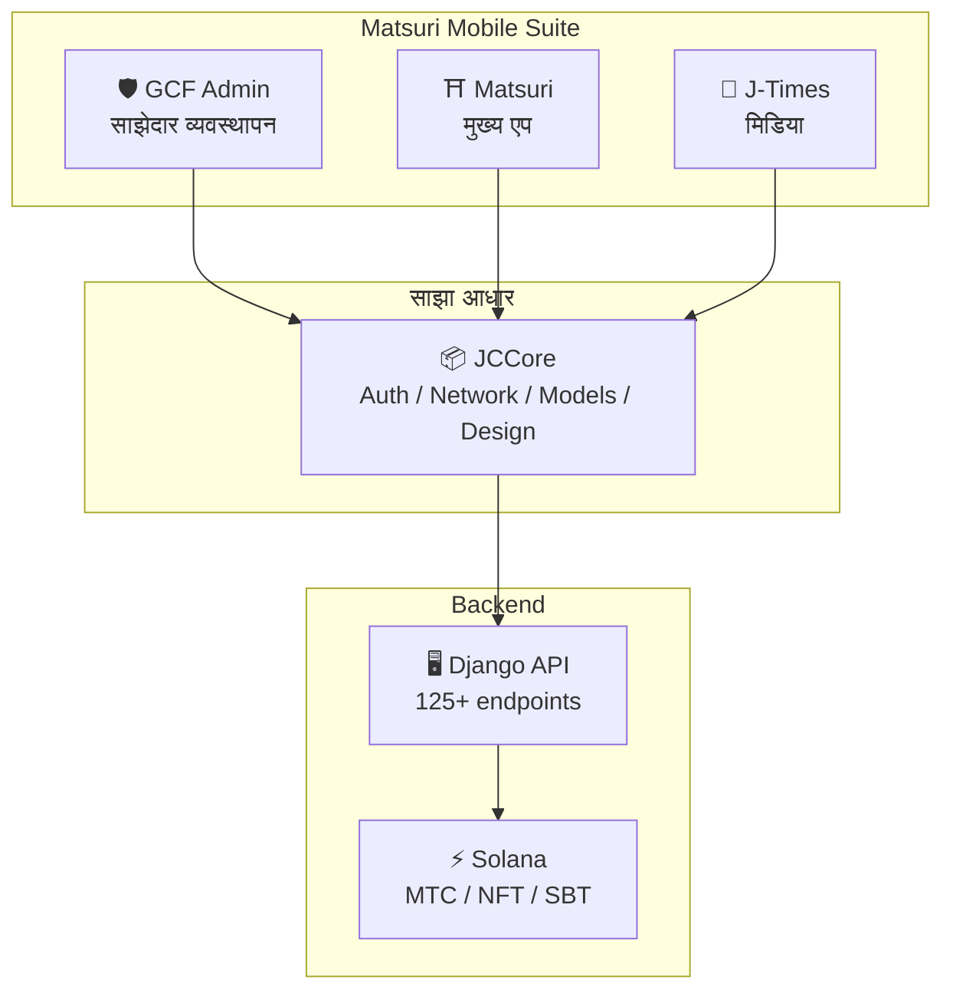
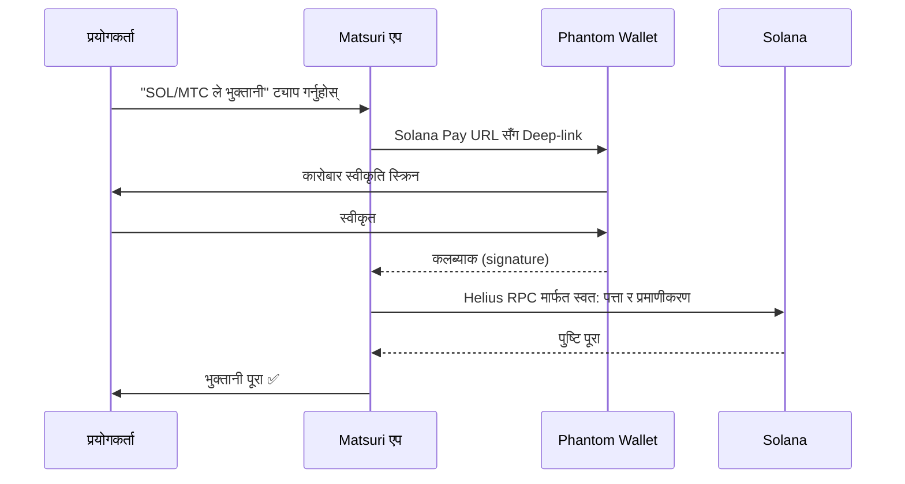
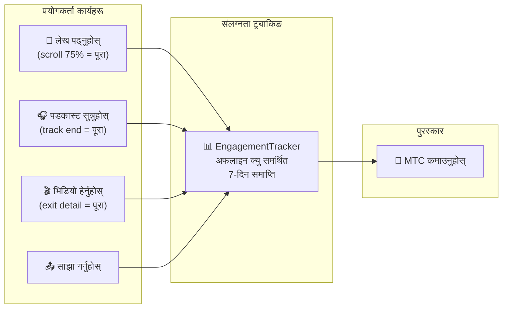
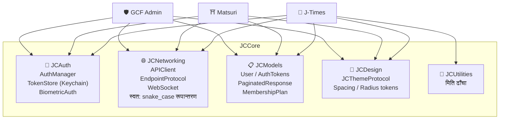
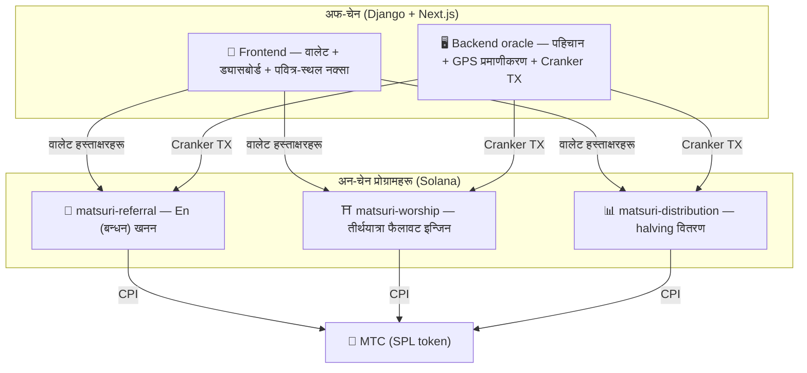
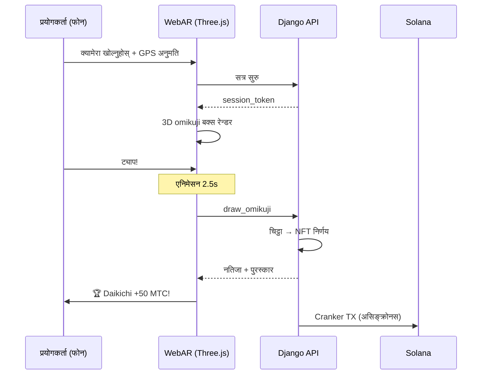

import useBaseUrl from '@docusaurus/useBaseUrl';

# 🔧 उत्पादन र प्रविधि — चलिरहेको कुराले सबै कुरा प्रमाणित गर्छ

> **चलिरहेको कुराले सबै कुरा प्रमाणित गर्छ।**
> हाम्रो मिसन शब्द मात्र होइन। वेब प्लेटफर्म पहिले नै लाइभ छ, र iOS एपहरू अन्तिम चरणमा छन्।

वेब एप र एड्मिन ड्यासबोर्ड **उत्पादनमा** छन्। तीन देशी iOS एपहरू पूरा भइसकेका छन् र अप्रिल–मे 2026 (Matsuri मेको सुरुमा) मा रिलिज भइरहेका छन्। Solana मा smart contracts खुला स्रोत हुन् — हामी अवधारणामा होइन, **चलिरहेको कोड र अवतरण हुन लागेको उत्पादन** मा कुरा गर्छौं।

---

## एप अवलोकन

| एप | उद्देश्य | स्थिति | समर्थित भाषाहरू |
| :--- | :--- | :---: | :--- |
| **GCF Admin** | साझेदार व्यवस्थापन र परिचालन उपकरण | ✅ रिलिज | 🇯🇵🇬🇧🇨🇳🇹🇭🇳🇴 |
| **Matsuri** | मुख्य उपभोक्ता एप | ✅ रिलिज | 🇯🇵🇬🇧🇨🇳🇹🇭🇳🇴 |
| **J-Times** | संस्कृति मिडिया र सिकाइ | ✅ रिलिज | 🇯🇵🇬🇧 |

---

## 1. 🛡️ GCF Admin — साझेदार व्यवस्थापन एप

:::info स्थिति: App Store मा रिलिज गरिएको (v1.0)
GCF (Global Community Friends) सदस्यहरूको लागि परिचालन व्यवस्थापन एप। वेब एड्मिन स्क्रिनको सम्पूर्ण कार्यक्षमता, मोबाइलमा एकीकृत।
:::

  

  
  
  

### एपले के गर्न सक्छ

| श्रेणी | सुविधाहरू |
| :--- | :--- |
| **📊 ड्यासबोर्ड** | KPI कार्डहरू, राजस्व चार्टहरू, द्रुत कार्यहरू |
| **👥 सदस्य व्यवस्थापन** | सूची, विवरण, सम्पादन, स्तर व्यवस्थापन |
| **💰 राजस्व व्यवस्थापन** | कमिशन ट्र्याकिङ, MTC निकासी व्यवस्थापन, भुक्तानी व्यवस्थापन |
| **📝 सामग्री व्यवस्थापन** | इभेन्ट, लेख, पडकास्ट, र भिडियो सिर्जना, सम्पादन, र प्रकाशन |
| **🎫 गाइड स्लटहरू** | गाइड स्लटहरू व्यवस्थापन गर्नुहोस् र राजस्व ट्र्याक गर्नुहोस् |
| **🖼️ NFT ड्यासबोर्ड** | Founder's Collection, अन-चेन प्रमाणीकरण, NFT स्थानान्तरण |
| **⛩️ पवित्र-स्थल व्यवस्थापन** | साइट CRUD, बिकन कन्फिगरेसन |
| **🎲 AR खनन कन्फिगरेसन** | Omikuji सम्भावना तालिकाहरू, पुरस्कार प्यारामिटर व्यवस्थापन |
| **📊 विश्लेषण** | त्रुटि रिपोर्टहरू, उपयोग विश्लेषण |
| **🔗 रेफरलहरू** | अनुकूल QR कोड उत्पादन, रेफरल कार्यक्रम व्यवस्थापन |

### प्राविधिक विशिष्टीकरण

| वस्तु | विवरण |
| :--- | :--- |
| **वास्तुकला** | Clean Architecture + MVVM + `@Observable` (iOS 17) |
| **भाषा / SDK** | Swift 6.0 / Xcode 16+ / iOS 17.0+ |
| **API एकीकरण** | 125+ endpoints |
| **Tests** | 226 tests / 45 test classes |
| **स्थानीयकरण** | 5 भाषा (JP/EN/CN/TH/NO) / 957+ अनुवाद कुञ्जीहरू |
| **Swift Concurrency** | Strict Concurrency अनुपालन / शून्य निर्माण चेतावनी |

### QR कोड एकीकरण

GCF Admin ले Matsuri-ब्रान्डेड अनुकूल QR कोडहरू उत्पन्न गर्न सक्छ। बहुमुखी उपयोग केसहरू — इभेन्ट निमन्त्रणा, रेफरल लिङ्कहरू, भुक्तानी अनुरोधहरू, र थप।

---

## 2. ⛩️ Matsuri — मुख्य एप

:::info स्थिति: App Store मा रिलिज गरिएको (v3.0)
सामान्य प्रयोगकर्ताहरूको लागि मुख्य एप। इभेन्ट बुकिङ, भुक्तानी, Web3 वालेट, AR खनन — सबै एउटै एपमा पूरा हुन्छ। **अब App Store मा लाइभ।**
:::

  

  
  
  

### एपले के गर्न सक्छ

| श्रेणी | सुविधाहरू |
| :--- | :--- |
| **🎪 इभेन्ट बुकिङ** | खोज, बुकिङ, Stripe भुक्तानी, टिकट QR व्यवस्थापन |
| **💳 चार भुक्तानी विधिहरू** | क्रेडिट कार्ड / सुरक्षित कार्ड / MTC ब्यालेन्स / क्रिप्टो (SOL/MTC) |
| **👛 Web3 वालेट** | MTC ब्यालेन्स दृश्य, पठाउने/प्राप्त गर्ने, कारोबार इतिहास |
| **🖼️ NFT ग्यालेरी** | होल्ड गरिएका NFT/SBT को सूची, अन-चेन प्रमाणीकरण |
| **🗺️ पवित्र-स्थल नक्सा** | मन्दिर र चैत्यहरूको नक्सा दृश्य, चेक-इन |
| **🎲 AR खनन** | WebAR omikuji अनुभव, MTC कमाउनुहोस् |
| **💬 च्याट** | सन्दर्भ मेनुसहित मेसेजिङ |
| **⭐ Wishlist** | मनपर्ने इभेन्ट र अनुभवहरू सुरक्षित गर्नुहोस् |
| **🔍 उन्नत खोज** | आवाज खोज समर्थित |
| **🤝 रेफरल** | रेफरल कार्यक्रममा सामेल हुनुहोस्, पुरस्कारहरू ट्र्याक गर्नुहोस् |
| **📊 GCF ड्यासबोर्ड** | GCF सदस्यहरूको लागि हल्का एड्मिन दृश्य |

### Phantom Wallet एकीकरण — शून्य-इनपुट क्रिप्टो भुक्तानी

>**ठेगानाको copy-paste आवश्यक छैन।** Phantom Wallet स्वचालित रूपमा सुरु हुन्छ र भुक्तानी एकल स्वीकृतिसँग पूरा हुन्छ। कारोबार signature Helius RPC मार्फत स्वचालित रूपमा पत्ता लागेको हुन्छ।

### प्राविधिक विशिष्टीकरण

| वस्तु | विवरण |
| :--- | :--- |
| **वास्तुकला** | Clean Architecture + MVVM + Swift Concurrency |
| **भाषा / SDK** | Swift 6.0 / Xcode 16+ / iOS 17.0+ |
| **भुक्तानी** | Stripe PaymentSheet + MTC Balance + Phantom (Solana Pay) |
| **API एकीकरण** | 72 endpoints / 16 श्रेणीहरू |
| **Tests** | 230+ (Model, ViewModel, Network, Security, DeepLink, E2E) |
| **स्थानीयकरण** | 5 भाषा (JP/EN/CN/TH/NO) / 406 अनुवाद कुञ्जीहरू |
| **ViewModels** | 25 (पूर्ण रूपमा MVVM — Views बाट शून्य प्रत्यक्ष API कलहरू) |
| **प्रमाणीकरण** | Apple Sign In / Google Sign In (PKCE) |

---

## 3. 📰 J-Times — संस्कृति मिडिया एप

:::info स्थिति: रिलिज — App Store मा लाइभ
जापानी संस्कृतिको गहिराइ बुझाउने मिडिया प्लेटफर्म। लेख पढ्नुहोस्, पडकास्ट सुन्नुहोस्, भिडियो हेर्नुहोस् — हरेक कार्यले MTC कमाउँछ।
:::

  

  
  

### एपले के गर्न सक्छ

| श्रेणी | सुविधाहरू |
| :--- | :--- |
| **📖 लेखहरू** | Parallax hero, drop caps, पढ्ने प्रगति बार, समृद्ध सामग्री (Markdown, तालिका, उद्धरण) |
| **🎧 पडकास्टहरू** | शृङ्खला ब्राउजिङ, वेभफर्म प्लेयर, sleep timer, AirPlay, lock-screen नियन्त्रण |
| **🎬 भिडियो** | अनुकूली ग्रिड/सूची दृश्य, छोटो-फर्म भिडियो (TikTok-शैली, double-tap) |
| **🔍 खोज** | बहु-फिल्टर, ट्रेन्डिङ ट्यागहरू, आवाज खोज |
| **🧭 Discovery** | फिचर carousel, staff picks, weekly top |
| **📚 लाइब्रेरी** | मनपर्ने, इतिहास (मितिद्वारा), डाउनलोड, प्लेलिस्टहरू |
| **🎵 अडियो प्लेयर** | मिनी प्लेयर (swipe-नियन्त्रित), पूर्ण प्लेयर (वेभफर्म, गीतात्मक, दोहोर्याउने) |
| **👤 सदस्यता** | 3 स्तर भर सुविधा तुलना (Free / Premium / Pro), खरिद पुनर्स्थापना |

### Media Mining — पढ्ने, सुन्ने, र हेर्ने खननको रूपमा

>**अफलाइनमा पनि रेकर्ड गरिएको।** सिग्नल नभएको पहाडी मन्दिरमा लेख पढ्नुहोस् — नेटवर्क फर्किएपछि, संलग्नता स्वत: सबमिट हुन्छ र MTC क्रेडिट हुन्छ।

### डिजाइन प्रणाली — जापानी सौन्दर्यशास्त्रको "चार स्तम्भ"

J-Times ले परम्परागत जापानी सौन्दर्यशास्त्रलाई आधुनिक UI मा ल्याउने मौलिक डिजाइन प्रणाली प्रयोग गर्छ।

| स्तम्भ | अवधारणा | UI आवेदन |
| :--- | :--- | :--- |
| **墨 (sumi — मसी)** | न्यानो तटस्थ खैरो | पृष्ठभूमि, पाठ श्रेणीक्रम |
| **朱 (shu — सिन्दूरी)** | जापानी रातो (#C53030) | अक्सेन्ट रङ, महत्त्वपूर्ण कार्यहरू |
| **間 (ma — खाली ठाउँ)** | 4pt ग्रिडमा नकारात्मक खाली ठाउँ | spacing, सास फेर्ने ठाउँ |
| **紙 (kami — कागज)** | सूक्ष्म बनावट, glassmorphism | कार्ड सतह, गहिराइ |

### प्राविधिक विशिष्टीकरण

| वस्तु | विवरण |
| :--- | :--- |
| **वास्तुकला** | Clean Architecture + MVVM + Swift Concurrency |
| **भाषा / SDK** | Swift 6.0 / Xcode 16+ / iOS 17.0+ |
| **बाह्य निर्भरताहरू** | **शून्य** — केवल Apple first-party frameworks |
| **API एकीकरण** | 40+ endpoints |
| **Tests** | 371 tests / 20 files |
| **स्थानीयकरण** | 2 भाषा (JP/EN) / 310+ अनुवाद कुञ्जीहरू |
| **अफलाइन समर्थन** | ContentCache (50MB) + ImageDiskCache (200MB) + डाउनलोड व्यवस्थापक |
| **प्रमाणीकरण** | Apple Sign In / Google Sign In (PKCE) |

---

## साझा आधार: JCCore पुस्तकालय

तीनै एपहरूमा साझा गरिएको Swift Package पुस्तकालय।

| मोड्युल | भूमिका |
| :--- | :--- |
| **JCAuth** | Keychain-आधारित टोकन व्यवस्थापन, biometric auth (Face ID / Touch ID) |
| **JCNetworking** | टाइप-सुरक्षित API client, WebSocket, स्वचालित JSON snake_case रूपान्तरण |
| **JCModels** | एपहरू भर साझा डेटा मोडेलहरू (User, AuthTokens, आदि) |
| **JCDesign** | Theme protocol, design tokens (spacing, corner radius) |
| **JCUtilities** | मिति र स्ट्रिङ उपयोगिताहरू |

---

## सुरक्षा र गोपनीयता

| वस्तु | कार्यान्वयन |
| :--- | :--- |
| **Auth tokens** | iOS Keychain (TokenStore) मा गुप्त र भण्डारण गरिएको |
| **Biometric auth** | Face ID / Touch ID मार्फत दुई-कारक |
| **API सञ्चार** | HTTPS + certificate pinning |
| **वालेट निजी कुञ्जी** | एप-भित्र कहिल्यै भण्डारण नगरिएको — Phantom Wallet लाई प्रत्यायोजित |
| **AR खनन** | क्यामेरा छविहरू सर्भरमा पठाइँदैन (VisionProof) |
| **अफलाइन डेटा** | SwiftData गुप्तीकरण + स्वचालित समाप्ति |
| **Swift Concurrency** | Actor isolation race conditions लाई रोक्छ |

---

## विकास गुणस्तर

### मोबाइल एपहरू: तीन एपमा **827+ स्वचालित परीक्षणहरू**।

| एप | Tests | कभरेज क्षेत्र |
| :--- | :---: | :--- |
| **GCF Admin** | 226 | Model, ViewModel, Repository, API, स्थानीयकरण, नेभिगेसन |
| **Matsuri** | 230+ | Model, ViewModel, Network, Security, DeepLink, Regression, Performance, E2E |
| **J-Times** | 371 | Model, ViewModel, API, Repository, नेभिगेसन, स्थानीयकरण, Security, Performance |

### Smart contracts: चरणहरूमा विस्तार गर्दै परीक्षणहरू

Solana मा Rust प्रोग्रामहरूको लागि, हामीले मूल तर्क (math मोड्युलहरू) को लागि unit tests सँग सुरु गरेका छौं, र सुरक्षा अडिट (Q2–Q3 2026) को तयारीमा परीक्षण कभरेज चरणहरूमा विस्तार गरिरहेका छौं।

---

## Smart contracts — खुला-स्रोत डिजाइन

>**Trustless डिजाइन दर्शन।**
> पुरस्कार गणना, रेफरल रूखहरू, halving तालिका — हरेक टुक्रा तर्क **अन-चेन** चल्छ र कसैले पनि अडिट गर्न योग्य।
> स्रोत: [GitHub](https://github.com/Cootakahashi/matsuri-contracts)

---

### योगदानकर्ताहरू

| सदस्य | भूमिका |
| :--- | :--- |
| **Ko Takahashi** | संस्थापक / Lead Developer — वास्तुकला, smart contracts, full-stack विकास |

> 🌏**अघि बढ्दा, GCF सदस्यहरू र विश्वव्यापी विकासकर्ता समुदायले पनि सह-विकास प्रयासमा सामेल हुनेछन्।**
> टिक्न निर्मित "संस्कृति पूर्वाधार" को रूपमा, Matsuri Protocol पारदर्शिता र साझा स्वामित्वमा निर्मित छ।

---

### समग्र संरचना

Matsuri ले Solana मा **तीन Anchor (Rust) प्रोग्रामहरू** तैनाथ गर्छ, प्रत्येकले इकोसिस्टमको स्तम्भहरू मध्ये एक बोक्छ।

---

### 1. 📣 En-Mining (縁 — बन्धन / जडान)

**उद्देश्य:** एक हाइब्रिड वृद्धि इन्जिन जसले "चौडाइ" (रेफरल नेटवर्क) र "गहिराइ" (आर्थिक प्रभाव) दुवैलाई पुरस्कृत गर्छ। साधारण affiliate मार्केटिङ होइन, तर पूर्ण खनन प्रोटोकल जहाँ वास्तविक-संसार आर्थिक गतिविधिले अन-चेन मूल्य उत्पन्न गर्छ।

#### स्कोरिङ डिजाइन

योगदान स्कोर दुई भारित कम्पोनेन्टहरूमा आधारित छ:

| कम्पोनेन्ट | भार | उद्देश्य |
| :--- | :---: | :--- |
| **चौडाइ** (रेफरलको संख्या) | 30% | नेटवर्क पहुँच — तपाईंले ल्याएको मानिसहरूको संख्या |
| **गहिराइ** (भुक्तानी मात्रा) | 70% | आर्थिक प्रभाव — वास्तविक खरिद, साइन-अप मात्रै होइन |

स्कोरहरू समयसँगै जम्मा हुन्छन् र प्रत्येक halving epoch मा MTC मा परिणत हुन्छन्। थप बूस्ट संयन्त्रहरू योजना गरिएको छ:

| बूस्ट | विवरण | स्थिति |
| :--- | :--- | :---: |
| **Toku (徳 — सद्गुण) staking** | योगदान स्कोर बूस्ट गर्न MTC लक गर्नुहोस् (~50% सम्म बूस्ट)। स्तर र सटीक मल्टिप्लायर्स halving पूल रिलिज तालिका विरुद्ध कैलिब्रेट गरिन्छन् | ⬜ Coefficients TBD |
| **सिजन रैङ्किङ** | प्रत्येक epoch का शीर्ष प्रदर्शनकर्ताहरूले **Evangelist** उपाधि (स्थायी SBT) र स्कोर बूस्ट कमाउँछन्। सटीक दर शासनद्वारा निर्धारण | ⬜ Coefficients TBD |

:::info प्रगतिशील प्यारामिटर डिजाइन
बूस्ट गुणहरू (staking स्तरहरू, रैङ्किङ बोनसहरू) जानाजानी समायोज्य छन्। तिनीहरू वास्तविक इकोसिस्टम डेटा — कुल सक्रिय प्रयोगकर्ताहरू, halving पूल रिलिज दर, मूल्य स्थिरता लक्ष्यहरूको आधारमा अन्तिम रूप दिइनेछन् र smart contracts मा लक गरिनेछन्। यो दृष्टिकोणले निश्चित प्रतिफलहरूको अति-प्रतिज्ञा बिना **निष्पक्ष वितरण** ग्यारेन्टी गर्छ।
:::

#### Anti-sybil रक्षा (तीन तह)

| तह | संयन्त्र | स्थान |
| :--- | :--- | :--- |
| **पहिचान गेट** | X/Twitter OAuth + SMS | अफ-चेन (Django) |
| **अन-चेन गेट** | केवल `is_verified = true` भएका प्रोफाइलहरूले पुरस्कार कमाउँछन् | Smart contract |
| **गहिराइ भार** | 70% स्कोर = वास्तविक भुक्तानी → बटहरूले केही कमाउँदैनन् | स्कोरिङ इन्जिन |

---

### 2. ⛩️ तीर्थयात्रा फैलावट इन्जिन (Worship Routing Engine)

**उद्देश्य:** टोकन अर्थशास्त्र प्रयोग गरेर overtourism समाधान गर्ने विश्वको पहिलो **ReFi प्रोटोकल**। MTC कमाउन पवित्र स्थलहरू भ्रमण गर्नुहोस्। महत्त्वपूर्ण ट्विस्ट: *एक स्थलमा आगन्तुकहरू जति कम, तपाईंले त्यति घातीय रूपमा बढी पुरस्कार पाउनुहुन्छ।*

:::tip मूल अन्तरदृष्टि
"उल्टो Uber surge pricing" — भीडभाडयुक्त स्थानहरूलाई जरिवाना गरिन्छ, frontier स्थलहरूलाई बूस्ट गरिन्छ। पर्यटकहरू स्वेच्छाले कम-भ्रमण गरिएका ठाउँहरूतर्फ सर्छन् **किनकि तिनीहरू बढी लाभदायक छन्।**
:::

#### पुरस्कार डिजाइन सिद्धान्तहरू

प्रत्येक भ्रमणको लागि योगदान स्कोर बहु कारकहरूद्वारा निर्धारण गरिन्छ:

| कारक | सिद्धान्त | प्रभाव |
| :--- | :--- | :--- |
| **साइटको लोकप्रियता** | कम आगन्तुक = उच्च स्कोर | भीडभाडयुक्त क्षेत्रहरूबाट पर्यटकहरू फैलाउने |
| **भ्रमणको समय** | दिएको दिनमा अघिल्लो आगन्तुकहरूले बढी कमाउँछन् | अफ-पीक भ्रमणहरूलाई प्रोत्साहन |
| **क्षेत्रीय स्तर** | क्षेत्रीय र frontier साइटहरू सबैभन्दा उच्च रैङ्क | क्षेत्रीय पुनरुत्थान चलाउने |
| **भ्रमण आवृत्ति** | नियमित आगन्तुकहरूले बोनस स्कोर जम्मा गर्छन् | निरन्तर संलग्नता पुरस्कृत |
| **Omikuji भाग्य** | प्रति चेक-इन अनियमित बोनस ड्र | रमाइलो gamification तत्व |
| **प्रायोजित बूस्ट** | नगरपालिकाहरूले विशेष साइटहरू बूस्ट गर्न सक्छन् | B2B/B2G राजस्व मोडेल |

:::info गुणहरू समायोज्य छन्
प्रत्येक कारकको लागि सटीक मल्टिप्लायर्स (उदाहरणका लागि, क्षेत्रीय साइटले प्रमुख साइटको तुलनामा कति बढी कमाउँछ) **halving पूल तालिका** र वास्तविक उपयोग डेटाको आधारमा ट्यून गरिन्छ, र चरणहरूमा smart contracts मा लक गरिन्छ। डिजाइन सिद्धान्त निश्चित छन् — गुणहरू इकोसिस्टमसँग विकसित हुन्छन्।
:::

---

### 3. 📊 Halving वितरण

**उद्देश्य:** Bitcoin को halving तालिकाबाट प्रेरित, MTC वितरण प्रति epoch स्वचालित रूपमा halve हुन्छ। गणितीय रूपमा ग्यारेन्टी गरिएको दुर्लभता।

| Instruction | विवरण |
| :--- | :--- |
| `initialize` | वितरण पूल आरम्भ गर्नुहोस् |
| `register_miner` | खनिकर्ता दर्ता गर्नुहोस् |
| `update_score` | स्कोर अद्यावधिक गर्नुहोस् |
| `advance_epoch` | epoch अघि बढाउनुहोस् (halving कार्यान्वयन) |
| `claim_distribution` | वितरण पुरस्कार दाबी गर्नुहोस् |

---

### 4. 🎴 AR खनन — WebAR omikuji अनुभव

**उद्देश्य:** केवल फोन ब्राउजर प्रयोग गरेर वास्तविक ठाउँमा AR omikuji देखा पार्ने, र यसमार्फत MTC खन्ने। **एप डाउनलोड आवश्यक छैन।** विश्वको पहिलो WebAR × ब्लकचेन पूर्वाधार, Shintō आध्यात्मिकतालाई अत्याधुनिक प्रविधिसँग मिलाउने।

#### वास्तुकला

#### Omikuji सम्भावना कन्फिगरेसन (GCF एड्मिन)

Basis Points (10000 = 100%) 0.01% सटीकतासँग। GCF एड्मिन स्क्रिनबाट समायोज्य।

| ग्रेड | दुर्लभता | बोनस | NFT |
|------|-----------|---------|-----|
| 🏆 Daikichi | दुर्लभ | अधिकतम बोनस | ✅ |
| ✨ Kichi | असामान्य | उच्च बोनस | ऐच्छिक |
| 🌸 Shōkichi | सामान्य | सानो बोनस | — |
| 🍃 Suekichi | सामान्य | सहभागिता रेकर्ड | — |
| 💀 Kyō | असामान्य | सहभागिता रेकर्ड | — |

सम्भावनाहरू र पुरस्कार गुणहरू इकोसिस्टम आकार र halving रिलिज रकमको आधारमा चरणहरूमा अन्तिम रूप दिइनेछन्, र smart contracts मा कार्यान्वयन गरिनेछन्।

#### ZK-Proof of Vision (5-तह सुरक्षा)

GPS spoofing र replay हमलाहरूलाई बहु तहहरूमा हटाउँछ। **गोपनीयता संरक्षण गर्न, क्यामेरा छविहरू कहिल्यै सर्भरमा पठाइँदैन।**

| तह | के प्रमाणित गरिन्छ | भार |
| :--- | :--- | :--- |
| Temporal | सत्र समय 5–120s | /20 |
| Motion | Gyro स्वाभाविकता (हात-समातेको कम्पन पत्ता लगाउने) | /20 |
| Light | परिवेशी प्रकाश × दिनको समय स्थिरता | /20 |
| HMAC | proof_hash signature प्रमाणीकरण | /20 |
| Fingerprint | उपकरण विशिष्टता | /20 |
| **कुल** | **60/100 वा माथि = PASS** | |

#### पुरस्कार डिजाइन

पुरस्कारहरू स्थल प्रकार, omikuji नतिजा, र क्षेत्रीय स्तर सहित बहु कारकहरूको आधारमा **योगदान स्कोर** को रूपमा रेकर्ड गरिन्छ। विशिष्ट गुणहरू halving रिलिज तालिका र इकोसिस्टम वृद्धिसँग संरेखित चरणहरूमा अन्तिम रूप दिइन्छ, र smart contracts मा कार्यान्वयन गरिन्छ।

---

### शुद्ध math मोड्युलहरू (अडिट योग्य मूल तर्क)

प्रत्येक प्रोग्रामले स्कोरिङ र पुरस्कार गणनालाई **शुद्ध, अडिट योग्य `math.rs` मोड्युलमा** अलग गर्छ:

- **शून्य साइड इफेक्ट** — कुनै I/O छैन, कुनै मेमोरी आवंटन छैन, कुनै बाह्य कलहरू छैनन्
- **दस्तावेजीकरण गरिएका सूत्रहरू** — rustdoc भित्र LaTeX-शैली नोटेसन
- **Overflow विश्लेषण** — प्रमाणित दायरा भएका u128 बीचसम्म
- **व्यापक परीक्षण** — किनार केसहरू, सीमा सर्तहरू, अनुपात प्रमाणीकरण
- **समायोज्य गुणहरू** — पुरस्कार प्यारामिटरहरू शासनमार्फत अद्यावधिक हुन योग्य गरी डिजाइन गरिएका छन्, इकोसिस्टम बढ्दा चरणबद्ध कैलिब्रेसनलाई अनुमति दिँदै

---

### सुरक्षा मोडेल

यी कन्ट्र्याक्टहरू **पूर्ण रूपमा खुला स्रोत** छन्। सुरक्षा अपारदर्शितामा होइन, गणितीय ग्यारेन्टीहरूमा आधारित छ।

| सिद्धान्त | कार्यान्वयन |
| :--- | :--- |
| **केवल PDA भल्टहरू** | टोकन भल्टहरू PDAs (program-derived addresses) द्वारा नियन्त्रित हुन्छन् — कुनै मानव कुञ्जीले निकाल्न सक्दैन |
| **जाँचिएको अंकगणित** | सबै गणनाहरू `checked_*` अंकगणित प्रयोग गर्छन् — overflow असम्भव छ |
| **अधिकारको पृथकीकरण** | एड्मिन (multisig) ≠ Cranker (सीमित कार्यहरू) ≠ प्रयोगकर्ता (आत्म-हिरासत) |
| **आपतकालीन pause** | एड्मिनले प्रोग्राम केवल सुरक्षा खतराको प्रतिक्रियामा pause गर्न सक्छ। तर **कोषको कुनै आन्दोलन वा जफत सम्भव छैन** — pause "रक्षा गर्ने ढाल" हो, नियम परिवर्तन गर्ने तरिका होइन |
| **अपरिवर्तनीय tokenomics** | Halving दर, कुल पूल, र epoch लम्बाइ प्रारम्भिक कन्फिगरेसन पछि परिवर्तन गर्न सकिँदैन |
| **शुद्ध math मोड्युलहरू** | पुरस्कार/स्कोरिङ तर्क छुट्टै, परीक्षण योग्य math पुस्तकालयमा बस्छ |
| **Vision Proof** | 5-तह spoof पत्ता लगाउने जसले कहिल्यै क्यामेरा डेटा प्रसारण गर्दैन (गोपनीयता-संरक्षण) |

---

**[▶ अर्को: रोडम्याप र टोली](/docs/roadmap)** | **[◀ अघिल्लो: Tokenomics](/docs/tokenomics)**
