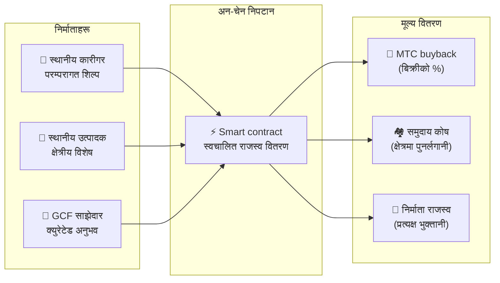

import useBaseUrl from '@docusaurus/useBaseUrl';

# 🗓️ रोडम्याप र टोली

>**यहाँसम्म पढ्नुभएकाहरूका लागि — दृष्टि, आर्थिक डिजाइन, र प्राविधिक आधार सबै ठाउँमा छन्।**
> हामी छोटो-अवधिको अनुमानात्मक परियोजना होइनौं।
>**मुख्य प्लेटफर्म विकास पहिले नै पूरा भएको छ,** र हामी यसलाई बढाउने चरणमा प्रवेश गरिरहेका छौं।

---

## रणनीतिक माइलस्टोनहरू

### 🔥 चरण 1: जागरण (2026 को पहिलो आधा — अहिले)

**विषय: आधार र नगद प्रवाह**

वेब प्लेटफर्म लाइभ छ, र अप्रिल 2026 देखि सबै तीन iOS एपहरू (GCF Admin, J-Times, Matsuri) अब App Store मा लाइभ छन्। हामी CEO-नेतृत्वको वित्तीय प्रणालीमार्फत मुद्रीकरण र प्रारम्भिक तरलता सुरक्षित गर्नमा फोकस गर्छौं।

| स्थिति | माइलस्टोन | विवरण |
| :---: | :--- | :--- |
| ✅ | **वेब प्लेटफर्म लाइभ** | Matsuri वेब एप र GCF एड्मिन ड्यासबोर्ड (वेब) चलिरहेको |
| ✅ | **भुक्तानी र वृद्धि** | MTC भुक्तानी कार्य र रेफरल airdrop कार्य कार्यान्वयन |
| ✅ | **मिडिया लन्च** | J-Times (वेब र पडकास्ट) वितरण आधार निर्मित |
| ✅ | **Genesis** | Solana चेनमा MTC टोकन जारी |
| ✅ | **तरलता सुरक्षित** | Raydium मा प्रारम्भिक तरलता पूल सिर्जित |
| ⬜ | **प्रोत्साहनहरू सुरु** | 20% लक्ष्य APY सँग तरलता खननको लन्च |
| ⬜ | **अन-चेन भुक्तानी** | Solana Pay प्रमाणीकरण उत्पादनमा जान्छ |
| ⬜ | **VIP भर्ती** | प्रारम्भिक 20 GCF VIP सदस्यहरूको चयन पूरा |

### 🚀 चरण 2: विस्तार (2026 को दोस्रो आधा)

**विषय: वास्तविक सम्पत्ति र साहसिक खनन**

हामी पूरा भएको webapp लाई पूरा रूपमा लाभ उठाउँछौं, भौतिक आधार र "तीर्थयात्रा" सुविधा विस्तार गर्छौं।

| स्थिति | माइलस्टोन | विवरण |
| :---: | :--- | :--- |
| ⬜ | **नयाँ सुविधा रिलिज** | साहसिक खनन (तीर्थयात्रा) कार्यान्वयन र रिलिज |
| ⬜ | **विदेशी विस्तार** | एसियामा साझेदार आधार विकास (थाइल्यान्ड, ताइवान, आदि) र VIP इभेन्टहरू |
| ⬜ | **सम्पत्ति व्यवस्थापन** | घरजग्गा, इक्विटी, र क्रिप्टोको पोर्टफोलियो निर्माण |
| ⬜ | **लक्ष्य** | इकोसिस्टम-व्यापी सम्पत्ति स्केल **¥1 बिलियन (~6.5M $)** |

### 🌊 चरण 3: परिक्रमण (2027 बाट)

**विषय: व्यापक स्वीकृति, सह-सिर्जना अर्थतन्त्र, विकेन्द्रीकरण**

जनतालाई खुला, अन-चेन मार्केटप्लेस, र पूर्ण इकोसिस्टम सञ्चालन।

| स्थिति | माइलस्टोन | विवरण |
| :---: | :--- | :--- |
| ⬜ | **Grand opening** | Matsuri एप विश्वव्यापी आधिकारिक रिलिज |
| ⬜ | **Great unlock (2027/6/1)** | संस्थापक lockup unlock + खनन पूल (550M) सक्रिय + halving चक्र सुरु |
| ⬜ | **सह-सिर्जना मार्केटप्लेस** | क्षेत्रीय विशेष पसलहरू + GCF साझेदार पसलहरू — स्वचालित MTC buyback सँग अन-चेन भुक्तानी |
| ⬜ | **क्राउडफन्डिङ (NFT अधिकार)** | प्रयोगकर्ताहरूले Solana मा सांस्कृतिक परियोजनाहरू कोष गर्छन्। Backers ले स्वामित्व, राजस्व साझेदारी, र शासन अधिकारहरू प्रतिनिधित्व गर्ने NFTs प्राप्त गर्छन् |
| ⬜ | **अन-चेन भुक्तानी** | सबै मार्केटप्लेस कारोबार smart contract द्वारा निपटारा — बिक्रीको निश्चित प्रतिशत स्वत: MTC buyback पूलमा रूट गरिन्छ |
| ⬜ | **लक्ष्य** | इकोसिस्टम-व्यापी सम्पत्ति स्केल **¥10 बिलियन (~65M $)** |
| ⬜ | **DAO संक्रमण** | निर्णय गर्ने अधिकार GCF समुदायलाई क्रमशः स्थानान्तरण |

#### 🏪 सह-सिर्जना मार्केटप्लेस अवधारणा

"सांस्कृतिक OS" को परम अभिव्यक्ति — एउटा विकेन्द्रीकृत मार्केटप्लेस जहाँ **संस्कृति निर्माताहरू र संस्कृति प्रेमीहरू सीधा कारोबार गर्छन्**, शोषक मध्यस्थहरू बिना।

| सुविधा | विवरण | स्थिति |
| :--- | :--- | :---: |
| **🏺 क्षेत्रीय विशेष पसल** | कारीगर र स्थानीय उत्पादकहरूले विश्वव्यापी ग्राहकहरूलाई सीधा बेच्छन्। MTC मा भुक्तानी गर्दा 5–10% छुट | ⬜ अवधारणा |
| **🎫 क्राउडफन्डिङ + NFT अधिकार** | सांस्कृतिक परियोजनाहरू (मन्दिर पुनर्स्थापन, चाडपर्व पुनरुत्थान, कारीगर कार्यशाला) कोष गर्नुहोस्। तपाईंको योगदान प्रमाणित गर्ने र राजस्व साझेदारी वा शासन अधिकार प्रदान गर्न सक्ने NFTs प्राप्त गर्नुहोस् | ⬜ अवधारणा |
| **⚡ अन-चेन निपटान** | प्रत्येक मार्केटप्लेस कारोबार Solana smart contract मार्फत निपटारा हुन्छ। राजस्व स्वत: विभाजित: निर्माता भुक्तानी + समुदाय कोष + MTC buyback — कुनै म्यानुअल लेखा आवश्यक छैन | ⬜ अवधारणा |
| **🗳️ Backer शासन** | NFT होल्डरहरूले उनीहरूले कोष गरेका परियोजनाहरूले स्रोतहरू कसरी बाँडफाँट गर्छन् भन्नेमा भोट गर्छन् — मात्र दान होइन, तर वास्तविक सह-सिर्जना | ⬜ अवधारणा |

:::info यो किन महत्त्वपूर्ण छ
आज, पर्यटकहरूले आफ्ना घरमालिक — प्लेटफर्म — लाई "भाडा" तिर्ने पसलहरूबाट स्मारिकाहरू किन्छन्। भोलि, **क्योतोको ग्रामीण कारीगरले कोपेनहेगनको प्रशंसकलाई सीधा बेच्नेछन्**, र त्यो बिक्रीको एक भाग स्वत: MTC अर्थतन्त्रलाई बलियो बनाउनेछ। यो फ्लाईव्हीलको सबैभन्दा पूर्ण रूपमा छ।
:::

---

## 👤 टोली

  

### Ko Takahashi — संस्थापक / CEO र lead architect

| वस्तु | विवरण |
| :--- | :--- |
| **भूमिका** | समग्र परियोजना नेतृत्व। प्लेटफर्म डिजाइन, smart contracts, full-stack विकास |
| **दृष्टि** | "संस्कृति निर्यात गर्छ र सम्पत्ति आयात गर्छ" को "सांस्कृतिक OS" को वकिल |
| **रुख** | आफै कोड लेख्छन् र आफै जमिनमा खडा हुन्छन् (Golden Gai) — "skin in the game" को अभ्यासकर्ता |

  

### Jon Anders Jensen — निर्देशक / GCF र इभेन्ट सञ्चालन

| वस्तु | विवरण |
| :--- | :--- |
| **भूमिका** | GCF सञ्चालन। इभेन्ट र टुरको सञ्चालन डिजाइन गर्छन् र जमिनमा काम गर्छन् |
| **शक्ति** | अन्तर्राष्ट्रिय परिप्रेक्ष्य र GCF सदस्यहरूसँग विश्वसनीय सम्बन्धमार्फत इकोसिस्टमको "मानव" प्रवाहलाई समर्थन गर्छन् |

  

### Ryunosuke Honda — निर्देशक / क्षेत्रीय संस्कृति राजदूत

| वस्तु | विवरण |
| :--- | :--- |
| **भूमिका** | जापानभर क्षेत्रीय संस्कृति र समुदायहरू र Matsuri इकोसिस्टम बीचको पुल |
| **शक्ति** | क्षेत्रीय सांस्कृतिक सम्पत्तिहरू पत्ता लगाउँछन् र "Deep Japan" अनुभवहरू पुर्‍याउन Matsuri प्लेटफर्ममा ल्याउँछन् |

### 🌏 GCF समुदाय — संसारभर फैलिएका विकास सदस्यहरू

Matsuri Protocol संस्थापक टोलीद्वारा मात्र निर्मित छैन।
**संसारभरका GCF सदस्यहरूले** परीक्षण, प्रतिक्रिया, अनुवाद, र क्षेत्रीय तैनाथीमार्फत प्रोटोकलको विकासमा योगदान गर्छन्।

| क्षेत्र | संरचना |
| :--- | :--- |
| **💼 विश्वव्यापी वित्त** | एसियाभर निजी लगानीकर्ता नेटवर्कहरूसँग साझेदारी |
| **⚙️ Engineering** | ब्लकचेन र मोबाइल एप विकासभर वितरित engineering टोली |
| **🏮 सञ्चालन** | Shinjuku Golden Gai र प्रमुख पर्यटन गन्तव्यका स्थानीय समुदायहरूसँग बलियो pipeline |
| **🌐 समुदाय** | जापान, नर्वे, थाइल्यान्ड, र ताइवान समावेश बहुराष्ट्रिय GCF सदस्य आधार |

:::tip हामी सँगै निर्माण गर्ने सांस्कृतिक पूर्वाधार
यदि तपाईं GCF मा सामेल हुनुहुन्छ भने, तपाईं पनि Matsuri Protocol को सह-विकासकर्ता बन्नुहुन्छ।
कोड लेख्नु योगदानको एकमात्र रूप होइन। आफ्नो क्षेत्रमा पवित्र स्थलहरू परिचय गराउने, दस्तावेज अनुवाद गर्ने, इभेन्ट योजना बनाउने —
यी सबै यो प्रोटोकललाई संसारमा लैजाने शक्ति हुन्।
:::

---

## 🏛️ शासन (DAO)

Matsuri Protocol केन्द्रीकरणबाट **DAO (विकेन्द्रीकृत स्वायत्त संगठन)** मा क्रमशः माइग्रेट हुन्छ।
GCF सदस्यहरू (Platinum / Gold) ले अन्ततः निम्न मुख्य मामिलाहरूमा **मतदान अधिकार** राख्नेछन्।

| मतदान वस्तु | सामग्री |
| :--- | :--- |
| **💰 कोष बाँडफाँट** | व्यवसाय राजस्व कुन नयाँ व्यवसाय र मार्केटिङमा लगानी गर्ने |
| **⚙️ प्रोटोकल अद्यावधिक** | एप शुल्क दर र खनन पुरस्कार दरको सूक्ष्म समायोजन |
| **⛩️ सांस्कृतिक मान्यता** | कुन चाडपर्व र मन्दिरहरूलाई "आधिकारिक तीर्थयात्रा स्थल" को रूपमा मान्यता दिने र वित्तीय रूपमा समर्थन गर्ने |

:::info क्रान्तिमा सामेल हुनुहोस्
हामी केवल एप निर्माण गरिरहेका छैनौं।
हामी **सीमारहित सांस्कृतिक अर्थतन्त्र** निर्माण गरिरहेका छौं।
:::

---

**[◀ अघिल्लो: उत्पादन र प्रविधि](/docs/product-tech)** | **[⛩️ whitepaper को शीर्षमा फर्कनुहोस्](/docs/intro)**
