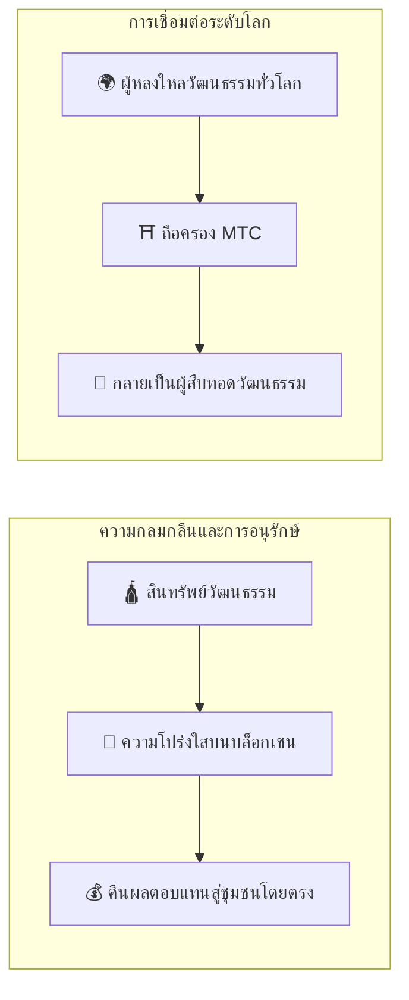

# ⛩️ ยินดีต้อนรับสู่ Matsuri Coin

> **โค้ดเพื่อความสมดุล คุณค่าเพื่อสันติภาพ**
> สะพานแห่ง «Wa» ในโลกที่แตกแยก MTC คือเข็มทิศที่นำทางจากการแข่งขัน สู่การร่วมสร้าง

**Matsuri Coin (MTC)** คือ Utility Token แบบกระจายศูนย์ที่ถูกสร้างบนบล็อกเชน Solana
ออกแบบมาเป็น **«Culture OS»** ที่เชื่อมต่อมรดกจิตวิญญาณของญี่ปุ่น — «Deep Japan» — เข้ากับเศรษฐกิจโลก

เราไม่ได้สร้างแค่ระบบชำระเงิน
เรากำลังสร้าง **สะพานเชื่อมญี่ปุ่นกับโลก** — กรอบการร่วมสร้างรูปแบบใหม่ที่ผู้คนผู้รักวัฒนธรรมจับมือกันข้ามพรมแดน

---

## 🎯 พันธกิจของเรา

:::info ส่งต่อพลังงานตลาดมูลค่า ¥10 ล้านล้าน สู่อนาคตของวัฒนธรรม
ตลาดท่องเที่ยวขาเข้าของญี่ปุ่นกำลังเติบโตสู่ระดับ **¥10 ล้านล้าน** ต่อปี
แต่ใต้พาดหัวข่าวนั้นซ่อนอยู่ **«ความจริงที่ไม่สะดวก»**
:::

### ปัญหาที่ไม่มีใครพูดถึง

| ปัญหา | ความเป็นจริง |
| :--- | :--- |
| 💸 **รายได้รั่วไหล** | ค่าคอมมิชชันส่วนใหญ่ไหลไปต่างประเทศผ่าน OTA ข้ามชาติและตัวกลาง |
| 😤 **ชุมชนหมดแรง** | นักท่องเที่ยวล้นทะลัก แต่ไม่มีรายได้ไหลกลับสู่ชุมชนท้องถิ่น |
| 🚧 **กำแพงประสบการณ์** | ทัวร์แพ็คเกจแค่แตะผิวเผิน — นักเดินทางไม่เคยสัมผัส *ญี่ปุ่นของจริง* |

> **«คนญี่ปุ่นลำบาก นักท่องเที่ยวเห็นแค่ฉากหน้า ส่วนความมั่งคั่งหายไปกับค่าธรรมเนียมแพลตฟอร์ม»**

เราใช้ Web3 เพื่อรื้อถอนระบบที่บิดเบี้ยวนี้
การชำระเงินของคุณจะถึงมือชุมชนท้องถิ่นและการอนุรักษ์มรดก **โดยตรง** — โปร่งใสทุกขั้นตอน ไม่มีคนกลาง

---

## 🏗️ โมเดลผสมผสาน: วัฒนธรรม × เทคโนโลยี

โปรเจกต์คริปโตส่วนใหญ่ไล่ล่าแต่กำไร ปฏิบัติกับวัฒนธรรมเหมือนสินค้าใช้แล้วทิ้ง
MTC พลิกเกม: เราสร้าง **«เศรษฐกิจที่ปกป้องวัฒนธรรม»** — โครงสร้างผสมผสานที่ควรมีมาตั้งแต่วันแรก

| เสาหลัก | ความหมาย |
| :--- | :--- |
| **🛕 ความกลมกลืนและการอนุรักษ์** | เงินที่นักท่องเที่ยวจ่ายไหลผ่านบล็อกเชนไปถึงการอนุรักษ์วัฒนธรรมและช่างฝีมือโดยตรง ชุมชน (GCF) รักษาอำนาจอธิปไตยเหนือมรดกของตนเอง |
| **🌍 การเชื่อมต่อระดับโลก** | โครงสร้างพื้นฐานที่ให้ใครก็ได้ ที่ไหนก็ได้ สนับสนุนจิตวิญญาณ «Wa» ของญี่ปุ่น การถือ MTC คือการร่วมเป็นส่วนหนึ่งของประวัติศาสตร์ที่มีชีวิตของญี่ปุ่น |

---

## 💎 ทำไมต้องใช้ MTC?

ระบบนิเวศ MTC มอบทั้ง **ความเติมเต็มทางจิตใจ** และ **ผลตอบแทนทางการเงินที่จับต้องได้**

### ✨ คุณค่าด้านประสบการณ์

| ประโยชน์ | รายละเอียด |
| :--- | :--- |
| **🎌 ประสบการณ์ที่มีความหมาย** | ปลดล็อก «Deep Japan» — พื้นที่ศักดิ์สิทธิ์ที่ปิดจากสาธารณะ พิธีกรรมส่วนตัวในศาลเจ้า กิจกรรมวัฒนธรรมเฉพาะผู้ได้รับเชิญ |
| **🌐 สายสัมพันธ์ตลอดชีวิต** | เชื่อมต่อกับญี่ปุ่นผ่าน MTC นานหลังจากกลับบ้าน สถานที่ที่คุณ «กลับมาได้เสมอ» |
| **⚖️ การแลกเปลี่ยนที่เป็นธรรม** | สัญญาอัจฉริยะกำจัดคนกลาง เงินของคุณไปถึงมือผู้ที่สมควรได้รับโดยตรง |

### 💰 ข้อได้เปรียบทางการเงิน

| ประโยชน์ | รายละเอียด |
| :--- | :--- |
| **🏷️ อัตราพิเศษ** | จ่ายด้วย MTC ประหยัด **5–10%** เทียบกับราคาเยน เช่น ทัวร์ ¥30,000 → ~¥27,000 |
| **🔑 สิทธิ์เข้าถึงพิเศษ** | ตั๋ว NFT สำหรับสถานที่เฉพาะผู้ได้รับเชิญและอีเวนต์จำนวนจำกัด — เฉพาะผู้ถือ MTC |
| **🛡️ ป้องกันความเสี่ยงค่าเงิน** | ล็อกมูลค่าประสบการณ์ก่อนเดินทาง — ไม่ต้องกังวลเรื่องอัตราแลกเปลี่ยนผันผวน |

---

## ⚡ ทำไมต้อง Solana?

เพื่อรองรับทั้ง «ความต้องการท่องเที่ยวจริง» และ «การซื้อขายความถี่สูง» เหลือเพียง **บล็อกเชนเดียวที่ใช้ได้จริง**

| รายการเปรียบเทียบ | Ethereum | Solana |
| :--- | :---: | :---: |
| **ค่าธรรมเนียม** | ¥100–¥1,000+ | **~¥0.04** |
| **ความเร็ว** | 12 วินาที – นาที | **0.4 วินาที** |
| **ปริมาณงาน** | ~15 TPS | **หลายพัน TPS** |

:::tip บททดสอบเงินทำบุญ
ไมโครเพย์เมนต์ขนาดเล็กเท่า «หยอดเหรียญ ¥100 ลงกล่องทำบุญ» ต้องการค่าธรรมเนียม **ต่ำกว่า ¥1** มีเพียง Solana ที่ผ่านบททดสอบนี้
:::

---

:::note พร้อมเริ่มต้น
MTC ยุติยุคสมัยของการท่องเที่ยวที่เพียงแค่ *บริโภค* วัฒนธรรม ยินดีต้อนรับสู่การเดินทางแห่ง **การร่วมสร้าง** — มาสร้างอนาคตด้วยกัน
:::

**[▶ วิสัยทัศน์: ทำไมต้องตอนนี้?](/docs/vision)** ｜ **[▶ เข้าร่วม GCF (สมาชิก VIP)](/docs/economy)**
