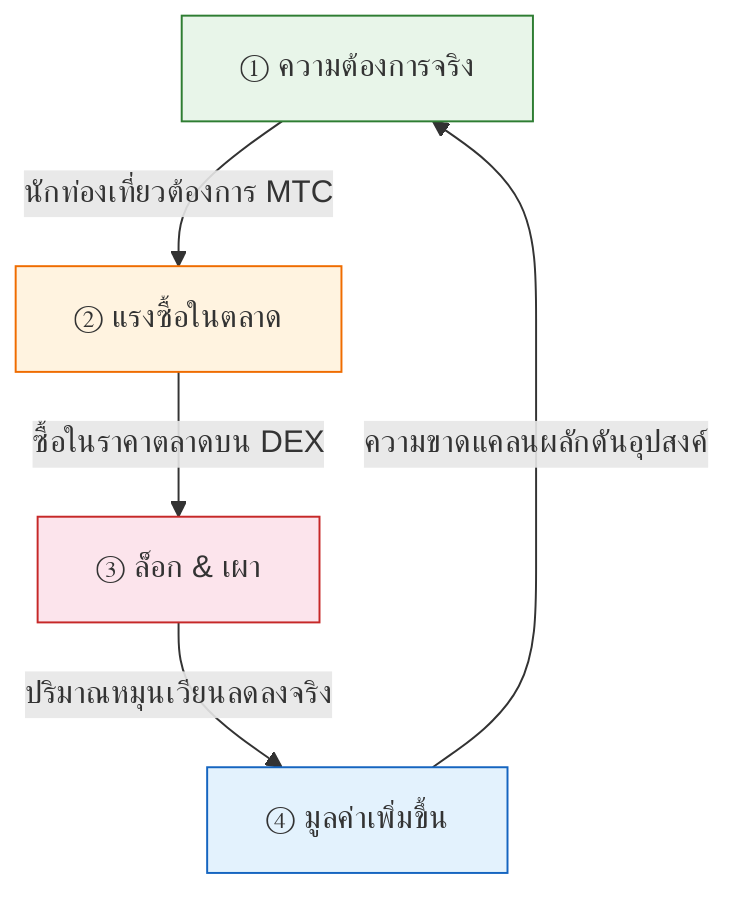
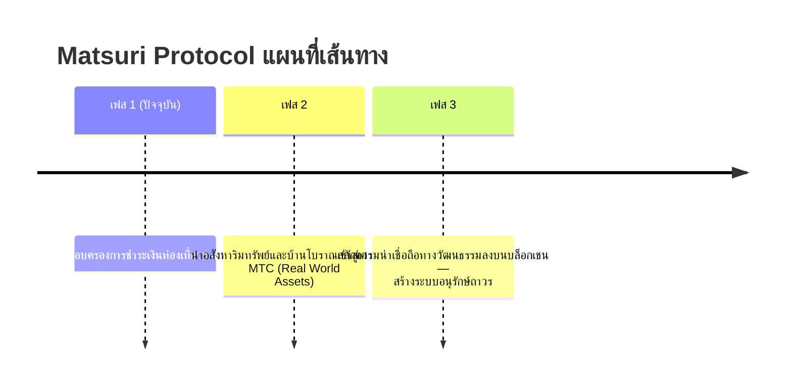

# 🎯 วิสัยทัศน์: กลยุทธ์ «Inbound-First»

> **จากการพึ่งพาเงินอุดหนุน สู่การพึ่งพาตนเอง**
> ยุคสมัยของการอุ้มเศรษฐกิจชนบทด้วยเงินภาษีจบลงแล้ว เราส่งเงินทุนต่างชาติตรงเข้าสู่วัฒนธรรม

โครงการฟื้นฟูท้องถิ่นส่วนใหญ่ล้มเหลว — เพราะสิ่งที่ทำคือแค่หมุนเวียนงบประมาณภาครัฐที่หดตัวลงเรื่อยๆ

**Matsuri Protocol ใช้แนวทางที่ตรงกันข้ามทั้งหมด**

---

## 1. กลยุทธ์: เครื่องจักรส่งออกวัฒนธรรม

เรานิยามสินทรัพย์ท่องเที่ยวของญี่ปุ่นใหม่ — ไม่ใช่ «สินค้าบริโภค» แต่เป็น **«ตราสารทางการเงินที่ส่งออกได้»**

| ปัญหา | ความเป็นจริง | ผลกระทบ |
| :--- | :--- | :--- |
| 💸 **รายได้รั่วไหล** | ค่าคอมฯ ให้ OTA ต่างชาติ (Booking.com, Expedia ฯลฯ) | รายได้ **15–20% รั่วไหล** ไปต่างประเทศ |
| 🚧 **กำแพงที่มองไม่เห็น** | อุปสรรคด้านภาษาและการชำระเงิน | นักเดินทางผู้มั่งคั่งเข้าไม่ถึงประสบการณ์ «Deep Japan» |

:::tip บทบาทของ MTC
MTC คือ **กุญแจมาสเตอร์คีย์เพียงดอกเดียว** ที่หยุดการรั่วไหลและทลายกำแพง
:::

---

## 2. ล้อเศรษฐกิจหมุน (Economic Flywheel)

จุดเด่นของ Matsuri Protocol: **ความกระตือรือร้นของนักท่องเที่ยวผลักดันราคา MTC ขึ้นอย่างเป็นตัวเลข**
ไม่ใช่ความหวัง — แต่เป็น **กลไกอุปสงค์-อุปทาน**

### ทำไม MTC ถึงมีมูลค่าเพิ่มขึ้น?

**วงจรอัตโนมัติ 4 ขั้นตอน** ที่ขับเคลื่อนราคา:

| ขั้นตอน | ชื่อ | กลไก |
| :---: | :--- | :--- |
| **①** | **ความต้องการจริง** | นักท่องเที่ยวต้องใช้ MTC สำหรับจองไกด์และซื้อ Ticket-NFT |
| **②** | **แรงซื้อในตลาด** | MTC ถูกซื้อในราคาตลาดบน DEX — ขับเคลื่อนด้วยการบริโภค ไม่ใช่การเก็งกำไร |
| **③** | **ล็อก & เผา** | ส่วนหนึ่งของ MTC ที่ใช้ชำระเงินถูกล็อกหรือเผาทันทีโดยสัญญาอัจฉริยะ — อุปทานลดลงจริง |
| **④** | **มูลค่าเพิ่มขึ้น** | อุปสงค์ซื้อเพิ่มขึ้นเรื่อยๆ อุปทานขายลดลงเรื่อยๆ — มูลค่าความขาดแคลนเพิ่มขึ้นอย่างเป็นตัวเลข |

:::info แก่นแท้
**«ยิ่งนักท่องเที่ยวสนุกกับญี่ปุ่น สินทรัพย์ของผู้ถือ MTC ยิ่งเพิ่มมูลค่า»**
สมการง่ายๆ นี้คือหัวใจเต้นของโปรเจกต์
:::

---

## 3. จุดหมายสุดท้าย: Culture OS

เป้าหมายสูงสุดของเราไม่ใช่แอปชำระเงิน
แต่คือการ **เปลี่ยนวัฒนธรรมให้เป็นระบบปฏิบัติการ**

> เราปกป้อง **วัฒนธรรมที่ยืนยาวมา 1,000 ปี** ด้วย **เทคโนโลยีบล็อกเชนล้ำสมัย**
> นี่คืออนาคตที่ Matsuri Protocol กำลังสร้าง

---

**[▶ ถัดไป: เราสร้างรายได้อย่างไร? (เศรษฐกิจ)](/docs/economy)**
