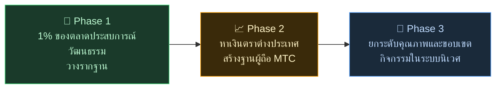

# 🌏 ปัญหาและทางออก — ความจริงอันไม่สะดวก และความหวัง

> **ปณิธานงดงาม แต่โลกแห่งความจริงขวางทางอยู่**

---

## แต่มีความจริงอันไม่สะดวกขวางปณิธานนี้อยู่

:::info พลังงานตลาด 10 ล้านล้านเยน ไม่ถึงมือผู้ดูแลวัฒนธรรม
ตลาดท่องเที่ยวขาเข้าของญี่ปุ่นกำลังเติบโตสู่ **10 ล้านล้านเยน** ต่อปี
แต่ผลประโยชน์ส่วนใหญ่ไม่ถึงมือคนหน้างาน
:::

### ตลาดที่ MTC มุ่งหมาย

เราไม่ได้จะคว้าทั้ง 10 ล้านล้านเยน

สิ่งที่เราเล็งก่อนคือ **ตลาดประสบการณ์วัฒนธรรม ไกด์ และทัวร์ท้องถิ่น** ภายในตลาดนั้น เป้าหมายแรกคือ **1% ของส่วนนี้ (ประมาณ 1 แสนล้านเยน)** เริ่มจากเล็กแล้วทำให้แข็งแกร่ง

| เฟส | กลยุทธ์ | เป้าหมาย |
| :--- | :--- | :--- |
| **เริ่มเล็ก** | โฟกัสที่ประสบการณ์วัฒนธรรมและทัวร์ไกด์ สะสมผลงาน ขยายด้วยการบอกต่อ | สร้างฐานรายได้ |
| **ทำให้แข็งแกร่ง** | ได้เงินตราต่างประเทศ (รายได้จาก inbound) พิสูจน์กลไกการแบ่งรายได้ให้ผู้ถือ MTC | สร้างความเชื่อมั่นในเศรษฐกิจ MTC |
| **ยกระดับคุณภาพ** | เมื่อถึงขนาดหนึ่ง ให้ความสำคัญกับคุณภาพประสบการณ์ ขอบเขตกิจกรรม และความลึกของชุมชน มากกว่าการขยาย | เศรษฐกิจวัฒนธรรมที่ยั่งยืน |

> **ไม่ไล่ตามปริมาณ แต่เติบโตด้วยคุณภาพของผู้มีส่วนร่วมและความลึกของประสบการณ์** นี่คือกลยุทธ์ขยายของ MTC

แพลตฟอร์ม Web2 นำความงดงามของการเดินทางไปสู่ผู้คนทั่วโลก เราซาบซึ้งในคุณูปการนั้น
แต่โครงสร้างแบบรวมศูนย์ย่อมมีผลข้างเคียงที่หลีกเลี่ยงไม่ได้

อัลกอริทึมกำหนดว่า "จะแสดงอะไร" ผู้ประกอบการถูกบังคับให้แข่งขันเพื่อลำดับการแสดงผล รีวิวเดียวพลิกยอดขายได้ อัตราค่าธรรมเนียมเปลี่ยนได้ตามใจแพลตฟอร์ม — คนหน้างานอยู่ในความกังวลตลอดว่า "ถูกเลือก หรือ ถูกลืม"

โครงสร้างนี้สร้างการแตกแยกระหว่างผู้ประกอบการ และความหวาดกลัวต่อกฎที่มองไม่เห็น
ร้านข้างๆ กลายเป็นคู่แข่ง การกอบโกยกลายเป็นเรื่องสมเหตุสมผลกว่าความร่วมมือ แม้แต่นักเดินทางก็ได้รับเพียงตัวเลือกที่ถูกจัดให้เป็นแบบเดียวกันด้วย "ดาว" และ "อันดับ" ทำให้ประสบการณ์ที่มีคุณค่าจริงๆ จมหายไป

:::danger 3 ปัญหาที่คนหน้างานเผชิญ
💸 **รายได้รั่วไหล** — รายได้ส่วนใหญ่ไหลออกนอกประเทศเป็นค่าคอมมิชชันให้ OTA และตัวกลางต่างประเทศ

😤 **ชุมชนหมดแรง** — แบกรับแต่ภาระ overtourism แต่รายได้ที่สำคัญไม่ไหลกลับสู่ท้องถิ่น

🚧 **กำแพงประสบการณ์** — อัลกอริทึมแสดงแต่ทัวร์แบบเดียวๆ ซ้ำๆ นักเดินทางไม่มีโอกาสพบ "ญี่ปุ่นตัวจริง"
:::

> **คนญี่ปุ่นลำบาก นักท่องเที่ยวไม่เห็นตัวตนจริง ความมั่งคั่งหายไปกับแพลตฟอร์ม**

---

## แล้วเราจะเปลี่ยนอะไรได้อย่างไร?

แต่วันนี้ เทคโนโลยีที่สามารถพลิกโครงสร้างนี้จากรากฐานได้มาถึงแล้ว

:::tip Smart Contract — กฎกลางที่เปลี่ยนไม่ได้
ค่าธรรมเนียมและเงื่อนไขถูกสลักไว้ในโค้ด ไม่มีใครเปลี่ยนได้ตามอำเภอใจ กฎที่เท่าเทียมสำหรับทุกคนทำงานโดยอัตโนมัติ
:::

:::tip Blockchain — ความโปร่งใสที่ทุกคนมองเห็น
ทุกธุรกรรมถูกบันทึกในบัญชีสาธารณะที่ใครก็ตรวจสอบได้ ยุคที่ข้อมูลถูกขังไว้ในบริษัทสิ้นสุดแล้ว
:::

:::tip Solana — ชำระใน 0.4 วินาที ค่าธรรมเนียม 0.04 ¥
ไม่ต้องจ่ายค่าตัวกลางซ้อนๆ หรือรอหลายวัน คนเชื่อมต่อกับคนได้โดยตรง
:::

:::tip AI — ลบต้นทุนการจัดการให้หมดสิ้น
ผลิตภาพที่พุ่งทะลุทำให้โครงสร้างต้นทุนที่ต้องใช้ดำเนินแพลตฟอร์มยักษ์ใหญ่กลายเป็นเรื่องในอดีต
:::

ไม่ต้องพึ่งตัวกลางอีกต่อไป ยุคที่ผู้คนเชื่อมต่อกันได้โดยตรงมาถึงแล้ว

เราใช้เทคโนโลยีเหล่านี้ปลดปล่อยเศรษฐกิจ inbound จากการผูกขาด คืนรายได้สู่คนหน้างานทั้งในญี่ปุ่นและประเทศต่างๆ
และไม่หยุดแค่ญี่ปุ่น — เราสร้าง**ระบบที่ปกป้องวัฒนธรรมทั่วโลกและเชื่อมโยงเข้าด้วยกัน**

---

**[◀ ก่อนหน้า: วิสัยทัศน์และปณิธาน](/docs/vision)** ｜ **[▶ ถัดไป: อนาคตที่ MTC วาดไว้](/docs/future)**
