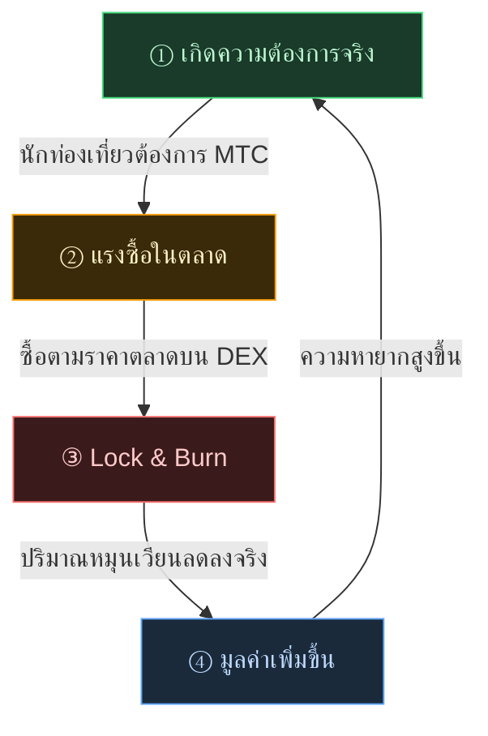

# 🔄 Economic Flywheel — วงจรการเติบโต และ Cultural OS

> **ยิ่งนักท่องเที่ยวสนุกกับญี่ปุ่นมากเท่าไร ความต้องการในระบบนิเวศก็ยิ่งสูงขึ้น**
> กลไกอุปสงค์-อุปทานนี้คือหัวใจของโปรเจกต์

---

## กลไกอุปสงค์-อุปทานของ MTC

การออกแบบ Matsuri Protocol ทำให้ **การเพิ่มขึ้นของความต้องการจริงสร้างแรงซื้อ เมื่อผสมกับการลดลงของอุปทาน เงื่อนไขของการเพิ่มมูลค่าก็พร้อม**
นี่ไม่ใช่การพูดด้วยอารมณ์ แต่คือ **กลไกอุปสงค์-อุปทาน**

**วงจร 4 ขั้น** ต่อไปนี้ค้ำจุนกลไกนี้

| ขั้น | ชื่อ | กลไก |
| :---: | :--- | :--- |
| **①** | **เกิดความต้องการจริง** | นักท่องเที่ยวต้องการ MTC เพื่อจองไกด์หรือซื้อ NFT ticket |
| **②** | **แรงซื้อในตลาด** | ซื้อ MTC ตามราคาตลาดบน DEX (Decentralized Exchange) เป็นแรงซื้อที่มั่นคงเพราะมาจากการบริโภค ไม่ใช่การเก็งกำไร |
| **③** | **Lock & Burn** | MTC ส่วนหนึ่งที่ใช้ชำระเงินจะถูกล็อกหรือเผาทันทีโดย Smart Contract ปริมาณหมุนเวียนลดลงในเชิงกายภาพ |
| **④** | **ความหายากสูงขึ้น** | แรงซื้อเพิ่ม อุปทานขายลด การเปลี่ยนแปลงสมดุลอุปสงค์-อุปทานทำให้ความหายากต่อเหรียญสูงขึ้นเชิงโครงสร้าง |

---

---

:::note วิสัยทัศน์ที่สูตรนี้รองรับ
ภาพรวมของ "Cultural OS" ที่อยู่ปลายทางของ Flywheel นี้ เล่าโดยละเอียดในหน้าถัดไป [อนาคตที่ MTC วาดไว้](/docs/future)
:::

---

**[◀ ก่อนหน้า: ปัญหาและทางออก](/docs/challenges)** ｜ **[▶ ถัดไป: อนาคตที่ MTC วาดไว้](/docs/future)**
