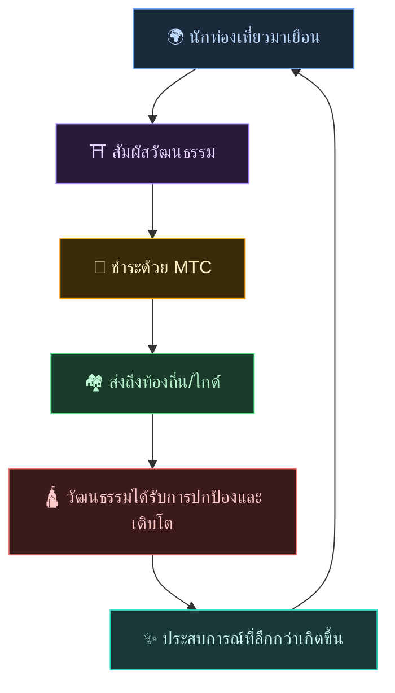
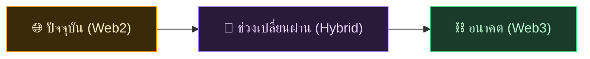
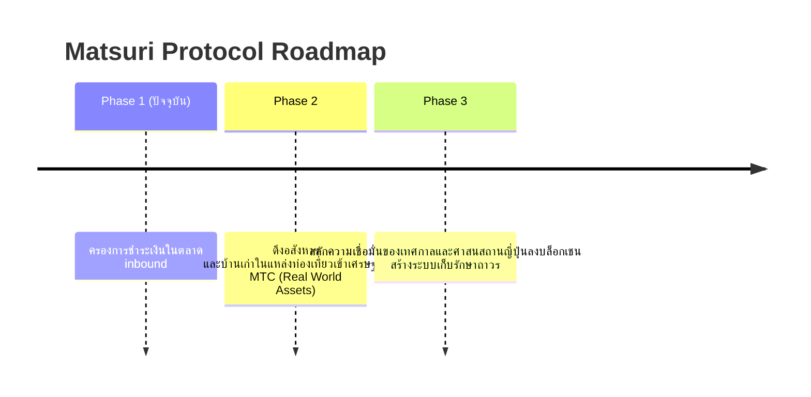

# 🌀 อนาคตที่ MTC วาดไว้ — เศรษฐกิจที่ "การมีส่วนร่วม" ทุกอย่างหมุนเวียน

> **คนที่สัมผัสประสบการณ์ คนที่ส่งต่อ คนที่ปกป้อง ความรู้สึกทั้งหมดหมุนเวียนในฐานะเศรษฐกิจ และส่งวัฒนธรรมให้รุ่นต่อไป**

---

## วงจรที่เราต้องการสร้าง

MTC ไม่ใช่โทเคนเพื่อการเก็งกำไร

นักท่องเที่ยวสัมผัสวัฒนธรรมญี่ปุ่นและประทับใจ
ไกด์ส่งต่อความประทับใจนั้นและได้รับรางวัล
ท้องถิ่นได้รับผลตอบแทนและสามารถปกป้องวัฒนธรรมต่อไป
แล้ววัฒนธรรมนั้นก็ดึงดูดนักท่องเที่ยวใหม่อีกครั้ง

วงจรนี้คือเหตุผลที่ MTC ดำรงอยู่

---

## เศรษฐกิจที่ตอบแทน 3 ฝ่าย

ในการท่องเที่ยวแบบเดิม: นักท่องเที่ยวจ่ายเงิน แพลตฟอร์มเอากำไร ไม่เหลืออะไรให้คนหน้างาน
ในเศรษฐกิจ MTC ทุกคนที่มีส่วนร่วมได้รับผลตอบแทน

| ผู้มีส่วนร่วม | เกิดอะไรขึ้น | ได้รับอะไร |
| :--- | :--- | :--- |
| **🌍 คนที่สัมผัสประสบการณ์** | สัมผัสวัฒนธรรมญี่ปุ่น และจ่ายด้วย MTC | เข้าถึงประสบการณ์ของแท้ในราคาต่ำกว่าเยน และเชื่อมต่อต่อไปผ่าน MTC แม้หลังกลับประเทศ |
| **⛩️ คนที่ส่งต่อ** | จัดอีเวนต์ในฐานะไกด์ ส่งคอนเทนต์ใน J-Times | รางวัลโดยตรงโดยไม่มีคนกลางขูดรีด ยิ่งทำ ยิ่งได้ MTC |
| **🏘️ คนที่ปกป้อง** | รักษาและสืบทอดวัฒนธรรมในฐานะชุมชนท้องถิ่น | รายได้ถึงมือโดยตรง เจริญเติบโตแบบยั่งยืน ไม่ใช่ overtourism |

---

## ยิ่งเศรษฐกิจขยาย ยิ่งวัฒนธรรมแข็งแกร่ง

เศรษฐกิจ MTC เริ่มจากการจองประสบการณ์ แล้วแผ่ขยายสู่ทุกด้านของชีวิต

- **ประสบการณ์** — ประสบการณ์วัฒนธรรมของแท้, Sanpai Mining
- **ปัจจัยสี่** — เกสต์เฮาส์ ร้านค้า อาหาร แฟชั่น
- **โปรเจกต์ร่วมสร้าง** — การลงทุนปกป้องวัฒนธรรมผ่านคราวด์ฟันดิง
- **ความเข้าใจระหว่างวัฒนธรรม** — พื้นที่แลกเปลี่ยนและเข้าใจกันข้ามพรมแดน

ยิ่งเศรษฐกิจขยาย ยิ่งการหมุนเวียนผ่าน MTC หนาแน่นขึ้น กำลังในการค้ำจุนวัฒนธรรมก็ยิ่งเข้มแข็ง
นี่ไม่ใช่เพียงโมเดลธุรกิจ แต่คือ **เครื่องพยุงชีวิตของวัฒนธรรม**

---

## จาก Web2 สู่ Web3 — อย่างนุ่มนวลและเป็นขั้นตอน

เราไม่ได้บอกว่า "ย้ายทุกอย่างขึ้นบล็อกเชนทันที"

คนส่วนใหญ่ยังไม่คุ้นกับ Web3 ด้วยเหตุนี้เอง เราจึงออกแบบให้ **เริ่มจากรูปแบบที่คุ้นเคย แล้วค่อยๆ สัมผัสประโยชน์ของ Web3**

| เฟส | ประสบการณ์ผู้ใช้ | กลไกเบื้องหลัง |
| :--- | :--- | :--- |
| **ปัจจุบัน** | จองประสบการณ์และชำระเงินเหมือนเว็บแอปทั่วไป ใช้บัตรเครดิตได้ | Django + Stripe ไม่ต้องมี Wallet ก็เริ่มได้ |
| **ช่วงเปลี่ยนผ่าน** | รับและใช้ MTC ในแอป เชื่อม Wallet ด้วยแตะครั้งเดียว | คะแนน off-chain ทยอยย้ายเป็น on-chain |
| **อนาคต** | ธุรกรรมและสิทธิ์ทั้งหมดบันทึกบนบล็อกเชนอย่างโปร่งใส การมีส่วนร่วมของคุณถูกพิสูจน์ชั่วนิรันดร์ | เศรษฐกิจอัตโนมัติเต็มรูปแบบ แก้ไขไม่ได้ ผ่าน Smart Contract |

:::tip Web3 ไม่ยาก
ตั้งค่า Wallet หรือจัดการ Seed Phrase — ตอนแรกไม่ต้องทำก็ได้ ขณะใช้งานจะค่อยๆ สัมผัสโลก Web3 อย่างเป็นธรรมชาติ — **พอรู้ตัวอีกที คุณก็เป็นชาว Web3 ไปแล้ว** นี่คือประสบการณ์ที่เราออกแบบ
:::

---

## เศรษฐกิจที่ขับเคลื่อนด้วยความเห็นอกเห็นใจ ไม่ใช่กำลัง

และเศรษฐกิจนี้ทำงานด้วย Smart Contract
ไม่มีใครเปลี่ยนกฎฝ่ายเดียวตามอำนาจหรือผลประโยชน์ได้ — **ระบบเศรษฐกิจที่ไม่อาจเปลี่ยนแปลงสถานภาพด้วยกำลัง**

บนพื้นฐานนี้ เราเรียนรู้จากภูมิปัญญาโบราณ แล้วสร้างคุณค่าใหม่อย่างไม่หยุดยั้ง 温故知新 และก้าวสู่นวัตกรรม

> **โลกที่แม้ไม่มี ¥ ไม่มี $ ชีวิตก็ดำเนินไปได้บนแกนแห่งวัฒนธรรม**
>
> แทนที่จะฝากมูลค่าเงินไว้กับคนอื่น คุณสร้างและใช้มูลค่าด้วย "การมีส่วนร่วม" ของตัวเอง
> นี่คืออิสรภาพที่ MTC อยากมอบให้

---

## 🏁 จุดหมายสุดท้าย: "Cultural OS"

เป้าหมายสุดท้ายของเราไม่ใช่แค่แอปชำระเงิน
แต่คือ **การทำให้วัฒนธรรมกลายเป็น OS (ฐาน)**

> เราปกป้องภูมิปัญญาโบราณด้วยบล็อกเชนล้ำสมัย
> นี่คือแผนที่อนาคตที่ Matsuri Protocol วาดไว้

---

:::note ภาคเรื่องราวจบเพียงเท่านี้
ผู้ที่อ่านมาถึงตรงนี้ คงเข้าใจแล้วว่า MTC ดำรงอยู่เพื่ออะไร
ต่อไปคือ **【ภาคปฏิบัติ】** — ไปดูกันว่าจริงๆ แล้วทำอะไรกับ MTC ได้บ้าง
:::

**[◀ ก่อนหน้า: Economic Flywheel](/docs/flywheel)** ｜ **[▶ ถัดไป: Ecosystem](/docs/ecosystem)**
