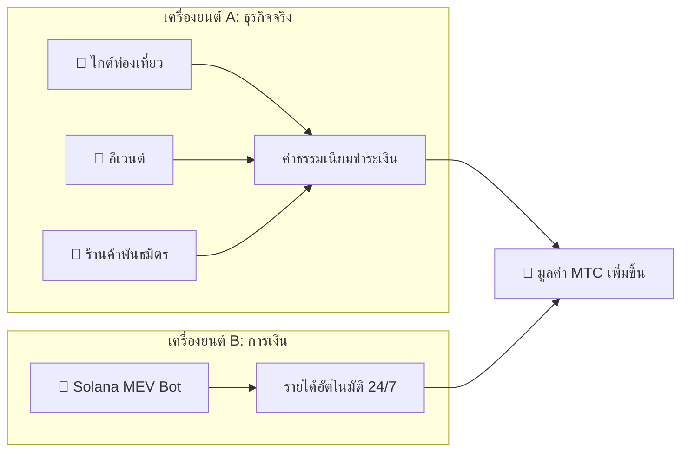

# 💰 ระบบเศรษฐกิจ

> ระบบเศรษฐกิจ Matsuri Coin (MTC) เรียบง่ายแต่แข็งแกร่ง
> **เครื่องยนต์รายได้สองตัว — ธุรกิจจริงและอัลกอริทึมการเงิน — สร้างกำไรและกระจายคืนให้ผู้ถือโดยอัตโนมัติ**


---

## 1. เครื่องยนต์รายได้คู่



| เครื่องยนต์ | แหล่งรายได้ | วิธีการทำงาน |
| :--- | :--- | :--- |
| **🏯 เครื่องยนต์ A (ธุรกิจ)** | ค่าธรรมเนียมจากไกด์ อีเวนต์ และร้านค้าพันธมิตร | นักท่องเที่ยวมากขึ้น → เงินทุนต่างชาติไหลเข้ามากขึ้น → ระบบนิเวศขยายตัว |
| **🤖 เครื่องยนต์ B (การเงิน)** | การซื้อขายอัตโนมัติโดย Solana MEV Bot | โปรแกรมซื้อขายความถี่สูงภายใต้ CEO สกัดกำไรจากความไม่มีประสิทธิภาพของตลาดบนเชน 24/7/365 |

---

## 2. โปรโตคอลซื้อคืน (กลไกเพิ่มมูลค่า)

เราไม่เอากำไรเข้ากระเป๋า
กฎสัญญาอัจฉริยะส่งรายได้ตรงสู่ **การเพิ่มมูลค่า MTC**

| แหล่งรายได้ | สัดส่วน | การดำเนินการ |
| :--- | :---: | :--- |
| **ยอดขาย Matsuri HQ** (ไกด์และอีเวนต์) | **20%** | **ซื้อคืน** จากตลาด + เสริมสภาพคล่อง |
| **สมาชิกภาพ GCF** (ค่าสมาชิก) | **25%** | **ซื้อคืน** จากตลาด |

:::info ตรรกะหลัก
**«ธุรกิจเติบโต = MTC ถูกซื้ออย่างต่อเนื่องในตลาดเปิด»**
สมการนี้คือรากฐานของมูลค่าสินทรัพย์ของคุณ
:::

---

## 3. ตรรกะกำหนดราคา

กลไกราคาของเราทำงานบน **สูตร AMM (Automated Market Maker)** — ไม่ใช่ความฝัน

```
ราคา = สภาพคล่อง (SOL) ÷ อุปทาน (MTC)
```

| ขั้นตอน | เกิดอะไรขึ้น | ผลลัพธ์ |
| :---: | :--- | :--- |
| **①** | รายได้ธุรกิจ (SOL) ถูกอัดเข้าพูล | **ตัวเศษ ↑** |
| **②** | MTC ถูกซื้อคืนจากตลาดและเผาทำลาย | **ตัวส่วน ↓** |
| **③** | ตัวเศษ ↑ × ตัวส่วน ↓ | **ราคาเพิ่มขึ้นอย่างเป็นตัวเลข** |

---

## 4. GCF (Global Community Friends)

GCF คือองค์กรพันธมิตร (DAO) แบบ **เชิญเท่านั้น** ที่ขยายระบบนิเวศ Matsuri
ไม่ใช่แค่สโมสรสมาชิก — แต่เป็น **กลุ่มธุรกิจ** ที่แบ่งปันผลกำไร


### ระดับสมาชิก

| ระดับ | บทบาท | สิทธิพิเศษ |
| :---: | :--- | :--- |
| **👑 Platinum** | เจ้าของ / VIP | สิทธิ์สูงสุด **50 ที่นั่งแรก** เท่านั้น อำนาจตัดสินใจ + เงินปันผลสูง |
| **🥇 Gold** | แอมบาสเดอร์ | ทีมปฏิบัติการ สิทธิ์ในการ **ทำเงินไม่มีเพดาน** ผ่านกิจกรรม อัตราไมนิ่งและค่าแนะนำสูงสุด |

### สิทธิพิเศษ ①: Real-Work Mining (สิทธิ์การขุด)

**MTC 550 ล้านเหรียญ (~61% ของอุปทานทั้งหมด)** ที่จะปลดล็อกในวันที่ 1 มิถุนายน 2027 ถูกสำรองไว้เป็น **กองทุนรางวัลผู้มีส่วนร่วม** — ไม่ใช่ทิ้งลงตลาด

:::tip ตอบแทนตามผลงาน 100%
MTC ถูกแจกจ่ายอัตโนมัติจากกองทุนตามผลงานของคุณ (ยอดขาย จำนวนผู้เยี่ยมชม จำนวนรอบไกด์)
:::

**ตารางการลดครึ่ง (รอบ 2 ปี):**

| ช่วงเวลา | สัดส่วนปล่อย | ปริมาณ |
| :--- | :---: | :--- |
| **รอบที่ 1** 2027 – 2029 | **50%** | ~275 ล้านเหรียญ |
| **รอบที่ 2** 2029 – 2031 | **25%** | ~137 ล้านเหรียญ |
| **รอบที่ 3** 2031 – 2033 | **12.5%** | ~68 ล้านเหรียญ |

:::caution โอกาสผู้มาก่อน
เร็วกว่าการลดครึ่งของ Bitcoin (รอบ 4 ปี) — เราใช้ **รอบ 2 ปี**
ผู้ที่ทุ่มสุดตัวใน **2 ปีแรกจาก 2027** จะได้เปรียบผู้มาก่อนอย่างท่วมท้น
:::

### สิทธิพิเศษ ②: ค่าคอมมิชชันแนะนำระดับพรีเมียม

แนะนำสินค้ามูลค่าสูง (สมาชิกภาพ, ทัวร์ VIP, อสังหาริมทรัพย์พันธมิตร) รับ **ค่าคอมมิชชันพรีเมียม (USDC + MTC)** — สูงกว่าแอฟฟิลิเอตทั่วไปหลายเท่า จ่าย **ทันที** ผ่านสัญญาอัจฉริยะ

---

## 5. รายละเอียดโทเค็น

เราได้ **เพิกถอน** สิทธิ์ Mint และ Freeze บน Solana อย่างถาวร
ไม่มีการออกเพิ่ม — ตลอดกาล ไม่มีการอายัดทรัพย์ — ตลอดกาล **ออกแบบแบบไร้ความไว้วางใจอย่างสมบูรณ์**

| รายการ | รายละเอียด |
| :--- | :--- |
| **ชื่อโทเค็น** | Matsuri Coin |
| **สัญลักษณ์** | MTC |
| **เชน** | Solana |
| **อุปทานทั้งหมด** | **900,000,000 MTC** (คงที่) |
| **สิทธิ์ Mint** | 🚫 เพิกถอนแล้ว |
| **สิทธิ์ Freeze** | 🚫 เพิกถอนแล้ว |
| **สัญญาล็อก** | Streamflow Finance (ตรวจสอบแล้ว) |

:::warning เชิญเท่านั้น — ที่นั่งจำกัด
GCF จะปิดรับสมาชิกทันทีที่ที่นั่งจำกัดเต็ม (Platinum: 50 / Gold: กำลังปรับ)
การถือสิทธิ์นี้หมายความว่าคุณเข้าสู่ **วงในของเศรษฐกิจ Matsuri**
:::

---

**[▶ ถัดไป: ระบบนิเวศและไมนิ่ง](/docs/ecosystem)** ｜ **[เข้าร่วม Discord](#)**
