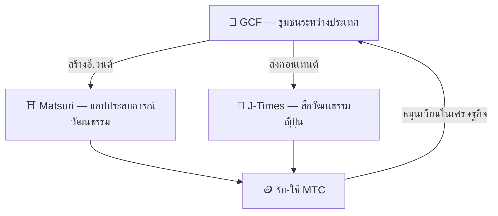

# 🏗️ MTC Ecosystem — เศรษฐกิจที่ประสบการณ์ สื่อ และชุมชนหมุนเวียน

> **3 "พื้นที่" เพื่อทำปณิธานให้เป็นจริง**
> พื้นที่สัมผัส พื้นที่เรียนรู้ พื้นที่เชื่อมต่อ — แต่ละที่เป็นอิสระ แต่เชื่อมโยงเป็นเศรษฐกิจเดียวกันผ่าน MTC

MTC ไม่ใช่แค่โทเคน 3 ผลิตภัณฑ์และชุมชนระหว่างประเทศทำงานร่วมกันเพื่อสร้าง**เศรษฐกิจที่ปกป้องวัฒนธรรม**

:::tip 🤝 GCF — ชุมชนระหว่างประเทศที่ขับเคลื่อนระบบนิเวศ
พื้นที่ที่คนรักวัฒนธรรมญี่ปุ่นเชื่อมโยงกันข้ามพรมแดน GCF คัดสรรไกด์ และไกด์ GCF เป็นผู้ดำเนินประสบการณ์บน Matsuri แล้วส่งคอนเทนต์ที่น่าสนใจผ่าน J-Times — กิจกรรมของชุมชนคือเครื่องยนต์ที่ขับเคลื่อนทั้งระบบนิเวศ
:::

:::tip ⛩️ Matsuri — แอปประสบการณ์วัฒนธรรม
เริ่มจากการจองประสบการณ์วัฒนธรรม แล้วขยายไปสู่ **เกสต์เฮาส์** **ร้านค้า** **คราวด์ฟันดิง** ทีละขั้น ขยายเศรษฐกิจจากประสบการณ์สู่เครื่องนุ่งห่ม อาหาร ที่อยู่ และการลงทุนร่วมสร้าง

**Sanpai Mining (การแสวงบุญ)** — รับ MTC จากการไปเยือนศาลเจ้า วัด และสถานที่ทางวัฒนธรรมจริงๆ กระจายกระแสคนจากจุดดังสู่จุดซ่อนเร้นในต่างจังหวัดอย่างเป็นธรรมชาติ แก้ปัญหา overtourism และกระตุ้นท้องถิ่นไปพร้อมกัน
:::

:::tip 📰 J-Times — สื่อวัฒนธรรมญี่ปุ่น
แพลตฟอร์มสื่อที่ส่งต่อเสน่ห์ของวัฒนธรรมญี่ปุ่นสู่โลก รับ MTC ผ่านการมีส่วนร่วม เช่น อ่านบทความ แชร์ ฯลฯ
:::

---

## 🤝 Social Mining (เชื่อมต่อเพื่อรับรางวัล)

**เชื่อมกับ GCF Admin Dashboard — เว็บเปิดใช้งานแล้ว (แอป iOS กำหนดเปิดตัวเมษายน 2026)**

สมาชิก GCF ได้สิทธิ์เข้าถึง **GCF Admin Web** เฉพาะ

| ฟีเจอร์ | ทำอะไรได้ |
| :--- | :--- |
| **🎪 สร้างอีเวนต์** | ออกแบบและลงประกาศอีเวนต์หรือทัวร์ของคุณเอง |
| **📢 ส่งคอนเทนต์** | ส่งต่อและเผยแพร่บทความและคอนเทนต์ของ J-Times |
| **📊 ติดตามการแนะนำ** | ติดตามพฤติกรรมและรายได้ของผู้ใช้ที่คุณแนะนำแบบเรียลไทม์ |

:::info รางวัลอัตโนมัติ
ทุกครั้งที่เพื่อนที่คุณแนะนำชำระเงิน ระบบจะโอนรางวัล (ส่วนแบ่งรายได้) เข้า Wallet ของคุณ **โดยอัตโนมัติ**
:::

---

## 🎓 Creator Economy (สร้างเพื่อรับรางวัล)

ไม่ใช่แค่บริโภคคอนเทนต์ แต่บนแพลตฟอร์ม Matsuri **ใครก็ได้**สามารถสร้างคอนเทนต์และทำรายได้

| แพลตฟอร์ม | ครีเอเตอร์ทำอะไรได้ | โมเดลรายได้ |
| :--- | :--- | :--- |
| **📚 Course Marketplace** | เผยแพร่คอร์สวิดีโอ/ข้อความเกี่ยวกับวัฒนธรรม ภาษา งานฝีมือญี่ปุ่น | ค่าธรรมเนียมต่อการเรียน (ส่วนแบ่งครีเอเตอร์) |
| **🎙️ Podcast Studio** | ผลิตซีรีส์ออดิโอสำหรับ Spotify, Apple Podcasts, RSS | ตอนเฉพาะสมาชิก |
| **🤝 คราวด์ฟันดิง** | เปิดแคมเปญระดมทุนบน Solana สำหรับโปรเจกต์วัฒนธรรม | ติดตามการบริจาคแบบ on-chain |
| **🛍️ ร้านค้าผู้ใช้** | เปิดร้านส่วนตัวในแพลตฟอร์ม (งานฝีมือ สินค้า) | ขายตรงพร้อมระบบสินค้า/รีวิว |

:::tip การผลิตที่ช่วยเหลือด้วย AI
โฮสต์อีเวนต์สามารถใช้ **AI Assistant ในตัว (GPT-4 Turbo)** เพื่อสร้างคำอธิบายอีเวนต์ แปลอัตโนมัติเป็น 5 ภาษา และสร้าง metadata ที่ปรับ SEO ได้ภายใน Admin Dashboard
:::

---

  

*Meetup ชุมชนที่โกลเดนไก — ความเชื่อมโยงกลายเป็นพลังในการ mining*

---

:::note ไปหน้าต่อไป
ถ้าอยากรู้กลไก mining และวิธีรับรางวัลอย่างเป็นรูปธรรม ไปต่อที่ **[Mining & วิธีหารายได้ →](/docs/mining)**
:::
