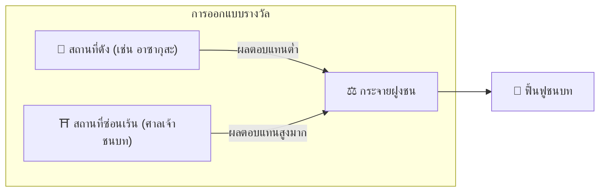

# ⛏️ เสาหลัก 3 ต้นของไมนิ่ง

> **Proof of Action (PoA)**
> Matsuri Coin ไม่ได้ขุดด้วย GPU แต่ขุดด้วย **«การกระทำของมนุษย์»**

เว็บแอปและแดชบอร์ดผู้ดูแลระบบ **สร้างเสร็จแล้ว** — เริ่มสร้างรายได้ **ได้ทันที** ผ่านกิจกรรมด้านล่าง

---

## 1. 📖 Media Mining (อ่าน ฟัง ตอบ เพื่อรับเงิน)

**ขับเคลื่อนโดย «J-Times» สื่อทางการ**

ความรู้เปลี่ยนคุณภาพของการเดินทาง
เราให้รางวัลการเรียนรู้ — ทั้งการอ่าน ฟัง **และ** การพิสูจน์ความเข้าใจผ่านแบบทดสอบ

| การกระทำ | สิ่งที่คุณทำ | รางวัล |
| :--- | :--- | :--- |
| **📰 อ่านเพื่อรับเงิน** | อ่านบทความ J-Times เกี่ยวกับประวัติศาสตร์ ชินโต เซน | ได้รับ MTC |
| **🎧 ฟังเพื่อรับเงิน** | สตรีมพอดแคสต์พิเศษเกี่ยวกับวัฒนธรรมญี่ปุ่นเชิงลึก | ได้รับ MTC |
| **✅ ตอบเพื่อรับเงิน** | ตอบแบบทดสอบถูกต้องเพื่อพิสูจน์ความรู้ | ได้รับ MTC (ทันที) |

:::tip เวลาว่าง → เวลาขุด
เวลาเดินทาง พักกลางวัน หรือบนเครื่องบิน — ทุกช่วงเวลาว่างกลายเป็นโอกาสสร้างรายได้
:::

---

## 2. 🤝 Social Mining (เชื่อมต่อเพื่อรับเงิน)

**ขับเคลื่อนโดย GCF Admin Dashboard — ทำงานแล้ว**

สมาชิก GCF ได้รับสิทธิ์เข้าถึง **«GCF Admin Web»** โดยเฉพาะ

| ฟีเจอร์ | สิ่งที่คุณทำได้ |
| :--- | :--- |
| **🎪 สร้างอีเวนต์** | วางแผนและเผยแพร่อีเวนต์และทัวร์ของคุณเอง |
| **📢 กระจายเนื้อหา** | ขยายบทความ J-Times และเนื้อหาผ่านเครือข่ายของคุณ |
| **📊 ติดตามการแนะนำ** | ติดตามกิจกรรมและรายได้ของผู้ใช้ที่แนะนำแบบเรียลไทม์ |

:::info การจ่ายเงินอัตโนมัติ
ทุกครั้งที่เพื่อนที่คุณแนะนำทำธุรกรรม ระบบจะ **โอนส่วนแบ่งรายได้** เข้ากระเป๋าเงินของคุณ **อัตโนมัติ**
:::

---

## 3. 🗺️ Adventure Mining (เดินเพื่อรับเงิน)

**โปรเจกต์ «PILGRIMAGE» — เฟสถัดไป (อยู่ระหว่างพัฒนา)**

ฟีเจอร์ยุคใหม่ที่ใช้ GPS และแรงจูงใจโทเค็นเพื่อเปลี่ยนเส้นทางการไหลของนักท่องเที่ยว

> **«ผู้คนเดินทางไปชนบทเพราะผลตอบแทนสูงกว่า»**
> ตรรกะทางเศรษฐกิจนี้แก้ปัญหานักท่องเที่ยวล้นเมืองและเร่งการฟื้นฟูภูมิภาค

### 🎲 โปรโตคอล «โอมิคุจิ»

สัญญาอัจฉริยะแบบใบเซียมซีที่ทำงาน **ฟรี (แค่ค่าแก๊ส)** เมื่อเช็คอิน

| ผลลัพธ์ | สิ่งที่คุณได้ |
| :--- | :--- |
| **🎊 เซียมซีมงคลยิ่ง** | Airdrop โบนัส MTC |
| **📜 NFT Drop** | **«Goshuin NFT»** เฉพาะสถานที่นั้น |
| **🏆 สะสมครบชุด** | สะสม NFT ครบชุดจะปลดล็อกสิทธิ์เข้าร่วมอีเวนต์พิเศษ |

:::note ไม่ใช่การพนัน
ไม่ต้องลงเงินเดิมพันใดๆ แค่โบนัสสุ่มสำหรับ **การไปเยือน**
:::

---

## 4. 🏦 Liquidity Mining (ฝากเพื่อรับเงิน)

> **เป็นธนาคารเสียเอง**

เรามีโปรแกรมรางวัลพิเศษสำหรับผู้ให้สภาพคล่อง MTC/SOL บน Raydium

| รายการ | รายละเอียด |
| :--- | :--- |
| **ใครได้สิทธิ์** | ผู้ให้สภาพคล่องรุ่นแรก («พาร์ทเนอร์ผู้ก่อตั้ง») |
| **APY เป้าหมาย** | **50%** (กำหนดเป็นค่าชดเชยความเสี่ยง) |
| **ทำไม** | สร้างสภาพคล่องเริ่มต้นเพื่อสภาพแวดล้อมการซื้อขายที่มั่นคง |

---

**[▶ ถัดไป: แผนที่เส้นทางและทีม](/docs/roadmap)** ｜ **[◀ ก่อนหน้า: ระบบเศรษฐกิจ](/docs/economy)**
