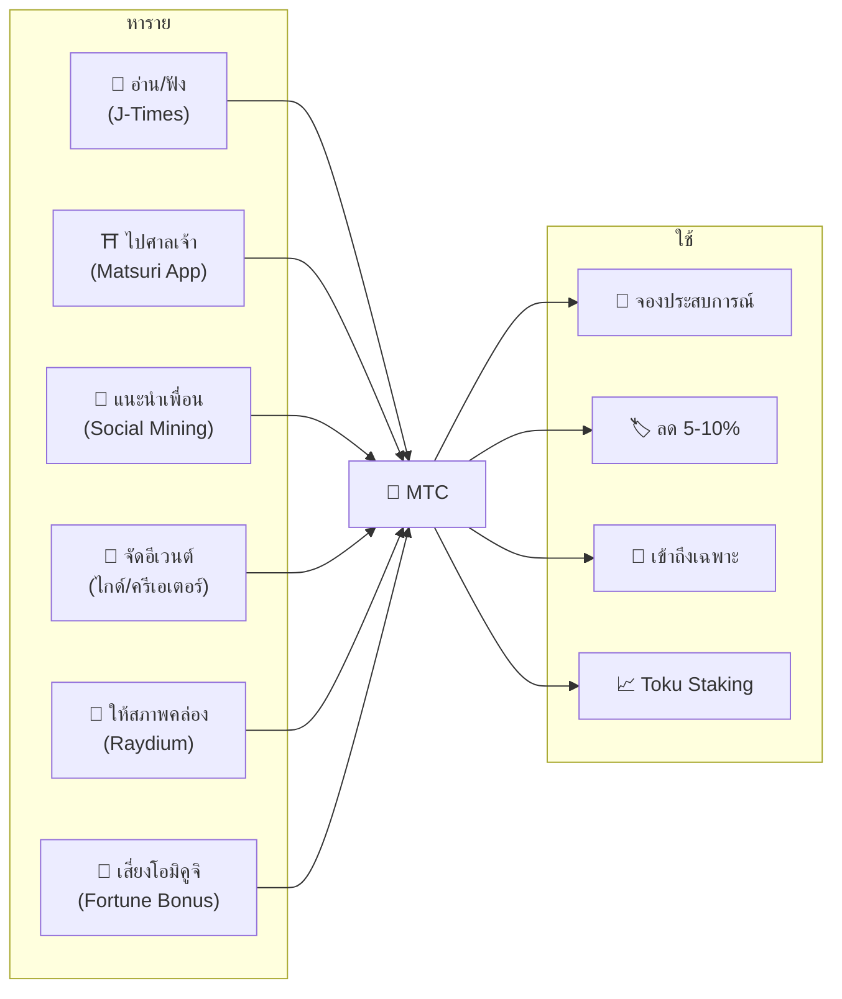
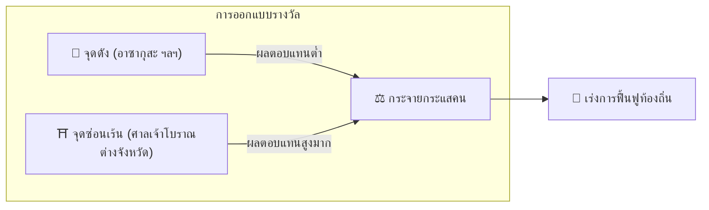
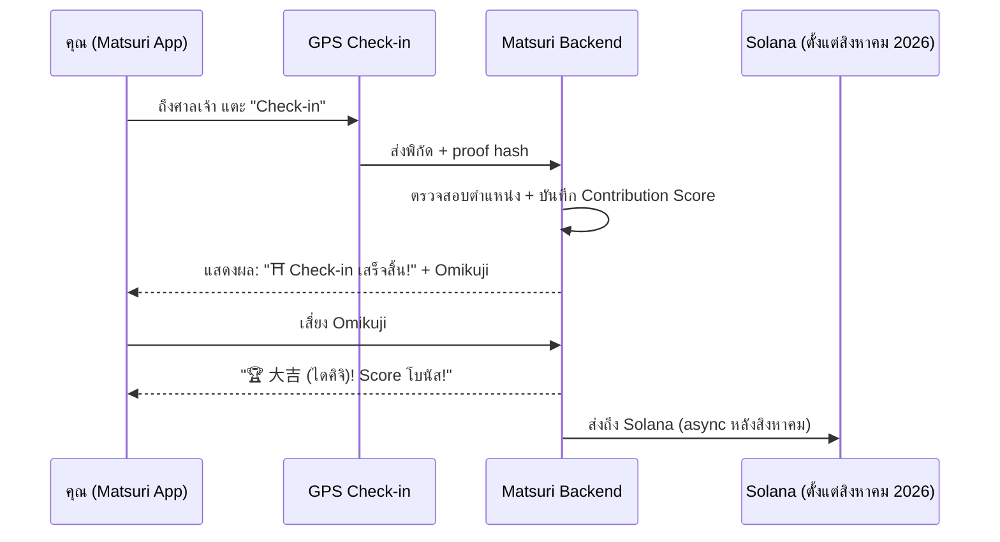
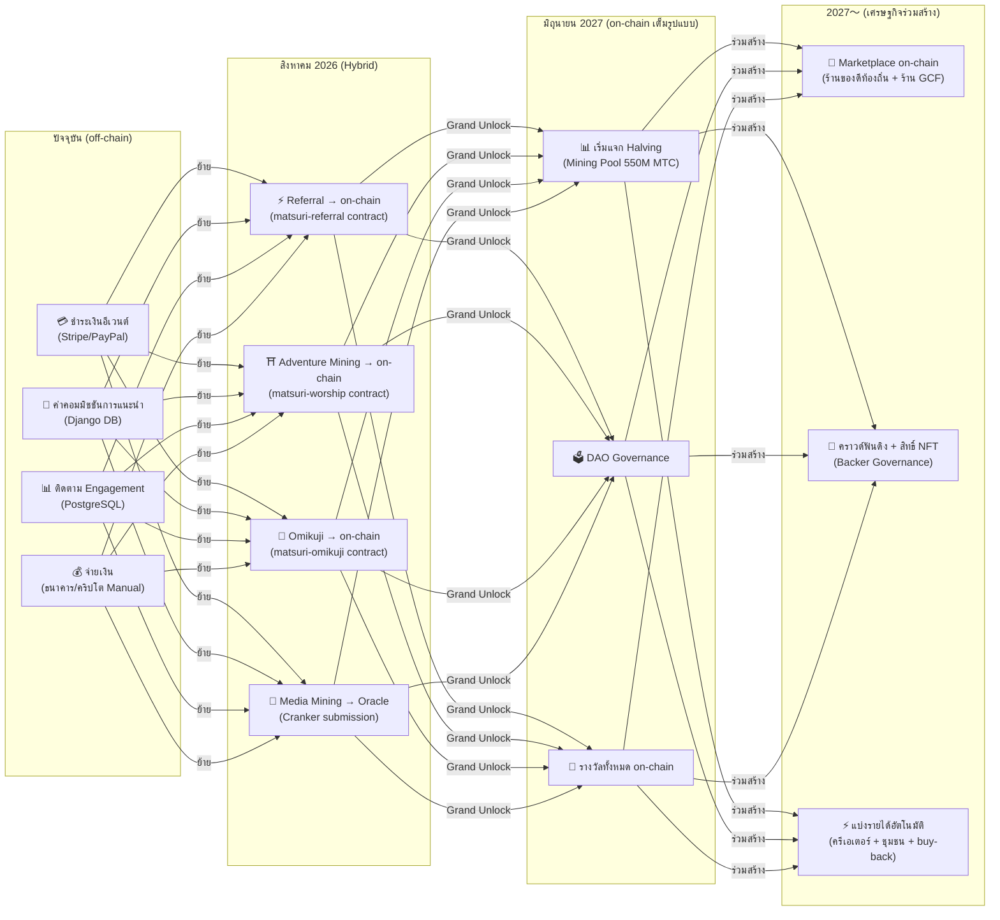

import useBaseUrl from '@docusaurus/useBaseUrl';

# ⛏️ 5 เสาหลักของ Mining และวิธีหารายได้

> **"การมีส่วนร่วม" กับวัฒนธรรม กลายเป็นคุณค่าโดยตรง**
> อ่าน เดิน เชื่อมต่อ สร้าง สนับสนุน — การกระทำแต่ละอย่างของคุณสร้าง MTC

<small>*※ "Mining" คืออะไร? — ใน Bitcoin และอื่นๆ คอมพิวเตอร์ทำการคำนวณปริมาณมหาศาลเพื่อรับเหรียญใหม่เป็นรางวัล เรียกว่า "Mining" (การขุด) ใน MTC ไม่ใช่พลังคำนวณของคอมพิวเตอร์ แต่เป็น **การกระทำของคุณเอง** — การอ่านบทความ ไปเยือนศาลเจ้า จัดอีเวนต์ — ที่เป็น "การขุด" แทนการขุดทอง การมีส่วนร่วมกับวัฒนธรรมสร้าง MTC นี่คือ "Mining" ของเรา*</small>

> หารายได้จากการกระทำ ใช้กับประสบการณ์ ถือไว้ให้เติบโต

MTC ไม่ใช่โทเคนเก็งกำไร ทุกการกระทำสร้างคุณค่าและได้คุณค่ากลับคืน หมุนเวียนในเศรษฐกิจจริง Web Application และ Admin Dashboard **เปิดใช้งานอยู่แล้ว** ปัจจุบันบันทึก Contribution Score แบบ off-chain (Django) และจะทยอยย้ายเป็น on-chain ตั้งแต่สิงหาคม 2026

:::tip ภาพรวม
MTC มี **เศรษฐกิจหมุนเวียนเต็มรูปแบบ**: หารายได้ผ่านกิจกรรมจริง ใช้กับประสบการณ์จริง มูลค่าเติบโตไปพร้อมกับการขยายของระบบนิเวศ หน้านี้จะอธิบายกลไกเหล่านี้โดยละเอียด
:::

---

## MTC Lifecycle

---

## 5 เสาหลักของ Mining

### 1. 📖 Media Mining (อ่าน ฟัง ตอบ เพื่อรับรางวัล)

**เชื่อมโยงกับสื่อทางการ "J-Times"**

ความรู้ยกระดับคุณภาพการเดินทางอย่างมาก เปิด **แอป J-Times** และเพลิดเพลินกับคอนเทนต์เกี่ยวกับวัฒนธรรมญี่ปุ่น นอกจากการเรียนรู้ผ่านข้อความและเสียง ยังให้รางวัลกับ **การทดสอบความเข้าใจ (Quiz)** MTC จะถูกมอบให้โดยอัตโนมัติทุกครั้งที่ทำการกระทำเสร็จสิ้น

| การกระทำ | เงื่อนไขเสร็จสิ้น | รางวัลโดยประมาณ |
| :--- | :--- | :---: |
| **📰 อ่านบทความ** | เลื่อนถึง 75% | 2〜30 MTC |
| **🎧 ฟังพอดแคสต์** | เล่นจนจบ | 2〜30 MTC |
| **🎬 ดูวิดีโอ** | ปิดหน้ารายละเอียดหลังดู | 2〜30 MTC |
| **📤 แชร์คอนเทนต์** | แสดง share sheet | 2〜30 MTC |
| **✅ ตอบ Quiz** | ผ่านการทดสอบความเข้าใจ | 2〜30 MTC |

<small>*※ จำนวนรางวัลปรับตามประเภท/ความยาวของคอนเทนต์ และสมดุลอุปทานในระบบนิเวศ*</small>

:::tip เวลาว่างกลายเป็น Mining
เวลาระหว่างเดินทางหรือพักกลายเป็นเวลาที่สร้างรางวัลโดยตรง
:::

:::info รองรับออฟไลน์
ไม่มีสัญญาณอินเทอร์เน็ตในศาลเจ้าชนบท? ไม่เป็นไร J-Times จะบันทึกกิจกรรมไว้ในเครื่อง **และซิงก์อัตโนมัติเมื่อกลับมาออนไลน์** (offline queue เก็บได้ 7 วัน) MTC ที่ได้จะไม่หายไป
:::

**ขั้นตอนเบื้องหลัง:**
1. แอป J-Times ตรวจจับการกระทำของคุณ (อ่านจบ ดูจบ แชร์ ฯลฯ)
2. บันทึกในเครื่องแม้ออฟไลน์ (เก็บ 7 วัน)
3. ส่งไปเซิร์ฟเวอร์เพื่อตรวจสอบเมื่อกลับมาออนไลน์
4. สะท้อนในยอดคงเหลือในฐานะ Contribution Score
5. ตั้งแต่สิงหาคม 2026: บันทึก Score ที่ผ่านการตรวจสอบแล้วผ่าน Oracle ขึ้น on-chain ตรวจสอบบน Blockchain ได้

---

### 2. ⛩️ Adventure Mining (เดินเพื่อรับรางวัล)

**โปรเจกต์ "จาริกแสวงบุญ" — Smart Contract เสร็จสมบูรณ์ เตรียม deploy Mainnet สิงหาคม 2026**

ฟีเจอร์รุ่นใหม่ที่ใช้ GPS และแรงจูงใจโทเคนควบคุม "การไหลของคน" ในโลกจริง แผนที่ดินแดนศักดิ์สิทธิ์เปิดใช้งานใน Matsuri Web App แล้ว ปัจจุบันบันทึก Score แบบ off-chain และเริ่มแจกจ่ายรางวัล on-chain หลัง deploy Smart Contract สิงหาคม 2026

>**หากหารายได้ได้ ก็ไปต่างจังหวัด**
> ความสมเหตุสมผลทางเศรษฐกิจนี้จะแก้ overtourism และเร่งการฟื้นฟูท้องถิ่น

**กลไก Check-in:**

  
  

    
<strong>Worship Mining</strong> — เช็กอินใกล้ศาลเจ้า ตรวจจับพลังด้วย AR omikuji เพื่อรับโบนัส MTC ตัวคูณจาก 1.0× ถึง 10.0×

  

**หลักการพื้นฐาน — ยิ่งจุดผู้มาเยือนน้อย ยิ่งหารายได้ได้มาก:**

| ประเภทไซต์ | ตัวอย่าง | รางวัลโดยประมาณ (ต่อ Check-in) |
| :--- | :--- | :---: |
| 🏙️ **หลัก** | Sensō-ji, Kiyomizu-dera, Fushimi Inari | 30〜50 MTC |
| 🌆 **แกนท้องถิ่น** | Ichinomiya ของแต่ละจังหวัด, ศาลเจ้าใหญ่ภูมิภาค | 50〜100 MTC |
| 🏞️ **ท้องถิ่น** | ศาลเจ้าเก่าแก่ในต่างจังหวัด | 100〜150 MTC |
| ⛰️ **Frontier** | วัดบนภูเขา, ดินแดนศักดิ์สิทธิ์บนเกาะห่างไกล | 150〜200 MTC |

<small>*※ ข้างต้นคือรางวัลฐานโดยประมาณ อาจทวีคูณตามมัลติพลายเออร์ของโอมิคูจิ*</small>

**ปัจจัยเพิ่ม Score:**
- **มัลติพลายเออร์โอมิคูจิ** — โบนัสสุ่มทุก Check-in ถ้าเป็น 大吉 (ไดคิจิ) รางวัลทวีคูณ
- **ความถี่การเยือน** — ผู้เยือนเป็นประจำได้มากขึ้นเมื่อเวลาผ่านไป
- **ไซต์ที่มีสปอนเซอร์** — อปท.สามารถบูสต์ไซต์เฉพาะได้

:::info Contribution Score → MTC
กิจกรรมของคุณสะสมในฐานะ **Contribution Score** ในแต่ละ Halving Epoch (เริ่มมิถุนายน 2027) Score จะถูกแปลงเป็น MTC จากมายนิ่งพูล 550M ยิ่งมีส่วนร่วมกับชุมชนมาก ยิ่งได้รับ MTC มาก ค่าสัมประสิทธิ์การบูสต์จะถูกกำหนดทีละขั้นและนำไปบันทึกใน Smart Contract — รับประกันการกระจายที่เป็นธรรมตามขนาดพูลจริง
:::

---

### 3. 🤝 Social Mining (เชื่อมต่อเพื่อรับรางวัล)

แค่แนะนำเพื่อนก็ได้ MTC

#### รางวัลแนะนำสำหรับผู้ใช้ทั่วไป

กลไกง่าย เมื่อเพื่อนสมัครผ่านลิงก์แนะนำของคุณ จะได้ **300 MTC ต่อการแนะนำตรง 1 ครั้ง**

| เงื่อนไข | รางวัล |
| :--- | :--- |
| เพื่อนที่คุณแนะนำสมัคร | **300 MTC** |

เท่านั้น ไม่มีรางวัลแบบหลายชั้น

#### รางวัลแนะนำสำหรับตัวแทน GCF

[สมาชิก GCF](/docs/gcf) เป็น **ตัวแทนอย่างเป็นทางการ** ที่รับผิดชอบการขยายระบบนิเวศ และมีโครงสร้างรางวัลที่ลึกกว่า

| ชั้น | ความสัมพันธ์ | ค่าคอมมิชชัน |
| :---: | :--- | :---: |
| **L1** | แนะนำตรง | **20%** |
| **L2** | การแนะนำของผู้ที่ถูกแนะนำ | **5%** |
| **L3** | ลำดับที่ 3 | **5%** |
| **L4** | ลำดับที่ 4 | **5%** |

:::note เกี่ยวกับระบบตัวแทน GCF
รางวัลหลายชั้นนี้ใช้กับตัวแทนอย่างเป็นทางการที่มี GCF Membership (เฉพาะคำเชิญ) เท่านั้น ผู้ใช้ทั่วไปได้เฉพาะการแนะนำตรง (300 MTC)
ค่าคอมมิชชันตัวแทน GCF คำนวณจาก **กิจกรรมทางเศรษฐกิจจริงของผู้ถูกแนะนำ (ซื้อประสบการณ์ เข้าอีเวนต์ ฯลฯ)** แค่รวบรวมคนไม่ก่อให้เกิดรางวัล
:::

**กลไก En-Mining Score (สำหรับตัวแทน GCF):**

Contribution Score คำนวณจาก 2 องค์ประกอบ:
- **ความกว้างของเครือข่าย** (30%) — พาคนมาได้กี่คน
- **กิจกรรมทางเศรษฐกิจ** (70%) — การซื้อจริงของเครือข่ายที่แนะนำ

Score สะสมตามเวลาและแปลงเป็น MTC ในแต่ละ Halving Epoch

#### GCF Admin Dashboard — เว็บเปิดใช้งานแล้ว

สมาชิก GCF ได้สิทธิ์เข้าถึง Admin Dashboard เฉพาะ

| ฟีเจอร์ | ทำอะไรได้ |
| :--- | :--- |
| **🎪 สร้างอีเวนต์** | ออกแบบและลงประกาศอีเวนต์หรือทัวร์ของคุณเอง |
| **📢 ส่งคอนเทนต์** | ส่งและเผยแพร่บทความ/คอนเทนต์ J-Times |
| **📊 ติดตามการแนะนำ** | ติดตามพฤติกรรม/รายได้ของผู้ใช้ที่แนะนำแบบเรียลไทม์ |

:::warning ปัจจุบัน off-chain → ย้ายเป็น on-chain สิงหาคม 2026
ค่าคอมมิชชันการแนะนำปัจจุบันติดตามใน Django (PostgreSQL) และจ่ายผ่านโอนเงินธนาคารหรือคริปโต ตั้งแต่ **สิงหาคม 2026** จะย้ายเป็น **Matsuri Referral Smart Contract** บน Solana ทำให้การจ่ายเงินตรวจสอบได้บน on-chain
:::

  

*Meetup ชุมชนที่โกลเดนไก — ความเชื่อมโยงเป็นพลัง mining*

---

### 4. 🎓 Creator & Guide Mining (สร้างเพื่อรับรางวัล)

ไม่ใช่แค่บริโภค แต่บนแพลตฟอร์ม Matsuri **ใครก็ได้**สามารถสร้างคอนเทนต์และหารายได้ ถ้าคุณเป็นสมาชิก GCF ไกด์ หรือครีเอเตอร์ หารายได้ด้วยวิธีต่อไปนี้ได้

| กิจกรรม | วิธีหารายได้ |
| :--- | :--- |
| **🗺️ จัดทัวร์** | ค่าคอมมิชชันไกด์ (ตั้งต่ออีเวนต์) + ทิป |
| **🎫 ขายตั๋วอีเวนต์** | ส่วนแบ่งรายได้ผ่าน EventPurchase |
| **📚 เผยแพร่คอร์ส** | ค่าธรรมเนียมต่อการเรียน (ส่วนแบ่งครีเอเตอร์) |
| **🎙️ ผลิตตอนพอดแคสต์** | รายได้ subscription |
| **🤝 เปิดแคมเปญคราวด์ฟันดิง** | ติดตามการบริจาคบน Solana on-chain |
| **🛍️ เปิดร้านค้าผู้ใช้** | ขายงานฝีมือ/สินค้าโดยตรง |

**ระบบทิป:** หลังจบอีเวนต์ ผู้เข้าร่วมสามารถส่งทิปให้ไกด์ได้ (แบบ Uber) ทิปประมวลผลผ่าน Stripe และติดตามได้บน leaderboard สาธารณะ

:::tip การผลิตที่ช่วยเหลือด้วย AI
โฮสต์อีเวนต์สามารถใช้ **AI Assistant ในตัว (GPT-4 Turbo)** สร้างคำอธิบาย แปลอัตโนมัติ 5 ภาษา และสร้าง metadata ปรับ SEO ได้ในแดชบอร์ด
:::

---

### 5. 🏦 Liquidity Mining (ฝากเพื่อรับรางวัล)

>**มาเป็นธนาคารกัน**

จัดหาสภาพคล่อง MTC/SOL บน Raydium DEX และค้ำจุนพื้นฐานการซื้อขายในระยะแรกของระบบนิเวศ สำหรับผู้ให้สภาพคล่องช่วงแรก เราจัดเตรียมโปรแกรมรางวัลพิเศษในฐานะ "หุ้นส่วนผู้ก่อตั้ง"

| รายการ | รายละเอียด |
| :--- | :--- |
| **กลุ่มเป้าหมาย** | ผู้ถือ MTC และ SOL ทุกคน |
| **ผลตอบแทนรายปีเป้าหมาย** | **20%** (แรงจูงใจสภาพคล่องระยะแรก ตั้งเป็น Risk Premium) |
| **DEX** | Raydium (Solana) |
| **ความสำคัญ** | รับประกันสภาพคล่องระยะแรก สร้างสภาพแวดล้อมการซื้อขายที่มั่นคง |

---

## 🎲 Omikuji Bonus

ทุก Check-in ของ Adventure Mining มี Omikuji (เสี่ยงเซียมซี) ฟรีรวมอยู่ด้วย Smart Contract รูปแบบโอมิคูจิที่ทำงาน **ฟรี (เสียเพียง Gas Fee)** เมื่อ Check-in เสร็จสิ้น

| ดวง | มัลติพลายเออร์รางวัล | โบนัสเพิ่ม |
| :--- | :---: | :--- |
| 🏆 **大吉 (ไดคิจิ — โชคยิ่งใหญ่)** | รางวัลฐาน × มัลติพลายเออร์สูงสุด | Goshuin NFT |
| ✨ **吉 (คิจิ — โชคดี)** | รางวัลฐาน × มัลติพลายเออร์สูง | — |
| 🌸 **小吉 (โชคิจิ — โชคเล็ก)** | รางวัลฐาน × มัลติพลายเออร์เล็ก | — |
| 🍃 **末吉 (ซุเอคิจิ — โชคท้าย)** | รางวัลฐาน × 1.0 | — |
| 💀 **凶 (เคียว — อัปมงคล)** | รางวัลฐาน × 1.0 | — |

ความน่าจะเป็นและมัลติพลายเออร์ปรับได้จาก GCF Admin Dashboard และทีมดูแลจัดการตามสมดุลอุปทาน MTC ของระบบนิเวศ ผลลัพธ์ถูกกำหนดด้วย **Commit-Reveal Protocol ป้องกันการปลอมแปลง** บน Solana ไม่มีใครเปลี่ยนผลลัพธ์ได้หลังเฟส Commit

<small>*※ แม้ได้ 凶 (เคียว) ก็ยังได้รางวัลฐาน ออกแบบให้ตอบแทนการกระทำ Check-in ในตัวมันเอง*</small>

:::note ไม่ใช่การพนัน
ไม่ต้องวางเดิมพันทางการเงินใดๆ เป็น **โบนัสสุ่มสำหรับการกระทำ "ได้มาเยือน"** การรวบรวม NFT เฉพาะจะปลดล็อกสิทธิ์เข้าอีเวนต์พิเศษ
:::

---

## วิธีใช้ MTC

| Use Case | ข้อดี | ใช้ได้หรือไม่ |
| :--- | :--- | :---: |
| **🎫 จองประสบการณ์** | จ่ายด้วย MTC สำหรับทัวร์ อีเวนต์ กิจกรรมวัฒนธรรม | ✅ ใช้ได้ |
| **🏷️ ส่วนลด** | ลด 5-10% จากราคาเยนเมื่อจ่ายด้วย MTC | ✅ ใช้ได้ |
| **🔑 เข้าถึงเฉพาะ** | อีเวนต์ที่ต้อง NFT เปิด, พิธี VIP เฉพาะ, ทัวร์ส่วนตัว | ✅ ใช้ได้ |
| **📈 Toku Staking** | ล็อก MTC เพื่อบูสต์ Contribution Score (บูสต์สูงสุด ~50%) | 🔜 สิงหาคม 2026 |
| **🗳️ DAO Governance** | โหวต Treasury, Protocol Upgrade, การรับรองไซต์ | 🔜 2027 |
| **🛍️ ร้านพันธมิตร** | จ่ายที่ร้านค้า/ร้านอาหารพันธมิตร | 🔜 ขยายตัว |

:::info MTC ในฐานะช่องทางชำระเงิน
ใน Matsuri App MTC เป็นช่องทางชำระเงินระดับหนึ่งเทียบเท่า Credit Card และ Solana Pay ไม่ต้องแปลง — เลือก "จ่ายด้วย MTC" ตอน checkout แล้วหักจากยอดคงเหลือทันที
:::

### เกี่ยวกับการแปลง MTC เป็นเงินสด

:::warning สำคัญ: เราไม่ให้บริการแปลง/แลก MTC
เนื่องจากทีมงาน Matsuri ไม่ได้จดทะเบียนเป็นผู้ประกอบธุรกิจแลกเปลี่ยนคริปโต **เราไม่ดำเนินการแลกเปลี่ยน MTC กับเงินตรา (เยน ดอลลาร์ ฯลฯ) โดยตรงเลย**

หากต้องการแลก MTC เป็นคริปโตหรือเงินตราอื่น ทำได้ด้วยตนเองตามขั้นตอน:
1. จัดการ MTC ใน Wallet รองรับ Solana เช่น **Phantom Wallet**
2. แลก MTC → SOL บน **Raydium (DEX)**
3. แลก SOL เป็นเงินตราบน Exchange คริปโต (CEX)

อนาคตเรามองการ List บน CEX (Centralized Exchange) เมื่อถึงตอนนั้นจะมีวิธีแลกที่สะดวกกว่า
:::

---

## ตัวอย่าง: 1 วันในเศรษฐกิจ MTC

> **เช้า:** อ่านบทความ J-Times 3 บทบนรถไฟ → รับ MTC
> **บ่าย:** ไปศาลเจ้าต่างจังหวัดด้วย Matsuri App → Check-in, เสี่ยง 吉 (×1.5) → ได้ MTC เพิ่ม
> **เย็น:** ใช้ MTC ที่ได้ จองทัวร์วัฒนธรรมโกลเดนไก ¥9,000 ด้วยส่วนลด 10% (จ่ายเทียบเท่า ¥8,100)
> **ผลลัพธ์:** ความอยากรู้ทางวัฒนธรรมของคุณเปลี่ยนเป็นประสบการณ์จริง ไกด์ ศาลเจ้า ชุมชน ได้รับเงินโดยตรง ไม่มี OTA เก็บค่าคอม 20%

---

## ความยั่งยืนทางเศรษฐกิจ

:::warning จะเกิดอะไรถ้าพูล Mining หมด?
พูล Halving 550M MTC ถูกออกแบบให้ยืนยาว **หลายทศวรรษ** ปริมาณปล่อยลดครึ่งทุก 2 ปี เชิงคณิตศาสตร์จึงไม่มีทางถึง 100% รางวัลต่อเนื่องระยะยาว (รายละเอียดดู [Tokenomics](/docs/tokenomics)) แม้หลังปล่อยน้อยมาก:

- **Transaction Fees** ยังให้รางวัลผู้ร่วมเครือข่ายจากกิจกรรม on-chain
- **Buy-back Protocol** (20-25% ของรายได้ธุรกิจ) สร้างแรงซื้ออย่างคงเส้นคงวา
- **Toku Staking** ล็อกอุปทานหมุนเวียน ลดแรงขาย
- **รายได้ธุรกิจจริง** (อีเวนต์ สมาชิก คอร์ส) ค้ำจุนระบบนิเวศแยกจากการแจกโทเคน

MTC ค้ำจุนด้วย **เศรษฐกิจจริง** — ไม่ใช่แค่ Token Emission
:::

---

## On-chain Transition Roadmap

เศรษฐกิจ Matsuri กำลังย้ายทีละขั้นจาก off-chain (Django/PostgreSQL) สู่ on-chain (Solana Smart Contract) ผ่านการย้ายนี้ การดำเนินการทั้งหมดจะเป็น **Trustless, Auditable, Permissionless**

| เฟส | ไทม์ไลน์ | สิ่งที่เป็น on-chain |
| :--- | :--- | :--- |
| **Phase 1 (ปัจจุบัน)** | เปิดใช้งาน | MTC Token (SPL), Raydium LP, Solana Pay Verification |
| **Phase 2 (สิงหาคม 2026)** | Smart Contract Mainnet Deploy | ค่าคอมแนะนำ, รางวัล Adventure Mining, สุ่ม Omikuji, Media Mining ผ่าน Oracle |
| **Phase 3 (มิถุนายน 2027)** | Grand Unlock | แจก Halving 550M MTC, DAO Governance, กระจายศูนย์เต็มรูปแบบ |
| **Phase 4 (2027〜)** | เศรษฐกิจร่วมสร้าง | Marketplace on-chain (ร้านของดีท้องถิ่น + ร้าน GCF), คราวด์ฟันดิงสิทธิ์ NFT, แบ่งรายได้อัตโนมัติให้ครีเอเตอร์ + ชุมชน + buy-back |

:::warning ทำไมไม่ทำทุกอย่าง on-chain ทันที?
**เราจะไม่เปิดใช้งานฟังก์ชัน on-chain ที่เงินผู้ใช้เคลื่อนไหวจนกว่า Security Audit จะเสร็จสมบูรณ์** นี่คือหลักการของเรา

สถานการณ์ปัจจุบัน:
- **ความเสี่ยงต่อเงินผู้ใช้: ไม่มี** — ปัจจุบันรางวัล/Score ทั้งหมดจัดการ off-chain (Django) ไม่มีฟังก์ชันที่เงินผู้ใช้เคลื่อนผ่าน Smart Contract เปิดใช้งาน
- **กำหนดการ Audit: Q2〜Q3 2026** — ผ่าน Security Audit ระดับมืออาชีพ deploy Mainnet ทีละสัญญาตามความปลอดภัยที่ยืนยัน
- **Audit เสร็จสิ้น = เงื่อนไขก่อน Deploy** — ไม่เปิดใช้งาน Smart Contract ที่ยัง Audit ไม่เสร็จบน Mainnet เด็ดขาด

รางวัลช่วง off-chain ก็ตรวจสอบได้ — ทุกธุรกรรมมี `solana_signature` เป็นหลักฐานการชำระเงิน
:::

---

**[▶ ถัดไป: Tokenomics](/docs/tokenomics)** ｜ **[◀ ก่อนหน้า: Ecosystem](/docs/ecosystem)**
