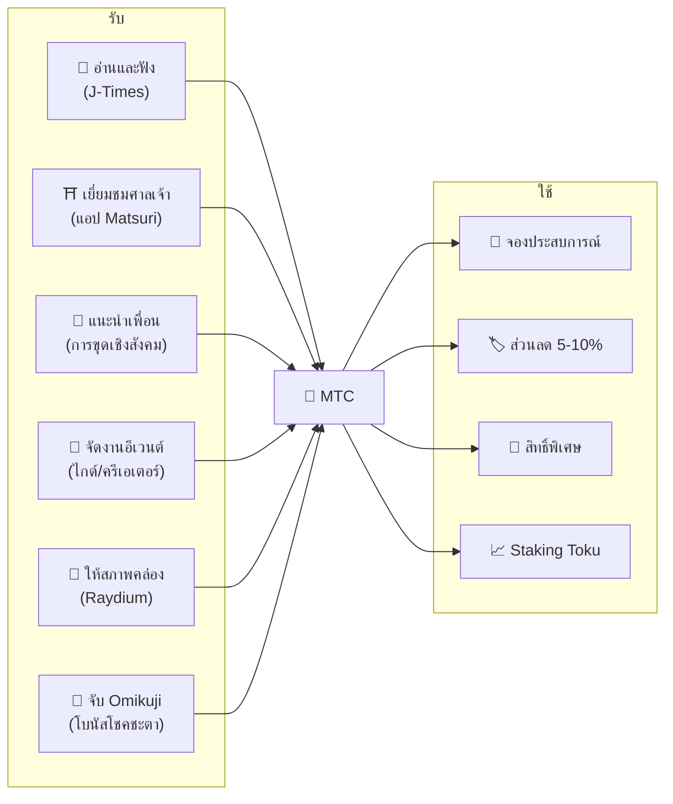
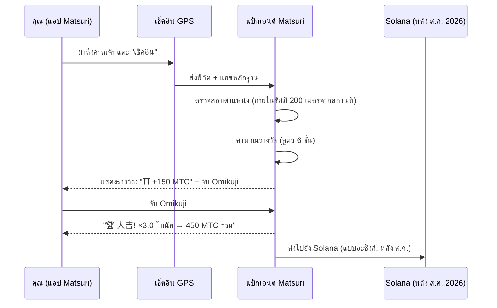
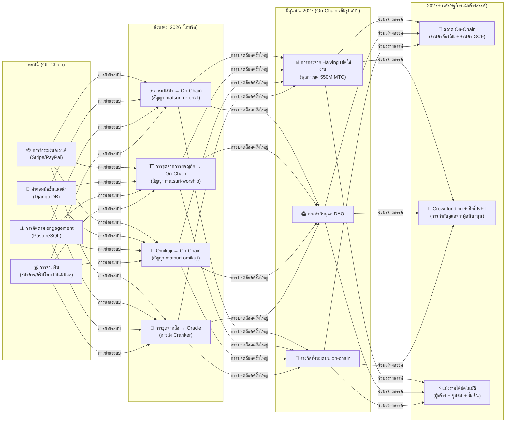

# 💎 วิธีรับและใช้ MTC

> **รับจากการกระทำ ใช้จ่ายกับประสบการณ์ ถือไว้เพื่อเติบโต**
> MTC ไม่ใช่แค่โทเคนเก็งกำไร — มันไหลเวียนผ่านเศรษฐกิจจริงที่ทุกการกระทำสร้างและจับคุณค่าได้

:::tip ภาพรวม
MTC มี **เศรษฐกิจหมุนเวียนครบวงจร**: คุณรับมันผ่านกิจกรรมจริง ใช้จ่ายกับประสบการณ์จริง และมูลค่าของมันเติบโตตามการขยายตัวของระบบนิเวศ หน้านี้จะแสดงให้คุณเห็นอย่างชัดเจน
:::

---

## วงจรชีวิตของ MTC



---

## วิธีรับ MTC

### 1. 📖 การขุดจากสื่อ — อ่าน ฟัง และดูบน J-Times

เปิด **แอป J-Times** และเสพเนื้อหาเกี่ยวกับวัฒนธรรมญี่ปุ่น ทุกการกระทำที่เสร็จสมบูรณ์จะได้รับ MTC โดยอัตโนมัติ

| การกระทำ | เกณฑ์การเสร็จสิ้น | รางวัล |
| :--- | :--- | :---: |
| **อ่านบทความ** | เลื่อนลงถึง 75% ของความลึก | MTC |
| **ฟังพอดแคสต์** | เล่นจนจบ | MTC |
| **ดูวิดีโอ** | ออกจากหน้ารายละเอียดหลังดูจบ | MTC |
| **แชร์เนื้อหา** | แสดงแผงแชร์ | MTC |
| **ทำแบบทดสอบ** | ผ่านการทดสอบความเข้าใจ | MTC (ทันที) |

:::info รองรับออฟไลน์
ไม่มีอินเทอร์เน็ตที่ศาลเจ้าในชนบท? ไม่เป็นไร J-Times บันทึกกิจกรรมของคุณในเครื่องและ **ซิงค์อัตโนมัติเมื่อคุณกลับมาออนไลน์** (คิวออฟไลน์ที่เก็บข้อมูล 7 วัน) คุณจะไม่สูญเสีย MTC ที่ได้รับเด็ดขาด
:::

**วิธีการทำงานเบื้องหลัง:**
1. `EngagementTracker` ในแอปตรวจจับเหตุการณ์การเสร็จสิ้น
2. การกระทำจะถูกจัดคิวในเครื่อง (แม้ออฟไลน์)
3. เมื่อเครือข่ายกลับมา การกระทำจะถูกรวมกลุ่มและส่งไปยัง Django API
4. API ตรวจสอบและเครดิต MTC ไปยังยอดคงเหลือของคุณ
5. หลังสิงหาคม 2026: การกระทำจะถูกส่งออน-เชนผ่าน Cranker oracle

---

### 2. ⛩️ การขุดจากการผจญภัย — เยี่ยมชมสถานที่ศักดิ์สิทธิ์ด้วยแอป Matsuri

เปิด **แอป Matsuri** ค้นหาศาลเจ้าหรือวัดบนแผนที่สถานที่ศักดิ์สิทธิ์ ไปที่นั่น และเช็คอิน ยิ่งสถานที่มีผู้เยี่ยมชมน้อย คุณยิ่งได้รับมาก

**ขั้นตอนทีละขั้น:**



**ตัวคูณรางวัล — ทำไมชนบทจ่ายมากกว่า:**

| ประเภทสถานที่ | ตัวอย่าง | ตัวคูณ |
| :--- | :--- | :---: |
| 🏙️ **หลัก** | Sensoji, Kiyomizu-dera, Fushimi Inari | ×1 |
| 🌆 **ภูมิภาค** | อิชิโนมิยะประจำจังหวัด, ศาลเจ้าใหญ่ประจำภูมิภาค | ×2 |
| 🏞️ **ชนบท** | ศาลเจ้าประวัติศาสตร์ในชนบท | ×5 |
| ⛰️ **แนวหน้า** | วัดบนภูเขา, สถานที่ศักดิ์สิทธิ์บนเกาะห่างไกล | ×10 |

**รวมถึงโบนัสเพิ่มเติม:**
- **โบนัสผู้บุกเบิก** — ผู้เยี่ยมชมคนแรกของวันได้รับมากที่สุด (การลดลงแบบฮาร์มอนิก)
- **โบนัสสตรีค** — เยี่ยมชมติดต่อกันหลายวันเพื่อรับสูงสุด +50%
- **Omikuji** — จับฉลากโชคชะตาแบบสุ่ม: 大吉 = ×3.0, 吉 = ×1.5, 小吉 = ×1.2
- **บีคอนที่ได้รับการสนับสนุน** — เทศบาลฝาก MTC เพื่อส่งเสริมสถานที่เฉพาะ

> **ตัวอย่าง:** เยี่ยมชมศาลเจ้าบนภูเขาที่ห่างไกล (×10) ในฐานะผู้เยี่ยมชมคนที่ 2 ของวัน พร้อมสตรีค 5 วัน (+10%) และจับ 吉 (×1.5) = รางวัลฐานถูกขยาย **16.5 เท่า**

---

### 3. 🤝 การขุดเชิงสังคม — แนะนำเพื่อนและสร้างเครือข่าย

แชร์รหัสแนะนำของคุณ เมื่อเครือข่ายของคุณทำธุรกรรม คุณจะได้รับโดยอัตโนมัติ

| ชั้น | ความสัมพันธ์ | ค่าคอมมิชชัน |
| :---: | :--- | :---: |
| **L1** | คุณ → เพื่อน (โดยตรง) | **20%** |
| **L2** | เพื่อน → เพื่อนของเพื่อน | **5%** |
| **L3** | ระดับที่ 3 | **5%** |
| **L4** | ระดับที่ 4 | **5%** |

**วิธีการทำงานของคะแนน En-Mining:**

```
คะแนนของคุณ = (ผู้ถูกแนะนำโดยตรง × 30%) + (ปริมาณธุรกรรมของเครือข่าย × 70%)
              × ตัวคูณ Staking Toku (1.0× – 10.0×)
              × การเพิ่มจากตำแหน่ง (+5% ต่อฤดูกาลจัดอันดับ, สูงสุด +50%)
```

> **ข้อมูลสำคัญ:** 70% ของคะแนนมาจาก **กิจกรรมทางเศรษฐกิจจริง** ในเครือข่ายของคุณ ไม่ใช่แค่การสมัคร การเชิญ 1,000 คนที่ไม่เคยใช้จ่ายจะได้น้อยกว่าการเชิญ 10 คนที่ใช้จ่ายจริง

:::warning ปัจจุบัน Off-Chain → ย้ายไป On-Chain สิงหาคม 2026
ค่าคอมมิชชันจากการแนะนำปัจจุบันถูกติดตามใน Django (PostgreSQL) และจ่ายผ่านการโอนเงินหรือคริปโต เริ่มตั้งแต่ **สิงหาคม 2026** ระบบค่าคอมมิชชันจากการแนะนำทั้งหมดจะย้ายไปยัง **สัญญาอัจฉริยะ Matsuri Referral** บน Solana — ทำให้การจ่ายเงินเป็นแบบ trustless ทันที และตรวจสอบได้บนเชน
:::

---

### 4. 🎪 การขุดจากครีเอเตอร์และไกด์ — จัดงานอีเวนต์ สร้างเนื้อหา

หากคุณเป็นสมาชิก GCF ไกด์ หรือครีเอเตอร์:

| กิจกรรม | วิธีที่คุณได้รับ |
| :--- | :--- |
| **จัดทัวร์** | ค่าคอมมิชชันไกด์ (กำหนดตามอีเวนต์) + ทิป |
| **ขายตั๋วอีเวนต์** | แบ่งรายได้ผ่าน EventPurchase |
| **เผยแพร่คอร์ส** | ค่าธรรมเนียมต่อการลงทะเบียน |
| **สร้างตอนพอดแคสต์** | รายได้จากการสมัครสมาชิก |
| **เปิดแคมเปญ crowdfunding** | การบริจาคผ่าน Solana |

**ระบบทิป:** หลังจากทุกอีเวนต์ แขกสามารถให้ทิปไกด์ได้ (แบบ Uber) ทิปถูกประมวลผลผ่าน Stripe และแสดงบนลีดเดอร์บอร์ดสาธารณะ

---

### 5. 🏦 การขุดจากสภาพคล่อง — ให้สภาพคล่องบน Raydium

ให้สภาพคล่อง MTC/SOL บน Raydium DEX และรับรางวัล

| รายการ | รายละเอียด |
| :--- | :--- |
| **APY เป้าหมาย** | 50% (สิ่งจูงใจสภาพคล่องช่วงแรก) |
| **DEX** | Raydium (Solana) |
| **ใคร** | ทุกคนที่ถือ MTC และ SOL |

---

### 6. 🎲 โบนัส Omikuji — ตัวคูณโชคชะตา

ทุกการเช็คอินจากการขุดจากการผจญภัยรวมการจับ Omikuji (ดวง) ฟรี ตัวคูณนี้ถูกใช้เพิ่มเติมจากโบนัสอื่นทั้งหมด

| ดวง | ความน่าจะเป็น | ตัวคูณ |
| :--- | :---: | :---: |
| 🏆 **大吉** (มหาโชค) | 5% | ×3.0 |
| ✨ **吉** (โชคดี) | 15% | ×1.5 |
| 🌸 **小吉** (โชคเล็กน้อย) | 30% | ×1.2 |
| 🍃 **末吉** (โชคในอนาคต) | 35% | ×1.0 |
| 💀 **凶** (โชคร้าย) | 15% | ×1.0 |

ผลลัพธ์ถูกกำหนดโดย **โปรโตคอล commit-reveal ที่ป้องกันการแทรกแซง** บน Solana แม้แต่เซิร์ฟเวอร์ก็ไม่สามารถเปลี่ยนผลลัพธ์ของคุณหลังจากเฟส commit

---

## ที่ที่จะใช้จ่าย MTC

| กรณีการใช้งาน | ประโยชน์ | พร้อมใช้งาน |
| :--- | :--- | :---: |
| **🎫 จองประสบการณ์** | ชำระค่าทัวร์ อีเวนต์ และกิจกรรมทางวัฒนธรรมด้วย MTC | ✅ ตอนนี้ |
| **🏷️ ส่วนลด** | ลด 5–10% เทียบกับราคาเยนเมื่อชำระด้วย MTC | ✅ ตอนนี้ |
| **🔑 สิทธิ์พิเศษ** | อีเวนต์ที่ต้องมี NFT พิธี VIP เท่านั้น ทัวร์ส่วนตัว | ✅ ตอนนี้ |
| **📈 Staking Toku** | ล็อค MTC เพื่อเพิ่มตัวคูณการขุดของคุณ (1.0× → 10.0×) | 🔜 ส.ค. 2026 |
| **🗳️ การกำกับดูแล DAO** | โหวตเรื่องคลัง การอัปเกรดโปรโตคอล และการรับรองสถานที่ | 🔜 2027 |
| **🛍️ ร้านค้าพาร์ทเนอร์** | ชำระเงินที่ร้านค้าและร้านอาหารที่เข้าร่วม | 🔜 กำลังขยาย |

:::info MTC ในฐานะช่องทางชำระเงิน
ในแอป Matsuri MTC เป็นวิธีการชำระเงินระดับเดียวกับบัตรเครดิตและ Solana Pay ไม่ต้องแปลงสกุล — เลือก "ชำระด้วย MTC" ที่หน้าชำระเงินและยอดคงเหลือจะถูกหักทันที
:::

### ตัวอย่าง: หนึ่งวันในเศรษฐกิจ MTC

> **เช้า:** อ่านบทความ J-Times 3 บทความบนรถไฟ → รับ MTC
> **บ่าย:** เยี่ยมชมศาลเจ้าในชนบทด้วยแอป Matsuri → เช็คอิน จับ 吉 (×1.5) → รับ MTC มากขึ้น
> **เย็น:** ใช้ MTC ที่ได้รับจองทัวร์วัฒนธรรม Golden Gai มูลค่า ¥9,000 พร้อมส่วนลด 10% (จ่ายเทียบเท่า ¥8,100)
> **ผลลัพธ์:** ความอยากรู้ทางวัฒนธรรมของคุณได้ทุนสนับสนุนประสบการณ์จริง — และไกด์ ศาลเจ้า และชุมชนต่างได้รับการชำระเงินโดยตรง ไม่มี OTA หักค่าคอมมิชชัน 20%

### ความยั่งยืนทางเศรษฐกิจ

:::warning จะเกิดอะไรขึ้นเมื่อพูลการขุดหมด?
พูล halving 550M MTC ถูกออกแบบให้คงอยู่ **หลายทศวรรษ** (20 ยุค × 2 ปี = 40 ปีตามทฤษฎี) แต่แม้หลังจากพูลหมดแล้ว:

- **ค่าธรรมเนียมธุรกรรม** จากกิจกรรมออน-เชนยังคงให้รางวัลแก่ผู้เข้าร่วมเครือข่าย
- **โปรโตคอลซื้อคืน** (20-25% ของรายได้ธุรกิจ) สร้างแรงกดดันซื้อต่อเนื่อง
- **Staking Toku** ล็อคอุปทานหมุนเวียน ลดแรงกดดันขาย
- **รายได้จากธุรกิจจริง** (อีเวนต์ สมาชิกภาพ คอร์ส) ค้ำจุนระบบนิเวศโดยไม่ขึ้นกับการกระจายโทเคน

MTC ได้รับการสนับสนุนจาก **เศรษฐกิจจริง** — ไม่ใช่แค่การปล่อยโทเคน
:::

---

## แผนงานการย้ายไป On-Chain

เศรษฐกิจ Matsuri กำลังเคลื่อนย้ายอย่างต่อเนื่องจาก off-chain (Django/PostgreSQL) ไปสู่ on-chain (สัญญาอัจฉริยะ Solana) การเปลี่ยนผ่านนี้ทำให้การดำเนินงานทั้งหมดเป็นแบบ **trustless ตรวจสอบได้ และไม่ต้องขออนุญาต**



| เฟส | กำหนดเวลา | สิ่งที่ย้ายไป On-Chain |
| :--- | :--- | :--- |
| **เฟส 1 (ตอนนี้)** | ใช้งานจริง | โทเคน MTC (SPL), LP บน Raydium, การยืนยัน Solana Pay |
| **เฟส 2 (ส.ค. 2026)** | ปรับใช้สัญญาอัจฉริยะบน mainnet | ค่าคอมมิชชันแนะนำ, รางวัลการขุดจากการผจญภัย, การจับ Omikuji, การขุดจากสื่อผ่าน oracle |
| **เฟส 3 (มิ.ย. 2027)** | การปลดล็อคครั้งใหญ่ | การกระจาย halving 550M MTC, การกำกับดูแล DAO, การกระจายอำนาจเต็มรูปแบบ |
| **เฟส 4 (2027+)** | เศรษฐกิจร่วมสร้างสรรค์ | ตลาด on-chain (ร้านค้าท้องถิ่น + ร้านค้า GCF), crowdfunding พร้อมสิทธิ์ NFT, แบ่งรายได้อัตโนมัติไปยังผู้สร้าง + ชุมชน + ซื้อคืน |

:::warning ทำไมไม่ On-Chain ทั้งหมดตอนนี้?
การย้ายทุกอย่างไป on-chain ก่อน **การตรวจสอบความปลอดภัยระดับมืออาชีพ** (วางแผนไว้ Q2 2026) จะเป็นสิ่งที่ขาดความรับผิดชอบ แนวทางไฮบริดในปัจจุบันช่วยให้เราปรับปรุงได้อย่างปลอดภัยในขณะที่เตรียมพร้อมสำหรับการดำเนินงานแบบ trustless บน on-chain รางวัล off-chain ยังคงตรวจสอบได้ — ทุกธุรกรรมมี `solana_signature` เป็นหลักฐานการชำระเงิน
:::

---

**[▶ ถัดไป: แอปมือถือ](/docs/mobile-apps)** ｜ **[◀ ก่อนหน้า: ระบบนิเวศและการขุด](/docs/ecosystem)**
