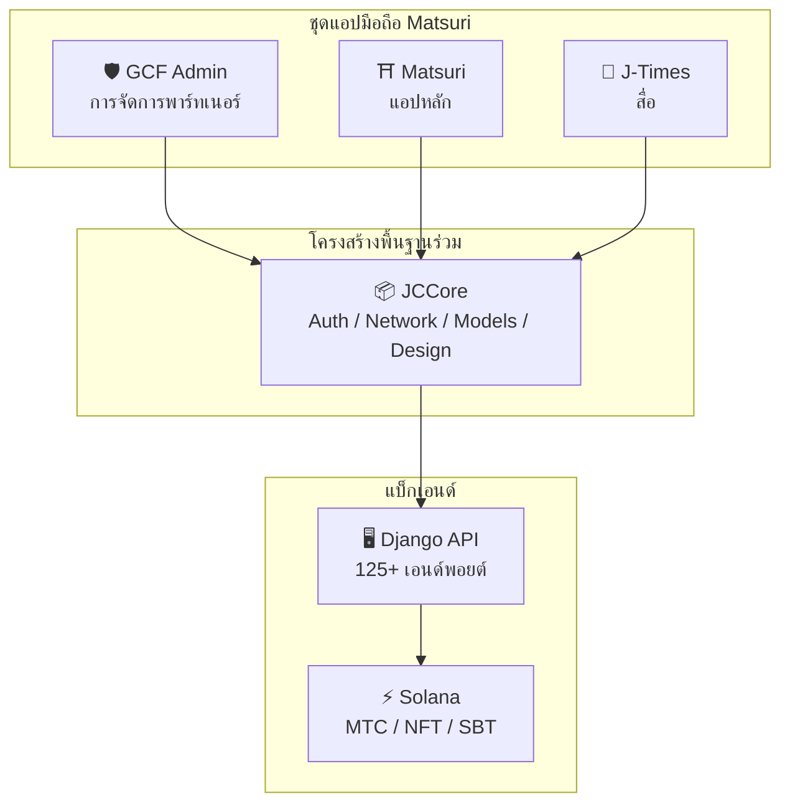
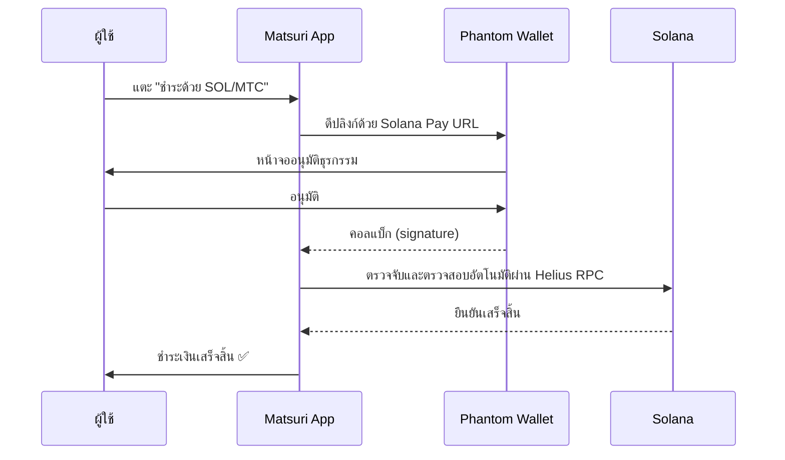
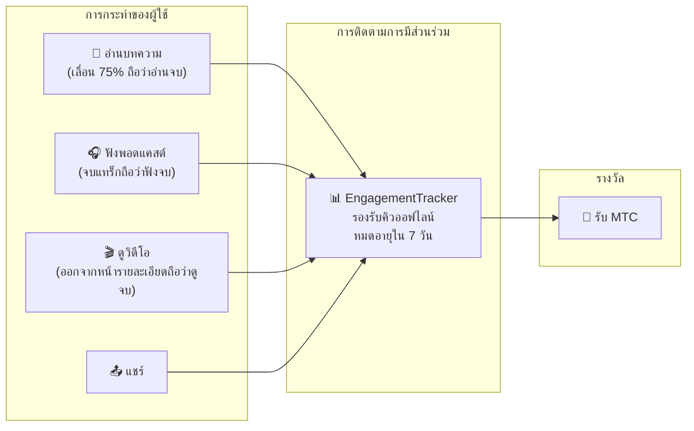
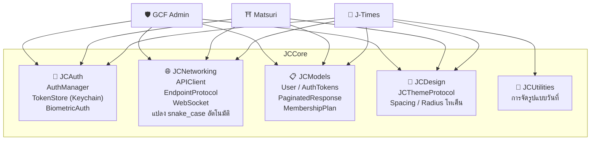

# 📱 ชุดแอปพลิเคชันมือถือ

> **แอป iOS เนทีฟสามตัวที่ครอบคลุมทุกระดับของระบบนิเวศ Matsuri**
> สร้างทั้งหมดด้วย Swift 6 / iOS 17+ การยืนยันตัวตน เครือข่าย และการออกแบบรวมเป็นหนึ่งเดียวผ่านไลบรารี **JCCore** ที่ใช้ร่วมกัน

:::tip ทำไมสิ่งนี้ถึงสำคัญสำหรับนักลงทุน
โปรเจกต์ Web3 ส่วนใหญ่มีแค่เว็บไซต์และไวท์เปเปอร์ Matsuri มี **แอป iOS ที่ใช้งานจริง 3 ตัว พร้อมการทดสอบอัตโนมัติ 827+ รายการ** โครงสร้างพื้นฐานที่ใช้ร่วมกัน และการรวม Solana แบบเนทีฟ นี่คือความลึกในการดำเนินงานที่หาได้ยากในวงการโทเค็น
:::

---

## ภาพรวมแอป

| แอป | วัตถุประสงค์ | สถานะ | ภาษา |
| :--- | :--- | :---: | :--- |
| **GCF Admin** | การจัดการพาร์ทเนอร์และการดำเนินงาน | ✅ เปิดตัวแล้ว | 🇯🇵🇬🇧🇨🇳🇹🇭🇳🇴 |
| **Matsuri** | แอปหลักสำหรับผู้ใช้ทั่วไป | 🔜 ปลายเดือนเมษายน 2026 | 🇯🇵🇬🇧🇨🇳🇹🇭🇳🇴 |
| **J-Times** | สื่อวัฒนธรรมและการเรียนรู้ | 🔜 ปลายเดือนเมษายน 2026 | 🇯🇵🇬🇧 |

---

## 1. 🛡️ GCF Admin — แอปจัดการพาร์ทเนอร์

:::info สถานะ: เปิดตัวบน App Store แล้ว (v1.0)
แอปจัดการธุรกิจสำหรับสมาชิก GCF (Global Community Friends) รวบรวมฟังก์ชันทั้งหมดของแผงควบคุมเว็บไว้ในมือถือ
:::

  
  
  

### สิ่งที่คุณทำได้ด้วยแอปนี้

| หมวดหมู่ | ฟีเจอร์ |
| :--- | :--- |
| **📊 แดชบอร์ด** | การ์ด KPI, กราฟยอดขาย, การดำเนินการด่วน |
| **👥 การจัดการสมาชิก** | รายการ, รายละเอียด, แก้ไข, จัดการระดับ |
| **💰 การจัดการรายได้** | การติดตามค่าคอมมิชชัน, การจัดการถอน MTC, การจัดการการจ่ายเงิน |
| **📝 การจัดการเนื้อหา** | สร้าง, แก้ไข, เผยแพร่อีเวนต์, บทความ, พอดแคสต์, วิดีโอ |
| **🎫 สล็อตไกด์** | การจัดการช่องไกด์, การติดตามรายได้ |
| **🖼️ แดชบอร์ด NFT** | Founder's Collection, การตรวจสอบออนเชน, การโอน NFT |
| **⛩️ การจัดการสถานที่ศักดิ์สิทธิ์** | CRUD ของสถานที่, ตั้งค่าบีคอน |
| **🎲 การตั้งค่า AR Mining** | ตารางความน่าจะเป็นโอมิคุจิ, การจัดการพารามิเตอร์รางวัล |
| **📊 การวิเคราะห์** | รายงานข้อผิดพลาด, การวิเคราะห์การใช้งาน |
| **🔗 การแนะนำ** | สร้างรหัส QR แบบกำหนดเอง, การจัดการโปรแกรมแนะนำ |

### ข้อมูลจำเพาะทางเทคนิค

| รายการ | รายละเอียด |
| :--- | :--- |
| **สถาปัตยกรรม** | Clean Architecture + MVVM + `@Observable` (iOS 17) |
| **ภาษา / SDK** | Swift 6.0 / Xcode 16+ / iOS 17.0+ |
| **การเชื่อมต่อ API** | 125 เอนด์พอยต์ขึ้นไป |
| **การทดสอบ** | 226 การทดสอบ / 45 คลาสทดสอบ |
| **การแปลภาษา** | 5 ภาษา (ญี่ปุ่น, อังกฤษ, จีน, ไทย, นอร์เวย์) / 957+ คีย์แปล |
| **Swift Concurrency** | เป็นไปตาม Strict Concurrency / ไม่มีคำเตือนในการบิลด์ |

### การรวม QR Code

GCF Admin สามารถสร้างรหัส QR แบบกำหนดเองพร้อมโลโก้ Matsuri ใช้งานได้หลากหลาย เช่น คำเชิญอีเวนต์ ลิงก์แนะนำ คำขอชำระเงิน และอื่นๆ

---

## 2. ⛩️ Matsuri — แอปหลัก

:::info สถานะ: กำหนดเปิดตัวปลายเดือนเมษายน 2026 (v3.0)
แอปหลักสำหรับผู้ใช้ทั่วไป จองอีเวนต์ ชำระเงิน กระเป๋า Web3 AR Mining — ทุกอย่างในแอปเดียว
:::

  
  
  

### สิ่งที่คุณทำได้ด้วยแอปนี้

| หมวดหมู่ | ฟีเจอร์ |
| :--- | :--- |
| **🎪 จองอีเวนต์** | ค้นหา, จอง, ชำระเงินผ่าน Stripe, จัดการตั๋ว QR |
| **💳 4 วิธีชำระเงิน** | บัตรเครดิต / บัตรที่บันทึกไว้ / ยอดคงเหลือ MTC / คริปโต (SOL/MTC) |
| **👛 กระเป๋า Web3** | แสดงยอด MTC, ส่งและรับ, ประวัติธุรกรรม |
| **🖼️ แกลเลอรี NFT** | รายการ NFT/SBT ที่ถือครอง, การตรวจสอบออนเชน |
| **🗺️ แผนที่สถานที่ศักดิ์สิทธิ์** | แสดงแผนที่ศาลเจ้าและวัด, เช็คอิน |
| **🎲 AR Mining** | ประสบการณ์โอมิคุจิ WebAR, รับ MTC |
| **💬 แชท** | ส่งข้อความพร้อมเมนูบริบท |
| **⭐ วิชลิสต์** | บันทึกอีเวนต์และประสบการณ์ที่ชอบ |
| **🔍 ค้นหาขั้นสูง** | รองรับการค้นหาด้วยเสียง |
| **🤝 การแนะนำ** | เข้าร่วมโปรแกรมแนะนำ, ติดตามรางวัล |
| **📊 แดชบอร์ด GCF** | แผงควบคุมอย่างง่ายสำหรับสมาชิก GCF |

### การเชื่อมต่อ Phantom Wallet — การชำระเงินคริปโตแบบไม่ต้องพิมพ์

> **ไม่ต้องคัดลอกที่อยู่กระเป๋า** Phantom Wallet เปิดขึ้นอัตโนมัติ ผู้ใช้อนุมัติ และการชำระเงินเสร็จสมบูรณ์ ลายเซ็นธุรกรรมถูกตรวจจับอัตโนมัติผ่าน Helius RPC — ประสบการณ์การชำระเงินคริปโตที่ราบรื่นที่สุดในตลาด

:::tip ทำไมสิ่งนี้ถึงสำคัญ
แอป Web3 ส่วนใหญ่บังคับให้ผู้ใช้คัดลอกที่อยู่กระเป๋า กรอกจำนวนเงินด้วยตนเอง และรอการยืนยัน การรวม Solana Pay ของ Matsuri ลดสิ่งเหล่านี้เหลือเพียง **การแตะครั้งเดียว** — ให้ประสบการณ์เทียบเท่า Apple Pay ในขณะที่เคลียร์บนเชน
:::

### ข้อมูลจำเพาะทางเทคนิค

| รายการ | รายละเอียด |
| :--- | :--- |
| **สถาปัตยกรรม** | Clean Architecture + MVVM + Swift Concurrency |
| **ภาษา / SDK** | Swift 6.0 / Xcode 16+ / iOS 17.0+ |
| **การชำระเงิน** | Stripe PaymentSheet + MTC Balance + Phantom (Solana Pay) |
| **การเชื่อมต่อ API** | 72 เอนด์พอยต์ / 16 หมวดหมู่ |
| **การทดสอบ** | 230+ (Model, ViewModel, Network, Security, DeepLink, E2E) |
| **การแปลภาษา** | 5 ภาษา (ญี่ปุ่น, อังกฤษ, จีน, ไทย, นอร์เวย์) / 406 คีย์แปล |
| **จำนวน ViewModel** | 25 (MVVM เต็มรูปแบบ — ไม่มีการเรียก API โดยตรงจาก View) |
| **การยืนยันตัวตน** | Apple Sign In / Google Sign In (PKCE) |

---

## 3. 📰 J-Times — แอปสื่อวัฒนธรรม

:::info สถานะ: กำหนดเปิดตัวปลายเดือนเมษายน 2026
แพลตฟอร์มสื่อที่นำเสนอวัฒนธรรมญี่ปุ่นเชิงลึก อ่านบทความ ฟังพอดแคสต์ ดูวิดีโอ — ทุกการกระทำจะได้รับ MTC
:::

  

### สิ่งที่คุณทำได้ด้วยแอปนี้

| หมวดหมู่ | ฟีเจอร์ |
| :--- | :--- |
| **📖 บทความ** | ฮีโร่พารัลแลกซ์, ดร็อปแคป, แถบความคืบหน้าการอ่าน, เนื้อหาแบบสมบูรณ์ (Markdown, ตาราง, อ้างอิง) |
| **🎧 พอดแคสต์** | เรียกดูซีรีส์, เครื่องเล่นแสดงคลื่นเสียง, ตั้งเวลาปิด, AirPlay, ควบคุมจากหน้าจอล็อก |
| **🎬 วิดีโอ** | แสดงแบบกริด/รายการปรับได้, วิดีโอสั้น (สไตล์ TikTok, แตะสองครั้ง) |
| **🔍 ค้นหา** | ฟิลเตอร์หลายตัว, แท็กยอดนิยม, ค้นหาด้วยเสียง |
| **🧭 ค้นพบ** | คารูเซลแนะนำ, สตาฟฟ์พิค, ยอดนิยมประจำสัปดาห์ |
| **📚 ไลบรารี** | รายการโปรด, ประวัติ (จัดตามวันที่), ดาวน์โหลด, เพลย์ลิสต์ |
| **🎵 เครื่องเล่นเสียง** | มินิเพลเยอร์ (ปัดเพื่อควบคุม), เครื่องเล่นเต็ม (คลื่นเสียง, เนื้อเพลง, เล่นซ้ำ) |
| **👤 สมาชิก** | เปรียบเทียบฟีเจอร์ 3 ระดับ (Free / Premium / Pro), กู้คืนการซื้อ |

### Media Mining — การอ่าน ฟัง ดู กลายเป็นการขุด

> **บันทึกได้แม้ออฟไลน์** แม้จะอ่านบทความที่ศาลเจ้าบนภูเขาที่ไม่มีสัญญาณ เมื่อกลับมาออนไลน์ การมีส่วนร่วมจะถูกส่งโดยอัตโนมัติและ MTC จะถูกมอบให้

### ระบบออกแบบ — "สี่เสาหลัก" แห่งสุนทรียศาสตร์ญี่ปุ่น

J-Times ใช้ระบบออกแบบเฉพาะที่นำสุนทรียศาสตร์แบบดั้งเดิมของญี่ปุ่นมาใช้ใน UI สมัยใหม่

| เสาหลัก | แนวคิด | การนำไปใช้ใน UI |
| :--- | :--- | :--- |
| **墨 (Sumi)** | โทนเทาอบอุ่น | สีพื้นหลัง, ลำดับชั้นข้อความ |
| **朱 (Shu)** | สีแดงญี่ปุ่น (#C53030) | สีเน้น, การกระทำสำคัญ |
| **間 (Ma)** | ช่องว่างแบบกริด 4pt | การเว้นระยะ, ความรู้สึกหายใจ |
| **紙 (Kami)** | พื้นผิวละเอียด, กลาสมอร์ฟิซึม | พื้นผิวการ์ด, การแสดงความลึก |

### ข้อมูลจำเพาะทางเทคนิค

| รายการ | รายละเอียด |
| :--- | :--- |
| **สถาปัตยกรรม** | Clean Architecture + MVVM + Swift Concurrency |
| **ภาษา / SDK** | Swift 6.0 / Xcode 16+ / iOS 17.0+ |
| **การพึ่งพาภายนอก** | **ศูนย์** — ใช้เฉพาะเฟรมเวิร์กของ Apple เท่านั้น |
| **การเชื่อมต่อ API** | 40 เอนด์พอยต์ขึ้นไป |
| **การทดสอบ** | 371 การทดสอบ / 20 ไฟล์ |
| **การแปลภาษา** | 2 ภาษา (ญี่ปุ่น, อังกฤษ) / 310+ คีย์แปล |
| **การรองรับออฟไลน์** | ContentCache (50MB) + ImageDiskCache (200MB) + ตัวจัดการดาวน์โหลด |
| **การยืนยันตัวตน** | Apple Sign In / Google Sign In (PKCE) |

---

## โครงสร้างพื้นฐานร่วม: ไลบรารี JCCore

ไลบรารี Swift Package ที่แอปทั้ง 3 ตัวใช้ร่วมกัน

| โมดูล | บทบาท |
| :--- | :--- |
| **JCAuth** | การจัดการโทเค็นผ่าน Keychain, การยืนยันตัวตนด้วยชีวมิติ (Face ID / Touch ID) |
| **JCNetworking** | ไคลเอนต์ API แบบ type-safe, WebSocket, แปลง JSON snake_case อัตโนมัติ |
| **JCModels** | โมเดลข้อมูลร่วมข้ามแอป (User, AuthTokens เป็นต้น) |
| **JCDesign** | โปรโตคอลธีม, โทเค็นออกแบบ (การเว้นระยะ, มุมโค้ง) |
| **JCUtilities** | ยูทิลิตี้วันที่และสตริง |

---

## ความปลอดภัยและความเป็นส่วนตัว

| รายการ | การนำไปใช้ |
| :--- | :--- |
| **โทเค็นยืนยันตัวตน** | เข้ารหัสและเก็บใน iOS Keychain (TokenStore) |
| **การยืนยันตัวตนด้วยชีวมิติ** | การยืนยันตัวตนสองปัจจัยด้วย Face ID / Touch ID |
| **การสื่อสาร API** | HTTPS + Certificate Pinning |
| **กุญแจส่วนตัวกระเป๋า** | ไม่เก็บกุญแจส่วนตัวในแอป — มอบหมายให้ Phantom Wallet |
| **AR Mining** | ไม่ส่งภาพกล้องไปยังเซิร์ฟเวอร์ (VisionProof) |
| **ข้อมูลออฟไลน์** | เข้ารหัส SwiftData + หมดอายุอัตโนมัติ |
| **Swift Concurrency** | ป้องกันสภาวะแข่งขันด้วย Actor isolation |

---

## คุณภาพการพัฒนา

3 แอปรวมกันมี **การทดสอบอัตโนมัติ 827+ รายการ**

| แอป | จำนวนการทดสอบ | ขอบเขตการครอบคลุม |
| :--- | :---: | :--- |
| **GCF Admin** | 226 | Model, ViewModel, Repository, API, Localization, Navigation |
| **Matsuri** | 230+ | Model, ViewModel, Network, Security, DeepLink, Regression, Performance, E2E |
| **J-Times** | 371 | Model, ViewModel, API, Repository, Navigation, Localization, Security, Performance |

---

**[▶ ถัดไป: แผนงานและทีม](/docs/roadmap)** ｜ **[◀ ก่อนหน้า: ระบบนิเวศและการขุด](/docs/ecosystem)**
