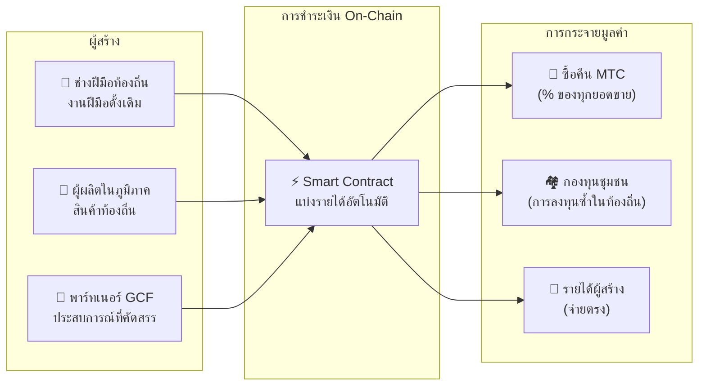

# 🗓️ แผนที่เส้นทางและธรรมาภิบาล

> **เส้นทางสู่ความมั่นใจ**
> นี่ไม่ใช่โปรเจกต์เก็งกำไรระยะสั้น
> **การพัฒนาแพลตฟอร์มหลักเสร็จสมบูรณ์แล้ว** — เราอยู่ในเฟสขยายขนาด

---

## ไมล์สโตนเชิงกลยุทธ์

### 🔥 เฟส 1: การตื่น (2026 ครึ่งแรก — ปัจจุบัน)

**ธีม: วางรากฐานและสร้างกระแสเงินสด**

ผลิตภัณฑ์สร้างเสร็จแล้ว มุ่งเน้นสร้างรายได้ผ่านระบบการเงินภายใต้ CEO และรักษาสภาพคล่องเริ่มต้น

| สถานะ | ไมล์สโตน | รายละเอียด |
| :---: | :--- | :--- |
| ✅ | **เปิดตัวผลิตภัณฑ์** | Matsuri Webapp และ GCF Admin Dashboard ทำงานแล้ว |
| ✅ | **ระบบชำระเงินและการเติบโต** | ฟังก์ชัน MTC Payment + Referral Airdrop เสร็จสมบูรณ์ |
| ✅ | **เปิดตัวสื่อ** | โครงสร้างพื้นฐาน J-Times (เว็บ + พอดแคสต์) พร้อมแล้ว |
| ✅ | **Genesis** | MTC Token Generation Event บน Solana |
| ✅ | **สภาพคล่อง** | สร้าง LP Pool เริ่มต้นบน Raydium เรียบร้อย |
| ⬜ | **โปรแกรมจูงใจ** | เปิด Liquidity Mining เป้า APY 20% |
| ⬜ | **ระบบเริ่มทำงาน** | Solana MEV/Arbitrage Bot เข้าสู่โหมดผลิตจริง |
| ⬜ | **สรรหา VIP** | คัดเลือกสมาชิก GCF VIP 20 คนแรก |

### 🚀 เฟส 2: ขยาย (2026 ครึ่งหลัง)

**ธีม: สินทรัพย์โลกจริงและ Adventure Mining**

ใช้ Webapp ที่สร้างเสร็จเพื่อขยายฐานทางกายภาพและฟีเจอร์ «Pilgrimage»

| สถานะ | ไมล์สโตน | รายละเอียด |
| :---: | :--- | :--- |
| ⬜ | **เปิดตัวฟีเจอร์** | Adventure Mining (Pilgrimage) เปิดใช้งาน |
| ⬜ | **ขยายทั่วโลก** | ฐานพันธมิตรและอีเวนต์ VIP ในเอเชีย (ไทย, ไต้หวัน ฯลฯ) |
| ⬜ | **บริหารสินทรัพย์** | ก่อสร้างพอร์ตอสังหาริมทรัพย์ หุ้น และคริปโตจากรายได้ธุรกิจ |
| ⬜ | **เป้าหมาย** | AUM ของระบบนิเวศรวม **¥1 พันล้าน (~$6.5 ล้าน)** |

### 🌊 เฟส 3: วงจร (2027+)

**ธีม: การยอมรับในวงกว้าง เศรษฐกิจร่วมสร้างสรรค์ และการกระจายอำนาจ**

เปิดตัวสาธารณะ ตลาด on-chain และเดินเครื่องระบบนิเวศเต็มรูปแบบ

| สถานะ | ไมล์สโตน | รายละเอียด |
| :---: | :--- | :--- |
| ⬜ | **แกรนด์โอเพนนิ่ง** | เปิดตัว Matsuri App ทั่วโลก |
| ⬜ | **ปลดล็อกครั้งใหญ่ (1 มิ.ย. 2027)** | ปลดล็อกล็อกอัพผู้ก่อตั้ง + Mining Pool (550 ล้าน MTC) ทำงาน + เริ่มรอบลดครึ่ง |
| ⬜ | **ตลาดร่วมสร้างสรรค์** | ร้านค้าสินค้าท้องถิ่น + ร้านค้าพาร์ทเนอร์ GCF — การชำระเงิน on-chain พร้อมการซื้อคืน MTC อัตโนมัติ |
| ⬜ | **Crowdfunding พร้อมสิทธิ์ NFT** | ผู้ใช้ร่วมทุนโครงการวัฒนธรรมบน Solana ผู้สนับสนุนได้รับ NFT ที่แสดงถึงความเป็นเจ้าของ ส่วนแบ่งรายได้ หรือสิทธิ์การกำกับดูแลเหนือโครงการที่ได้รับทุน |
| ⬜ | **การชำระเงิน On-Chain ของร้านค้า** | ธุรกรรมตลาดทั้งหมดชำระผ่าน smart contracts — เปอร์เซ็นต์ของทุกยอดขายไหลเข้าสู่พูลซื้อคืน MTC โดยอัตโนมัติ |
| ⬜ | **เป้าหมาย** | AUM ของระบบนิเวศรวม **¥10 พันล้าน (~$65 ล้าน)** |
| ⬜ | **เปลี่ยนสู่ DAO** | โอนอำนาจตัดสินใจบางส่วนสู่ชุมชน GCF |

#### 🏪 วิสัยทัศน์ตลาดร่วมสร้างสรรค์

การแสดงออกสูงสุดของ "Culture OS" — ตลาดแบบกระจายศูนย์ที่ **ผู้สร้างวัฒนธรรมและผู้ชื่นชอบวัฒนธรรมทำธุรกรรมโดยตรง** โดยไม่มีคนกลางที่หาประโยชน์

| ฟีเจอร์ | คำอธิบาย | สถานะ |
| :--- | :--- | :---: |
| **🏺 ร้านค้าสินค้าท้องถิ่น** | ช่างฝีมือและผู้ผลิตในภูมิภาคขายตรงสู่ผู้ชมทั่วโลก ชำระด้วย MTC = ส่วนลด 5–10% | ⬜ วิสัยทัศน์ |
| **🎫 Crowdfunding + สิทธิ์ NFT** | ร่วมทุนโครงการวัฒนธรรม (บูรณะศาลเจ้า ฟื้นฟูเทศกาล เวิร์กช็อปช่างฝีมือ) รับ NFT ที่แสดงถึงการมีส่วนร่วมของคุณ — พร้อมส่วนแบ่งรายได้หรือสิทธิ์การกำกับดูแล | ⬜ วิสัยทัศน์ |
| **⚡ การชำระเงิน On-Chain** | ทุกธุรกรรมในตลาดชำระผ่าน Solana smart contracts รายได้ถูกแบ่งอัตโนมัติ: จ่ายผู้สร้าง + กองทุนชุมชน + ซื้อคืน MTC — ไม่ต้องทำบัญชีแบบแมนวล | ⬜ วิสัยทัศน์ |
| **🗳️ การกำกับดูแลจากผู้สนับสนุน** | ผู้ถือ NFT ลงคะแนนเสียงว่าโครงการที่ได้รับทุนจะจัดสรรทรัพยากรอย่างไร — การร่วมสร้างสรรค์อย่างแท้จริง ไม่ใช่แค่การบริจาค | ⬜ วิสัยทัศน์ |

:::info ทำไมสิ่งนี้จึงสำคัญ
ทุกวันนี้ นักท่องเที่ยวซื้อของที่ระลึกจากร้านที่จ่ายค่าเช่าให้แพลตฟอร์มคนกลาง ในอนาคต **ช่างฝีมือในชนบทเกียวโตขายตรงให้แฟนในโคเปนเฮเกน** — และเปอร์เซ็นต์ของยอดขายนั้นจะเสริมความแข็งแกร่งของเศรษฐกิจ MTC โดยอัตโนมัติ นี่คือ "วงล้อมู่เล่" ในรูปแบบที่สมบูรณ์ที่สุด
:::

---

## 👤 ทีม

### Ko Takahashi — ผู้ก่อตั้ง / CEO และสถาปนิกหลัก

| รายการ | รายละเอียด |
| :--- | :--- |
| **บทบาท** | หัวหน้าโปรเจกต์ทั้งหมด ออกแบบและพัฒนาอัลกอริทึมการเงินหลัก (Solana MEV Bot) |
| **วิสัยทัศน์** | ผู้สร้างแนวคิด «ส่งออกวัฒนธรรม นำเข้าความมั่งคั่ง» |
| **ทัศนคติ** | เขียนโค้ดเอง ยืนหน้าบาร์ที่ Golden Gai เอง — คำจำกัดความของ «Skin in the Game» |

### Jon Anders Jensen

### Ryunosuke Honda

### 🌏 ชุมชน GCF — ผู้ร่วมพัฒนาทั่วโลก

Matsuri Protocol ไม่ได้สร้างขึ้นโดยทีมผู้ก่อตั้งเพียงลำพัง
**สมาชิก GCF ทั่วโลก** มีส่วนร่วมผ่านการทดสอบ ข้อเสนอแนะ การแปล และการขยายในภูมิภาค

| ด้าน | ทีม |
| :--- | :--- |
| **💼 การเงินระดับโลก** | เครือข่ายนักลงทุนส่วนตัวทั่วเอเชีย |
| **⚙️ วิศวกรรม** | ทีมวิศวกรแบบกระจายศูนย์สำหรับบล็อกเชนและมือถือ |
| **🏮 ปฏิบัติการ** | ท่อส่งที่แข็งแกร่งกับชุมชนท้องถิ่นใน Shinjuku Golden Gai และจุดท่องเที่ยวสำคัญ |
| **🌐 ชุมชน** | สมาชิก GCF หลายสัญชาติจากญี่ปุ่น นอร์เวย์ ไทย ไต้หวัน และอื่นๆ |

:::tip ร่วมสร้างโครงสร้างพื้นฐานทางวัฒนธรรม
เข้าร่วม GCF แล้วร่วมเป็นผู้พัฒนา Matsuri Protocol
การมีส่วนร่วมไม่ใช่แค่เขียนโค้ด — แนะนำสถานที่ศักดิ์สิทธ์ในท้องถิ่น แปลเอกสาร จัดกิจกรรม — ทุกอย่างช่วยเผยแพร่โปรโตคอลนี้สู่โลก
:::

### พันธมิตรเชิงกลยุทธ์

| ด้าน | ทีม |
| :--- | :--- |
| **💼 การเงินระดับโลก** | เครือข่ายนักลงทุนส่วนตัวทั่วเอเชีย |
| **⚙️ วิศวกรรม** | ทีมวิศวกรแบบกระจายศูนย์สำหรับบล็อกเชนและมือถือ |
| **🏮 ปฏิบัติการ** | ท่อส่งที่แข็งแกร่งกับชุมชนท้องถิ่นใน Shinjuku Golden Gai และจุดท่องเที่ยวสำคัญ |

---

## 🏛️ ธรรมาภิบาล (DAO)

Matsuri Protocol จะค่อยๆ เปลี่ยนผ่านไปสู่ **องค์กรอิสระแบบกระจายศูนย์ (DAO)**
สมาชิก GCF (Platinum/Gold) จะมี **สิทธิ์ลงคะแนนเสียง** ในการตัดสินใจสำคัญ:

| การลงคะแนน | ขอบเขต |
| :--- | :--- |
| **💰 จัดสรรทุน** | ธุรกิจใหม่หรือแคมเปญการตลาดใดที่จะได้รับทุน |
| **⚙️ อัพเกรดโปรโตคอล** | ปรับจูนอัตราค่าธรรมเนียมและเส้นโค้งรางวัลไมนิ่ง |
| **⛩️ รับรองวัฒนธรรม** | เทศกาลและศาลเจ้าใดที่จะได้รับการรับรองเป็น «สถานที่แสวงบุญอย่างเป็นทางการ» และได้รับทุน |

:::info ร่วมเป็นส่วนหนึ่งของการปฏิวัติ
เราไม่ได้แค่สร้างแอป
เรากำลังสร้าง **«เศรษฐกิจวัฒนธรรมไร้พรมแดน»**
:::

---

**[◀ กลับสู่หน้าแรกไวท์เปเปอร์](/docs/intro)** ｜ **[เข้าร่วม Discord](#)**
