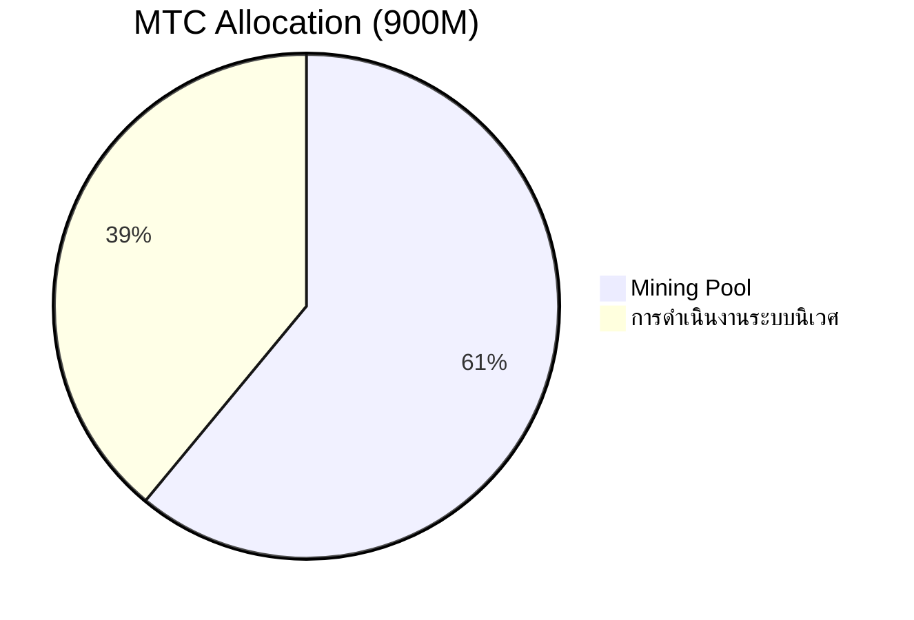
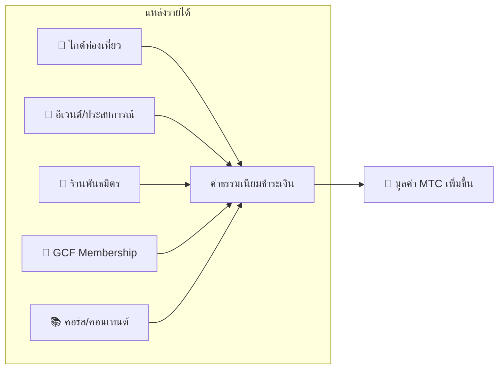

# 💰 Tokenomics — การออกแบบเศรษฐกิจของ MTC

> **ความเชื่อมั่นสลักอยู่ในโค้ด**
> การออกแบบเศรษฐกิจของ MTC ไม่ใช่คำสัญญาของใครสักคน แต่รับประกันด้วยคณิตศาสตร์และบล็อกเชน


> **"ระบบเศรษฐกิจที่ไม่สามารถเปลี่ยนแปลงสถานภาพด้วยกำลัง" — นั่นคือ Tokenomics ของ MTC**

การออกแบบเศรษฐกิจของ Matsuri Coin (MTC) ตั้งอยู่บนความเชื่อหนึ่งเดียว:
**กฎที่แม้แต่ทีมงานเองก็แก้ไขไม่ได้ คือหลักประกันความอุ่นใจที่ดีที่สุดสำหรับนักลงทุน**

อุปทานคงที่ตลอดกาล ไม่สามารถออกเพิ่ม หรืออายัดเงินได้ การเติบโตของธุรกิจสะท้อนเข้าสู่ราคาในระดับสูตรคณิตศาสตร์ —
นี่ไม่ใช่ "คำสัญญา" แต่เป็น **ข้อเท็จจริง** ที่สลักไว้บนบล็อกเชน

ในหน้านี้เราจะเปิดเผยกลไกเศรษฐกิจของ MTC อย่างโปร่งใสทั้งหมด

---

## ข้อมูลจำเพาะของโทเคน

เพื่อรับประกันความปลอดภัยของนักลงทุน เรา **สละ** "Mint Authority" และ "Freeze Authority" บน Solana ตลอดกาล
การออกเพิ่มเป็นไปไม่ได้ตลอดกาล การอายัดเงินก็เช่นกัน **ออกแบบ Trustless เต็มรูปแบบ**

| รายการ | รายละเอียด |
| :--- | :--- |
| **ชื่อโทเคน** | Matsuri Coin |
| **Ticker** | MTC |
| **Chain** | Solana |
| **Mint Address** | `DRENpzmRWM4TwECrCPCfS1k5VBPmanhQg9bcCWP8EZXF` [Solscan →](https://solscan.io/token/DRENpzmRWM4TwECrCPCfS1k5VBPmanhQg9bcCWP8EZXF) |
| **อุปทานรวม** | **900 ล้าน** (900,000,000 MTC) คงที่ |
| **Mint Authority** | 🚫 สละแล้ว ([ตรวจสอบ on-chain ได้](https://solscan.io/token/DRENpzmRWM4TwECrCPCfS1k5VBPmanhQg9bcCWP8EZXF)) |
| **Freeze Authority** | 🚫 สละแล้ว ([ตรวจสอบ on-chain ได้](https://solscan.io/token/DRENpzmRWM4TwECrCPCfS1k5VBPmanhQg9bcCWP8EZXF)) |
| **การจัดการล็อก** | Streamflow Finance (ตรวจสอบแล้ว) |

:::info ทำไมสิ่งนี้สำคัญ
การสละ Mint Authority หมายความว่า "ทีมงานไม่สามารถพิมพ์โทเคนมาเจือจางสัดส่วนของคุณได้ตามอำเภอใจ" การสละ Freeze Authority หมายความว่า "ไม่มีใครสามารถอายัด Wallet ของคุณได้" นี่คือแก่นแท้ของ Trustless (ไม่ต้องอาศัยความเชื่อใจ)
:::

---

## การจัดสรรโทเคน

การจัดสรร 900M MTC เป็นไปตามนี้



| หมวด | สัดส่วน | จำนวน | การใช้ |
| :--- | :---: | :--- | :--- |
| **⛏️ Mining Pool** | **61%** | 550 ล้าน | พูลรางวัลสำหรับผู้ร่วมสร้าง ปลดล็อกมิถุนายน 2027 ปล่อยแบบ Halving ทุก 2 ปี แจกตาม Contribution Score |
| **🌐 การดำเนินงานระบบนิเวศ** | **39%** | 350 ล้าน | การตลาด, แจกจ่าย GCF, ค่าดำเนินการ, ได้ Liquidity Pool (LP), ค่าพัฒนา, ค่าโฆษณา, ค่าจัดอีเวนต์ ฯลฯ |

:::note ระบบการปล่อย Mining Pool
550M MTC ไม่ได้ปล่อยทีเดียว แต่ตามกำหนด Halving ทุก 2 ปี **แจกจ่ายทีละขั้นตามCuntribution Score** กฎการปล่อย/แจกจ่ายจะทยอยติดตั้งเป็น Smart Contract ในปลายปี 2026 และสามารถตรวจสอบ on-chain ได้
:::

:::note เกี่ยวกับโควตาดำเนินงานระบบนิเวศ
โควตา 39% เป็นเงินทุนหลายวัตถุประสงค์ที่จำเป็นต่อการเติบโตของระบบนิเวศ รายการการใช้รวมถึง: กิจกรรมการตลาด, แจกจ่ายเริ่มต้นให้สมาชิก GCF, ให้ Raydium Liquidity Pool, ค่าตอบแทนทีมพัฒนา, ค่าโฆษณาประชาสัมพันธ์, ค่าจัดอีเวนต์ประสบการณ์วัฒนธรรม ความโปร่งใสในการใช้จะเป็นเรื่องที่ Community Governance ดูแลหลังเปลี่ยนเป็น DAO
:::

---

## โครงสร้างรายได้

สิ่งที่ค้ำจุนมูลค่า MTC คือ **รายได้จากธุรกิจจริง** ไม่ใช่การเก็งกำไร แต่เป็นกิจกรรมเศรษฐกิจจริงที่หนุนมูลค่าของโทเคน



| แหล่งรายได้ | เนื้อหา |
| :--- | :--- |
| **🏯 ประสบการณ์/ไกด์** | ค่าธรรมเนียมชำระเงินจากไกด์ท่องเที่ยวและอีเวนต์ประสบการณ์วัฒนธรรม |
| **🤝 GCF Membership** | ค่าธรรมเนียมสมาชิก |
| **📚 คอนเทนต์** | ค่าเรียนคอร์ส, ค่า subscription สื่อ |
| **🏪 Marketplace** | ค่าธรรมเนียมธุรกรรมจากร้านพันธมิตร (ขยายตัวทีละขั้น) |

:::tip เติบโตด้วยความต้องการจริงเป็นฐาน
ยิ่งนักท่องเที่ยว inbound เพิ่ม เงินตราต่างประเทศไหลเข้า ระบบนิเวศขยาย มูลค่า MTC ไม่ได้ถูกกำหนดด้วยการเก็งกำไร แต่ด้วย **จำนวนคนที่สัมผัสวัฒนธรรม**
:::

---

## ผลประกอบการปัจจุบัน

เศรษฐกิจ MTC ยังอยู่ในช่วงแรก แต่กิจกรรมจริงได้เริ่มต้นแล้ว

| ตัวชี้วัด | ผลงาน |
| :--- | :--- |
| **จำนวนอีเวนต์ที่จัด** | มากกว่า 50 ครั้ง (ทดลอง) |
| **สมาชิก GCF Platinum** | เข้าร่วม 20 คน (จาก 50) |
| **สมาชิก GCF Gold** | กำลังเปิดรับสมัครในเร็วๆ นี้ |
| **Web Platform** | เปิดใช้งานอยู่ เปิดรับผู้ใช้ทดลองใช้งาน |
| **iOS App** | พัฒนาเสร็จ เตรียมเปิดตัวเมษายน 2026 |

:::note พูดกันตรงๆ
เรายังไม่มี "ผลงานความสำเร็จยิ่งใหญ่" 50 อีเวนต์และทดลองใช้งาน — นั่นคือความจริงปัจจุบัน แต่ผลิตภัณฑ์กำลังทำงาน ชุมชนมีอยู่จริง และเราอยู่ในเฟสที่กำลังขยายตัวอย่างจริงจังจากจุดนี้
:::

---

## Buy-back Protocol (ซื้อคืน)

เราจะไม่ทำให้ "กำไรเข้ากระเป๋าทีมงาน"
นโยบายของเราคือนำรายได้ธุรกิจส่วนหนึ่งไปซื้อ MTC คืนจากตลาด

| แหล่งรายได้ | อัตราคืน | การดำเนินการ |
| :--- | :---: | :--- |
| **ยอดขายของ Matsuri Headquarters** (ไกด์, อีเวนต์) | **20%** | **ซื้อคืน** จากตลาด + เพิ่มใน Liquidity Pool |
| **GCF Membership** (ค่าสมาชิก) | **25%** | **ซื้อคืน** จากตลาด |

:::info สถานะปัจจุบันของการซื้อคืน
Buy-back Protocol **จะเริ่มดำเนินการจากนี้** เมื่อรายได้ธุรกิจเพิ่มขึ้นจริง ช่วงแรกจะทำ off-chain (manual) และทยอยย้ายเป็นการดำเนินการอัตโนมัติด้วย Smart Contract หลังปลายปี 2026 หลังย้าย on-chain ประวัติการซื้อคืนจะตรวจสอบได้โดยทุกคนบนบล็อกเชน
:::

การซื้อคืนไม่ใช่คำสัญญาว่า "สักวันหนึ่งจะทำ" แต่เป็นกฎที่ถูกโปรแกรมไว้เป็น Protocol ทุกครั้งที่ยอดขายธุรกิจเพิ่ม MTC จะถูกดูดจากตลาดโดยอัตโนมัติ — นี่คือ **ความอุ่นใจเชิงโครงสร้าง** สำหรับนักลงทุน

---

## Logic การกำหนดราคา

กลไกการขึ้นราคาของ MTC ไม่ได้ตั้งบนความหวัง แต่อยู่บน **สูตร AMM (Automated Market Maker)**

```
ราคา = สภาพคล่อง (SOL) ÷ อุปทาน (MTC)
```

| ขั้น | เกิดอะไร | ผล |
| :---: | :--- | :--- |
| **①** | รายได้ธุรกิจ (SOL) ถูกฉีดเข้าพูล | **ตัวตั้งเพิ่มขึ้น** |
| **②** | ใช้เงินนั้นซื้อ MTC คืนจากตลาดและเผา | **ตัวส่วนลดลง** |
| **③** | ตัวตั้ง↑ × ตัวส่วน↓ | **เงื่อนไขความหายากเพิ่มพร้อม** |

:::info อธิบายกลไก ไม่ใช่การรับประกันราคา
สูตรนี้แสดงโครงสร้างการออกแบบว่า "เมื่อรายได้ธุรกิจต่อเนื่องและ Buy-back ถูกดำเนินการ สมดุลอุปสงค์-อุปทานจะเคลื่อนในทิศทางความหายาก" ราคาจริงได้รับอิทธิพลจากหลายปัจจัย เช่น อุปสงค์-อุปทานในตลาด สภาพแวดล้อมภายนอก และสภาพคล่อง
:::

---

## กำหนดการ Halving

MTC **550 ล้าน (ประมาณ 61% ของอุปทานรวม)** ที่ปลดล็อกวันที่ 1 มิถุนายน 2027 ไม่ได้ขายในตลาด แต่เก็บไว้เป็น **พูลรางวัลสำหรับผู้ร่วมสร้าง**

เราใช้ **Halving ทุก 2 ปี** เร็วกว่าวงจร 4 ปีของ Bitcoin
ทุก 2 ปีปริมาณปล่อยลดครึ่ง ในทางทฤษฎี รางวัลจะต่อเนื่องหลายทศวรรษ

| ช่วงเวลา | สัดส่วนปล่อย | จำนวน | สัดส่วนสะสม |
| :--- | :---: | :--- | :---: |
| **ช่วงที่ 1** 2027 – 2029 | **50%** | ประมาณ 275 ล้าน | 50% |
| **ช่วงที่ 2** 2029 – 2031 | **25%** | ประมาณ 137 ล้าน | 75% |
| **ช่วงที่ 3** 2031 – 2033 | **12.5%** | ประมาณ 68 ล้าน | 87.5% |
| **ช่วงที่ 4** 2033 – 2035 | **6.25%** | ประมาณ 34 ล้าน | 93.75% |
| **ช่วงที่ 5 เป็นต้นไป** | ลดครึ่งต่อเนื่อง | ค่อยๆ ลด | → เข้าใกล้ 100% |

<small>*※ ทางคณิตศาสตร์ไม่มีทางถึง 100% ปริมาณปล่อยจะเข้าใกล้ศูนย์ไม่รู้จบ หลักการเดียวกับ Bitcoin*</small>

:::tip ยิ่งเริ่มร่วมสร้างเร็ว ยิ่งรับ MTC ได้มาก
ด้วยกลไก Halving ปริมาณปล่อยในช่วงที่ 1 (2027〜2029) สูงที่สุด และลดลงทุก Epoch นั่นคือ **คนที่สะสม Contribution Score ตั้งแต่ช่วงแรก จะได้รับ MTC มากที่สุด**

ตัวอย่างกิจกรรมที่สะท้อนใน Contribution Score:
- สร้างอีเวนต์/ผลงานรวบรวมคน
- ดำเนินคอร์สไกด์ยอดนิยม
- ค้นหา/ฝึกไกด์ดีเด่น
- ยอดชม/แชร์คอนเทนต์ J-Times
- จำนวน Check-in จาริกแสวงบุญ

รางวัลไม่ได้ตัดสินด้วย "ลำดับการเข้าร่วม" แต่ด้วย **"ปริมาณและคุณภาพของการมีส่วนร่วม"**
:::

---

:::note ไปหน้าต่อไป
เมื่อเข้าใจการออกแบบเศรษฐกิจของ MTC แล้ว ต่อไปมาดู **วิธีเข้าร่วมในฐานะพาร์ทเนอร์** กัน
**[GCF Membership →](/docs/gcf)**
:::
