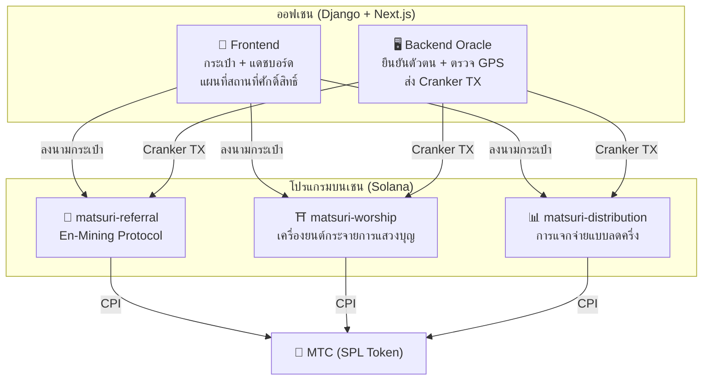
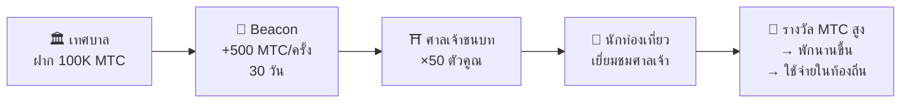
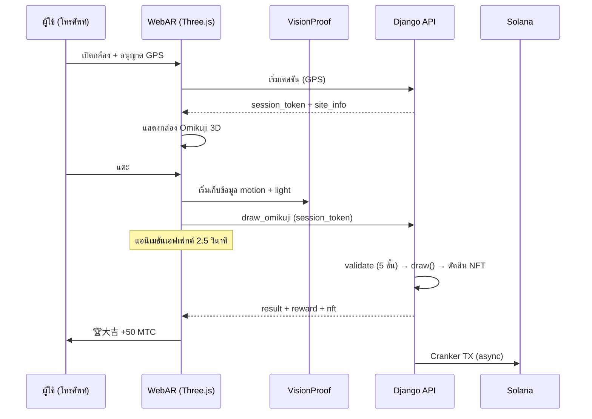

# ⚡ สมาร์ทคอนแทร็กต์ — สถาปัตยกรรมโอเพนซอร์ส

> **ออกแบบโดยไม่ต้องเชื่อมั่น (Trustless)**
> ลอจิกรางวัล ต้นไม้การแนะนำ และตารางลดครึ่ง ทั้งหมดถูกบังคับใช้ **บนเชน** ผ่านโปรแกรม Rust ที่ตรวจสอบได้
> ซอร์สโค้ด: [GitHub](https://github.com/Cootakahashi/matsuri-contracts)

---

## ภาพรวม

Matsuri deploy **โปรแกรม Anchor (Rust) สามตัว** บน Solana แต่ละตัวรับผิดชอบเสาหลักของระบบนิเวศ:



---

## 1. 📣 En-Mining (縁マイニング) Protocol

**วัตถุประสงค์:** เครื่องยนต์เติบโตแบบไฮบริดที่ให้รางวัลทั้ง *ความกว้าง* (เครือข่ายแนะนำ) และ *ความลึก* (ผลกระทบทางเศรษฐกิจ) ไม่ใช่แค่โปรแกรมพันธมิตร — แต่เป็นโปรโตคอลขุดเต็มรูปแบบที่กิจกรรมเศรษฐกิจจริงสร้างมูลค่าบนเชน

### การออกแบบการให้คะแนน

คะแนนการมีส่วนร่วมอิงจากสององค์ประกอบที่มีน้ำหนัก:

| องค์ประกอบ | น้ำหนัก | วัตถุประสงค์ |
| :--- | :---: | :--- |
| **ความกว้าง** (จำนวนแนะนำ) | 30% | การเข้าถึงเครือข่าย — คุณพาคนเข้ามาเท่าไหร่ |
| **ความลึก** (ปริมาณชำระเงิน) | 70% | ผลกระทบทางเศรษฐกิจ — การซื้อจริง ไม่ใช่แค่สมัคร |

คะแนนสะสมเมื่อเวลาผ่านไปและแปลงเป็น MTC ในแต่ละยุค halving มีการวางแผนกลไกส่งเสริมเพิ่มเติม:

| การส่งเสริม | คำอธิบาย | สถานะ |
| :--- | :--- | :---: |
| **Toku (徳) Staking** | ล็อค MTC เพื่อเพิ่มคะแนนการมีส่วนร่วม (เพิ่มได้สูงสุด ~50%) ระดับและตัวคูณที่แน่นอนจะถูกปรับเทียบตามตารางปล่อยพูล halving | ⬜ ค่าสัมประสิทธิ์ TBD |
| **การจัดอันดับตามฤดูกาล** | ผู้ที่ทำผลงานดีที่สุดในแต่ละ epoch จะได้รับตำแหน่ง **Evangelist** (SBT ถาวร) และคะแนนส่งเสริม เปอร์เซ็นต์ที่แน่นอนจะถูกกำหนดผ่านการกำกับดูแล | ⬜ ค่าสัมประสิทธิ์ TBD |

:::info การออกแบบพารามิเตอร์แบบค่อยเป็นค่อยไป
ค่าสัมประสิทธิ์ส่งเสริม (ระดับ staking, โบนัสจัดอันดับ) ถูกตั้งใจให้ปรับได้ จะถูกกำหนดจากข้อมูลระบบนิเวศจริง — ผู้ใช้ที่ใช้งานอยู่ทั้งหมด, อัตราปล่อยพูล halving, และเป้าหมายเสถียรภาพราคา — แล้วล็อคเข้าสมาร์ทคอนแทร็กต์ แนวทางนี้รับประกัน **การกระจายที่ยุติธรรม** โดยไม่สัญญาผลตอบแทนคงที่
:::

### การป้องกัน Anti-Sybil (3 ชั้น)

| ชั้น | กลไก | ที่ไหน |
| :--- | :--- | :--- |
| **ประตูตัวตน** | X/Twitter OAuth + SMS | ออฟเชน (Django) |
| **ประตูออนเชน** | เฉพาะโปรไฟล์ `is_verified = true` เท่านั้นที่ได้รับรางวัล | Smart Contract |
| **น้ำหนักความลึก** | 70% ของคะแนน = การชำระเงินจริง → บอทไม่ได้อะไรเลย | เครื่องยนต์ให้คะแนน |

---

## 2. ⛩️ เครื่องยนต์กระจายการแสวงบุญ (Worship Routing Engine)

**วัตถุประสงค์:** **โปรโตคอล ReFi แรกของโลกที่แก้ปัญหาการท่องเที่ยวมากเกินไปด้วยเศรษฐศาสตร์โทเค็น** เยือนสถานที่ศักดิ์สิทธิ์ → ได้รับ MTC แต่จุดพลิก: *สถานที่ที่มีคนเยี่ยมชมน้อยกว่าจ่ายมากขึ้นแบบทวีคูณ*

:::tip ข้อมูลเชิงลึก
นี่คือ «Uber surge pricing แบบกลับหัว» — สถานที่แออัดถูกลงโทษ สถานที่ชายแดนได้รับเพิ่ม นักท่องเที่ยวจะนำทางตัวเองไปยังสถานที่ที่มีคนเยี่ยมน้อยกว่าเพราะ **มันให้ผลกำไรมากกว่า**
:::

### หลักการออกแบบรางวัล

คะแนนการมีส่วนร่วมสำหรับแต่ละการเยี่ยมชมถูกกำหนดโดยหลายปัจจัย:

| ปัจจัย | หลักการ | ผลกระทบ |
| :--- | :--- | :--- |
| **ความนิยมของสถานที่** | สถานที่ที่มีผู้เยี่ยมชมน้อยได้คะแนนสูงกว่า | นำทางนักท่องเที่ยวออกจากพื้นที่แออัด |
| **เวลาเยี่ยมชม** | ผู้เยี่ยมชมกลุ่มแรกของวันได้คะแนนสูงกว่า | ส่งเสริมการเยี่ยมชมนอกชั่วโมงเร่งด่วน |
| **ระดับภูมิภาค** | สถานที่ชนบทและแนวหน้าอยู่ระดับสูงสุด | ขับเคลื่อนการฟื้นฟูภูมิภาค |
| **ความถี่เยี่ยมชม** | ผู้เยี่ยมชมประจำสะสมคะแนนโบนัส | ให้รางวัลการมีส่วนร่วมอย่างสม่ำเสมอ |
| **ดวง Omikuji** | จับฉลากโบนัสสุ่มในแต่ละเช็คอิน | ชั้นเกมที่สนุก |
| **การส่งเสริมจากสปอนเซอร์** | เทศบาลสามารถส่งเสริมสถานที่เฉพาะ | โมเดลรายได้ B2B/B2G |

:::info ค่าสัมประสิทธิ์ปรับได้
ตัวคูณที่แน่นอนสำหรับแต่ละปัจจัย (เช่น สถานที่ชนบทได้มากกว่าสถานที่หลักเท่าไหร่) จะ **ถูกปรับเทียบตามตาราง halving pool** และข้อมูลการใช้งานจริง จากนั้นล็อคเข้าสมาร์ทคอนแทร็กต์อย่างค่อยเป็นค่อยไป หลักการออกแบบคงที่ — ค่าสัมประสิทธิ์วิวัฒนาการไปกับระบบนิเวศ
:::

### Sponsored Beacons (B2B/B2G)

เทศบาล, บริษัทรถไฟ และสำนักงานการท่องเที่ยวสามารถ **ฝาก MTC** เพื่อสร้างโซนรางวัลสูงแบบจำกัดเวลาที่สถานที่เฉพาะ



> **โมเดลรายได้ B2B:** สปอนเซอร์จ่าย MTC เพื่อนำทางนักท่องเที่ยว แรงกดดันซื้อ MTC → มูลค่าโทเค็นเพิ่ม Win-win-win

---

## 3. 📊 การแจกจ่ายแบบลดครึ่ง

**วัตถุประสงค์:** 550 ล้าน MTC mining pool แจกจ่ายตลอดหลายทศวรรษผ่าน **รอบลดครึ่ง 2 ปี** — เร็วกว่ารอบ 4 ปีของ Bitcoin

### ตารางลดครึ่ง

```
Total Pool: 550,000,000 MTC

Epoch 0 (2027–2029):  275,000,000 MTC  (50%)
Epoch 1 (2029–2031):  137,500,000 MTC  (25%)
Epoch 2 (2031–2033):   68,750,000 MTC  (12.5%)
Epoch 3 (2033–2035):   34,375,000 MTC  (6.25%)
        ...              ...
∑ → 550,000,000 MTC (ผลรวมแบบ asymptotic)
```

### สูตรรางวัลส่วนบุคคล

```
your_reward = epoch_budget × (your_score / total_score)
```

การคำนวณทั้งหมดใช้ **128-bit intermediate computation** — เป็นไปไม่ได้ทางคณิตศาสตร์ที่จะ overflow

### แหล่งคะแนนประสิทธิภาพ

| กิจกรรม | น้ำหนักคะแนน |
| :--- | :--- |
| **เซสชันไกด์ที่ดำเนินการ** | สูง |
| **ยอดขายตั๋วอีเวนต์** | สูง |
| **กิจกรรมเครือข่ายแนะนำ** | กลาง |
| **การเยี่ยมชมสถานที่แสวงบุญ** | กลาง |
| **การมีส่วนร่วมของสื่อ** | ต่ำ |

:::info การเลื่อน Epoch แบบไม่ต้องขออนุญาต
คำสั่ง `advance_epoch` สามารถเรียกใช้โดย **ใครก็ได้** — ไม่ต้องมี admin นาฬิการะบบกำหนดว่าเมื่อไหร่ที่ epoch จะเปลี่ยน รับประกันการทำงานแบบ trustless แม้ทีมหายไป
:::

---

## 4. 🎴 AR Mining — WebAR Omikuji Mining

**วัตถุประสงค์:** ทำให้ AR Omikuji ปรากฏในพื้นที่จริงด้วยเบราว์เซอร์สมาร์ทโฟนเท่านั้นเพื่อขุด MTC **ไม่ต้องดาวน์โหลดแอป** โครงสร้างพื้นฐาน WebAR × Blockchain แห่งแรกของโลกที่ผสมผสานจิตวิญญาณชินโตกับเทคโนโลยีล้ำสมัย

### สถาปัตยกรรม



### Optimistic UI (เวลารอศูนย์)

| ขั้นตอน | เวลา | การประมวลผล |
|---------|------|------|
| แตะ → เริ่มเอฟเฟกต์ | 0ms | Frontend เล่นแอนิเมชันทันที |
| API draw_omikuji | ~50ms | Django จับฉลาก + ตัดสิน NFT |
| เอฟเฟกต์เสร็จ | 2500ms | ผลลัพธ์ยืนยันแล้ว → แสดง |
| Solana TX | ~400ms | ส่งในพื้นหลัง |

### การตั้งค่า Omikuji (GCF Admin)

Basis Points (10000 = 100%) ควบคุมแม่นยำถึง 0.01% ปรับได้จากหน้า GCF Admin

| ระดับ | ความหายาก | โบนัส | NFT |
|------|-----------|---------|-----|
| 🏆 大吉 | หายาก | โบนัสสูงสุด | ✅ |
| ✨ 吉 | ไม่ค่อยพบ | โบนัสสูง | เลือกได้ |
| 🌸 小吉 | ทั่วไป | โบนัสเล็กน้อย | — |
| 🍃 末吉 | ทั่วไป | บันทึกการเข้าร่วม | — |
| 💀 凶 | ไม่ค่อยพบ | บันทึกการเข้าร่วม | — |

ความน่าจะเป็นและค่าสัมประสิทธิ์รางวัลจะถูกกำหนดอย่างค่อยเป็นค่อยไปตามขนาดระบบนิเวศและปริมาณการปล่อย halving แล้วนำไปใช้ในสมาร์ทคอนแทร็กต์

### ZK-Proof of Vision (การตรวจสอบ 5 ชั้น)

กำจัดการปลอม GPS และการโจมตีซ้ำผ่านหลายชั้น **ไม่ส่งข้อมูลกล้องไปยังเซิร์ฟเวอร์** เพื่อปกป้องความเป็นส่วนตัว

| Layer | เนื้อหาการตรวจสอบ | คะแนน |
|-------|---------|------|
| Temporal | เวลาเซสชัน 5-120 วินาที | /20 |
| Motion | ความแปรปรวนของไจโร 0.005-0.5 (ความเป็นธรรมชาติของมือถือ) | /20 |
| Light | แสงรอบข้าง × ความสอดคล้องกับเวลา | /20 |
| HMAC | การตรวจสอบลายเซ็น proof_hash | /20 |
| Fingerprint | ความเป็นเอกลักษณ์ของอุปกรณ์ | /20 |
| **รวม** | **เกณฑ์ PASS** | **60/100** |

### การออกแบบรางวัล

รางวัลจะถูกบันทึกเป็น **คะแนนการมีส่วนร่วม** โดยอิงจากหลายปัจจัย รวมถึงประเภทสถานที่ ผลลัพธ์ Omikuji และระดับภูมิภาค ค่าสัมประสิทธิ์ที่เฉพาะเจาะจงจะถูกกำหนดอย่างค่อยเป็นค่อยไปตามตารางปล่อย halving และการเติบโตของระบบนิเวศ แล้วนำไปใช้ในสมาร์ทคอนแทร็กต์

---

## โมดูลคณิตศาสตร์ (โอเพนซอร์สหลัก)

โปรแกรมทั้งหมดแยกคณิตศาสตร์การให้คะแนน/รางวัลออกเป็น **โมดูล `math.rs` ที่บริสุทธิ์และตรวจสอบได้** ด้วย:

- **ไม่มีผลข้างเคียง** — ไม่มี I/O, ไม่มีการจัดสรร, ไม่มีการเรียกภายนอก
- **สูตรที่มีเอกสาร** — เครื่องหมาย LaTeX ใน rustdoc
- **การวิเคราะห์ overflow** — ค่ากลาง u128 ที่มีขอบเขตพิสูจน์แล้ว
- **การทดสอบที่ครอบคลุม** — กรณีขอบ, เงื่อนไขขอบเขต, การตรวจสอบอัตราส่วน
- **ค่าสัมประสิทธิ์ปรับได้** — พารามิเตอร์รางวัลถูกออกแบบให้อัปเดตได้ผ่านการกำกับดูแล ช่วยให้ปรับเทียบอย่างค่อยเป็นค่อยไปตามการเติบโตของระบบนิเวศ

---

## โมเดลความปลอดภัย (โอเพนซอร์ส)

เหล่าคอนแทร็กต์เหล่านี้เป็น **โอเพนซอร์สทั้งหมด** ความปลอดภัยพึ่งพาการรับประกันทางคณิตศาสตร์ ไม่ใช่ความคลุมเครือ

| หลักการ | การดำเนินการ |
| :--- | :--- |
| **ห้องเก็บ PDA เท่านั้น** | ห้องเก็บโทเค็นควบคุมโดย PDA — ไม่มีกุญแจของมนุษย์ที่สามารถถอนได้ |
| **การคำนวณที่ตรวจสอบแล้ว** | การคำนวณทั้งหมดใช้ `checked_*` — overflow เป็นไปไม่ได้ |
| **การแยกอำนาจ** | Admin (multisig) ≠ Cranker (ops จำกัด) ≠ ผู้ใช้ (ดูแลตัวเอง) |
| **หยุดฉุกเฉิน** | Admin สามารถหยุดโปรแกรมทั้งหมดได้ทันที; ไม่สามารถขโมยเงินได้ |
| **Tokenomics ที่ไม่เปลี่ยนแปลง** | ตัวคูณลดครึ่ง, pool ทั้งหมด, ระยะเวลา epoch ตั้งค่าครั้งเดียวและไม่สามารถเปลี่ยนได้ |
| **โมดูลคณิตศาสตร์บริสุทธิ์** | ลอจิกคะแนน/รางวัลแยกเป็นไลบรารีคณิตศาสตร์ที่ตรวจสอบและทดสอบได้ |
| **Vision Proof** | ป้องกันการปลอม 5 ชั้นโดยไม่ส่งข้อมูลกล้อง (ปกป้องความเป็นส่วนตัว) |

---

**[◀ กลับสู่แผนที่เส้นทาง](/docs/roadmap)** ｜ **[ดูซอร์สโค้ด](https://github.com/Cootakahashi/matsuri-contracts)**
