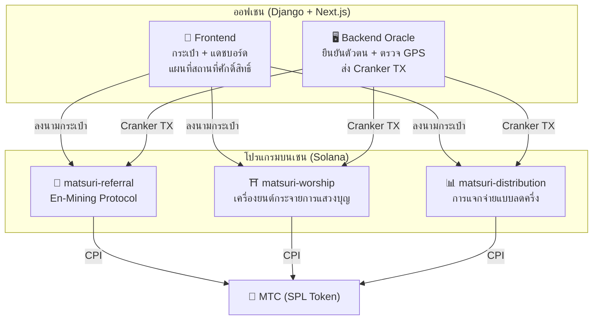
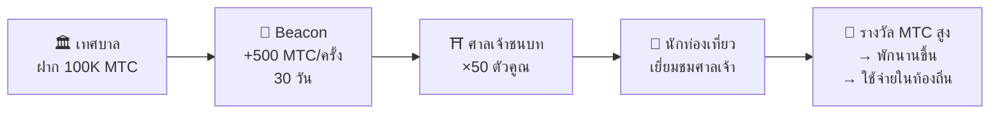
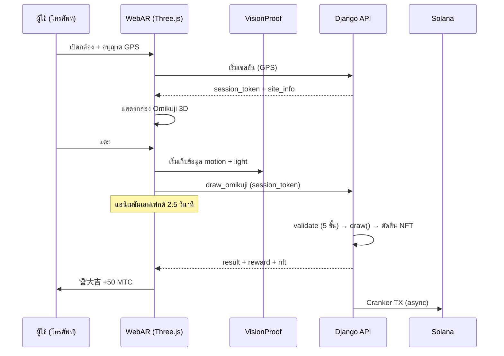

# ⚡ สมาร์ทคอนแทร็กต์ — สถาปัตยกรรมโอเพนซอร์ส

> **ออกแบบโดยไม่ต้องเชื่อมั่น (Trustless)**
> ลอจิกรางวัล ต้นไม้การแนะนำ และตารางลดครึ่ง ทั้งหมดถูกบังคับใช้ **บนเชน** ผ่านโปรแกรม Rust ที่ตรวจสอบได้
> ซอร์สโค้ด: [GitHub](https://github.com/Cootakahashi/matsuri-contracts)

---

## ภาพรวม

Matsuri deploy **โปรแกรม Anchor (Rust) สามตัว** บน Solana แต่ละตัวรับผิดชอบเสาหลักของระบบนิเวศ:



---

## 1. 📣 En-Mining (縁マイニング) Protocol

**วัตถุประสงค์:** เครื่องยนต์เติบโตแบบไฮบริดที่ให้รางวัลทั้ง *ความกว้าง* (เครือข่ายแนะนำ) และ *ความลึก* (ผลกระทบทางเศรษฐกิจ) ไม่ใช่แค่โปรแกรมพันธมิตร — แต่เป็นโปรโตคอลขุดเต็มรูปแบบที่กิจกรรมเศรษฐกิจจริงสร้างมูลค่าบนเชน

### สูตรการให้คะแนน

```
S_final = S_raw × M_toku × B_title

where:
  S_raw   = 0.30 × จำนวนแนะนำ + 0.70 × (ปริมาณ / 10^9)
  M_toku  = f(MTC ที่ stake) ∈ [1.0×, 10.0×]
  B_title = 1.0 + min(จำนวนซีซั่นที่ติดอันดับ × 0.05, 0.50)
```

| องค์ประกอบ | น้ำหนัก | วัตถุประสงค์ |
| :--- | :---: | :--- |
| **ความกว้าง** (จำนวนแนะนำ) | 30% | การเข้าถึงเครือข่าย — คุณพาคนเข้ามาเท่าไหร่ |
| **ความลึก** (ปริมาณชำระเงิน) | 70% | ผลกระทบทางเศรษฐกิจ — การซื้อจริง ไม่ใช่แค่สมัคร |
| **ตัวคูณ Toku** | ×1–10 | ล็อค MTC เพื่อเพิ่มพลังการขุด |
| **ตัวเพิ่มตำแหน่ง** | +5%/ซีซั่น | รางวัลถาวรสำหรับผู้ที่ทำผลงานดีอย่างสม่ำเสมอ |

### ระดับ Toku (徳) Staking

| MTC ที่ Stake | ตัวคูณ | ระดับ |
| :--- | :---: | :--- |
| 0 | 1.0× | — |
| 1,000+ | 1.5× | บรอนซ์ |
| 10,000+ | 3.0× | ซิลเวอร์ |
| 100,000+ | 5.0× | โกลด์ |
| 1,000,000+ | 10.0× | ไดมอนด์ |

### En no Banzuke (การจัดอันดับตามฤดูกาล)

ในแต่ละซีซั่น (epoch) ผู้ที่ทำผลงานได้ดีที่สุดจะได้รับการจัดอันดับ สิทธิประโยชน์:
- 10% แรกได้รับตำแหน่ง **Evangelist** (แฟล็ก SBT ถาวร)
- แต่ละซีซั่นที่ติดอันดับให้ **+5% mining boost** (สะสม, เพดาน: 50%)

### การป้องกัน Anti-Sybil (3 ชั้น)

| ชั้น | กลไก | ที่ไหน |
| :--- | :--- | :--- |
| **ประตูตัวตน** | X/Twitter OAuth + SMS | ออฟเชน (Django) |
| **ประตูออนเชน** | เฉพาะโปรไฟล์ `is_verified = true` เท่านั้นที่ได้รับรางวัล | Smart Contract |
| **น้ำหนักความลึก** | 70% ของคะแนน = การชำระเงินจริง → บอทไม่ได้อะไรเลย | เครื่องยนต์ให้คะแนน |

---

## 2. ⛩️ เครื่องยนต์กระจายการแสวงบุญ (Worship Routing Engine)

**วัตถุประสงค์:** **โปรโตคอล ReFi แรกของโลกที่แก้ปัญหาการท่องเที่ยวมากเกินไปด้วยเศรษฐศาสตร์โทเค็น** เยือนสถานที่ศักดิ์สิทธิ์ → ได้รับ MTC แต่จุดพลิก: *สถานที่ที่มีคนเยี่ยมชมน้อยกว่าจ่ายมากขึ้นแบบทวีคูณ*

:::tip ข้อมูลเชิงลึก
นี่คือ «Uber surge pricing แบบกลับหัว» — สถานที่แออัดถูกลงโทษ สถานที่ชายแดนได้รับเพิ่ม นักท่องเที่ยวจะนำทางตัวเองไปยังสถานที่ที่มีคนเยี่ยมน้อยกว่าเพราะ **มันให้ผลกำไรมากกว่า**
:::

### สูตรรางวัล 6 ชั้น

```
R_final = R_pioneer × M_dynamic × M_regional × M_streak × M_omikuji

where:
  R_pioneer  = daily_pool / visit_order     (harmonic 1/n decay)
  M_dynamic  = ผู้ดูแลกำหนด ∈ [0.1×, 50×]
  M_regional = tier_table[tier] ∈ {1×, 2×, 5×, 10×}
  M_streak   = 1.0 + min(days × 0.02, 0.50)
  M_omikuji  = การจับฉลาก ∈ {1.0, 1.2, 1.5, 3.0}
```

### ชั้น 1: โบนัสผู้บุกเบิก

Harmonic decay — คณิตศาสตร์ที่นำทางนักท่องเที่ยว:

| ลำดับการเยี่ยมชม | รางวัลเทียบกับคนที่ 1 | ตัวอย่างจริง (1000 MTC pool) |
| :---: | :---: | :--- |
| คนที่ 1 | 100% | 1,000 MTC |
| คนที่ 5 | 20% | 200 MTC |
| คนที่ 10 | 10% | 100 MTC |
| คนที่ 100 | 1% | 10 MTC |

> **ผู้เยี่ยมชมคนแรก = รางวัลมากกว่าคนที่ 100 ถึง 100 เท่า** สร้างแรงจูงใจอันทรงพลังในการเยี่ยมชมช่วงนอกเวลาเร่งด่วน

### ชั้น 2: ตัวคูณแบบไดนามิก (กระจายความแออัด)

ควบคุมแบบเรียลไทม์โดยผู้ดูแลผ่าน GCF Admin panel:

| สถานการณ์ | ตัวคูณ | ผลกระทบ |
| :--- | :---: | :--- |
| **ท่องเที่ยวมากเกินไป** (อาซากุสะช่วงพีค) | 0.1× | ลดรางวัล 90% |
| **ปกติ** | 1.0× | มาตรฐาน |
| **มีคนเยี่ยมน้อย** | 10× | เพิ่มรางวัล 10 เท่า |
| **แคมเปญชายแดน** | 50× | แรงจูงใจสูงสุด |

### ชั้น 3: ระดับภูมิภาค

| ระดับ | ป้ายกำกับ | ตัวคูณ | ตัวอย่าง |
| :---: | :--- | :---: | :--- |
| 0 | 🏙️ ใหญ่ | 1× | 浅草寺, 清水寺, 伏見稲荷 |
| 1 | 🌆 กลาง | 2× | ศาลเจ้าหลักระดับจังหวัด |
| 2 | 🏞️ ชนบท | 5× | วัดโบราณในชนบท |
| 3 | ⛰️ ลับ | 10× | วัดบนยอดเขา, ศาลเจ้าบนเกาะ |

### ชั้น 4: โบนัสต่อเนื่อง

+2% ต่อวันต่อเนื่อง, เพดาน +50% ให้รางวัลผู้เยี่ยมชมประจำ

### ชั้น 5: 🎲 Omikuji Protocol

| ผลลัพธ์ | ความน่าจะเป็น | ตัวคูณ |
| :--- | :---: | :---: |
| 🏆 **大吉** | 5% | 3.0× |
| ✨ **吉** | 15% | 1.5× |
| 🌸 **小吉** | 30% | 1.2× |
| 🍃 **末吉** | 35% | 1.0× |
| 💀 **凶** | 15% | 1.0× |

### ชั้น 6: Sponsored Beacons (B2B/B2G)

เทศบาล, บริษัทรถไฟ และสำนักงานการท่องเที่ยวสามารถ **ฝาก MTC** เพื่อสร้างโซนรางวัลสูงแบบจำกัดเวลาที่สถานที่เฉพาะ



> **โมเดลรายได้ B2B:** สปอนเซอร์จ่าย MTC เพื่อนำทางนักท่องเที่ยว แรงกดดันซื้อ MTC → มูลค่าโทเค็นเพิ่ม Win-win-win

---

## 3. 📊 การแจกจ่ายแบบลดครึ่ง

**วัตถุประสงค์:** 550 ล้าน MTC mining pool แจกจ่ายตลอดหลายทศวรรษผ่าน **รอบลดครึ่ง 2 ปี** — เร็วกว่ารอบ 4 ปีของ Bitcoin

### ตารางลดครึ่ง

```
Total Pool: 550,000,000 MTC

Epoch 0 (2027–2029):  275,000,000 MTC  (50%)
Epoch 1 (2029–2031):  137,500,000 MTC  (25%)
Epoch 2 (2031–2033):   68,750,000 MTC  (12.5%)
Epoch 3 (2033–2035):   34,375,000 MTC  (6.25%)
        ...              ...
∑ → 550,000,000 MTC (ผลรวมแบบ asymptotic)
```

### สูตรรางวัลส่วนบุคคล

```
your_reward = epoch_budget × (your_score / total_score)
```

การคำนวณทั้งหมดใช้ **128-bit intermediate computation** — เป็นไปไม่ได้ทางคณิตศาสตร์ที่จะ overflow

### แหล่งคะแนนประสิทธิภาพ

| กิจกรรม | น้ำหนักคะแนน |
| :--- | :--- |
| **เซสชันไกด์ที่ดำเนินการ** | สูง |
| **ยอดขายตั๋วอีเวนต์** | สูง |
| **กิจกรรมเครือข่ายแนะนำ** | กลาง |
| **การเยี่ยมชมสถานที่แสวงบุญ** | กลาง |
| **การมีส่วนร่วมของสื่อ** | ต่ำ |

:::info การเลื่อน Epoch แบบไม่ต้องขออนุญาต
คำสั่ง `advance_epoch` สามารถเรียกใช้โดย **ใครก็ได้** — ไม่ต้องมี admin นาฬิการะบบกำหนดว่าเมื่อไหร่ที่ epoch จะเปลี่ยน รับประกันการทำงานแบบ trustless แม้ทีมหายไป
:::

---

## 4. 🎴 AR Mining — WebAR Omikuji Mining

**วัตถุประสงค์:** ทำให้ AR Omikuji ปรากฏในพื้นที่จริงด้วยเบราว์เซอร์สมาร์ทโฟนเท่านั้นเพื่อขุด MTC **ไม่ต้องดาวน์โหลดแอป** โครงสร้างพื้นฐาน WebAR × Blockchain แห่งแรกของโลกที่ผสมผสานจิตวิญญาณชินโตกับเทคโนโลยีล้ำสมัย

### สถาปัตยกรรม



### Optimistic UI (เวลารอศูนย์)

| ขั้นตอน | เวลา | การประมวลผล |
|---------|------|------|
| แตะ → เริ่มเอฟเฟกต์ | 0ms | Frontend เล่นแอนิเมชันทันที |
| API draw_omikuji | ~50ms | Django จับฉลาก + ตัดสิน NFT |
| เอฟเฟกต์เสร็จ | 2500ms | ผลลัพธ์ยืนยันแล้ว → แสดง |
| Solana TX | ~400ms | ส่งในพื้นหลัง |

### การตั้งค่าความน่าจะเป็นของ Omikuji (GCF Admin)

Basis Points (10000 = 100%) ควบคุมแม่นยำถึง 0.01%

| ระดับ | ค่าเริ่มต้น | ตัวคูณรางวัล | NFT |
|------|-----------|---------|-----|
| 🏆 大吉 | 5.00% (500bp) | ×3.0 | ✅ |
| ✨ 吉 | 15.00% (1500bp) | ×1.5 | เลือกได้ |
| 🌸 小吉 | 30.00% (3000bp) | ×1.2 | — |
| 🍃 末吉 | 35.00% (3500bp) | ×1.0 | — |
| 💀 凶 | 15.00% (1500bp) | ×1.0 | — |

### ZK-Proof of Vision (การตรวจสอบ 5 ชั้น)

กำจัดการปลอม GPS และการโจมตีซ้ำผ่านหลายชั้น **ไม่ส่งข้อมูลกล้องไปยังเซิร์ฟเวอร์** เพื่อปกป้องความเป็นส่วนตัว

| Layer | เนื้อหาการตรวจสอบ | คะแนน |
|-------|---------|------|
| Temporal | เวลาเซสชัน 5-120 วินาที | /20 |
| Motion | ความแปรปรวนของไจโร 0.005-0.5 (ความเป็นธรรมชาติของมือถือ) | /20 |
| Light | แสงรอบข้าง × ความสอดคล้องกับเวลา | /20 |
| HMAC | การตรวจสอบลายเซ็น proof_hash | /20 |
| Fingerprint | ความเป็นเอกลักษณ์ของอุปกรณ์ | /20 |
| **รวม** | **เกณฑ์ PASS** | **60/100** |

### สูตรคำนวณรางวัล

```
Reward = Base(10 MTC) × SiteMultiplier × OmikujiMult × TierMult

TierMult = { ใหญ่: 1.0, กลาง: 2.0, ชนบท: 5.0, ลับ: 10.0 }
```

---

## โมดูลคณิตศาสตร์ (โอเพนซอร์สหลัก)

ทั้งสองโปรแกรมแยกคณิตศาสตร์การให้คะแนน/รางวัลทั้งหมดออกเป็น **โมดูล `math.rs` ที่บริสุทธิ์และตรวจสอบได้** ด้วย:

- **ไม่มีผลข้างเคียง** — ไม่มี I/O, ไม่มีการจัดสรร, ไม่มีการเรียกภายนอก
- **สูตรที่มีเอกสาร** — เครื่องหมาย LaTeX ใน rustdoc
- **การวิเคราะห์ overflow** — ค่ากลาง u128 ที่มีขอบเขตพิสูจน์แล้ว
- **การทดสอบที่ครอบคลุม** — กรณีขอบ, เงื่อนไขขอบเขต, การตรวจสอบอัตราส่วน

```rust
// ตัวอย่าง: โบนัสผู้บุกเบิก (จาก worship/math.rs)
#[inline]
pub fn pioneer_reward(daily_pool: u64, visit_order: u32) -> u64 {
    if visit_order == 0 { return 0; }
    (daily_pool as u128 / visit_order as u128) as u64
}
```

---

## โมเดลความปลอดภัย (โอเพนซอร์ส)

เหล่าคอนแทร็กต์เหล่านี้เป็น **โอเพนซอร์สทั้งหมด** ความปลอดภัยพึ่งพาการรับประกันทางคณิตศาสตร์ ไม่ใช่ความคลุมเครือ

| หลักการ | การดำเนินการ |
| :--- | :--- |
| **ห้องเก็บ PDA เท่านั้น** | ห้องเก็บโทเค็นควบคุมโดย PDA — ไม่มีกุญแจของมนุษย์ที่สามารถถอนได้ |
| **การคำนวณที่ตรวจสอบแล้ว** | การคำนวณทั้งหมดใช้ `checked_*` — overflow เป็นไปไม่ได้ |
| **การแยกอำนาจ** | Admin (multisig) ≠ Cranker (ops จำกัด) ≠ ผู้ใช้ (ดูแลตัวเอง) |
| **หยุดฉุกเฉิน** | Admin สามารถหยุดโปรแกรมทั้งหมดได้ทันที; ไม่สามารถขโมยเงินได้ |
| **Tokenomics ที่ไม่เปลี่ยนแปลง** | ตัวคูณลดครึ่ง, pool ทั้งหมด, ระยะเวลา epoch ตั้งค่าครั้งเดียวและไม่สามารถเปลี่ยนได้ |
| **โมดูลคณิตศาสตร์บริสุทธิ์** | ลอจิกคะแนน/รางวัลแยกเป็นไลบรารีคณิตศาสตร์ที่ตรวจสอบและทดสอบได้ |
| **Vision Proof** | ป้องกันการปลอม 5 ชั้นโดยไม่ส่งข้อมูลกล้อง (ปกป้องความเป็นส่วนตัว) |

---

**[◀ กลับสู่แผนที่เส้นทาง](/docs/roadmap)** ｜ **[ดูซอร์สโค้ด](https://github.com/Cootakahashi/matsuri-contracts)**
