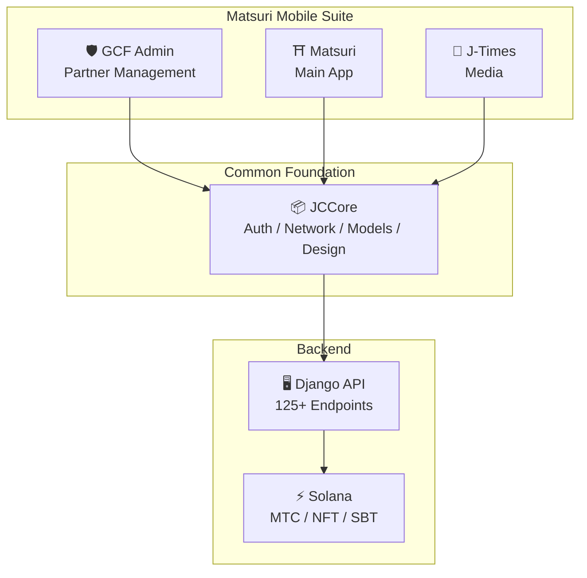
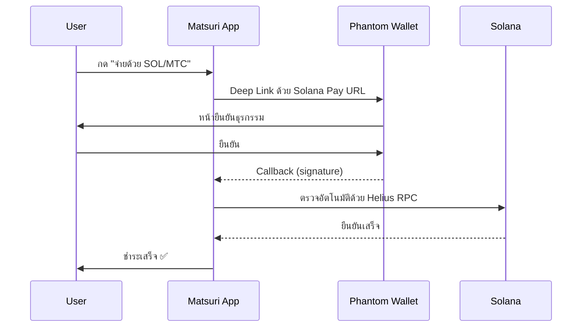
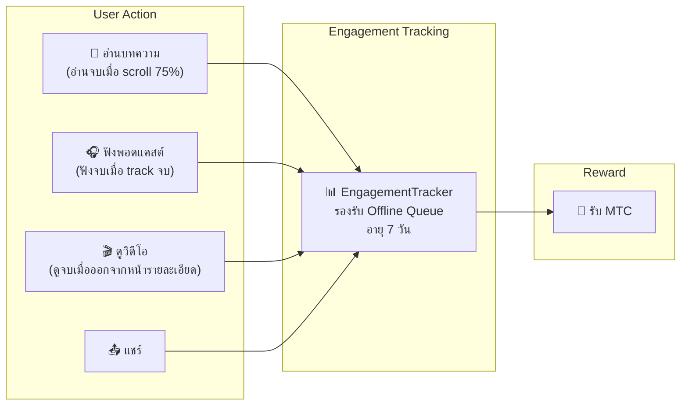
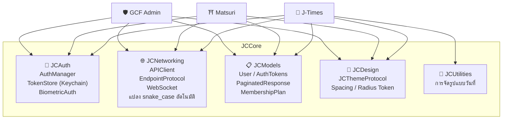
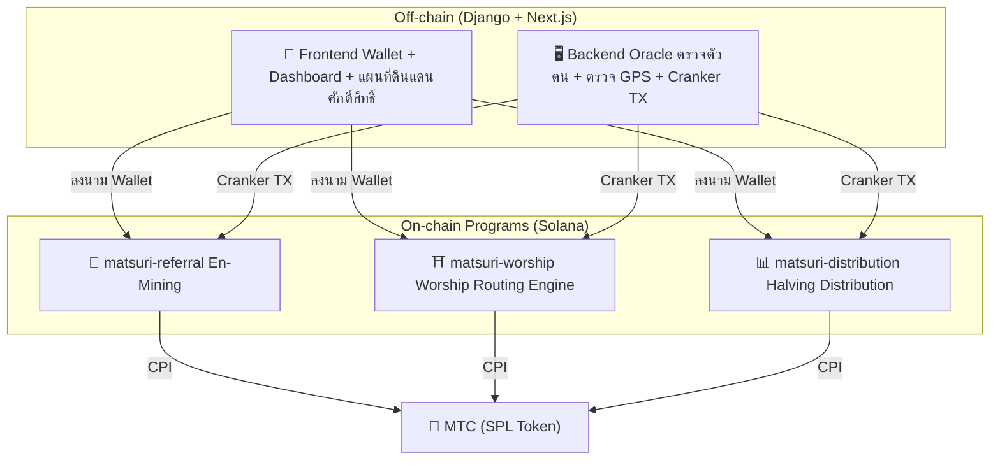
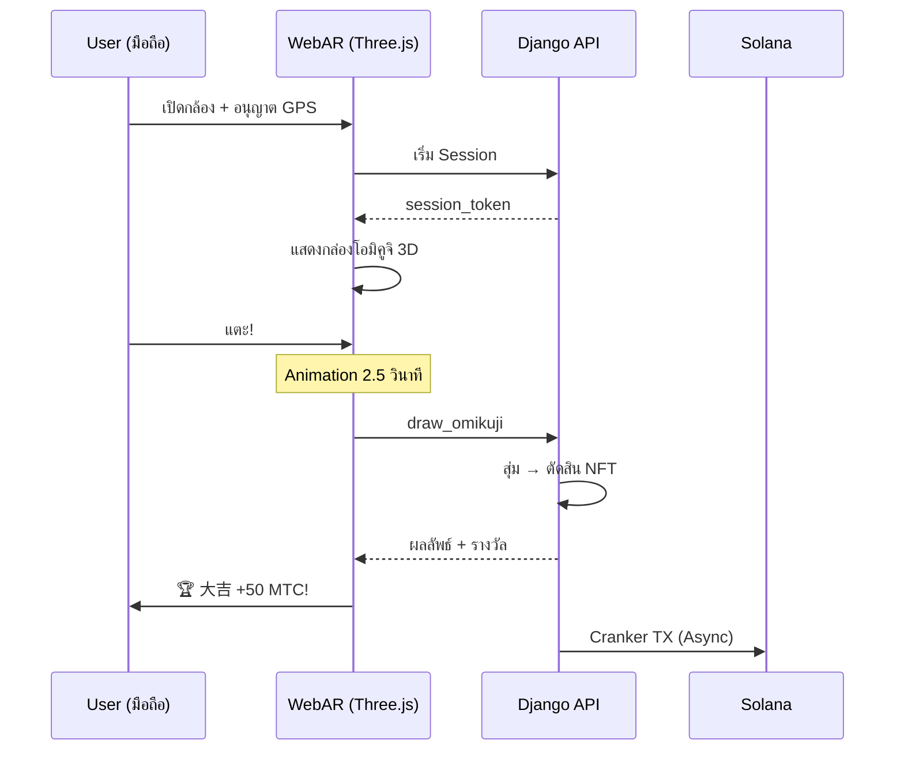

import useBaseUrl from '@docusaurus/useBaseUrl';

# 🔧 ผลิตภัณฑ์และเทคโนโลยี — สิ่งที่ทำงานอยู่คือหลักฐานของทุกอย่าง

> **สิ่งที่ทำงานอยู่คือหลักฐานของทุกอย่าง**
> ปณิธานของเราไม่ใช่แค่คำพูด Web Platform ทำงานอยู่แล้ว iOS App อยู่ในขั้นตอนสุดท้าย

Web App และ Admin Dashboard **อยู่ในการใช้งานจริง** iOS App เนทีฟ 3 ตัวพัฒนาเสร็จและเปิดตัวเมษายน 2026 Smart Contract บน Solana เปิดเป็น Open Source — เราไม่ได้พูดด้วยแนวคิด แต่ด้วย **โค้ดที่ทำงานและผลิตภัณฑ์ที่กำลังจะถึงมือคุณ**

---

## รายการแอป

| แอป | การใช้งาน | สถานะ | ภาษา |
| :--- | :--- | :---: | :--- |
| **GCF Admin** | เครื่องมือบริหารพาร์ทเนอร์/Operation | ✅ เปิดตัวแล้ว | 🇯🇵🇬🇧🇨🇳🇹🇭🇳🇴 |
| **Matsuri** | แอปหลักสำหรับผู้ใช้ทั่วไป | 🔜 เปิดตัวเมษายน 2026 | 🇯🇵🇬🇧🇨🇳🇹🇭🇳🇴 |
| **J-Times** | Culture Media & Learning | 🔜 เปิดตัวเมษายน 2026 | 🇯🇵🇬🇧 |

---

## 1. 🛡️ GCF Admin — แอปบริหารพาร์ทเนอร์

:::info สถานะ: เปิดตัวบน App Store แล้ว (v1.0)
แอปบริหารงานสำหรับสมาชิก GCF (Global Community Friends) รวมฟังก์ชันทั้งหมดของหน้าจอ Admin Web ไว้บนมือถือ
:::

  

  
  
  

### สิ่งที่ทำได้ในแอปนี้

| หมวดหมู่ | ฟังก์ชัน |
| :--- | :--- |
| **📊 Dashboard** | KPI Card, ชาร์ตยอดขาย, Quick Action |
| **👥 บริหารสมาชิก** | รายการ/รายละเอียด/แก้ไข/บริหาร Tier |
| **💰 บริหารรายได้** | ติดตามค่าคอม, บริหารการถอน MTC, บริหารการจ่าย |
| **📝 บริหารคอนเทนต์** | สร้าง/แก้ไข/เผยแพร่ อีเวนต์, บทความ, พอดแคสต์, วิดีโอ |
| **🎫 Guide Slot** | บริหารที่นั่งไกด์, ติดตามรายได้ |
| **🖼️ NFT Dashboard** | Founder's Collection, ยืนยัน on-chain, โอน NFT |
| **⛩️ บริหารดินแดนศักดิ์สิทธิ์** | CRUD ไซต์, ตั้งค่า Beacon |
| **🎲 ตั้งค่า AR Mining** | ตารางความน่าจะเป็นโอมิคูจิ, บริหารพารามิเตอร์รางวัล |
| **📊 Analytics** | รายงาน Error, วิเคราะห์สถานะการใช้งาน |
| **🔗 Referral** | สร้าง Custom QR, บริหารโปรแกรมการแนะนำ |

### ข้อมูลจำเพาะทางเทคนิค

| รายการ | รายละเอียด |
| :--- | :--- |
| **Architecture** | Clean Architecture + MVVM + `@Observable` (iOS 17) |
| **ภาษา / SDK** | Swift 6.0 / Xcode 16+ / iOS 17.0+ |
| **API Integration** | มากกว่า 125 Endpoints |
| **Test** | 226 Tests / 45 Test Classes |
| **Localization** | 5 ภาษา (JA/EN/ZH/TH/NO) / คีย์แปลกว่า 957 คีย์ |
| **Swift Concurrency** | ผ่าน Strict Concurrency / Build Warning เป็นศูนย์ |

### QR Code Integration

ใน GCF Admin สามารถสร้าง Custom QR Code ที่มีโลโก้ Matsuri ได้ รองรับหลายวัตถุประสงค์ เช่น คำเชิญอีเวนต์, Referral Link, คำขอชำระเงิน

---

## 2. ⛩️ Matsuri — แอปหลัก

:::info สถานะ: เปิดตัวปลายเมษายน 2026 (v3.0)
แอปหลักสำหรับผู้ใช้ทั่วไป จบทุกอย่างในแอปเดียว: จองอีเวนต์, ชำระเงิน, Web3 Wallet, AR Mining
:::

  
  
  

### สิ่งที่ทำได้ในแอปนี้

| หมวดหมู่ | ฟังก์ชัน |
| :--- | :--- |
| **🎪 จองอีเวนต์** | ค้นหา/จอง/ชำระด้วย Stripe/บริหาร QR ตั๋ว |
| **💳 ช่องทางชำระ 4 แบบ** | บัตรเครดิต / บัตรที่บันทึกไว้ / ยอด MTC / คริปโต (SOL/MTC) |
| **👛 Web3 Wallet** | แสดงยอด MTC, รับ-ส่ง, ประวัติธุรกรรม |
| **🖼️ NFT Gallery** | รายการ NFT/SBT ที่ถือ, ตรวจ on-chain |
| **🗺️ แผนที่ดินแดนศักดิ์สิทธิ์** | แสดงศาลเจ้าและวัดบนแผนที่, Check-in |
| **🎲 AR Mining** | ประสบการณ์ WebAR โอมิคูจิ, รับ MTC |
| **💬 Chat** | Messaging พร้อม Context Menu |
| **⭐ Wishlist** | บันทึกอีเวนต์/ประสบการณ์โปรด |
| **🔍 ค้นหาขั้นสูง** | รองรับ Voice Search |
| **🤝 Referral** | เข้าร่วมโปรแกรมแนะนำ, ติดตามรางวัล |
| **📊 GCF Dashboard** | หน้าจอบริหารเบื้องต้นสำหรับสมาชิก GCF |

### Phantom Wallet Integration — ชำระคริปโตโดยไม่ต้องกรอก

>**ผู้ใช้ไม่ต้องคัดลอก-วางแอดเดรส** Phantom Wallet เปิดอัตโนมัติ แค่กดยืนยันก็ชำระเสร็จ Transaction signature ตรวจอัตโนมัติด้วย Helius RPC

### ข้อมูลจำเพาะทางเทคนิค

| รายการ | รายละเอียด |
| :--- | :--- |
| **Architecture** | Clean Architecture + MVVM + Swift Concurrency |
| **ภาษา / SDK** | Swift 6.0 / Xcode 16+ / iOS 17.0+ |
| **ชำระเงิน** | Stripe PaymentSheet + MTC Balance + Phantom (Solana Pay) |
| **API Integration** | 72 Endpoints / 16 หมวด |
| **Test** | มากกว่า 230 (Model, ViewModel, Network, Security, DeepLink, E2E) |
| **Localization** | 5 ภาษา (JA/EN/ZH/TH/NO) / 406 คีย์แปล |
| **จำนวน ViewModel** | 25 (MVVM เต็มรูปแบบ — ไม่มี API call ตรงจาก View) |
| **Auth** | Apple Sign In / Google Sign In (PKCE) |

---

## 3. 📰 J-Times — Culture Media App

:::info สถานะ: เปิดตัวปลายเมษายน 2026
แพลตฟอร์มสื่อส่งต่อความลึกซึ้งของวัฒนธรรมญี่ปุ่น อ่านบทความ ฟังพอดแคสต์ ดูวิดีโอ — ทุกการกระทำได้รับ MTC
:::

  

  
  

### สิ่งที่ทำได้ในแอปนี้

| หมวดหมู่ | ฟังก์ชัน |
| :--- | :--- |
| **📖 บทความ** | Parallax Hero, Drop Cap, แถบความคืบหน้าการอ่าน, Rich Content (Markdown, ตาราง, quote) |
| **🎧 พอดแคสต์** | เรียกดูซีรีส์, Player แสดง Waveform, Sleep Timer, AirPlay, ควบคุมหน้าจอล็อก |
| **🎬 วิดีโอ** | Adaptive Grid/List, Short (แบบ TikTok, Double Tap) |
| **🔍 Search** | Multi-filter, Trending Tag, Voice Search |
| **🧭 Discovery** | Feature Carousel, Staff Picks, Popular ประจำสัปดาห์ |
| **📚 Library** | Favorite, ประวัติ (ตามวันที่), ดาวน์โหลด, Playlist |
| **🎵 Audio Player** | Mini Player (ควบคุมด้วย swipe), Full Player (Waveform, Lyrics, Repeat) |
| **👤 Membership** | เปรียบเทียบฟังก์ชัน 3 Tier (Free / Premium / Pro), กู้คืนการซื้อ |

### Media Mining — อ่าน ฟัง ดู กลายเป็น Mining

>**บันทึกได้แม้ออฟไลน์** แม้อ่านบทความที่ศาลเจ้ากลางป่าเขาที่ไม่มีสัญญาณ Engagement จะถูกส่งอัตโนมัติเมื่อกลับมาออนไลน์ และได้ MTC

### Design System — "สี่เสา" ของสุนทรียะญี่ปุ่น

J-Times ใช้ Design System เฉพาะที่นำสุนทรียะดั้งเดิมของญี่ปุ่นมาถ่ายทอดใน UI สมัยใหม่

| เสา | แนวคิด | การนำมาใช้กับ UI |
| :--- | :--- | :--- |
| **墨 (Sumi — หมึก)** | เทากลางที่อบอุ่น | สีพื้นหลัง, ลำดับชั้นข้อความ |
| **朱 (Shu — แดงญี่ปุ่น)** | แดงญี่ปุ่น (#C53030) | Accent Color, Action สำคัญ |
| **間 (Ma — ช่องว่าง)** | Spacing บนกริด 4pt | Spacing, การหายใจ |
| **紙 (Kami — กระดาษ)** | เท็กซ์เจอร์ละเอียด, Glassmorphism | พื้นผิวการ์ด, การแสดงความลึก |

### ข้อมูลจำเพาะทางเทคนิค

| รายการ | รายละเอียด |
| :--- | :--- |
| **Architecture** | Clean Architecture + MVVM + Swift Concurrency |
| **ภาษา / SDK** | Swift 6.0 / Xcode 16+ / iOS 17.0+ |
| **External Dependency** | **ศูนย์** — ใช้ Apple Framework แท้เท่านั้น |
| **API Integration** | มากกว่า 40 Endpoints |
| **Test** | 371 Tests / 20 ไฟล์ |
| **Localization** | 2 ภาษา (JA/EN) / คีย์แปลกว่า 310 |
| **รองรับ Offline** | ContentCache (50MB) + ImageDiskCache (200MB) + Download Manager |
| **Auth** | Apple Sign In / Google Sign In (PKCE) |

---

## Common Foundation: JCCore Library

Swift Package Library ที่แอปทั้ง 3 ตัวแชร์กัน

| Module | บทบาท |
| :--- | :--- |
| **JCAuth** | บริหาร Token ฐาน Keychain, Biometric Auth (Face ID / Touch ID) |
| **JCNetworking** | API Client แบบ Type-safe, WebSocket, แปลง JSON snake_case อัตโนมัติ |
| **JCModels** | Data Model ร่วมข้ามแอป (User, AuthTokens, etc.) |
| **JCDesign** | Theme Protocol, Design Token (Spacing, มุมโค้ง) |
| **JCUtilities** | Utility สำหรับวันที่/สตริง |

---

## Security & Privacy

| รายการ | การ Implement |
| :--- | :--- |
| **Authentication Token** | เก็บเข้ารหัสใน iOS Keychain (TokenStore) |
| **Biometric Auth** | Two-factor Auth ด้วย Face ID / Touch ID |
| **การสื่อสาร API** | HTTPS + Certificate Pinning |
| **Private Key ของ Wallet** | ไม่เก็บ Private Key ในแอป — มอบหมายให้ Phantom Wallet |
| **AR Mining** | ไม่ส่งภาพกล้องไปเซิร์ฟเวอร์ (VisionProof) |
| **Offline Data** | SwiftData Encryption + Expire อัตโนมัติ |
| **Swift Concurrency** | ป้องกัน Race Condition ด้วย Actor Isolation |

---

## คุณภาพการพัฒนา

### Mobile App: Implement **Automated Test กว่า 827** รวม 3 แอป

| แอป | จำนวน Test | พื้นที่ Coverage |
| :--- | :---: | :--- |
| **GCF Admin** | 226 | Model, ViewModel, Repository, API, Localization, Navigation |
| **Matsuri** | 230+ | Model, ViewModel, Network, Security, DeepLink, Regression, Performance, E2E |
| **J-Times** | 371 | Model, ViewModel, API, Repository, Navigation, Localization, Security, Performance |

### Smart Contract: ขยาย Implement Test ทีละขั้น

สำหรับโปรแกรม Rust บน Solana เริ่มจาก Unit Test ของ Core Logic (math module) และขยาย Test Coverage ทีละขั้นเพื่อเตรียม Security Audit (Q2〜Q3 2026)

---

## Smart Contract — ออกแบบ Open Source

>**ปรัชญาออกแบบ Trustless (ไม่ต้องไว้วางใจ)**
> การคำนวณรางวัล, Referral Tree, กำหนด Halving — Logic ทั้งหมดทำงาน **on-chain** และใครก็ตรวจสอบได้
> Source Code: [GitHub](https://github.com/Cootakahashi/matsuri-contracts)

---

### Contributors

| สมาชิก | บทบาท |
| :--- | :--- |
| **Ko Takahashi** | Founder / Lead Developer — ออกแบบ Architecture, Smart Contract, พัฒนา Full-stack |

> 🌏**ต่อไป สมาชิก GCF และชุมชนนักพัฒนาทั่วโลกจะร่วมพัฒนาด้วย**
> Matsuri Protocol ยึดความโปร่งใสและความเป็นเจ้าของร่วมเป็นหลัก เพื่อให้ทำงานเป็น "Infrastructure ของวัฒนธรรม" อย่างยั่งยืน

---

### โครงสร้างโดยรวม

Matsuri deploy **Anchor (Rust) Program 3 ตัว** บน Solana แต่ละตัวรับผิดชอบเสาหลักของระบบนิเวศ

---

### 1. 📣 En-Mining (縁マイニング — Mining ความสัมพันธ์)

**วัตถุประสงค์:** Hybrid Growth Engine ที่แปลงทั้ง "ความกว้าง (เครือข่ายแนะนำ)" และ "ความลึก (ผลกระทบทางเศรษฐกิจ)" เป็นรางวัล ไม่ใช่แค่ Affiliate ธรรมดา แต่เป็น Mining Protocol เต็มรูปแบบที่กิจกรรมเศรษฐกิจในโลกจริงสร้างมูลค่า on-chain

#### Scoring Design

Contribution Score คำนวณจาก 2 องค์ประกอบที่ถ่วงน้ำหนัก:

| องค์ประกอบ | น้ำหนัก | วัตถุประสงค์ |
| :--- | :---: | :--- |
| **ความกว้าง** (จำนวนคนที่แนะนำ) | 30% | ขอบเขตเครือข่าย — พาคนมากี่คน |
| **ความลึก** (ปริมาณธุรกรรม) | 70% | ผลกระทบทางเศรษฐกิจ — ไม่ใช่แค่สมัคร แต่คือการซื้อจริง |

Score สะสมตามเวลาและแปลงเป็น MTC ในแต่ละ Halving Epoch เรามีแผนเพิ่มกลไก Boost:

| Boost | คำอธิบาย | สถานะ |
| :--- | :--- | :---: |
| **Toku (徳) Staking** | ล็อก MTC เพื่อ Boost Contribution Score (Boost สูงสุด ~50%) Tier และมัลติพลายเออร์ปรับตามกำหนดการปล่อยพูล Halving | ⬜ ค่าสัมประสิทธิ์ยังไม่กำหนด |
| **Season Ranking** | Top Performer แต่ละ Epoch ได้ตำแหน่ง **Evangelist** (SBT ถาวร) และ Boost Score สัดส่วนที่แน่นอนกำหนดด้วย Governance | ⬜ ค่าสัมประสิทธิ์ยังไม่กำหนด |

:::info Progressive Parameter Design
ค่าสัมประสิทธิ์ Boost (Staking Tier, Ranking Bonus) ตั้งใจให้ปรับได้ กำหนดจากข้อมูลระบบนิเวศจริง — จำนวนผู้ใช้ที่แอคทีฟรวม, อัตราปล่อยพูล Halving, เป้าหมายเสถียรภาพราคา — แล้วล็อกในสัญญา วิธีนี้รับประกัน **การกระจายที่เป็นธรรม** โดยไม่สัญญาผลตอบแทนตายตัวเกินจริง
:::

#### Anti-Sybil Defense (3 Layer)

| Layer | กลไก | ที่ตั้ง |
| :--- | :--- | :--- |
| **Gate ตรวจตัวตน** | X/Twitter OAuth + SMS | off-chain (Django) |
| **Gate on-chain** | เฉพาะ Profile ที่ `is_verified = true` รับรางวัล | Smart Contract |
| **การถ่วงน้ำหนักความลึก** | 70% ของ Score = การจ่ายเงินจริง → Bot หารายได้ไม่ได้ | Scoring Engine |

---

### 2. ⛩️ Worship Routing Engine (เครื่องยนต์กระจายแสวงบุญ)

**วัตถุประสงค์:** **ReFi Protocol** แรกของโลกที่ใช้ Token Economics แก้ overtourism ไปเยือนดินแดนศักดิ์สิทธิ์รับ MTC แต่ประเด็นสำคัญ: *ไซต์ที่ผู้เยือนน้อย รับรางวัลมากขึ้นเชิงเอ็กซ์โปเนนเชียล*

:::tip Core Insight
"Reverse Uber Surge Pricing" — ไซต์แออัดถูก Penalty, Frontier Site ถูก Boost นักท่องเที่ยวสมัครใจเดินทางไปจุดที่ผู้เยือนน้อย **เพราะทำกำไรได้มากกว่า**
:::

#### หลักการออกแบบรางวัล

Contribution Score ของแต่ละการเยือนกำหนดด้วยหลายปัจจัย:

| ปัจจัย | หลักการ | ผล |
| :--- | :--- | :--- |
| **ความนิยมของไซต์** | ไซต์ผู้เยือนน้อยได้ Score สูง | กระจายนักท่องเที่ยวจากพื้นที่แออัด |
| **เวลาเยือน** | คนเยือนต้นวัน Score สูงกว่า | ส่งเสริมการเยือน Off-peak |
| **Tier ภูมิภาค** | ไซต์ท้องถิ่น/Frontier อยู่บนสุด | ส่งเสริมการฟื้นฟูท้องถิ่น |
| **ความถี่การเยือน** | ผู้เยือนประจำสะสม Bonus Score | ตอบแทน Engagement ต่อเนื่อง |
| **ดวงโอมิคูจิ** | สุ่ม Bonus ทุก Check-in | องค์ประกอบ Gamification สนุก |
| **Sponsored Boost** | อปท. สามารถ Boost ไซต์เฉพาะ | Revenue Model แบบ B2B/B2G |

:::info ค่าสัมประสิทธิ์ปรับได้
มัลติพลายเออร์ที่แน่นอนของแต่ละปัจจัย (เช่น ไซต์ท้องถิ่นได้มากกว่าไซต์หลักเท่าไหร่) ปรับตาม **กำหนดการพูล Halving** และข้อมูลการใช้จริง แล้วทยอยล็อกในสัญญา หลักการออกแบบคงที่ — ค่าสัมประสิทธิ์วิวัฒนาการไปพร้อมระบบนิเวศ
:::

---

### 3. 📊 Halving Distribution (การแจกจ่าย Halving)

**วัตถุประสงค์:** กำหนดการ Halving ที่ได้แรงบันดาลใจจาก Bitcoin ลดการแจก MTC ครึ่งหนึ่งอัตโนมัติทุก Epoch ความหายากที่รับประกันทางคณิตศาสตร์

| Instruction | คำอธิบาย |
| :--- | :--- |
| `initialize` | ตั้งค่าพูลแจกจ่าย |
| `register_miner` | ลงทะเบียน Miner |
| `update_score` | อัปเดต Score |
| `advance_epoch` | เลื่อน Epoch (ดำเนินการ Halving) |
| `claim_distribution` | รับรางวัลแจก |

---

### 4. 🎴 AR Mining — ประสบการณ์ WebAR โอมิคูจิ

**วัตถุประสงค์:** ประสบการณ์ที่ปรากฏ AR โอมิคูจิในพื้นที่จริงผ่านเบราว์เซอร์บนมือถือ เพื่อ Mine MTC **ไม่ต้อง DL แอป** Infrastructure WebAR × Blockchain แรกของโลก หลอมจิตวิญญาณชินโตกับเทคโนโลยีล้ำสมัย

#### Architecture

#### ตั้งค่าความน่าจะเป็นโอมิคูจิ (GCF Admin)

ควบคุมละเอียดทีละ 0.01% ด้วย Basis Points (10000 = 100%) ปรับได้จากหน้าจอ Admin ของ GCF

| ระดับ | Rarity | Bonus | NFT |
|------|-----------|---------|-----|
| 🏆 大吉 (Daikichi) | Rare | Bonus สูงสุด | ✅ |
| ✨ 吉 (Kichi) | Uncommon | Bonus สูง | Optional |
| 🌸 小吉 (Shōkichi) | Common | Bonus เล็ก | — |
| 🍃 末吉 (Suekichi) | Common | บันทึกการมีส่วนร่วม | — |
| 💀 凶 (Kyō) | Uncommon | บันทึกการมีส่วนร่วม | — |

ความน่าจะเป็นและค่าสัมประสิทธิ์รางวัลกำหนดทีละขั้นตามขนาดระบบนิเวศและปริมาณปล่อย Halving แล้ว Implement ใน Smart Contract

#### ZK-Proof of Vision (Security 5 ชั้น)

ขจัดการปลอม GPS และ Replay Attack หลายชั้น **เพื่อคุ้มครองความเป็นส่วนตัว ไม่ส่งภาพกล้องไปเซิร์ฟเวอร์**

| Layer | สิ่งที่ตรวจ | คะแนน |
| :--- | :--- | :--- |
| Temporal | เวลา Session 5-120 วินาที | /20 |
| Motion | ความเป็นธรรมชาติของ Gyro (ตรวจการสั่นจากมือถือ) | /20 |
| Light | ความสอดคล้องของแสงแวดล้อม × ช่วงเวลา | /20 |
| HMAC | ตรวจสอบลายเซ็น proof_hash | /20 |
| Fingerprint | ความเฉพาะของอุปกรณ์ | /20 |
| **รวม** | **60/100 ขึ้นไป = PASS** | |

#### การออกแบบรางวัล

รางวัลบันทึกเป็น **Contribution Score** ตามหลายปัจจัย เช่น ประเภทไซต์, ผลโอมิคูจิ, Tier ภูมิภาค ค่าสัมประสิทธิ์ที่แน่นอนกำหนดทีละขั้นตามกำหนดการปล่อย Halving และการเติบโตของระบบนิเวศ แล้ว Implement ใน Smart Contract

---

### Pure Math Modules (Core Logic ที่ตรวจสอบได้)

ทุกโปรแกรมแยกการคำนวณ Scoring / Reward เป็น **`math.rs` Module บริสุทธิ์ที่ตรวจสอบได้**:

- **Side Effect ศูนย์** — ไม่มี I/O, ไม่มีการจอง memory, ไม่เรียกภายนอก
- **สูตรที่ถูกเอกสาร** — สัญกรณ์แบบ LaTeX ใน rustdoc
- **วิเคราะห์ Overflow** — ค่ากลาง u128 ที่พิสูจน์ช่วงแล้ว
- **Test ครอบคลุม** — Edge Case, Boundary, ตรวจสอบอัตราส่วน
- **ค่าสัมประสิทธิ์ปรับได้** — พารามิเตอร์รางวัลออกแบบให้อัปเดตผ่าน Governance ปรับทีละขั้นตามการเติบโตของระบบนิเวศ

---

### Security Model

สัญญานี้ **Open Source เต็มรูปแบบ** Security อยู่บนหลักประกันทางคณิตศาสตร์ ไม่ใช่ความทึบ

| หลักการ | การ Implement |
| :--- | :--- |
| **Vault จำกัดด้วย PDA** | Token Vault ควบคุมด้วย PDA (Program Derived Address) — ถอนด้วย Key มนุษย์ไม่ได้ |
| **การคำนวณแบบ Checked** | ใช้ `checked_*` ในทุกการคำนวณ — Overflow เป็นไปไม่ได้ |
| **แยกอำนาจ** | Admin (Multisig) ≠ Cranker (Operation จำกัด) ≠ User (บริหารเอง) |
| **Emergency Stop** | Admin สามารถหยุดโปรแกรมชั่วคราวได้เฉพาะภัยคุกคามด้านความปลอดภัย แต่ **ไม่สามารถโยกหรือยึดเงิน** — การหยุดคือ "โล่ปกป้อง" ไม่ใช่วิธีเปลี่ยนกฎ |
| **Tokenomics ไม่เปลี่ยน** | อัตรา Halving, พูลรวม, ระยะ Epoch ไม่เปลี่ยนหลังตั้งครั้งแรก |
| **Pure Math Module** | Logic รางวัล/Score แยกเป็นไลบรารีคณิตศาสตร์ที่ทดสอบได้ |
| **Vision Proof** | ตรวจการปลอม 5 ชั้นที่ไม่ส่งข้อมูลกล้อง (คุ้มครองความเป็นส่วนตัว) |

---

**[▶ ถัดไป: Roadmap & ทีม](/docs/roadmap)** ｜ **[◀ ก่อนหน้า: Tokenomics](/docs/tokenomics)**
