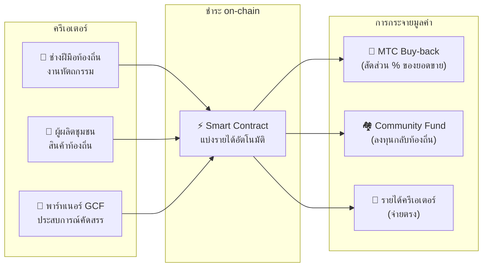

import useBaseUrl from '@docusaurus/useBaseUrl';

# 🗓️ Roadmap และทีม

>**ถึงท่านที่อ่านมาถึงตรงนี้ — วิสัยทัศน์ การออกแบบเศรษฐกิจ และฐานเทคโนโลยี พร้อมแล้วทั้งหมด**
> เราไม่ใช่โปรเจกต์เก็งกำไรระยะสั้น
>**การพัฒนา Platform หลักเสร็จสมบูรณ์แล้ว** เหลือแค่เฟสขยายตัว

---

## Strategic Milestones

### 🔥 Phase 1: ตื่นรู้ (ครึ่งแรก 2026 ── ปัจจุบัน)

**ธีม: สร้างรากฐานและทำ Cash Flow ให้มั่นคง**

Web Platform เปิดใช้งาน iOS App ทั้งสามตัว (GCF Admin, J-Times, Matsuri) พร้อมใช้งานบน App Store แล้ว (ณ เมษายน 2026) โฟกัสที่การหารายได้ผ่านระบบการเงินที่อยู่ใต้การดูแลโดยตรงของ CEO และการรักษาสภาพคล่องในระยะแรก

| สถานะ | Milestone | รายละเอียด |
| :---: | :--- | :--- |
| ✅ | **Web Platform เปิดใช้งาน** | Matsuri Web App, GCF Admin Dashboard (Web) เริ่มเปิดใช้งาน |
| ✅ | **ชำระเงินและการเติบโต** | ฟังก์ชันชำระด้วย MTC และ Referral Airdrop Implement เสร็จ |
| ✅ | **เริ่มเดินสื่อ** | สร้างฐานกระจาย J-Times (Web + Podcast) |
| ✅ | **Genesis** | ออกโทเคน MTC บน Solana Chain |
| ✅ | **รักษาสภาพคล่อง** | สร้าง Initial Liquidity Pool บน Raydium เสร็จ |
| ⬜ | **เริ่ม Incentive** | เริ่ม Liquidity Mining ผลตอบแทนรายปีเป้าหมาย 20% |
| ⬜ | **ชำระ on-chain** | เริ่มใช้งานจริง Solana Pay Verification |
| ⬜ | **รับสมัคร VIP** | คัดเลือก GCF VIP สมาชิกระยะแรก 20 คนเสร็จ |

### 🚀 Phase 2: ขยายตัว (ครึ่งหลัง 2026)

**ธีม: Real Asset และ Adventure Mining**

ใช้ Webapp ที่เสร็จสมบูรณ์เต็มที่ ขยายฐานกายภาพและฟังก์ชัน "แสวงบุญ"

| สถานะ | Milestone | รายละเอียด |
| :---: | :--- | :--- |
| ⬜ | **เปิดตัวฟังก์ชันใหม่** | Implement และเปิดตัว Adventure Mining (แสวงบุญ) |
| ⬜ | **ขยายต่างประเทศ** | บุกเบิกฐานพันธมิตรในเอเชีย (ไทย ไต้หวัน ฯลฯ) + จัดอีเวนต์ VIP |
| ⬜ | **บริหารสินทรัพย์** | สร้างพอร์ตฯ อสังหาฯ, หุ้น, คริปโต |
| ⬜ | **บรรลุเป้า** | ขนาดสินทรัพย์ระบบนิเวศรวม **1,000 ล้านเยน** |

### 🌊 Phase 3: หมุนเวียน (2027~)

**ธีม: แพร่หลายระดับใหญ่, เศรษฐกิจร่วมสร้าง, การกระจายศูนย์**

เฟสเปิดให้ประชาชนทั่วไป, Marketplace on-chain และระบบนิเวศเปิดใช้งานเต็มรูปแบบ

| สถานะ | Milestone | รายละเอียด |
| :---: | :--- | :--- |
| ⬜ | **Grand Open** | เปิดตัวอย่างเป็นทางการทั่วโลกของ Matsuri App |
| ⬜ | **Grand Unlock (2027/6/1)** | ปลดล็อก Founder + Mining Pool (550M) เปิดใช้งาน + เริ่มวงจร Halving |
| ⬜ | **Marketplace ร่วมสร้าง** | ร้านของดีท้องถิ่น + ร้านพาร์ทเนอร์ GCF ── ชำระ on-chain พร้อม MTC Buy-back อัตโนมัติ |
| ⬜ | **คราวด์ฟันดิง (มีสิทธิ์ NFT)** | ผู้ใช้ลงทุนโปรเจกต์วัฒนธรรมบน Solana ผู้สนับสนุนได้ NFT แสดงกรรมสิทธิ์ ส่วนแบ่งรายได้ สิทธิ์ Governance |
| ⬜ | **ชำระ on-chain** | ธุรกรรมทั้งหมดใน Marketplace ชำระด้วย Smart Contract ── สัดส่วนหนึ่งของยอดขายโอนเข้าพูล MTC Buy-back อัตโนมัติ |
| ⬜ | **บรรลุเป้า** | ขนาดสินทรัพย์ระบบนิเวศรวม **1 หมื่นล้านเยน (~$65M)** |
| ⬜ | **ย้ายเป็น DAO** | โอนอำนาจตัดสินใจส่วนหนึ่งให้ชุมชน GCF |

#### 🏪 แนวคิด Marketplace ร่วมสร้าง

การแสดงออกถึงที่สุดของ "Cultural OS" ── **Marketplace แบบกระจายศูนย์ที่ผู้สร้างวัฒนธรรมและผู้รักวัฒนธรรมซื้อขายกันโดยตรง** โดยไม่มีตัวกลางขูดรีด

| ฟังก์ชัน | คำอธิบาย | สถานะ |
| :--- | :--- | :---: |
| **🏺 ร้านของดีท้องถิ่น** | ช่างฝีมือและผู้ผลิตท้องถิ่นขายตรงให้ลูกค้าทั่วโลก ลด 5〜10% เมื่อชำระด้วย MTC | ⬜ แนวคิด |
| **🎫 คราวด์ฟันดิง + สิทธิ์ NFT** | ลงทุนในโปรเจกต์วัฒนธรรม (บูรณะศาลเจ้า, ฟื้นเทศกาล, เวิร์กช็อปช่างฝีมือ) ได้ NFT พิสูจน์การมีส่วนร่วม อาจมาพร้อมส่วนแบ่งรายได้ และสิทธิ์ Governance | ⬜ แนวคิด |
| **⚡ ชำระ on-chain** | ทุกธุรกรรม Marketplace ชำระด้วย Solana Smart Contract รายได้แบ่งอัตโนมัติ: จ่ายครีเอเตอร์ + Community Fund + MTC Buy-back ── ไม่ต้องทำบัญชีแบบ manual | ⬜ แนวคิด |
| **🗳️ Backer Governance** | ผู้ถือ NFT โหวตเรื่องการจัดสรรทรัพยากรของโปรเจกต์ที่ลงทุน ── ไม่ใช่แค่บริจาค แต่เป็นการร่วมสร้างอย่างแท้จริง | ⬜ แนวคิด |

:::info ทำไมเรื่องนี้สำคัญ
วันนี้นักท่องเที่ยวซื้อของที่ระลึกในร้านที่จ่ายค่าเช่าให้ "เจ้าของที่ดิน" ที่เรียกว่าแพลตฟอร์ม วันพรุ่งนี้ **ช่างฝีมือในชนบทเกียวโตขายตรงให้แฟนในโคเปนเฮเกน** และส่วนหนึ่งของยอดขายเสริมเศรษฐกิจ MTC อัตโนมัติ นี่คือรูปแบบที่สมบูรณ์แบบที่สุดของ Flywheel
:::

---

## 👤 ทีม

  

### Ko Takahashi ── ผู้ก่อตั้ง / CEO & Lead Architect

| รายการ | รายละเอียด |
| :--- | :--- |
| **บทบาท** | ดูแลโครงการโดยรวม ออกแบบแพลตฟอร์ม, Smart Contract, พัฒนา Full-stack |
| **วิสัยทัศน์** | ผู้เสนอ Cultural OS "ส่งออกวัฒนธรรม นำเข้าความมั่งคั่ง" |
| **จุดยืน** | เขียนโค้ดด้วยตัวเอง ยืนอยู่หน้างาน (โกลเดนไก) ด้วยตัวเอง ผู้ปฏิบัติจริงของ "Skin in the game" |

  

### Jon Anders Jensen ── กรรมการ / GCF & Event Operations

| รายการ | รายละเอียด |
| :--- | :--- |
| **บทบาท** | ฝ่ายปฏิบัติการ GCF ออกแบบ Operation ของอีเวนต์/ทัวร์ และทำงานภาคสนาม |
| **จุดแข็ง** | ค้ำจุนการหมุนเวียน "คน" ของระบบนิเวศด้วยมุมมองระหว่างประเทศและความสัมพันธ์ที่ไว้ใจได้กับสมาชิก GCF |

  

### Ryunosuke Honda ── กรรมการ / Cultural Ambassador ประจำภูมิภาค

| รายการ | รายละเอียด |
| :--- | :--- |
| **บทบาท** | สะพานเชื่อมวัฒนธรรม/ชุมชนแต่ละพื้นที่ของญี่ปุ่นกับระบบนิเวศ Matsuri |
| **จุดแข็ง** | ค้นหาทรัพยากรวัฒนธรรมท้องถิ่น และนำขึ้นแพลตฟอร์ม Matsuri เพื่อสร้างประสบการณ์ "Deep Japan" |

### 🌏 ชุมชน GCF ── สมาชิกพัฒนาทั่วโลก

Matsuri Protocol ไม่ได้สร้างโดยทีมผู้ก่อตั้งเพียงอย่างเดียว
**สมาชิก GCF ทั่วโลก** มีส่วนร่วมในการวิวัฒนาการของ Protocol ผ่าน Test, Feedback, การแปล, การเปิดในภูมิภาคต่างๆ

| ขอบเขต | โครงสร้าง |
| :--- | :--- |
| **💼 Global Finance** | เชื่อมโยงกับเครือข่ายนักลงทุนรายบุคคลในเอเชีย |
| **⚙️ Engineering** | ทีมวิศวกรกระจายศูนย์ด้านพัฒนา Blockchain & Mobile App |
| **🏮 Operation** | Pipeline ที่แข็งแกร่งกับชุมชนท้องถิ่นโกลเดนไกและแหล่งท่องเที่ยวสำคัญ |
| **🌐 Community** | สมาชิก GCF หลากหลายสัญชาติ เริ่มจากญี่ปุ่น, นอร์เวย์, ไทย, ไต้หวัน |

:::tip Infrastructure วัฒนธรรมที่เราสร้างร่วมกัน
ถ้าเข้าร่วม GCF คุณก็เป็นผู้ร่วมพัฒนา Matsuri Protocol
การมีส่วนร่วมไม่ใช่แค่เขียนโค้ด แนะนำดินแดนศักดิ์สิทธิ์ท้องถิ่น, แปลเอกสาร, จัดอีเวนต์ ──
ทั้งหมดเป็นพลังที่ขยาย Protocol นี้สู่โลก
:::

---

## 🏛️ Governance (DAO)

Matsuri Protocol จะค่อยๆ เปลี่ยนจากการรวมศูนย์ ไปสู่ **Decentralized Autonomous Organization (DAO)**
สมาชิก GCF (Platinum/Gold) จะมี **สิทธิ์ออกเสียง** เรื่องสำคัญต่อไปนี้ในอนาคต

| เรื่องที่โหวต | เนื้อหา |
| :--- | :--- |
| **💰 การจัดสรรเงินทุน** | ลงทุนรายได้ธุรกิจในธุรกิจใหม่ใดหรือการตลาดอะไร |
| **⚙️ Protocol Update** | ปรับละเอียดอัตราค่าธรรมเนียมแอปและอัตรารางวัล Mining |
| **⛩️ รับรองวัฒนธรรม** | รับรองเทศกาลหรือศาลเจ้าใดเป็น "สถานที่แสวงบุญอย่างเป็นทางการ" และสนับสนุนเงินทุน |

:::info เข้าร่วมการปฏิวัติ
เราไม่ได้แค่สร้างแอป
แต่กำลังสร้าง **เศรษฐกิจวัฒนธรรมไร้พรมแดน**
:::

---

**[◀ ก่อนหน้า: ผลิตภัณฑ์และเทคโนโลยี](/docs/product-tech)** ｜ **[⛩️ กลับไปหน้าแรกของ White Paper](/docs/intro)**
