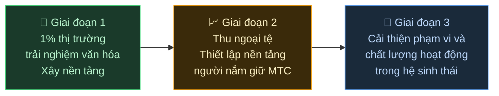

# 🌏 Thách thức & Giải pháp — những sự thật khó chịu, và hy vọng

> **Sứ mệnh thì đẹp. Thực tế đang đứng chắn đường nó.**

---

## Nhưng có những sự thật khó chịu đang đứng chắn đường sứ mệnh này

:::info Một thị trường ¥10 nghìn tỷ (~66 tỷ $), và năng lượng không đến được với những người gìn giữ văn hóa
Thị trường inbound của Nhật Bản đang tăng trưởng hướng tới **¥10 nghìn tỷ (~66 tỷ $) mỗi năm.**
Vậy mà rất ít lợi ích đó đến được tới mặt đất.
:::

### Thị trường mà MTC nhắm tới

Chúng tôi không cố lấy hết ¥10 nghìn tỷ trong một lần.

Mục tiêu đầu tiên của chúng tôi trong thị trường đó là phân khúc **trải nghiệm văn hóa, hướng dẫn viên và tour địa phương.** Chúng tôi xem **1% của phân khúc đó (khoảng ¥100 tỷ / ~660 triệu $)** là mục tiêu ban đầu: bắt đầu nhỏ, lớn lên vững chắc.

| Giai đoạn | Chiến lược | Mục tiêu |
| :--- | :--- | :--- |
| **Bắt đầu nhỏ** | Tập trung vào trải nghiệm văn hóa và tour có hướng dẫn. Xây dựng thành tích và lớn lên qua truyền miệng | Thiết lập nền doanh thu |
| **Lớn lên vững chắc** | Đưa ngoại tệ vào (doanh thu inbound) và chứng minh cơ chế chia sẻ doanh thu với người nắm giữ MTC | Xây dựng niềm tin vào nền kinh tế MTC |
| **Nâng chất lượng** | Khi đạt đến quy mô nhất định, ngừng đuổi theo tăng trưởng vì chính nó; làm sâu chất lượng trải nghiệm, phạm vi hoạt động và cộng đồng trong hệ sinh thái | Một nền kinh tế văn hóa bền vững |

> **Lớn lên qua chất lượng của những người liên quan và độ sâu của trải nghiệm, không phải qua khối lượng.** Đó là chiến lược mở rộng của MTC.

Các nền tảng Web2 đã mang niềm vui du lịch đến mọi người trên khắp thế giới, và chúng tôi thực sự biết ơn những gì họ đã xây. Nhưng cấu trúc tập trung đi kèm những tác dụng phụ không thể tránh khỏi.

Thuật toán quyết định cái gì được nhìn thấy. Nhà điều hành buộc phải cạnh tranh để được xếp chỗ. Một bài đánh giá có thể khiến doanh số dao động dữ dội. Tỷ lệ hoa hồng thay đổi theo ý thích của nền tảng — và những con người trên mặt đất sống trong nỗi sợ thường trực bị chọn, hoặc biến mất.

Cấu trúc này tạo ra sự chia rẽ giữa các nhà điều hành, và nỗi e dè trước những quy tắc vô hình.
Cửa hàng bên cạnh trở thành đối thủ; rào khách lại có lý hơn là hợp tác. Du khách cũng chỉ thấy các lựa chọn bị san phẳng thành "số sao" và "xếp hạng," và những trải nghiệm thực sự giá trị bị chôn vùi.

:::danger Ba vấn đề mà thực địa đang chịu đựng
💸 **Doanh thu chảy ra ngoài** — phần lớn doanh thu chảy ra khỏi đất nước dưới dạng hoa hồng cho các OTA và trung gian nước ngoài

😤 **Kiệt sức tại địa phương** — chỉ còn lại gánh nặng của overtourism; doanh thu quan trọng không bao giờ quay lại cộng đồng

🚧 **Bức tường trải nghiệm** — chỉ những tour đồng hóa do thuật toán chọn xuất hiện, và khách không bao giờ gặp được "Nhật Bản thật"
:::

> **Người Nhật vật vã, du khách chẳng gặp được điều thật, và sự giàu có biến mất vào các nền tảng.**

---

## Vậy chúng ta thay đổi nó bằng cách nào?

Hôm nay, công nghệ để thay đổi cấu trúc này từ gốc rễ cuối cùng đã đến.

:::tip Smart contracts — luật chung không thể bị viết lại
Tỷ lệ hoa hồng và điều kiện được khắc vào code. Không ai có thể thay đổi chúng theo ý thích. Mọi người vận hành dưới cùng một quy tắc, một cách tự động.
:::

:::tip Blockchain — sự minh bạch bạn thực sự nhìn thấy được
Mọi giao dịch đều được ghi vào sổ cái công khai mà ai cũng có thể kiểm tra. Kỷ nguyên dữ liệu bị khóa trong một tập đoàn đã qua.
:::

:::tip Solana — thanh toán 0,4 giây, phí ~0,0003 $
Không có chồng chất phí trung gian, không có thanh toán nhiều ngày. Người kết nối trực tiếp với người.
:::

:::tip AI — chính chi phí quản lý cũng tan biến
Một bước nhảy năng suất bùng nổ đang đưa cấu trúc chi phí cần để vận hành các nền tảng khổng lồ trở thành chuyện của quá khứ.
:::

Chúng ta không còn ở thời đại con người cần trung gian để kết nối nữa.

Với công nghệ này, chúng tôi giải phóng nền kinh tế inbound khỏi độc quyền và trả doanh thu về cho những con người trên mặt đất ở Nhật Bản và nước ngoài.
Và không chỉ ở Nhật Bản — chúng tôi xây dựng **một cấu trúc để bảo vệ và kết nối các nền văn hóa của thế giới.**

---

**[◀ Trước: Tầm nhìn & Sứ mệnh](/docs/vision)** | **[▶ Tiếp: Tương lai mà MTC hình dung](/docs/future)**
