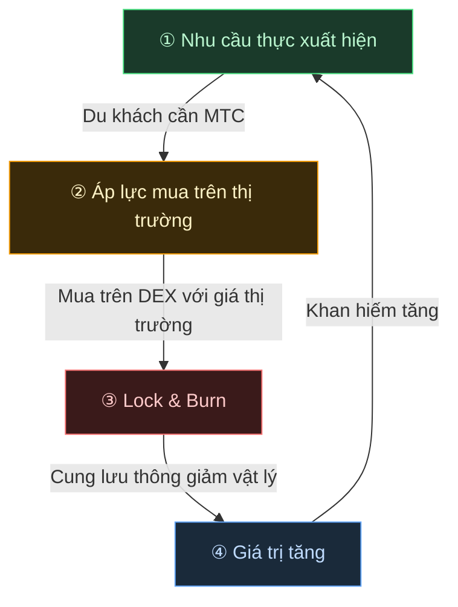

# 🔄 Bánh đà kinh tế — vòng lặp tăng trưởng và OS văn hóa

> **Du khách càng tận hưởng Nhật Bản, hệ sinh thái càng tạo ra nhiều nhu cầu.**
> Cơ chế cung-cầu này là trái tim đang đập của dự án.

---

## Cơ chế cung-cầu của MTC

Bằng thiết kế của Matsuri Protocol, **nhu cầu thực gia tăng tạo ra áp lực mua, và kết hợp với nguồn cung thu hẹp, tạo điều kiện cho giá trị tăng lên.**
Đây không phải là cảm xúc — đó là một **cơ chế cung và cầu.**

Cơ chế đó vận hành theo **vòng lặp bốn bước** dưới đây.

| Bước | Tên | Cơ chế |
| :---: | :--- | :--- |
| **①** | **Nhu cầu thực xuất hiện** | Du khách cần MTC để đặt hướng dẫn viên hoặc mua ticket NFT |
| **②** | **Áp lực mua trên thị trường** | MTC được mua theo giá thị trường trên DEX (sàn phi tập trung). Áp lực mua mạnh dựa trên tiêu dùng, không phải đầu cơ |
| **③** | **Lock & Burn** | Một phần MTC dùng trong thanh toán bị khóa hoặc đốt tức thì bởi smart contract. Cung lưu thông giảm vật lý |
| **④** | **Khan hiếm tăng** | Nhu cầu mua tăng, cung bán giảm. Sự dịch chuyển trong cân bằng cung-cầu khiến mỗi token khan hiếm hơn |

---

---

:::note Tầm nhìn đằng sau phương trình này
Bức tranh lớn hơn — "OS văn hóa" nằm bên kia bánh đà — được khám phá chi tiết ở trang tiếp theo, [Tương lai mà MTC hình dung](/docs/future).
:::

---

**[◀ Trước: Thách thức & Giải pháp](/docs/challenges)** | **[▶ Tiếp: Tương lai mà MTC hình dung](/docs/future)**
