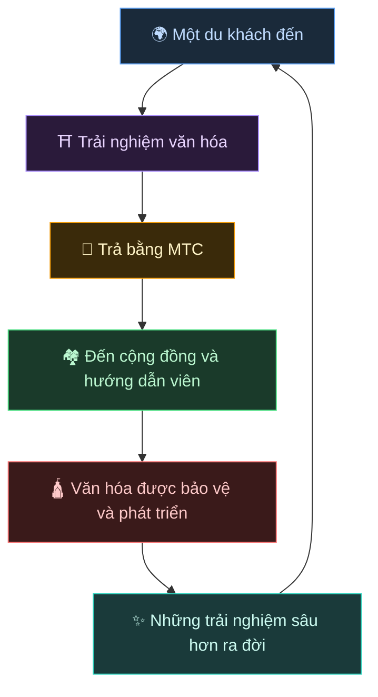
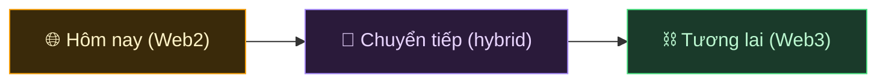
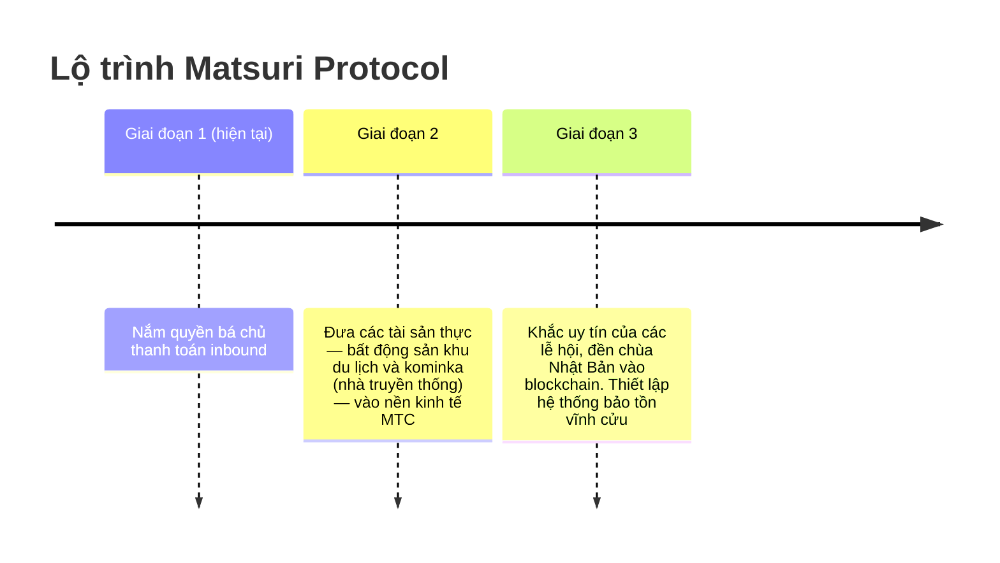

# 🌀 Tương lai mà MTC hình dung — một nền kinh tế nơi mọi hình thức tham gia đều lưu thông

> **Người trải nghiệm, người truyền tải, người bảo vệ — mọi cảm xúc lưu thông như nền kinh tế và đưa văn hóa đến thế hệ tiếp theo.**

---

## Sự lưu thông chúng tôi muốn tạo ra

MTC không phải là token để đầu cơ.

Du khách gặp gỡ văn hóa Nhật Bản và xúc động.
Hướng dẫn viên truyền tải cảm xúc đó và được tưởng thưởng.
Cộng đồng phát triển và tiếp tục bảo vệ văn hóa của mình.
Và văn hóa đó hút lấy du khách tiếp theo.

Sự lưu thông này chính là lý do MTC tồn tại.

---

## Một nền kinh tế nơi cả ba bên đều được tưởng thưởng

Trong mô hình du lịch cũ, du khách trả tiền, nền tảng lấy lợi nhuận, và không còn lại gì trên mặt đất.
Trong nền kinh tế của MTC, mọi người liên quan đều được tưởng thưởng.

| Ai liên quan | Điều gì xảy ra | Họ được tưởng thưởng thế nào |
| :--- | :--- | :--- |
| **🌍 Người trải nghiệm** | Gặp gỡ văn hóa Nhật Bản, trả bằng MTC | Rẻ hơn yên và tiếp cận thực sự với trải nghiệm chính gốc. Vẫn kết nối qua MTC ngay cả sau khi về nước |
| **⛩️ Người truyền tải** | Tổ chức sự kiện như hướng dẫn viên, đăng bài trên J-Times | Phần thưởng trực tiếp, không có trung gian gặm trên đầu. Bạn càng hành động, bạn càng kiếm được nhiều MTC |
| **🏘️ Người bảo vệ** | Là cộng đồng địa phương, gìn giữ và truyền lại văn hóa | Doanh thu đến trực tiếp. Cộng đồng phát triển bền vững thay vì chịu đựng overtourism |

---

## Nền kinh tế càng rộng, văn hóa càng mạnh

Nền kinh tế của MTC bắt đầu với việc đặt trải nghiệm, và mở rộng vào mọi mặt cuộc sống.

- **Trải nghiệm** — trải nghiệm văn hóa chính gốc, đào tại đền thờ
- **Y, thực, trú** — nhà trọ, cửa hàng, ẩm thực, thời trang
- **Dự án cộng tạo** — crowdfunding để đầu tư bảo vệ văn hóa
- **Hiểu biết quốc tế xuyên văn hóa** — không gian giao lưu và thấu hiểu lẫn nhau vượt biên giới

Nền kinh tế càng mở rộng, dòng MTC chảy qua nó càng dày, và sức mạnh nuôi dưỡng văn hóa của nó càng lớn.
Đây không chỉ là mô hình kinh doanh. Nó là **một hệ thống duy trì sự sống cho văn hóa.**

---

## Từ Web2 đến Web3 — theo từng giai đoạn, không gượng ép

Chúng tôi không nói "đặt mọi thứ lên blockchain" ngay từ ngày đầu.

Hầu hết mọi người ngày nay vẫn còn xa lạ với Web3. Chính vì vậy chúng tôi đã thiết kế để **bắt đầu với những hình thức mọi người đã biết, và để họ cảm nhận lợi ích của Web3 dần dần.**

| Giai đoạn | Trải nghiệm người dùng | Điều gì đang diễn ra bên dưới |
| :--- | :--- | :--- |
| **Hôm nay** | Đặt và trả như bất kỳ ứng dụng web thông thường nào. Thẻ tín dụng là đủ | Django + Stripe. Không cần ví để bắt đầu |
| **Chuyển tiếp** | Kiếm và dùng MTC trong ứng dụng. Kết nối ví chỉ một chạm | Điểm off-chain dần di chuyển on-chain |
| **Tương lai** | Mọi giao dịch và quyền được ghi minh bạch on-chain. Đóng góp của bạn được chứng minh mãi mãi | Một nền kinh tế hoàn toàn tự động, chống giả mạo, vận hành bởi smart contracts |

:::tip Web3 không nhất thiết phải khó
Không cần thiết lập ví, không cần quản lý seed phrase ngay từ đầu. Khi bạn dùng ứng dụng, bạn tự nhiên bước vào Web3. **Trước khi bạn nhận ra, bạn đã là một công dân của Web3.** Đó là trải nghiệm chúng tôi đang thiết kế.
:::

---

## Một nền kinh tế chuyển động bằng đồng cảm, không phải bằng vũ lực

Và nền kinh tế này chạy trên smart contracts.
Quy tắc không thể bị viết lại đơn phương theo ý ai đó — **một nền kinh tế trong đó hiện trạng không thể bị thay đổi bằng vũ lực.**

Trên nền tảng đó, chúng tôi học từ trí tuệ cổ xưa và tiếp tục tạo ra giá trị mới. 温故知新, và rồi sáng tạo.

> **Một thế giới nơi cuộc sống có thể gắn kết quanh văn hóa, ngay cả khi không có yên hay đô-la.**
>
> Không thuê ngoài ý nghĩa của tiền tệ cho người khác, mà tạo ra và tiêu dùng giá trị qua "sự tham gia" của chính bạn.
> Đó là sự tự do mà MTC muốn mang đến.

---

## 🏁 Đích đến cuối cùng: "OS văn hóa"

Mục tiêu tối thượng của chúng tôi không chỉ là một ứng dụng thanh toán.
Đó là biến **chính văn hóa thành OS (lớp nền tảng).**

> Chúng tôi bảo vệ trí tuệ cổ xưa bằng blockchain mới nhất.
> Đó là tương lai mà Matsuri Protocol đang vẽ ra.

---

:::note Kết thúc phần Câu chuyện
Nếu bạn đã đọc đến đây, giờ bạn nên hiểu được vì sao MTC tồn tại.
Tiếp theo là **[Thực hành]** — hãy xem bạn có thể thực sự làm gì với MTC.
:::

**[◀ Trước: Bánh đà kinh tế](/docs/flywheel)** | **[▶ Tiếp: Hệ sinh thái](/docs/ecosystem)**
