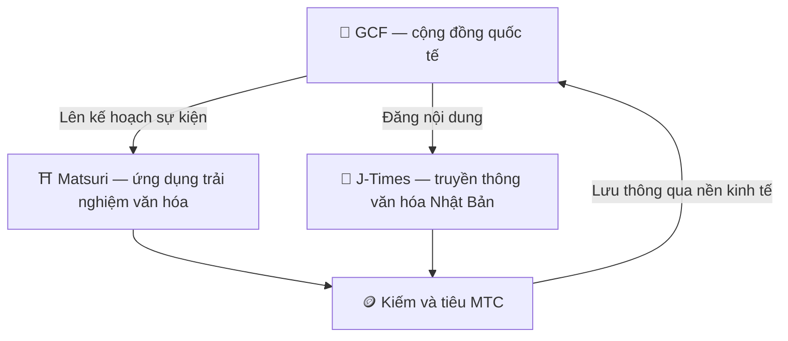

# 🏗️ Hệ sinh thái MTC — một nền kinh tế nơi trải nghiệm, truyền thông và cộng đồng lưu thông

> **Ba "địa điểm" để biến sứ mệnh thành hiện thực.**
> Một nơi để trải nghiệm, một nơi để học, một nơi để kết nối — mỗi nơi tự đứng vững, và MTC liên kết chúng thành một nền kinh tế lưu thông duy nhất.

MTC không chỉ là một token. Ba sản phẩm và một cộng đồng quốc tế cùng nhau xây dựng một nền kinh tế bảo vệ văn hóa.

:::tip 🤝 GCF — cộng đồng quốc tế thúc đẩy hệ sinh thái
Nơi tụ họp của những người yêu văn hóa Nhật Bản, vượt biên giới. GCF tuyển hướng dẫn viên, và những hướng dẫn viên GCF đó vận hành trải nghiệm trên Matsuri. Họ cũng đăng nội dung hấp dẫn trên J-Times — hoạt động của cộng đồng là động cơ làm chuyển động cả hệ sinh thái.
:::

:::tip ⛩️ Matsuri — ứng dụng trải nghiệm văn hóa
Bắt đầu với việc đặt trải nghiệm văn hóa và mở rộng theo từng giai đoạn vào **nhà trọ**, **cửa hàng** và **crowdfunding**. Nền kinh tế phát triển từ trải nghiệm vào y, thực, trú và đầu tư cộng tạo.

**Đào hành hương đền thờ (seichi junrei — hành hương thánh địa)** — kiếm MTC bằng cách thực sự ghé thăm đền thờ, chùa và di tích văn hóa. Du khách tự nhiên chảy từ điểm nóng nổi tiếng đến những viên ngọc địa phương ẩn giấu, đồng thời giải quyết overtourism và hồi sinh các vùng địa phương.
:::

:::tip 📰 J-Times — truyền thông văn hóa Nhật Bản
Một nền tảng truyền thông đưa sức quyến rũ của văn hóa Nhật Bản đến với thế giới. Bạn kiếm MTC qua việc tham gia như đọc và chia sẻ bài viết.
:::

---

## 🤝 Đào xã hội (kết nối và kiếm)

**Gắn với bảng điều khiển admin GCF — phiên bản web đã hoạt động (ứng dụng iOS dự kiến tháng 4/2026).**

Thành viên GCF nhận quyền truy cập vào giao diện **GCF admin web** dành riêng.

| Tính năng | Bạn có thể làm gì |
| :--- | :--- |
| **🎪 Tạo sự kiện** | Lên kế hoạch và đăng tải sự kiện và tour của riêng bạn |
| **📢 Phân phối nội dung** | Đăng và lan tỏa bài viết và nội dung J-Times |
| **📊 Theo dõi giới thiệu** | Theo dõi hoạt động và doanh thu của người dùng được giới thiệu theo thời gian thực |

:::info Phần thưởng tự động
Mỗi khi người bạn giới thiệu thanh toán, hệ thống **tự động** gửi phần thưởng (chia sẻ doanh thu) vào ví của bạn.
:::

---

## 🎓 Nền kinh tế creator (sáng tạo và kiếm)

Bạn không chỉ tiêu thụ nội dung — trên Matsuri, **bất kỳ ai** đều có thể tạo và kiếm tiền từ nó.

| Nền tảng | Creator có thể làm gì | Mô hình doanh thu |
| :--- | :--- | :--- |
| **📚 Sàn giao dịch khóa học** | Đăng khóa học video / văn bản về văn hóa, ngôn ngữ hoặc thủ công Nhật Bản | Phí mỗi lần đăng ký (chia sẻ doanh thu cho creator) |
| **🎙️ Studio podcast** | Sản xuất series âm thanh phân phối qua Spotify, Apple Podcasts và RSS | Tập chỉ dành cho người đăng ký |
| **🤝 Crowdfunding** | Khởi động chiến dịch gây quỹ dựa trên Solana cho dự án văn hóa | Theo dõi đóng góp on-chain |
| **🛍️ Cửa hàng người dùng** | Mở cửa hàng cá nhân trong nền tảng (thủ công, hàng hóa) | Bán hàng trực tiếp với hệ thống sản phẩm / đánh giá |

:::tip Hỗ trợ sản xuất bằng AI
Người tổ chức sự kiện có thể dùng **trợ lý AI tích hợp (GPT-4 Turbo)** trong bảng điều khiển admin để viết mô tả sự kiện, tự dịch sang 5 ngôn ngữ và tạo metadata tối ưu hóa SEO.
:::

---

  

*Buổi gặp cộng đồng tại Golden Gai — kết nối trở thành sức mạnh đào.*

---

:::note Trang tiếp theo
Để xem đào thực sự hoạt động thế nào và cách kiếm, hãy đến **[Đào & kiếm →](/docs/mining)**.
:::
